# Mixed Read/Write Throughput Analysis

**Generated:** 12/25/2025, 10:06:03 PM

## Configuration Legend

**Config ID Format:** `rX_wY_R..._W..._c...mb`

Where:
- `rX` = number of read workers (e.g., r10 = 10 read workers)
- `wY` = number of write workers (e.g., w2 = 2 write workers)
- `R...` = total reads per worker (e.g., R200k = 200,000 reads per worker)
- `W...` = total writes per worker (e.g., W20k = 20,000 writes per worker)
- `c...mb` = cache size in megabytes (e.g., c16mb = 16 MB cache)

**Example:** `r10_w2_R200k_W20k_c16mb` means:
- 10 read workers
- 2 write workers
- 200,000 reads per read worker (2,000,000 total reads)
- 20,000 writes per write worker (40,000 total writes)
- 16 MB cache size

## Throughput Charts

### Reads Throughput

This chart shows the read operations per second for each configuration.

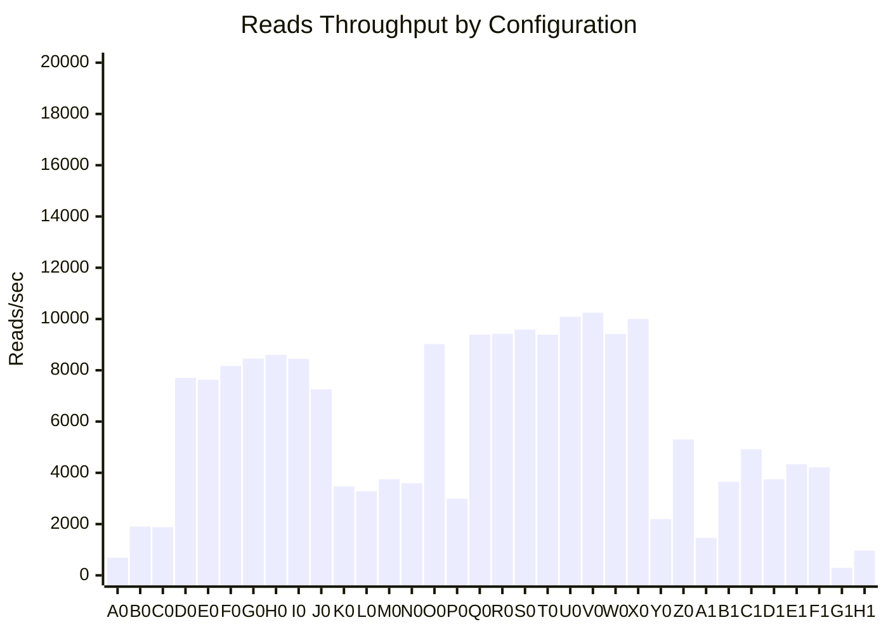

### Writes Throughput

This chart shows the write operations per second for each configuration.

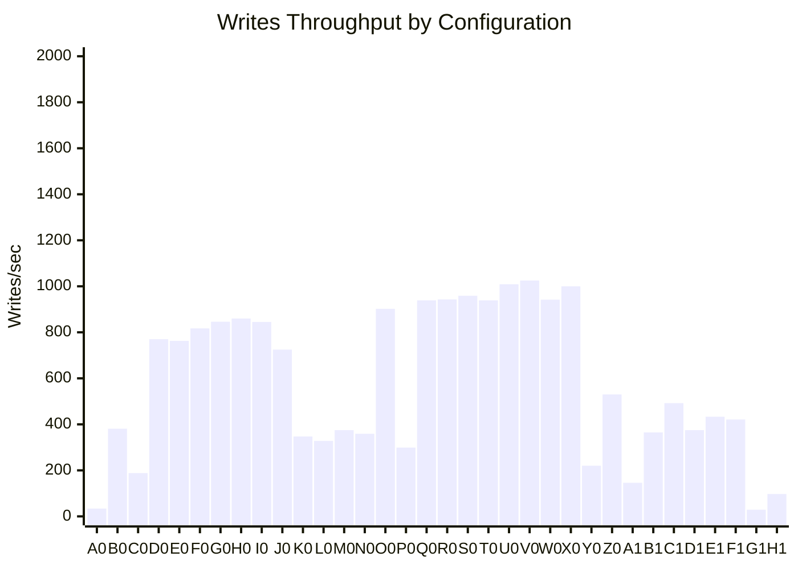

### Total Operations Throughput

This chart shows the combined (reads + writes) operations per second for each configuration.

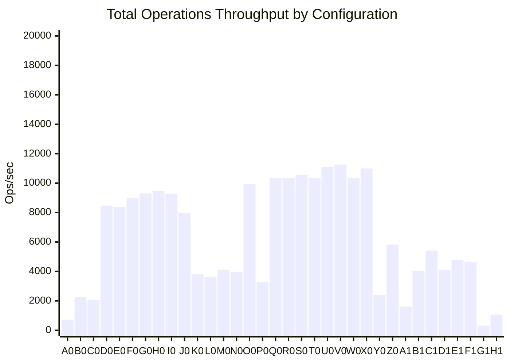

## Latency Charts

### Best Case Latency (Min)

#### Read Latency: Best Case (Min)

This chart shows the minimum (best case) latency for read operations across all configurations.

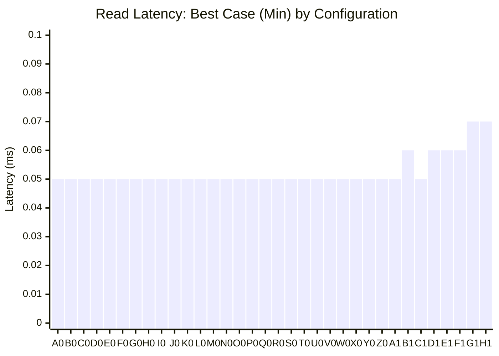

#### Write Latency: Best Case (Min)

This chart shows the minimum (best case) latency for write operations across all configurations.

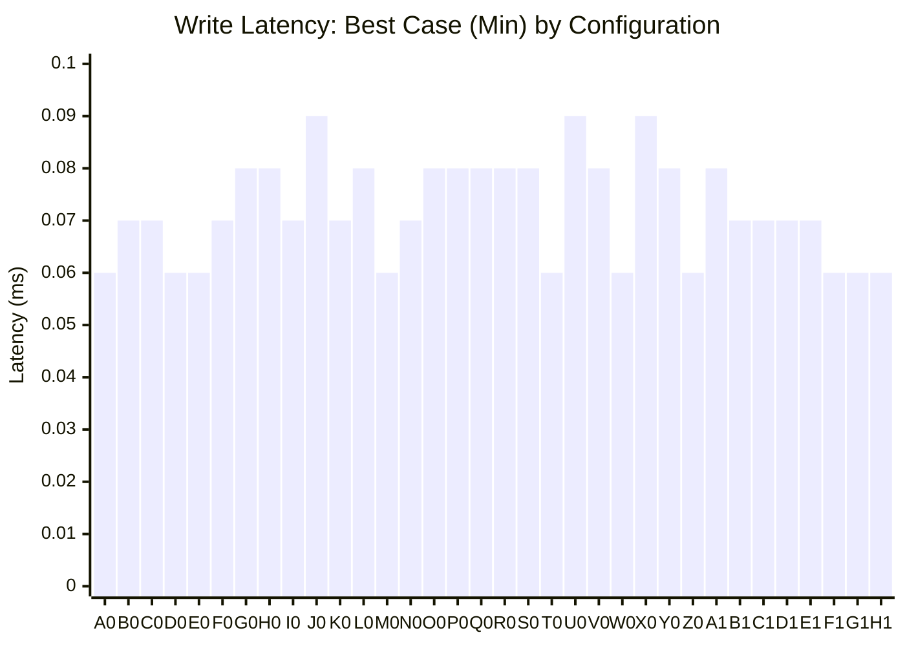

### Worst Case Latency (Max)

#### Read Latency: Worst Case (Max)

This chart shows the maximum (worst case) latency for read operations across all configurations.

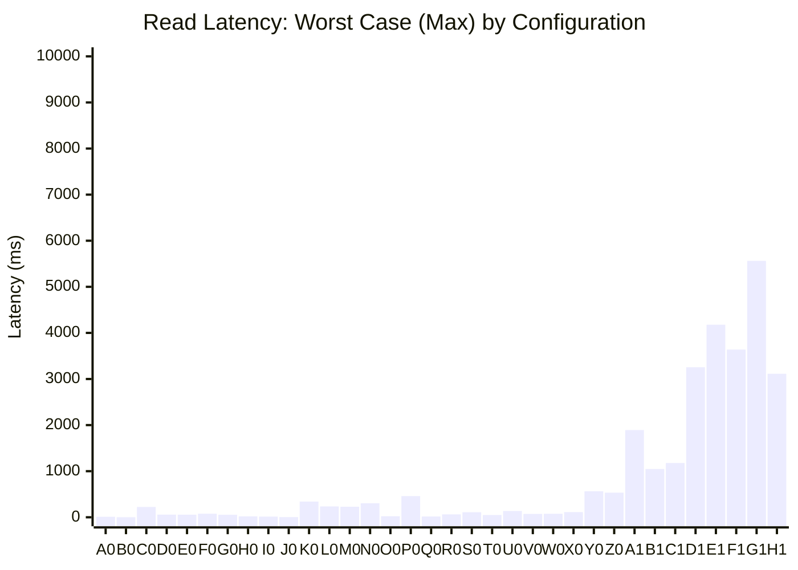

#### Write Latency: Worst Case (Max)

This chart shows the maximum (worst case) latency for write operations across all configurations.

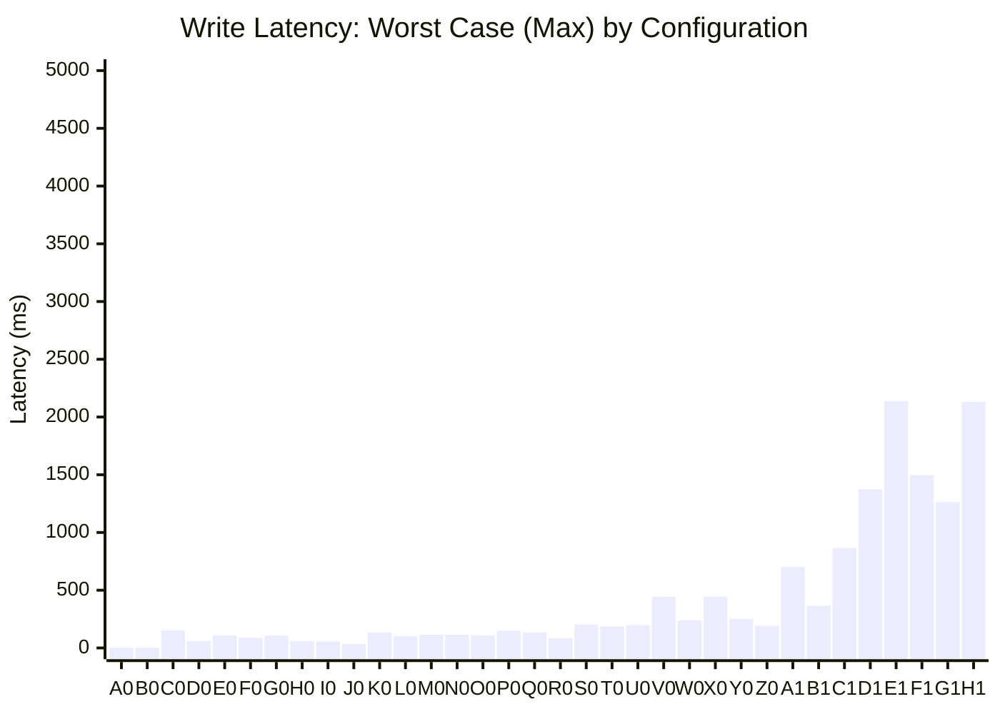

### Average Latency

#### Read Latency: Average

This chart shows the average latency for read operations across all configurations.

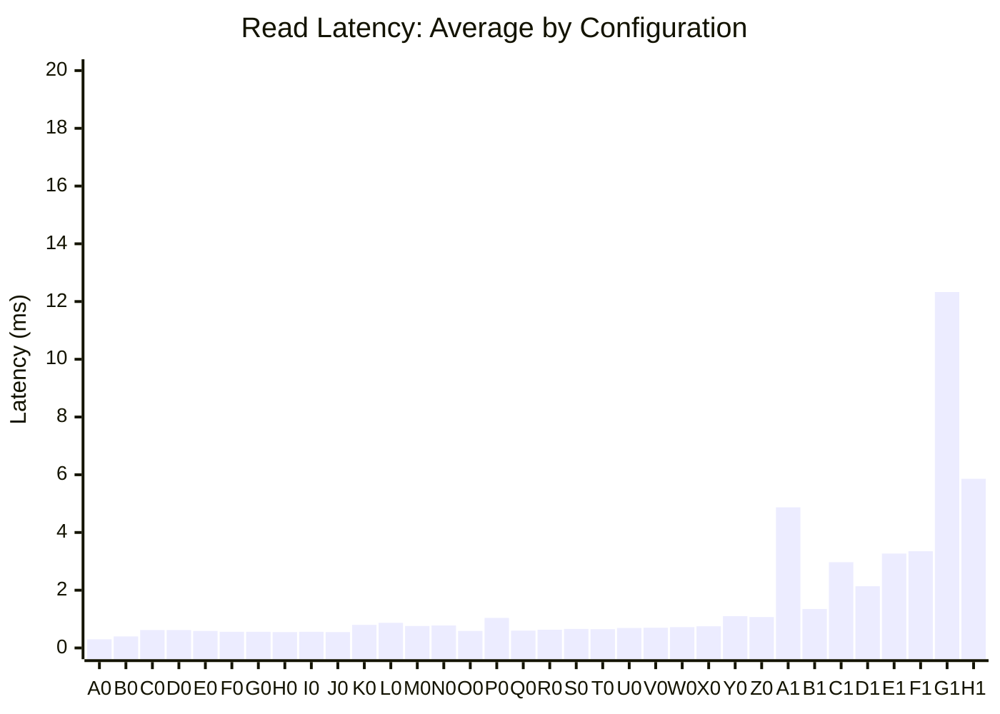

#### Write Latency: Average

This chart shows the average latency for write operations across all configurations.

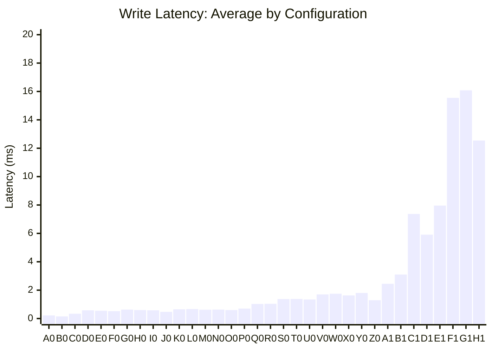

### P50 Latency (Median)

#### Read Latency: P50 (Median)

This chart shows the 50th percentile (median) latency for read operations across all configurations.

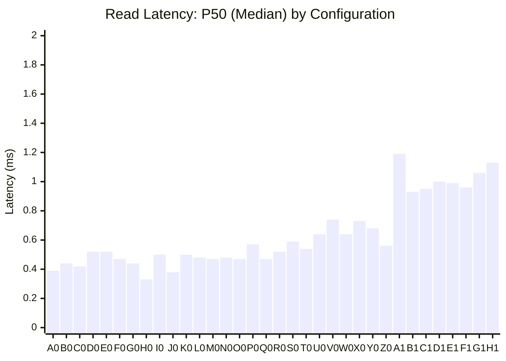

#### Write Latency: P50 (Median)

This chart shows the 50th percentile (median) latency for write operations across all configurations.

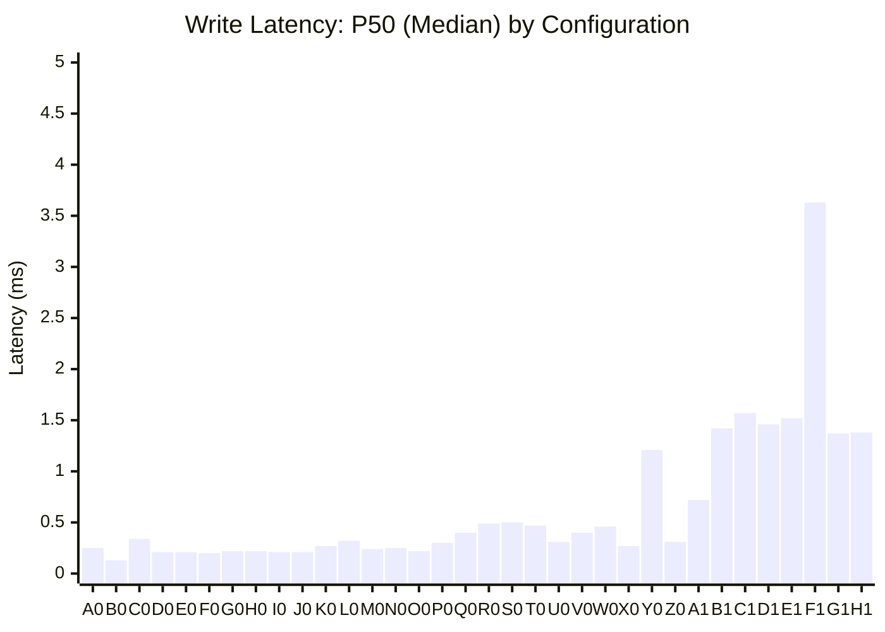

### P95 Latency

#### Read Latency: P95

This chart shows the 95th percentile latency for read operations across all configurations.

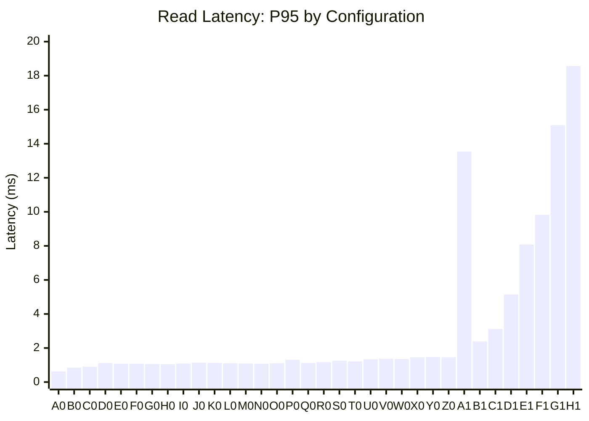

#### Write Latency: P95

This chart shows the 95th percentile latency for write operations across all configurations.

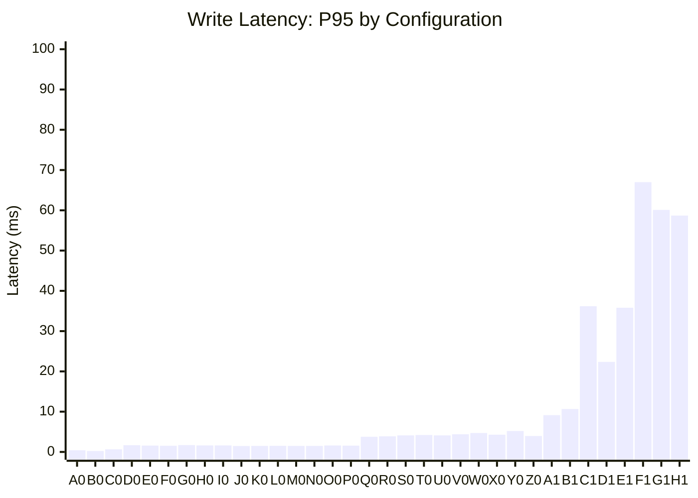

## Error Analysis

### Errors by Configuration

This chart shows the number of errors for read operations (SQLITE_BUSY errors) and write operations (lock errors) across all configurations. Read errors combine busy errors, and write errors combine lock errors.

```mermaid
xychart-beta
    title "Errors by Configuration"
    x-axis ["A0", "B0", "C0", "D0", "E0", "F0", "G0", "H0", "I0", "J0", "K0", "L0", "M0", "N0", "O0", "P0", "Q0", "R0", "S0", "T0", "U0", "V0", "W0", "X0", "Y0", "Z0", "A1", "B1", "C1", "D1", "E1", "F1", "G1", "H1"]
    y-axis "Error Count" 0 --> 5
    bar "Read Errors (Busy)" [0, 0, 0, 0, 0, 0, 0, 0, 0, 0, 0, 0, 0, 0, 0, 0, 0, 0, 0, 0, 0, 0, 0, 0, 0, 0, 0, 0, 0, 0, 0, 0, 0, 0]
    bar "Write Errors (Lock)" [0, 0, 0, 0, 0, 0, 0, 0, 0, 0, 0, 0, 0, 0, 0, 0, 0, 0, 0, 0, 0, 0, 0, 0, 0, 0, 0, 0, 0, 0, 0, 0, 0, 3]
```

## Summary Table

| Label | Config ID | Read Workers | Write Workers | Cache Size | Reads/sec | Writes/sec | Total Ops/sec | Read Errors | Write Errors |
|-------|-----------|--------------|---------------|------------|-----------|------------|---------------|-------------|--------------|
| A0 | r1_w1_R20k_W1k_c16mb | 1 | 1 | 16 MB | 689 | 34 | 723 | 0 | 0 |
| B0 | r5_w1_R1000_W200_c16mb | 5 | 1 | 16 MB | 1903 | 381 | 2283 | 0 | 0 |
| C0 | r5_w1_R2m_W200k_c24mb | 5 | 1 | 24 MB | 1878 | 188 | 2066 | 0 | 0 |
| D0 | r10_w2_R200k_W20k_c16mb | 10 | 2 | 16 MB | 7704 | 770 | 8475 | 0 | 0 |
| E0 | r10_w2_R200k_W20k_c20mb | 10 | 2 | 20 MB | 7632 | 763 | 8395 | 0 | 0 |
| F0 | r10_w2_R200k_W20k_c24mb | 10 | 2 | 24 MB | 8168 | 817 | 8985 | 0 | 0 |
| G0 | r10_w2_R200k_W20k_c32mb | 10 | 2 | 32 MB | 8456 | 846 | 9302 | 0 | 0 |
| H0 | r10_w2_R200k_W20k_c48mb | 10 | 2 | 48 MB | 8601 | 860 | 9461 | 0 | 0 |
| I0 | r10_w2_R200k_W20k_c56mb | 10 | 2 | 56 MB | 8447 | 845 | 9291 | 0 | 0 |
| J0 | r10_w2_R20k_W2000_c24mb | 10 | 2 | 24 MB | 7254 | 725 | 7979 | 0 | 0 |
| K0 | r10_w2_R2m_W200k_c16mb | 10 | 2 | 16 MB | 3468 | 347 | 3814 | 0 | 0 |
| L0 | r10_w2_R2m_W200k_c24mb | 10 | 2 | 24 MB | 3283 | 328 | 3611 | 0 | 0 |
| M0 | r10_w2_R2m_W200k_c32mb | 10 | 2 | 32 MB | 3750 | 375 | 4125 | 0 | 0 |
| N0 | r10_w2_R2m_W200k_c8mb | 10 | 2 | 8 MB | 3595 | 359 | 3954 | 0 | 0 |
| O0 | r11_w2_R200k_W20k_c48mb | 11 | 2 | 48 MB | 9024 | 902 | 9926 | 0 | 0 |
| P0 | r12_w2_R2m_W200k_c100mb | 12 | 2 | 100 MB | 2992 | 299 | 3292 | 0 | 0 |
| Q0 | r12_w3_R200k_W20k_c48mb | 12 | 3 | 48 MB | 9394 | 939 | 10333 | 0 | 0 |
| R0 | r13_w3_R200k_W20k_c48mb | 13 | 3 | 48 MB | 9425 | 943 | 10368 | 0 | 0 |
| S0 | r14_w4_R200k_W20k_c48mb | 14 | 4 | 48 MB | 9590 | 959 | 10549 | 0 | 0 |
| T0 | r14_w4_R300k_W30k_c48mb | 14 | 4 | 48 MB | 9392 | 939 | 10331 | 0 | 0 |
| U0 | r16_w4_R200k_W20k_c48mb | 16 | 4 | 48 MB | 10092 | 1009 | 11102 | 0 | 0 |
| V0 | r17_w5_R200k_W20k_c48mb | 17 | 5 | 48 MB | 10246 | 1025 | 11270 | 0 | 0 |
| W0 | r17_w5_R300k_W30k_c48mb | 17 | 5 | 48 MB | 9418 | 942 | 10360 | 0 | 0 |
| X0 | r18_w5_R200k_W20k_c48mb | 18 | 5 | 48 MB | 9999 | 1000 | 10998 | 0 | 0 |
| Y0 | r20_w4_R2m_W200k_c100mb | 20 | 4 | 100 MB | 2197 | 220 | 2417 | 0 | 0 |
| Z0 | r20_w4_R2m_W200k_c24mb | 20 | 4 | 24 MB | 5300 | 530 | 5830 | 0 | 0 |
| A1 | r40_w4_R2m_W200k_c48mb | 40 | 4 | 48 MB | 1464 | 146 | 1610 | 0 | 0 |
| B1 | r80_w8_R2m_W200k_c100mb | 80 | 8 | 100 MB | 3654 | 365 | 4019 | 0 | 0 |
| C1 | r10_w2_R2m_W200k_c20mb | 80 | 20 | 20 MB | 4921 | 492 | 5413 | 0 | 0 |
| D1 | r160_w16_R2m_W200k_c100mb | 160 | 16 | 100 MB | 3745 | 375 | 4120 | 0 | 0 |
| E1 | r200_w20_R2m_W200k_c24mb | 200 | 20 | 24 MB | 4334 | 433 | 4768 | 0 | 0 |
| F1 | r400_w40_R2m_W200k_c100mb | 400 | 40 | 100 MB | 4210 | 421 | 4631 | 0 | 0 |
| G1 | r800_w40_R200k_W20k_c48mb | 800 | 40 | 48 MB | 293 | 29 | 322 | 0 | 0 |
| H1 | r800_w40_R2m_W200k_c100mb | 800 | 40 | 100 MB | 966 | 97 | 1063 | 0 | 3 |
