# Scenario Throughput Analysis

**Generated:** 12/26/2025, 5:57:18 PM

## Summary Table

| Label | Scenario Name | Database Settings | Connection Settings |
|-------|---------------|-------------------|---------------------|
| A | base0 | defaults | none |
| B | busyTimeout1 | defaults | busy_timeout=5000ms |
| C | busyTimeout2000 | defaults | busy_timeout=2000ms |
| D | busyTimeout400 | defaults | busy_timeout=400ms |
| E | wal | journal_mode=WAL | busy_timeout=2000ms |
| F | walSyncNormal | journal_mode=WAL, sync=NORMAL | busy_timeout=2000ms |
| G | walSyncNormalAutocheckpoint2000 | journal_mode=WAL, sync=NORMAL | busy_timeout=2000ms, wal_autocheckpoint=2000 |
| H | walSyncNormalAutocheckpoint4000 | journal_mode=WAL, sync=NORMAL | busy_timeout=2000ms, wal_autocheckpoint=4000 |
| I | walSyncNormalAutocheckpoint4000Mmap1gb | journal_mode=WAL, sync=NORMAL, temp_store=memory | busy_timeout=2000ms, wal_autocheckpoint=4000, mmap=1GB |
| J | walSyncNormalBusyTimeout5000 | journal_mode=WAL, sync=NORMAL | busy_timeout=5000ms, wal_autocheckpoint=4000 |

## Concurrency 1

### Writes Per Second

This chart shows the write operations per second for all scenarios at concurrency level 1.

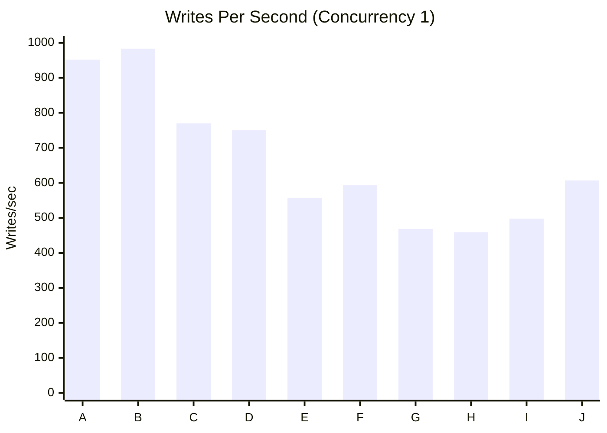
```mermaid
xychart-beta
    title "Writes Per Second (Concurrency 1)"
    x-axis ["A", "B", "C", "D", "E", "F", "G", "H", "I", "J"]
    y-axis "Writes/sec" 0 --> 1000
    bar [952, 983, 770, 750, 557, 593, 468, 459, 498, 607]
```

### Average Latency

This chart shows the average write latency for all scenarios at concurrency level 1.

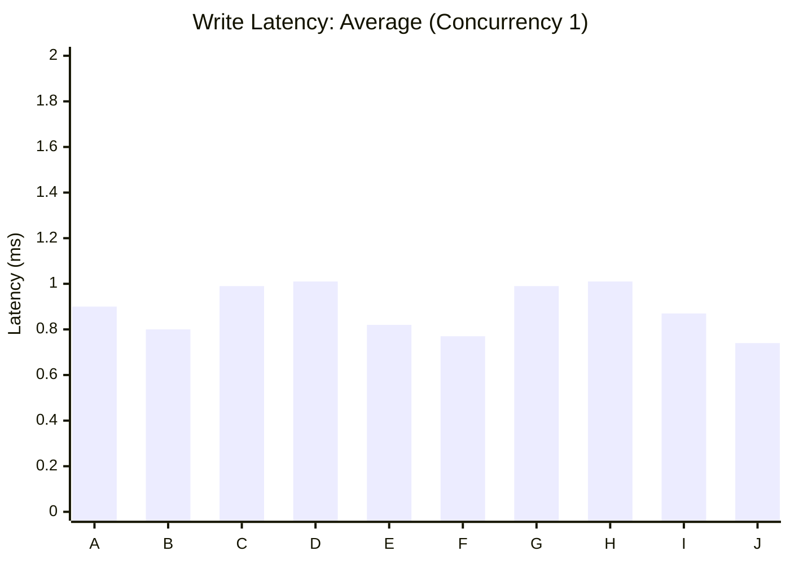
```mermaid
xychart-beta
    title "Write Latency: Average (Concurrency 1)"
    x-axis ["A", "B", "C", "D", "E", "F", "G", "H", "I", "J"]
    y-axis "Latency (ms)" 0 --> 2
    bar [0.90, 0.80, 0.99, 1.01, 0.82, 0.77, 0.99, 1.01, 0.87, 0.74]
```

### P95 Latency

This chart shows the 95th percentile write latency for all scenarios at concurrency level 1.

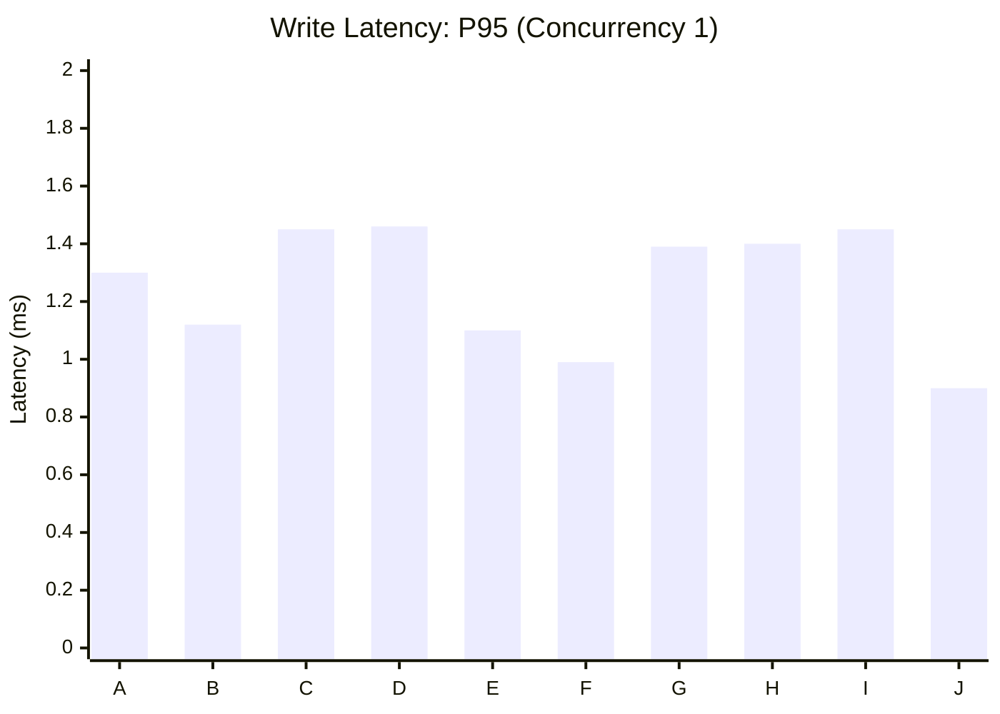
```mermaid
xychart-beta
    title "Write Latency: P95 (Concurrency 1)"
    x-axis ["A", "B", "C", "D", "E", "F", "G", "H", "I", "J"]
    y-axis "Latency (ms)" 0 --> 2
    bar [1.30, 1.12, 1.45, 1.46, 1.10, 0.99, 1.39, 1.40, 1.45, 0.90]
```

### P99 Latency

This chart shows the 99th percentile write latency for all scenarios at concurrency level 1.

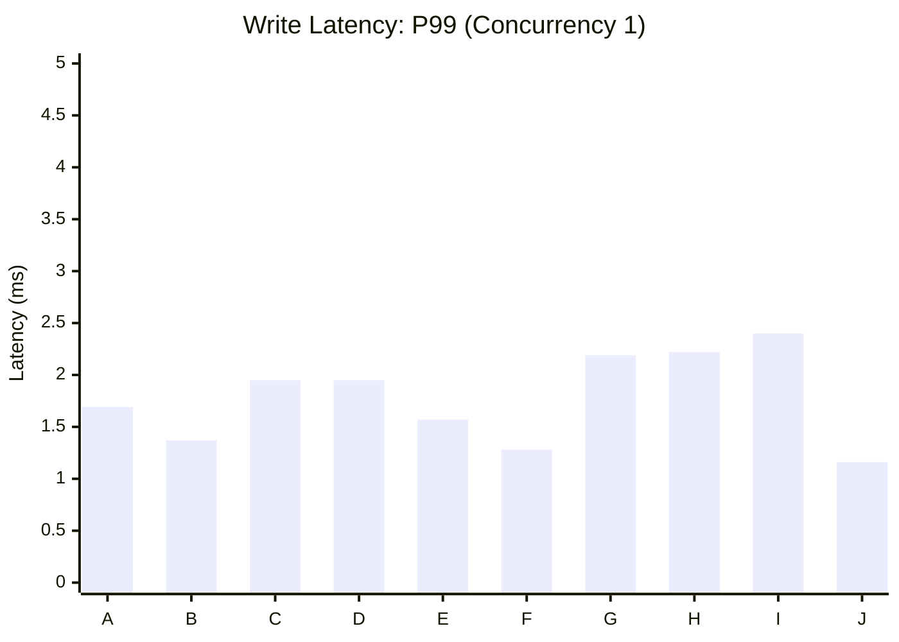
```mermaid
xychart-beta
    title "Write Latency: P99 (Concurrency 1)"
    x-axis ["A", "B", "C", "D", "E", "F", "G", "H", "I", "J"]
    y-axis "Latency (ms)" 0 --> 5
    bar [1.69, 1.37, 1.95, 1.95, 1.57, 1.28, 2.19, 2.22, 2.40, 1.16]
```

### Error Counts

This chart shows the number of lock errors for all scenarios at concurrency level 1.

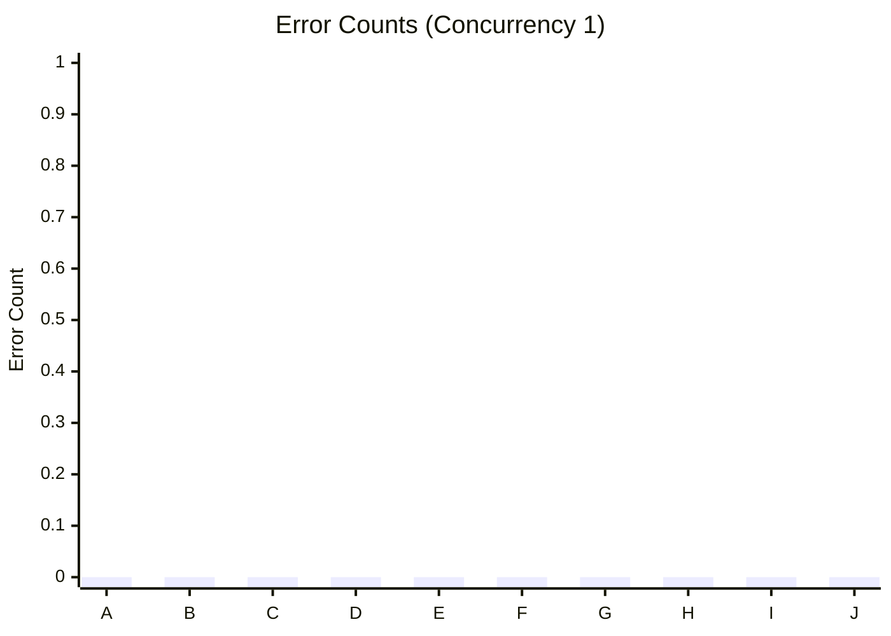
```mermaid
xychart-beta
    title "Error Counts (Concurrency 1)"
    x-axis ["A", "B", "C", "D", "E", "F", "G", "H", "I", "J"]
    y-axis "Error Count" 0 --> 1
    bar [0, 0, 0, 0, 0, 0, 0, 0, 0, 0]
```

## Concurrency 2

### Writes Per Second

This chart shows the write operations per second for all scenarios at concurrency level 2.

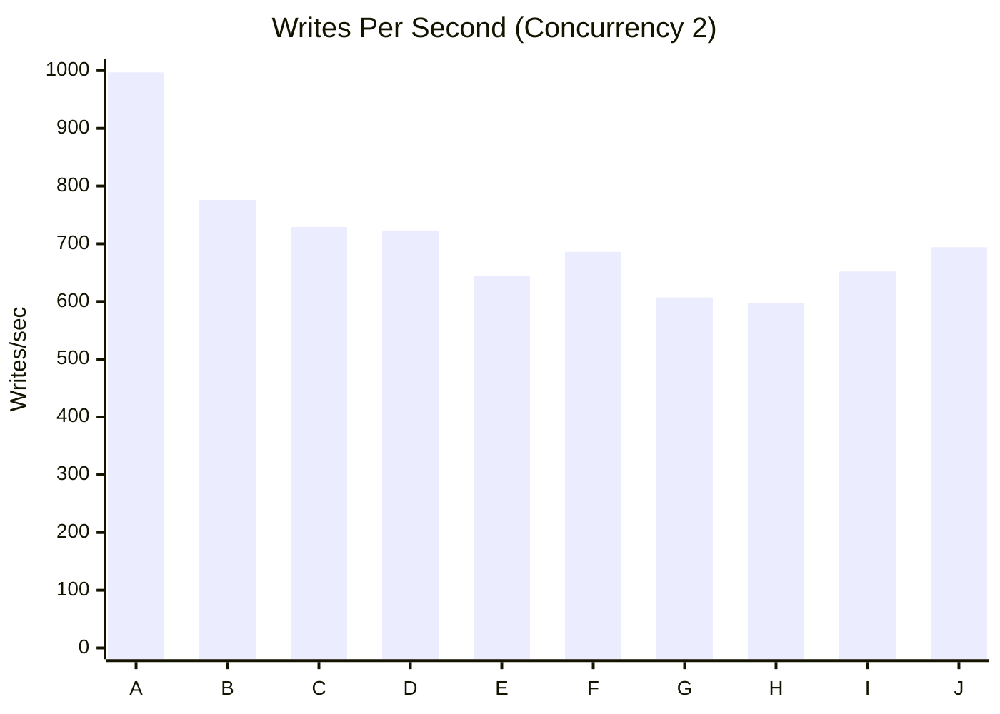
```mermaid
xychart-beta
    title "Writes Per Second (Concurrency 2)"
    x-axis ["A", "B", "C", "D", "E", "F", "G", "H", "I", "J"]
    y-axis "Writes/sec" 0 --> 1000
    bar [997, 776, 729, 723, 644, 686, 607, 597, 652, 694]
```

### Average Latency

This chart shows the average write latency for all scenarios at concurrency level 2.

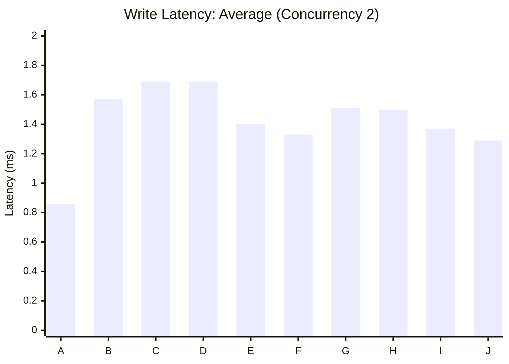
```mermaid
xychart-beta
    title "Write Latency: Average (Concurrency 2)"
    x-axis ["A", "B", "C", "D", "E", "F", "G", "H", "I", "J"]
    y-axis "Latency (ms)" 0 --> 2
    bar [0.86, 1.57, 1.69, 1.69, 1.40, 1.33, 1.51, 1.50, 1.37, 1.29]
```

### P95 Latency

This chart shows the 95th percentile write latency for all scenarios at concurrency level 2.

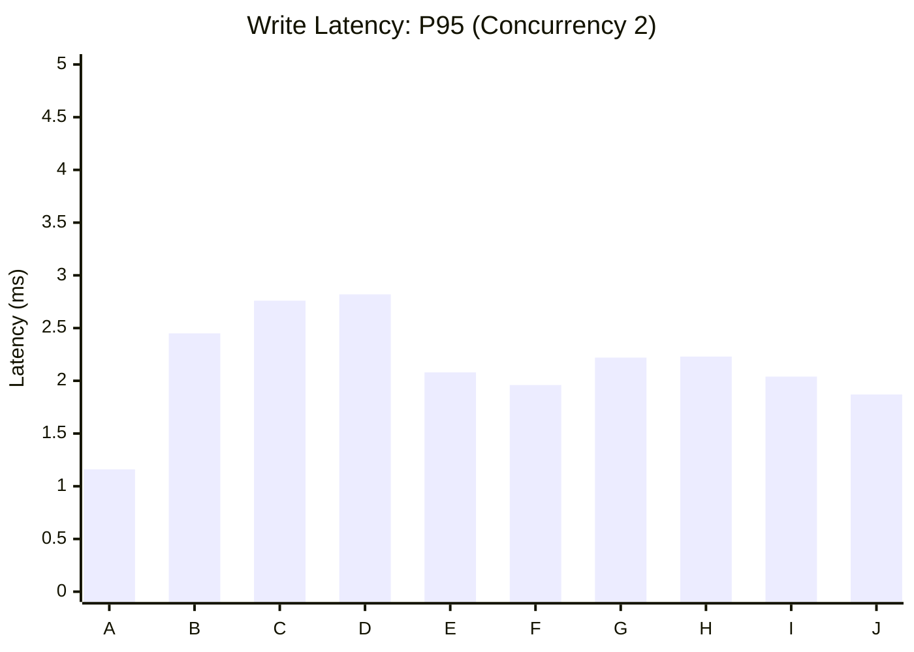
```mermaid
xychart-beta
    title "Write Latency: P95 (Concurrency 2)"
    x-axis ["A", "B", "C", "D", "E", "F", "G", "H", "I", "J"]
    y-axis "Latency (ms)" 0 --> 5
    bar [1.16, 2.45, 2.76, 2.82, 2.08, 1.96, 2.22, 2.23, 2.04, 1.87]
```

### P99 Latency

This chart shows the 99th percentile write latency for all scenarios at concurrency level 2.

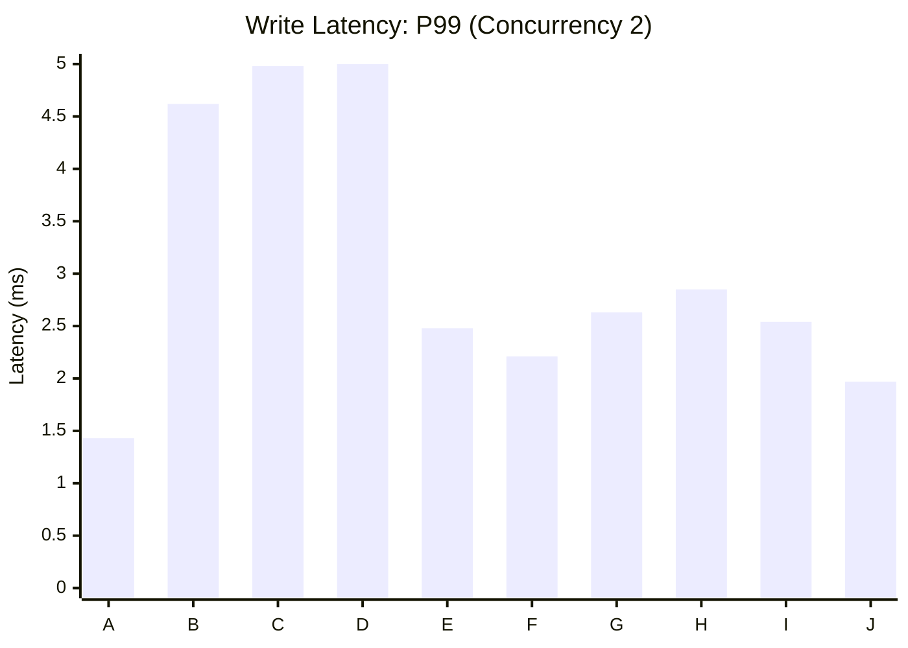
```mermaid
xychart-beta
    title "Write Latency: P99 (Concurrency 2)"
    x-axis ["A", "B", "C", "D", "E", "F", "G", "H", "I", "J"]
    y-axis "Latency (ms)" 0 --> 5
    bar [1.43, 4.62, 4.98, 5.00, 2.48, 2.21, 2.63, 2.85, 2.54, 1.97]
```

### Error Counts

This chart shows the number of lock errors for all scenarios at concurrency level 2.

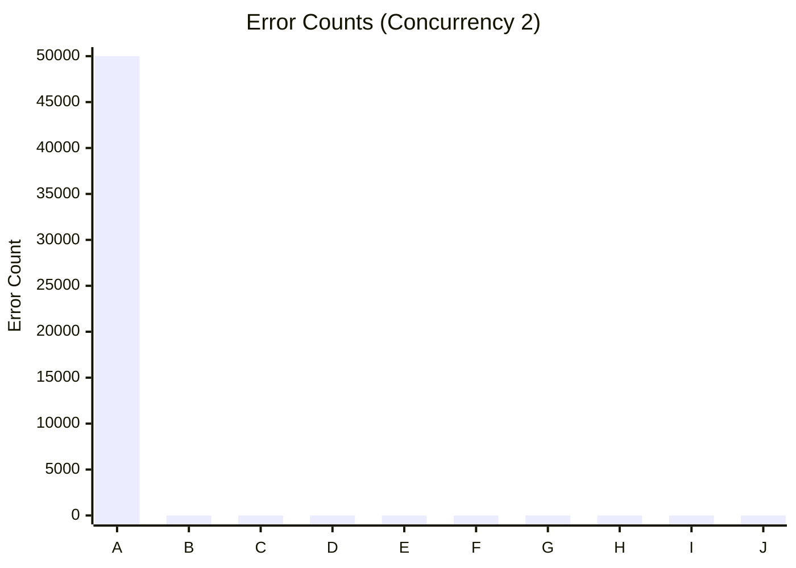
```mermaid
xychart-beta
    title "Error Counts (Concurrency 2)"
    x-axis ["A", "B", "C", "D", "E", "F", "G", "H", "I", "J"]
    y-axis "Error Count" 0 --> 50000
    bar [49998, 0, 0, 0, 0, 0, 0, 0, 0, 0]
```

## Concurrency 4

### Writes Per Second

This chart shows the write operations per second for all scenarios at concurrency level 4.

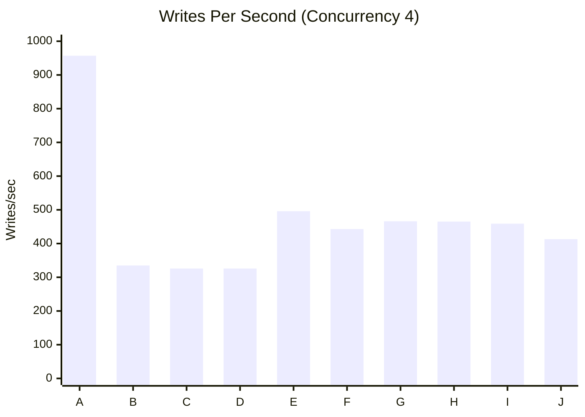
```mermaid
xychart-beta
    title "Writes Per Second (Concurrency 4)"
    x-axis ["A", "B", "C", "D", "E", "F", "G", "H", "I", "J"]
    y-axis "Writes/sec" 0 --> 1000
    bar [957, 335, 326, 326, 496, 443, 466, 465, 459, 413]
```

### Average Latency

This chart shows the average write latency for all scenarios at concurrency level 4.

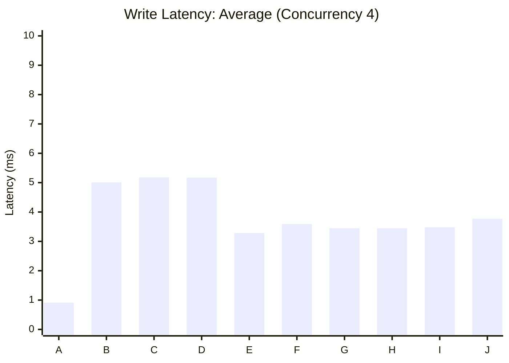
```mermaid
xychart-beta
    title "Write Latency: Average (Concurrency 4)"
    x-axis ["A", "B", "C", "D", "E", "F", "G", "H", "I", "J"]
    y-axis "Latency (ms)" 0 --> 10
    bar [0.91, 5.01, 5.18, 5.17, 3.28, 3.59, 3.45, 3.45, 3.48, 3.77]
```

### P95 Latency

This chart shows the 95th percentile write latency for all scenarios at concurrency level 4.

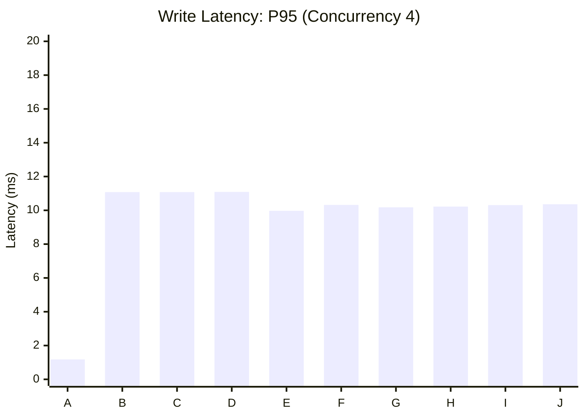
```mermaid
xychart-beta
    title "Write Latency: P95 (Concurrency 4)"
    x-axis ["A", "B", "C", "D", "E", "F", "G", "H", "I", "J"]
    y-axis "Latency (ms)" 0 --> 20
    bar [1.18, 11.08, 11.08, 11.09, 9.97, 10.32, 10.18, 10.22, 10.31, 10.36]
```

### P99 Latency

This chart shows the 99th percentile write latency for all scenarios at concurrency level 4.

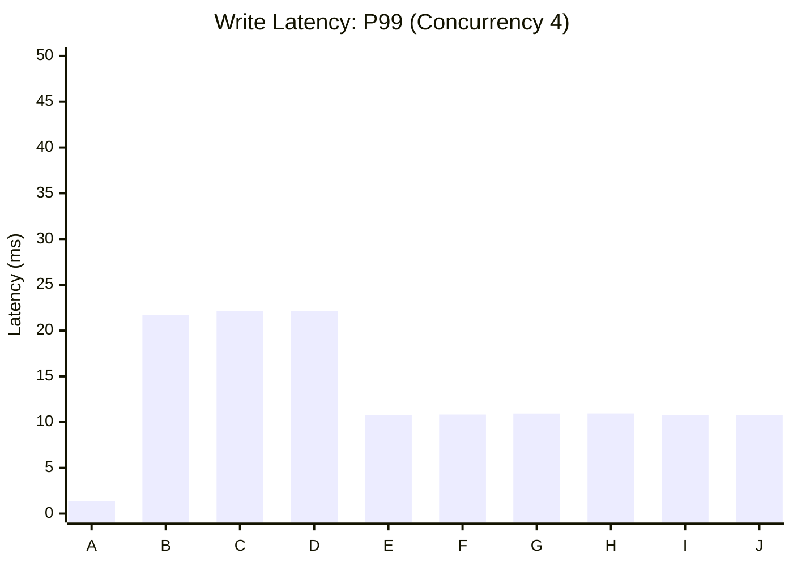
```mermaid
xychart-beta
    title "Write Latency: P99 (Concurrency 4)"
    x-axis ["A", "B", "C", "D", "E", "F", "G", "H", "I", "J"]
    y-axis "Latency (ms)" 0 --> 50
    bar [1.39, 21.73, 22.13, 22.16, 10.75, 10.82, 10.93, 10.94, 10.78, 10.76]
```

### Error Counts

This chart shows the number of lock errors for all scenarios at concurrency level 4.

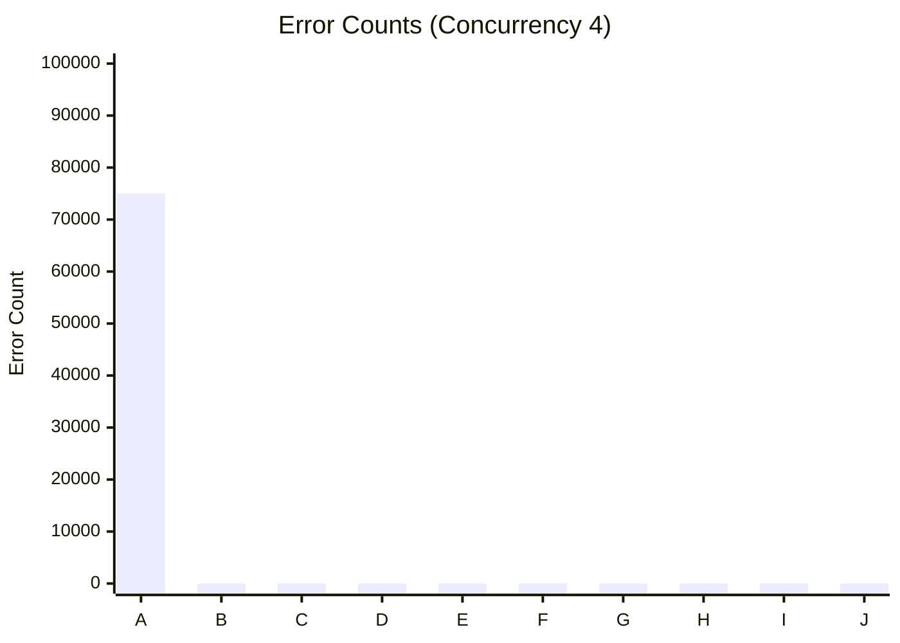
```mermaid
xychart-beta
    title "Error Counts (Concurrency 4)"
    x-axis ["A", "B", "C", "D", "E", "F", "G", "H", "I", "J"]
    y-axis "Error Count" 0 --> 100000
    bar [75031, 0, 0, 0, 0, 0, 0, 0, 0, 0]
```

## Concurrency 8

### Writes Per Second

This chart shows the write operations per second for all scenarios at concurrency level 8.

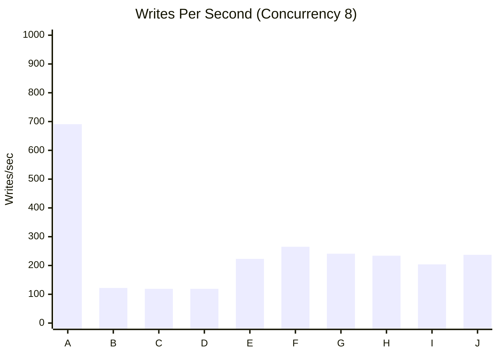
```mermaid
xychart-beta
    title "Writes Per Second (Concurrency 8)"
    x-axis ["A", "B", "C", "D", "E", "F", "G", "H", "I", "J"]
    y-axis "Writes/sec" 0 --> 1000
    bar [691, 122, 119, 119, 223, 265, 241, 234, 204, 237]
```

### Average Latency

This chart shows the average write latency for all scenarios at concurrency level 8.

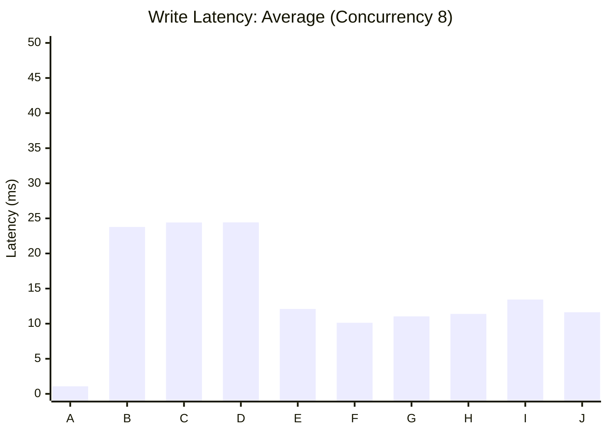
```mermaid
xychart-beta
    title "Write Latency: Average (Concurrency 8)"
    x-axis ["A", "B", "C", "D", "E", "F", "G", "H", "I", "J"]
    y-axis "Latency (ms)" 0 --> 50
    bar [1.07, 23.78, 24.42, 24.43, 12.10, 10.13, 11.04, 11.39, 13.44, 11.63]
```

### P95 Latency

This chart shows the 95th percentile write latency for all scenarios at concurrency level 8.

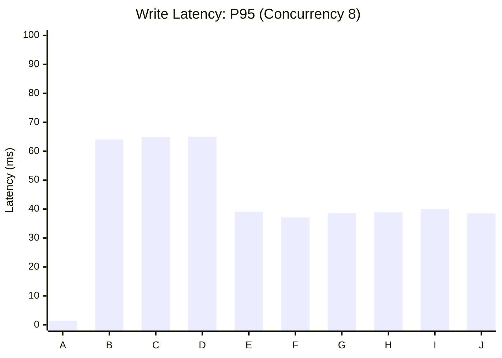
```mermaid
xychart-beta
    title "Write Latency: P95 (Concurrency 8)"
    x-axis ["A", "B", "C", "D", "E", "F", "G", "H", "I", "J"]
    y-axis "Latency (ms)" 0 --> 100
    bar [1.46, 64.02, 64.87, 65.00, 39.10, 37.12, 38.59, 38.93, 39.99, 38.47]
```

### P99 Latency

This chart shows the 99th percentile write latency for all scenarios at concurrency level 8.

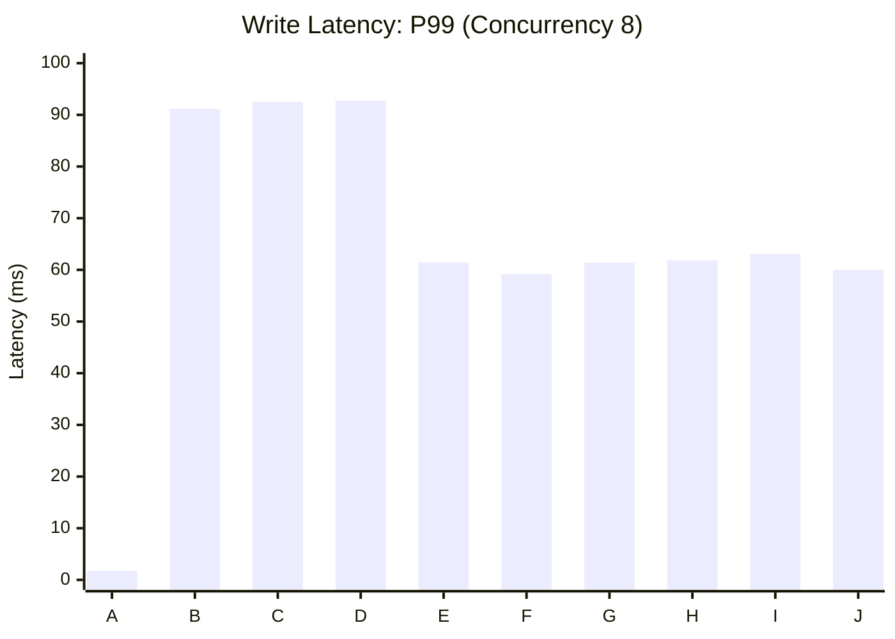
```mermaid
xychart-beta
    title "Write Latency: P99 (Concurrency 8)"
    x-axis ["A", "B", "C", "D", "E", "F", "G", "H", "I", "J"]
    y-axis "Latency (ms)" 0 --> 100
    bar [1.77, 91.17, 92.53, 92.73, 61.44, 59.19, 61.42, 61.85, 63.08, 59.99]
```

### Error Counts

This chart shows the number of lock errors for all scenarios at concurrency level 8.

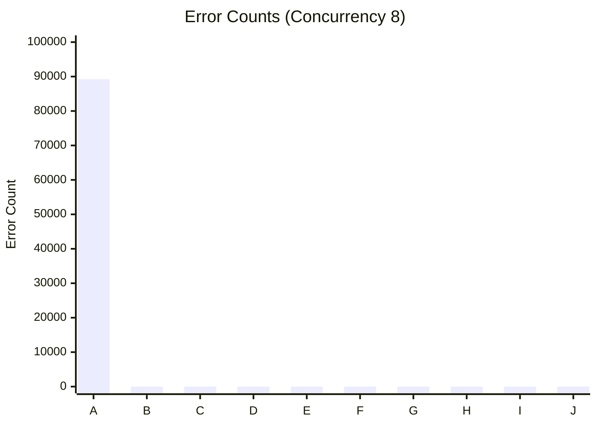
```mermaid
xychart-beta
    title "Error Counts (Concurrency 8)"
    x-axis ["A", "B", "C", "D", "E", "F", "G", "H", "I", "J"]
    y-axis "Error Count" 0 --> 100000
    bar [89232, 0, 0, 0, 0, 0, 0, 0, 0, 0]
```

## Concurrency 16

### Writes Per Second

This chart shows the write operations per second for all scenarios at concurrency level 16.

```mermaid
xychart-beta
    title "Writes Per Second (Concurrency 16)"
    x-axis ["A", "B", "C", "D", "E", "F", "G", "H", "I", "J"]
    y-axis "Writes/sec" 0 --> 500
    bar [181, 84, 84, 85, 214, 193, 196, 196, 174, 199]
```

### Average Latency

This chart shows the average write latency for all scenarios at concurrency level 16.

```mermaid
xychart-beta
    title "Write Latency: Average (Concurrency 16)"
    x-axis ["A", "B", "C", "D", "E", "F", "G", "H", "I", "J"]
    y-axis "Latency (ms)" 0 --> 100
    bar [1.48, 69.69, 70.77, 69.43, 22.33, 23.95, 24.49, 24.47, 29.66, 25.84]
```

### P95 Latency

This chart shows the 95th percentile write latency for all scenarios at concurrency level 16.

```mermaid
xychart-beta
    title "Write Latency: P95 (Concurrency 16)"
    x-axis ["A", "B", "C", "D", "E", "F", "G", "H", "I", "J"]
    y-axis "Latency (ms)" 0 --> 200
    bar [1.70, 193.92, 194.48, 193.95, 84.09, 88.79, 88.27, 87.99, 90.71, 86.55]
```

### P99 Latency

This chart shows the 99th percentile write latency for all scenarios at concurrency level 16.

```mermaid
xychart-beta
    title "Write Latency: P99 (Concurrency 16)"
    x-axis ["A", "B", "C", "D", "E", "F", "G", "H", "I", "J"]
    y-axis "Latency (ms)" 0 --> 500
    bar [2.66, 253.04, 289.97, 255.14, 114.66, 121.71, 119.54, 119.15, 139.74, 115.46]
```

### Error Counts

This chart shows the number of lock errors for all scenarios at concurrency level 16.

```mermaid
xychart-beta
    title "Error Counts (Concurrency 16)"
    x-axis ["A", "B", "C", "D", "E", "F", "G", "H", "I", "J"]
    y-axis "Error Count" 0 --> 100000
    bar [98326, 0, 0, 74, 0, 0, 0, 0, 0, 0]
```

## Concurrency 32

### Writes Per Second

This chart shows the write operations per second for all scenarios at concurrency level 32.

```mermaid
xychart-beta
    title "Writes Per Second (Concurrency 32)"
    x-axis ["A", "B", "C", "D", "E", "F", "G", "H", "I", "J"]
    y-axis "Writes/sec" 0 --> 500
    bar [241, 71, 75, 93, 210, 200, 190, 190, 204, 202]
```

### Average Latency

This chart shows the average write latency for all scenarios at concurrency level 32.

```mermaid
xychart-beta
    title "Write Latency: Average (Concurrency 32)"
    x-axis ["A", "B", "C", "D", "E", "F", "G", "H", "I", "J"]
    y-axis "Latency (ms)" 0 --> 200
    bar [1.93, 127.67, 120.32, 102.77, 36.79, 37.32, 41.88, 41.73, 40.45, 41.64]
```

### P95 Latency

This chart shows the 95th percentile write latency for all scenarios at concurrency level 32.

```mermaid
xychart-beta
    title "Write Latency: P95 (Concurrency 32)"
    x-axis ["A", "B", "C", "D", "E", "F", "G", "H", "I", "J"]
    y-axis "Latency (ms)" 0 --> 500
    bar [2.05, 448.53, 360.39, 306.98, 122.85, 139.27, 141.93, 141.77, 138.81, 139.85]
```

### P99 Latency

This chart shows the 99th percentile write latency for all scenarios at concurrency level 32.

```mermaid
xychart-beta
    title "Write Latency: P99 (Concurrency 32)"
    x-axis ["A", "B", "C", "D", "E", "F", "G", "H", "I", "J"]
    y-axis "Latency (ms)" 0 --> 1000
    bar [2.71, 659.51, 666.23, 426.84, 201.91, 220.18, 245.88, 244.61, 200.94, 199.83]
```

### Error Counts

This chart shows the number of lock errors for all scenarios at concurrency level 32.

```mermaid
xychart-beta
    title "Error Counts (Concurrency 32)"
    x-axis ["A", "B", "C", "D", "E", "F", "G", "H", "I", "J"]
    y-axis "Error Count" 0 --> 100000
    bar [97988, 0, 0, 2744, 0, 0, 0, 0, 0, 0]
```

## Concurrency 64

### Writes Per Second

This chart shows the write operations per second for all scenarios at concurrency level 64.

```mermaid
xychart-beta
    title "Writes Per Second (Concurrency 64)"
    x-axis ["A", "B", "C", "D", "E", "F", "G", "H", "I", "J"]
    y-axis "Writes/sec" 0 --> 200
    bar [135, 66, 49, 116, 101, 115, 174, 180, 137, 140]
```

### Average Latency

This chart shows the average write latency for all scenarios at concurrency level 64.

```mermaid
xychart-beta
    title "Write Latency: Average (Concurrency 64)"
    x-axis ["A", "B", "C", "D", "E", "F", "G", "H", "I", "J"]
    y-axis "Latency (ms)" 0 --> 500
    bar [3.91, 248.94, 319.03, 147.32, 107.49, 101.06, 71.33, 69.33, 93.00, 92.47]
```

### P95 Latency

This chart shows the 95th percentile write latency for all scenarios at concurrency level 64.

```mermaid
xychart-beta
    title "Write Latency: P95 (Concurrency 64)"
    x-axis ["A", "B", "C", "D", "E", "F", "G", "H", "I", "J"]
    y-axis "Latency (ms)" 0 --> 2000
    bar [3.48, 863.90, 1182.74, 422.95, 465.06, 452.03, 248.94, 247.27, 350.93, 349.31]
```

### P99 Latency

This chart shows the 99th percentile write latency for all scenarios at concurrency level 64.

```mermaid
xychart-beta
    title "Write Latency: P99 (Concurrency 64)"
    x-axis ["A", "B", "C", "D", "E", "F", "G", "H", "I", "J"]
    y-axis "Latency (ms)" 0 --> 2000
    bar [83.71, 1219.81, 1714.53, 442.24, 981.85, 867.16, 557.60, 555.29, 657.44, 654.45]
```

### Error Counts

This chart shows the number of lock errors for all scenarios at concurrency level 64.

```mermaid
xychart-beta
    title "Error Counts (Concurrency 64)"
    x-axis ["A", "B", "C", "D", "E", "F", "G", "H", "I", "J"]
    y-axis "Error Count" 0 --> 100000
    bar [98839, 0, 354, 19142, 3, 0, 0, 0, 0, 0]
```

## Concurrency 128

### Writes Per Second

This chart shows the write operations per second for all scenarios at concurrency level 128.

```mermaid
xychart-beta
    title "Writes Per Second (Concurrency 128)"
    x-axis ["A", "B", "C", "D", "E", "F", "G", "H", "J"]
    y-axis "Writes/sec" 0 --> 200
    bar [69, 61, 68, 135, 93, 123, 132, 118, 104]
```

### Average Latency

This chart shows the average write latency for all scenarios at concurrency level 128.

```mermaid
xychart-beta
    title "Write Latency: Average (Concurrency 128)"
    x-axis ["A", "B", "C", "D", "E", "F", "G", "H", "J"]
    y-axis "Latency (ms)" 0 --> 1000
    bar [27.54, 603.84, 580.24, 208.20, 264.41, 194.31, 179.77, 210.07, 260.51]
```

### P95 Latency

This chart shows the 95th percentile write latency for all scenarios at concurrency level 128.

```mermaid
xychart-beta
    title "Write Latency: P95 (Concurrency 128)"
    x-axis ["A", "B", "C", "D", "E", "F", "G", "H", "J"]
    y-axis "Latency (ms)" 0 --> 2000
    bar [237.86, 1824.45, 1634.21, 463.29, 1269.93, 869.64, 769.90, 868.32, 975.01]
```

### P99 Latency

This chart shows the 99th percentile write latency for all scenarios at concurrency level 128.

```mermaid
xychart-beta
    title "Write Latency: P99 (Concurrency 128)"
    x-axis ["A", "B", "C", "D", "E", "F", "G", "H", "J"]
    y-axis "Latency (ms)" 0 --> 5000
    bar [470.45, 2607.24, 2002.81, 544.69, 1795.27, 1328.64, 1191.46, 1280.24, 1503.53]
```

### Error Counts

This chart shows the number of lock errors for all scenarios at concurrency level 128.

```mermaid
xychart-beta
    title "Error Counts (Concurrency 128)"
    x-axis ["A", "B", "C", "D", "E", "F", "G", "H", "J"]
    y-axis "Error Count" 0 --> 100000
    bar [99069, 5, 1851, 43582, 468, 37, 1, 29, 15]
```

