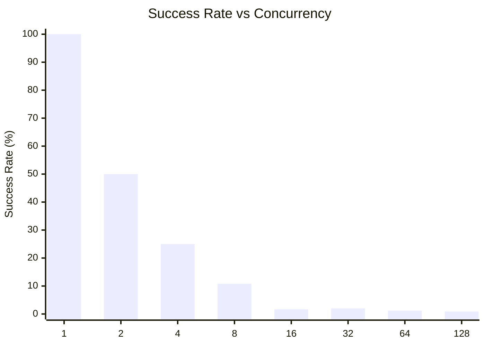
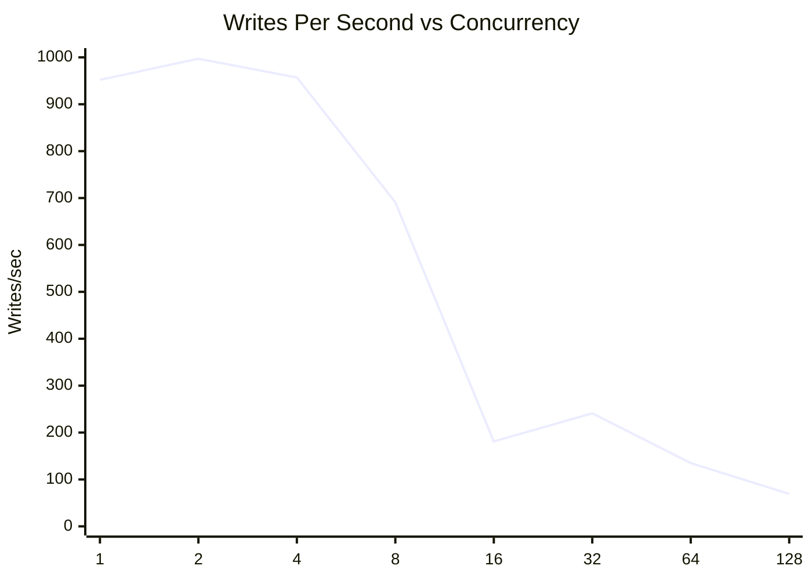
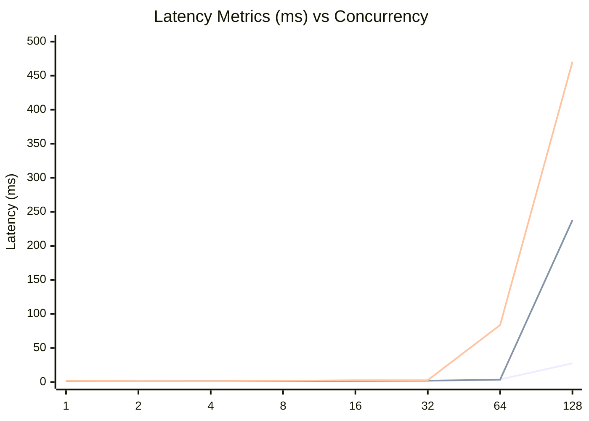
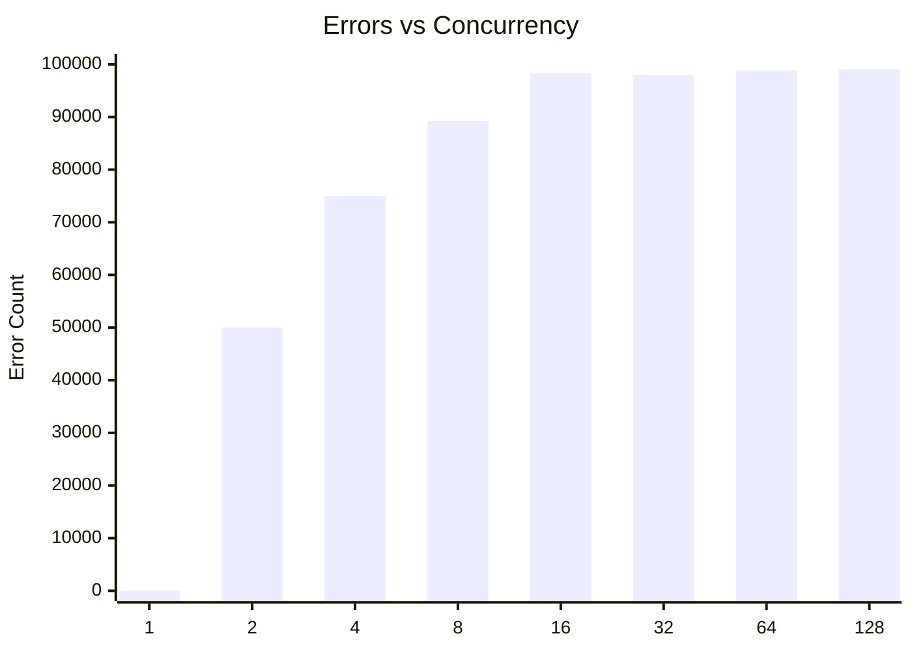

# SQLite Concurrent Writes Test: base0ConcurrentWrites

**Test Run:** 12/24/2025, 8:24:24 PM

## Overview

This test evaluates SQLite's behavior under concurrent write pressure. Each test configuration runs 100000 total write operations across different concurrency levels (number of simultaneous writers).

## Key Findings

- **Single writer achieves 100.0% success rate** with 952 writes/sec
- **Best throughput:** 997 writes/sec at concurrency 2
- **Worst success rate:** 0.9% at concurrency 128 with 99069 lock errors
- **High concurrency P99 latency:** 140ms average at 16+ concurrent writers


## Summary Table

| Concurrency | Success Rate | Writes/sec | Avg (ms) | P95 (ms) | P99 (ms) | Lock Errors |
|-------------|--------------|------------|----------|----------|----------|-------------|
| 1 | 100.0% | 952 | 0.90 | 1.30 | 1.69 | 0 |
| 2 | 50.0% | 997 | 0.86 | 1.16 | 1.43 | 49998 |
| 4 | 25.0% | 957 | 0.91 | 1.18 | 1.39 | 75031 |
| 8 | 10.8% | 691 | 1.07 | 1.46 | 1.77 | 89232 |
| 16 | 1.7% | 181 | 1.48 | 1.70 | 2.66 | 98326 |
| 32 | 2.0% | 241 | 1.93 | 2.05 | 2.71 | 97988 |
| 64 | 1.2% | 135 | 3.91 | 3.48 | 83.71 | 98839 |
| 128 | 0.9% | 69 | 27.54 | 237.86 | 470.45 | 99069 |


## Charts

### Success Rate by Concurrency

This chart shows how the success rate of write operations decreases as concurrency increases. SQLite uses file-level locking, so concurrent writes often fail with `SQLITE_BUSY` or `SQLITE_LOCKED` errors.



### Throughput (Writes Per Second)

Despite lower success rates at higher concurrency, the overall throughput pattern shows interesting behavior. The effective writes per second decreases as contention increases.



### Latency Distribution

This chart shows average, P95, and P99 latencies. As concurrency increases, latency variance grows significantly due to lock contention.



### Lock Errors by Concurrency

The number of lock errors (SQLITE_BUSY/SQLITE_LOCKED) increases with concurrency, demonstrating SQLite's single-writer limitation.



## Detailed Analysis

### Single Writer (Concurrency = 1)

With a single writer, SQLite performs optimally:
- **Success Rate:** 100.0%
- **Throughput:** 952 writes/second
- **Average Latency:** 0.90ms
- **P99 Latency:** 1.69ms
- **Lock Errors:** 0

This represents the baseline performance without contention.

### Low Concurrency (2-4 writers)

Even at low concurrency levels (2-4 writers), significant contention occurs:
- **Average Success Rate:** 37.5%
- **Average Lock Errors:** 62515 per test run

This demonstrates SQLite's fundamental limitation with concurrent writes - even 2 simultaneous writers will frequently conflict.

### High Concurrency (16+ writers)

At high concurrency (16+ writers), performance degrades significantly:
- **Average Success Rate:** 1.4%
- **Average P99 Latency:** 140ms
- **Maximum P99 Latency:** 470ms

The vast majority of write attempts fail due to lock contention. Successful writes also take much longer due to retry overhead and queuing.

## Raw Data

<details>
<summary>Click to expand raw JSON data</summary>

```json
{
  "testName": "base0ConcurrentWrites",
  "timestamp": "2025-12-24T14:54:24.237Z",
  "configurations": [
    {
      "concurrency": 1,
      "totalWrites": 100000,
      "metrics": {
        "total": 100000,
        "successful": 100000,
        "errors": 0,
        "lockErrors": 0,
        "successRate": 100,
        "avgTime": 0.9025808552799859,
        "p95": 1.3012610000005225,
        "p99": 1.6874580000003334,
        "writesPerSec": 952.1218746779022,
        "totalDuration": 105028.571089
      }
    },
    {
      "concurrency": 2,
      "totalWrites": 100000,
      "metrics": {
        "total": 100000,
        "successful": 50002,
        "errors": 49998,
        "lockErrors": 49998,
        "successRate": 50.002,
        "avgTime": 0.8576285034399347,
        "p95": 1.1603650000179186,
        "p99": 1.426779000001261,
        "writesPerSec": 996.5362773848364,
        "totalDuration": 50175.79503600001
      }
    },
    {
      "concurrency": 4,
      "totalWrites": 100000,
      "metrics": {
        "total": 100000,
        "successful": 24969,
        "errors": 75031,
        "lockErrors": 75031,
        "successRate": 24.969,
        "avgTime": 0.9065485476390527,
        "p95": 1.1784069999994244,
        "p99": 1.3930560000007972,
        "writesPerSec": 956.6005534368238,
        "totalDuration": 26101.803840999986
      }
    },
    {
      "concurrency": 8,
      "totalWrites": 100000,
      "metrics": {
        "total": 100000,
        "successful": 10768,
        "errors": 89232,
        "lockErrors": 89232,
        "successRate": 10.768,
        "avgTime": 1.0693726368872958,
        "p95": 1.4625539999979082,
        "p99": 1.7651130000012927,
        "writesPerSec": 690.9083135182454,
        "totalDuration": 15585.280693999986
      }
    },
    {
      "concurrency": 16,
      "totalWrites": 100000,
      "metrics": {
        "total": 100000,
        "successful": 1674,
        "errors": 98326,
        "lockErrors": 98326,
        "successRate": 1.6740000000000002,
        "avgTime": 1.4786496786143193,
        "p95": 1.696884000004502,
        "p99": 2.6641339999914635,
        "writesPerSec": 181.3070391112432,
        "totalDuration": 9232.956470999983
      }
    },
    {
      "concurrency": 32,
      "totalWrites": 100000,
      "metrics": {
        "total": 100000,
        "successful": 2012,
        "errors": 97988,
        "lockErrors": 97988,
        "successRate": 2.012,
        "avgTime": 1.9323113265406497,
        "p95": 2.0504669999936596,
        "p99": 2.7063560000096913,
        "writesPerSec": 241.0898557228808,
        "totalDuration": 8345.43616099999
      }
    },
    {
      "concurrency": 64,
      "totalWrites": 100000,
      "metrics": {
        "total": 100000,
        "successful": 1161,
        "errors": 98839,
        "lockErrors": 98839,
        "successRate": 1.161,
        "avgTime": 3.911227607234587,
        "p95": 3.4816800000262447,
        "p99": 83.71229200001108,
        "writesPerSec": 135.09399505582707,
        "totalDuration": 8594.016333000007
      }
    },
    {
      "concurrency": 128,
      "totalWrites": 100000,
      "metrics": {
        "total": 100000,
        "successful": 931,
        "errors": 99069,
        "lockErrors": 99069,
        "successRate": 0.931,
        "avgTime": 27.543024098818627,
        "p95": 237.86051100000623,
        "p99": 470.4476790000044,
        "writesPerSec": 69.21572195242216,
        "totalDuration": 13450.701281999995
      }
    }
  ]
}
```

</details>
