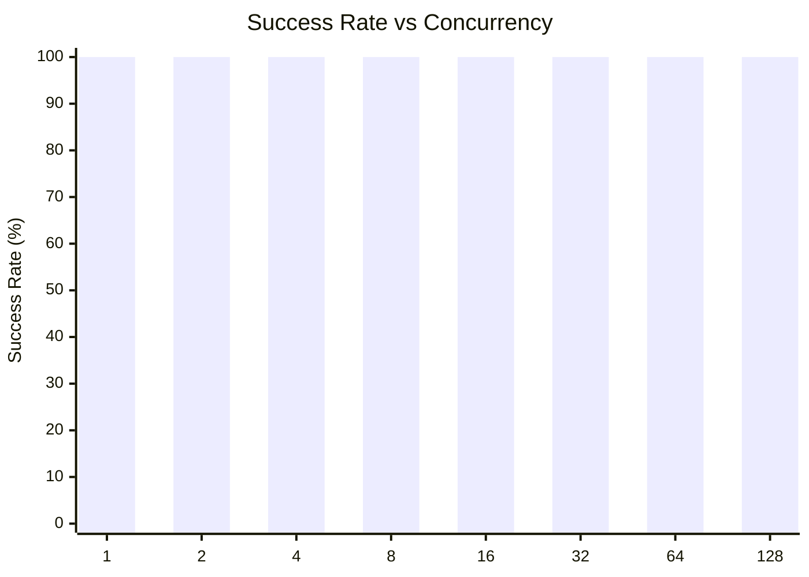
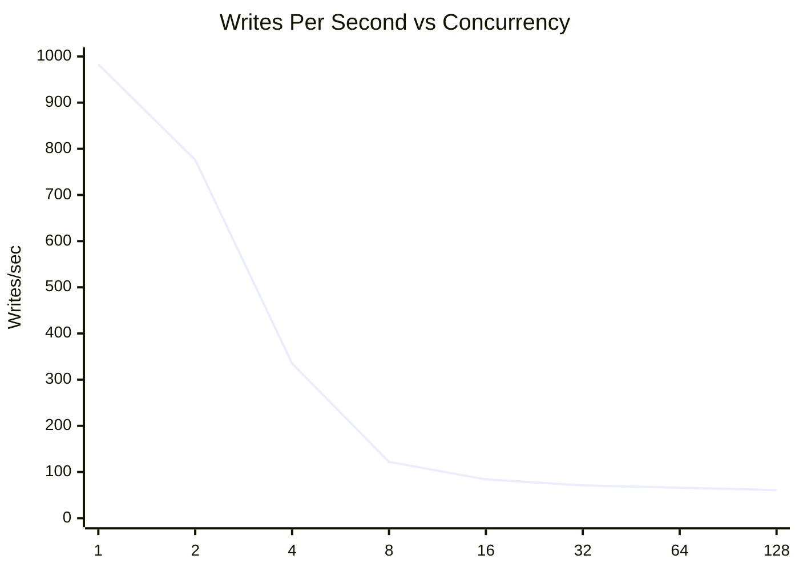
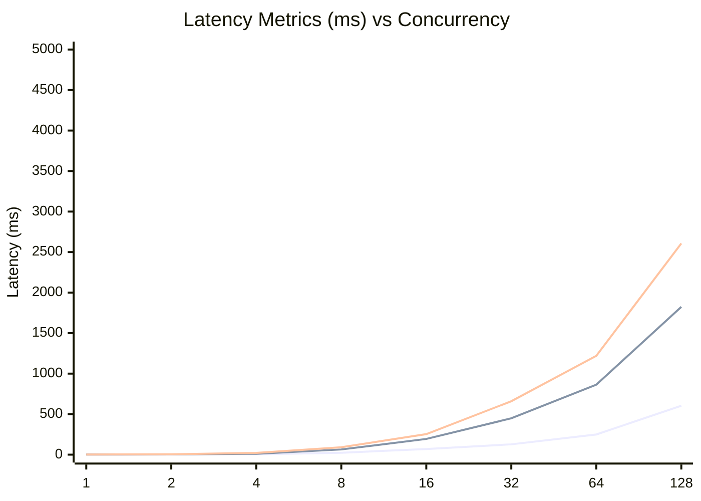
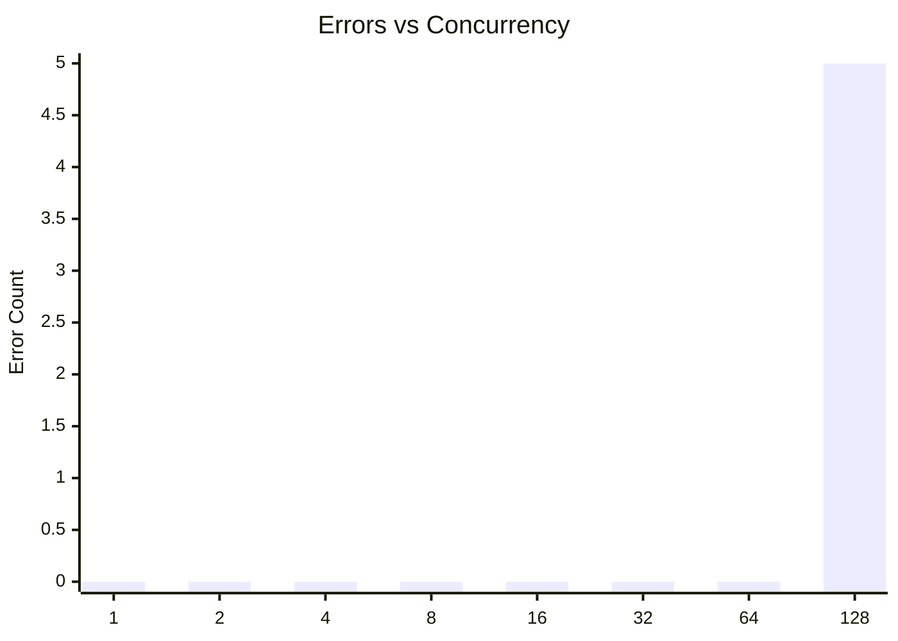

# SQLite Concurrent Writes Test: busyTimeout1ConcurrentWrites

**Test Run:** 12/24/2025, 10:46:02 PM

## Overview

This test evaluates SQLite's behavior under concurrent write pressure. Each test configuration runs 100000 total write operations across different concurrency levels (number of simultaneous writers).

## Key Findings

- **Single writer achieves 100.0% success rate** with 983 writes/sec
- **Best throughput:** 983 writes/sec at concurrency 1
- **Worst success rate:** 100.0% at concurrency 128 with 5 lock errors
- **High concurrency P99 latency:** 1185ms average at 16+ concurrent writers


## Summary Table

| Concurrency | Success Rate | Writes/sec | Avg (ms) | P95 (ms) | P99 (ms) | Lock Errors |
|-------------|--------------|------------|----------|----------|----------|-------------|
| 1 | 100.0% | 983 | 0.80 | 1.12 | 1.37 | 0 |
| 2 | 100.0% | 776 | 1.57 | 2.45 | 4.62 | 0 |
| 4 | 100.0% | 335 | 5.01 | 11.08 | 21.73 | 0 |
| 8 | 100.0% | 122 | 23.78 | 64.02 | 91.17 | 0 |
| 16 | 100.0% | 84 | 69.69 | 193.92 | 253.04 | 0 |
| 32 | 100.0% | 71 | 127.67 | 448.53 | 659.51 | 0 |
| 64 | 100.0% | 66 | 248.94 | 863.90 | 1219.81 | 0 |
| 128 | 100.0% | 61 | 603.84 | 1824.45 | 2607.24 | 5 |


## Charts

### Success Rate by Concurrency

This chart shows how the success rate of write operations decreases as concurrency increases. SQLite uses file-level locking, so concurrent writes often fail with `SQLITE_BUSY` or `SQLITE_LOCKED` errors.



### Throughput (Writes Per Second)

Despite lower success rates at higher concurrency, the overall throughput pattern shows interesting behavior. The effective writes per second decreases as contention increases.



### Latency Distribution

This chart shows average, P95, and P99 latencies. As concurrency increases, latency variance grows significantly due to lock contention.



### Lock Errors by Concurrency

The number of lock errors (SQLITE_BUSY/SQLITE_LOCKED) increases with concurrency, demonstrating SQLite's single-writer limitation.



## Detailed Analysis

### Single Writer (Concurrency = 1)

With a single writer, SQLite performs optimally:
- **Success Rate:** 100.0%
- **Throughput:** 983 writes/second
- **Average Latency:** 0.80ms
- **P99 Latency:** 1.37ms
- **Lock Errors:** 0

This represents the baseline performance without contention.

### Low Concurrency (2-4 writers)

Even at low concurrency levels (2-4 writers), significant contention occurs:
- **Average Success Rate:** 100.0%
- **Average Lock Errors:** 0 per test run

This demonstrates SQLite's fundamental limitation with concurrent writes - even 2 simultaneous writers will frequently conflict.

### High Concurrency (16+ writers)

At high concurrency (16+ writers), performance degrades significantly:
- **Average Success Rate:** 100.0%
- **Average P99 Latency:** 1185ms
- **Maximum P99 Latency:** 2607ms

The vast majority of write attempts fail due to lock contention. Successful writes also take much longer due to retry overhead and queuing.

## Raw Data

<details>
<summary>Click to expand raw JSON data</summary>

```json
{
  "testName": "busyTimeout1ConcurrentWrites",
  "timestamp": "2025-12-24T17:16:02.478Z",
  "configurations": [
    {
      "concurrency": 1,
      "totalWrites": 100000,
      "metrics": {
        "total": 100000,
        "successful": 100000,
        "errors": 0,
        "lockErrors": 0,
        "successRate": 100,
        "avgTime": 0.7955622229099925,
        "p95": 1.116647999995621,
        "p99": 1.3723310000059428,
        "writesPerSec": 982.7102231327108,
        "totalDuration": 101759.39727300001
      }
    },
    {
      "concurrency": 2,
      "totalWrites": 100000,
      "metrics": {
        "total": 100000,
        "successful": 100000,
        "errors": 0,
        "lockErrors": 0,
        "successRate": 100,
        "avgTime": 1.5653911375999834,
        "p95": 2.44517999998061,
        "p99": 4.623919999998179,
        "writesPerSec": 775.6912969502893,
        "totalDuration": 128917.264372
      }
    },
    {
      "concurrency": 4,
      "totalWrites": 100000,
      "metrics": {
        "total": 100000,
        "successful": 100000,
        "errors": 0,
        "lockErrors": 0,
        "successRate": 100,
        "avgTime": 5.013621336090113,
        "p95": 11.076808999991044,
        "p99": 21.73486700002104,
        "writesPerSec": 335.1200251071127,
        "totalDuration": 298400.550573
      }
    },
    {
      "concurrency": 8,
      "totalWrites": 100000,
      "metrics": {
        "total": 100000,
        "successful": 100000,
        "errors": 0,
        "lockErrors": 0,
        "successRate": 100,
        "avgTime": 23.783772884749958,
        "p95": 64.017804000061,
        "p99": 91.16516699991189,
        "writesPerSec": 121.80719961108112,
        "totalDuration": 820969.5347999999
      }
    },
    {
      "concurrency": 16,
      "totalWrites": 100000,
      "metrics": {
        "total": 100000,
        "successful": 100000,
        "errors": 0,
        "lockErrors": 0,
        "successRate": 100,
        "avgTime": 69.69499433829037,
        "p95": 193.92000299994834,
        "p99": 253.03985900012776,
        "writesPerSec": 84.45075839810706,
        "totalDuration": 1184121.9889179997
      }
    },
    {
      "concurrency": 32,
      "totalWrites": 100000,
      "metrics": {
        "total": 100000,
        "successful": 100000,
        "errors": 0,
        "lockErrors": 0,
        "successRate": 100,
        "avgTime": 127.66505692826975,
        "p95": 448.53138600010425,
        "p99": 659.513145999983,
        "writesPerSec": 71.3938524521745,
        "totalDuration": 1400680.8228620002
      }
    },
    {
      "concurrency": 64,
      "totalWrites": 100000,
      "metrics": {
        "total": 100000,
        "successful": 100000,
        "errors": 0,
        "lockErrors": 0,
        "successRate": 100,
        "avgTime": 248.93632333813005,
        "p95": 863.8957239999436,
        "p99": 1219.809957000427,
        "writesPerSec": 66.38679917325841,
        "totalDuration": 1506323.5650060005
      }
    },
    {
      "concurrency": 128,
      "totalWrites": 100000,
      "metrics": {
        "total": 100000,
        "successful": 99995,
        "errors": 5,
        "lockErrors": 5,
        "successRate": 99.995,
        "avgTime": 603.8417842523386,
        "p95": 1824.45264699962,
        "p99": 2607.2363699991256,
        "writesPerSec": 61.27826156920206,
        "totalDuration": 1631818.4856970003
      }
    }
  ]
}
```

</details>
