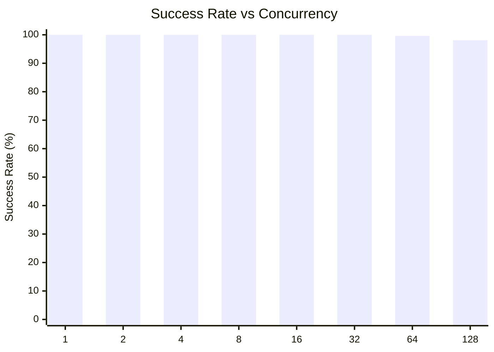
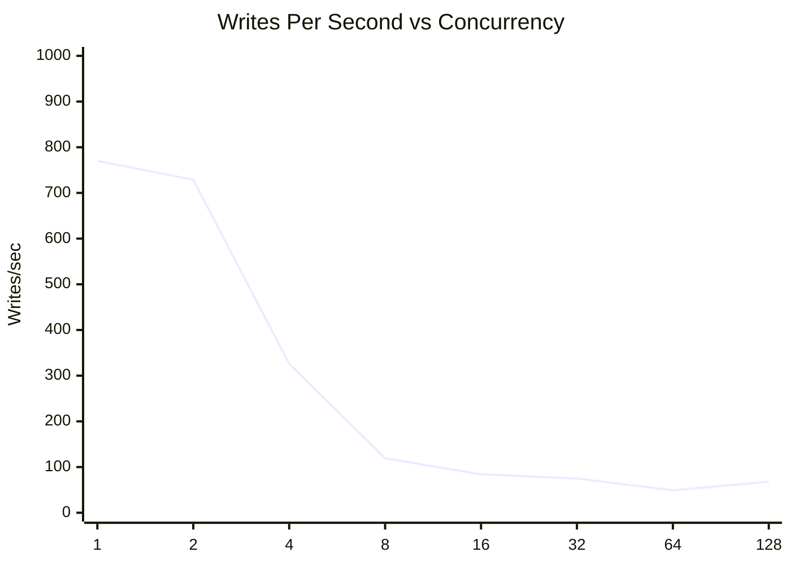
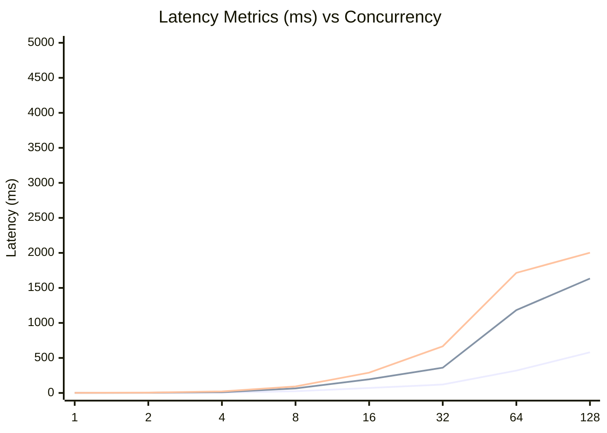
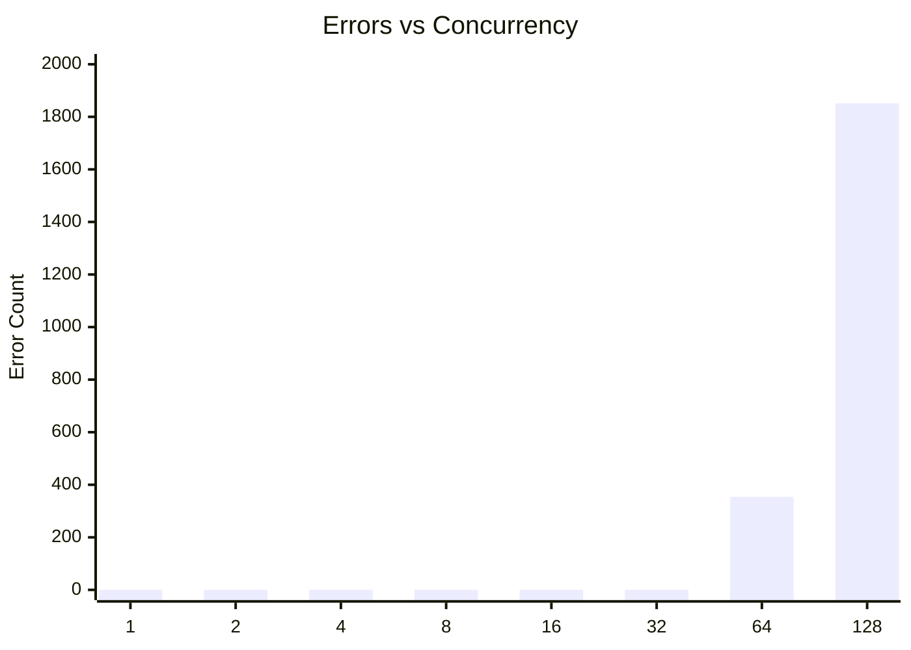

# SQLite Concurrent Writes Test: busyTimeout2000ConcurrentWrites

**Test Run:** 12/24/2025, 11:58:35 PM

## Overview

This test evaluates SQLite's behavior under concurrent write pressure. Each test configuration runs 100000 total write operations across different concurrency levels (number of simultaneous writers).

## Key Findings

- **Single writer achieves 100.0% success rate** with 770 writes/sec
- **Best throughput:** 770 writes/sec at concurrency 1
- **Worst success rate:** 98.1% at concurrency 128 with 1851 lock errors
- **High concurrency P99 latency:** 1168ms average at 16+ concurrent writers


## Summary Table

| Concurrency | Success Rate | Writes/sec | Avg (ms) | P95 (ms) | P99 (ms) | Lock Errors |
|-------------|--------------|------------|----------|----------|----------|-------------|
| 1 | 100.0% | 770 | 0.99 | 1.45 | 1.95 | 0 |
| 2 | 100.0% | 729 | 1.69 | 2.76 | 4.98 | 0 |
| 4 | 100.0% | 326 | 5.18 | 11.08 | 22.13 | 0 |
| 8 | 100.0% | 119 | 24.42 | 64.87 | 92.53 | 0 |
| 16 | 100.0% | 84 | 70.77 | 194.48 | 289.97 | 0 |
| 32 | 100.0% | 75 | 120.32 | 360.39 | 666.23 | 0 |
| 64 | 99.6% | 49 | 319.03 | 1182.74 | 1714.53 | 354 |
| 128 | 98.1% | 68 | 580.24 | 1634.21 | 2002.81 | 1851 |


## Charts

### Success Rate by Concurrency

This chart shows how the success rate of write operations decreases as concurrency increases. SQLite uses file-level locking, so concurrent writes often fail with `SQLITE_BUSY` or `SQLITE_LOCKED` errors.



### Throughput (Writes Per Second)

Despite lower success rates at higher concurrency, the overall throughput pattern shows interesting behavior. The effective writes per second decreases as contention increases.



### Latency Distribution

This chart shows average, P95, and P99 latencies. As concurrency increases, latency variance grows significantly due to lock contention.



### Lock Errors by Concurrency

The number of lock errors (SQLITE_BUSY/SQLITE_LOCKED) increases with concurrency, demonstrating SQLite's single-writer limitation.



## Detailed Analysis

### Single Writer (Concurrency = 1)

With a single writer, SQLite performs optimally:
- **Success Rate:** 100.0%
- **Throughput:** 770 writes/second
- **Average Latency:** 0.99ms
- **P99 Latency:** 1.95ms
- **Lock Errors:** 0

This represents the baseline performance without contention.

### Low Concurrency (2-4 writers)

Even at low concurrency levels (2-4 writers), significant contention occurs:
- **Average Success Rate:** 100.0%
- **Average Lock Errors:** 0 per test run

This demonstrates SQLite's fundamental limitation with concurrent writes - even 2 simultaneous writers will frequently conflict.

### High Concurrency (16+ writers)

At high concurrency (16+ writers), performance degrades significantly:
- **Average Success Rate:** 99.4%
- **Average P99 Latency:** 1168ms
- **Maximum P99 Latency:** 2003ms

The vast majority of write attempts fail due to lock contention. Successful writes also take much longer due to retry overhead and queuing.

## Raw Data

<details>
<summary>Click to expand raw JSON data</summary>

```json
{
  "testName": "busyTimeout2000ConcurrentWrites",
  "timestamp": "2025-12-24T18:28:35.781Z",
  "configurations": [
    {
      "concurrency": 1,
      "totalWrites": 100000,
      "metrics": {
        "total": 100000,
        "successful": 100000,
        "errors": 0,
        "lockErrors": 0,
        "successRate": 100,
        "avgTime": 0.9914040975899707,
        "p95": 1.4464020000013988,
        "p99": 1.948259999990114,
        "writesPerSec": 770.4978591775116,
        "totalDuration": 129786.21395100001
      }
    },
    {
      "concurrency": 2,
      "totalWrites": 100000,
      "metrics": {
        "total": 100000,
        "successful": 100000,
        "errors": 0,
        "lockErrors": 0,
        "successRate": 100,
        "avgTime": 1.6886288524899862,
        "p95": 2.762040999979945,
        "p99": 4.9837010000192095,
        "writesPerSec": 728.7795271186969,
        "totalDuration": 137215.709661
      }
    },
    {
      "concurrency": 4,
      "totalWrites": 100000,
      "metrics": {
        "total": 100000,
        "successful": 100000,
        "errors": 0,
        "lockErrors": 0,
        "successRate": 100,
        "avgTime": 5.1784702237599785,
        "p95": 11.082767000014428,
        "p99": 22.131762000033632,
        "writesPerSec": 325.7045606179658,
        "totalDuration": 307026.71098699997
      }
    },
    {
      "concurrency": 8,
      "totalWrites": 100000,
      "metrics": {
        "total": 100000,
        "successful": 100000,
        "errors": 0,
        "lockErrors": 0,
        "successRate": 100,
        "avgTime": 24.41551083527973,
        "p95": 64.87026599992532,
        "p99": 92.52703699993435,
        "writesPerSec": 118.90622514241731,
        "totalDuration": 840998.8617519999
      }
    },
    {
      "concurrency": 16,
      "totalWrites": 100000,
      "metrics": {
        "total": 100000,
        "successful": 100000,
        "errors": 0,
        "lockErrors": 0,
        "successRate": 100,
        "avgTime": 70.76847621396917,
        "p95": 194.48038200009614,
        "p99": 289.97224400006235,
        "writesPerSec": 83.61320253801371,
        "totalDuration": 1195983.373015
      }
    },
    {
      "concurrency": 32,
      "totalWrites": 100000,
      "metrics": {
        "total": 100000,
        "successful": 100000,
        "errors": 0,
        "lockErrors": 0,
        "successRate": 100,
        "avgTime": 120.32096336830992,
        "p95": 360.3907139999792,
        "p99": 666.2254380001687,
        "writesPerSec": 75.49499055500947,
        "totalDuration": 1324591.198235
      }
    },
    {
      "concurrency": 64,
      "totalWrites": 100000,
      "metrics": {
        "total": 100000,
        "successful": 99646,
        "errors": 354,
        "lockErrors": 354,
        "successRate": 99.646,
        "avgTime": 319.02718977884905,
        "p95": 1182.743586000055,
        "p99": 1714.531336999964,
        "writesPerSec": 48.93447643132562,
        "totalDuration": 2036314.8288679998
      }
    },
    {
      "concurrency": 128,
      "totalWrites": 100000,
      "metrics": {
        "total": 100000,
        "successful": 98149,
        "errors": 1851,
        "lockErrors": 1851,
        "successRate": 98.149,
        "avgTime": 580.2356389403649,
        "p95": 1634.2089550001547,
        "p99": 2002.8102350002155,
        "writesPerSec": 68.09951381166208,
        "totalDuration": 1441258.4540830003
      }
    }
  ]
}
```

</details>
