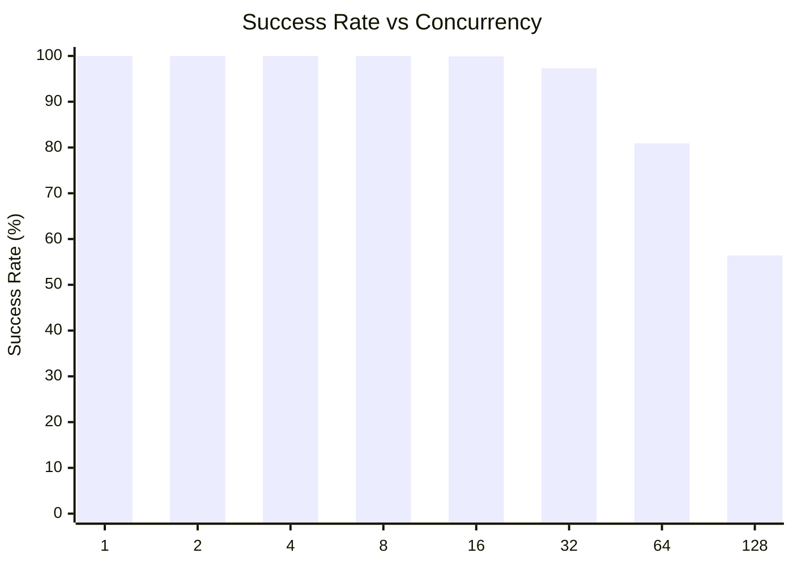
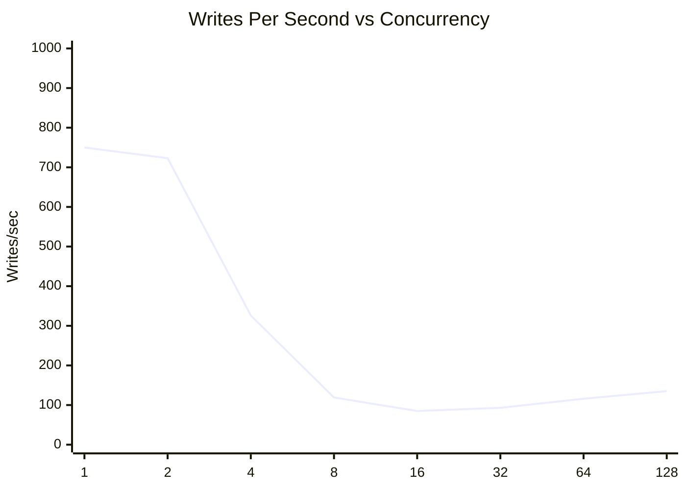
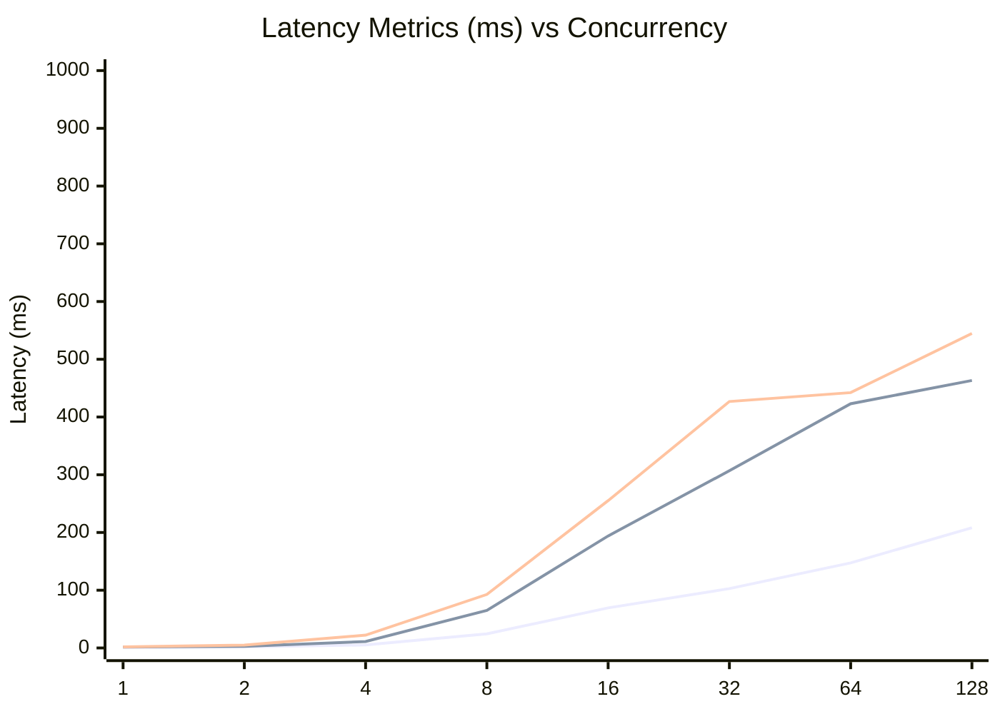
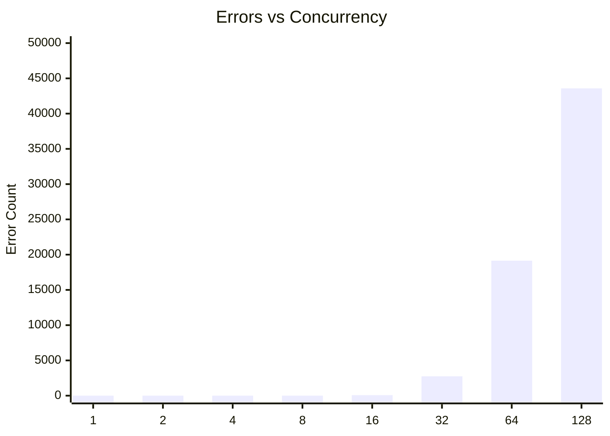

# SQLite Concurrent Writes Test: busyTimeout400ConcurrentWrites

**Test Run:** 12/24/2025, 11:14:33 PM

## Overview

This test evaluates SQLite's behavior under concurrent write pressure. Each test configuration runs 100000 total write operations across different concurrency levels (number of simultaneous writers).

## Key Findings

- **Single writer achieves 100.0% success rate** with 750 writes/sec
- **Best throughput:** 750 writes/sec at concurrency 1
- **Worst success rate:** 56.4% at concurrency 128 with 43582 lock errors
- **High concurrency P99 latency:** 417ms average at 16+ concurrent writers


## Summary Table

| Concurrency | Success Rate | Writes/sec | Avg (ms) | P95 (ms) | P99 (ms) | Lock Errors |
|-------------|--------------|------------|----------|----------|----------|-------------|
| 1 | 100.0% | 750 | 1.01 | 1.46 | 1.95 | 0 |
| 2 | 100.0% | 723 | 1.69 | 2.82 | 5.00 | 0 |
| 4 | 100.0% | 326 | 5.17 | 11.09 | 22.16 | 0 |
| 8 | 100.0% | 119 | 24.43 | 65.00 | 92.73 | 0 |
| 16 | 99.9% | 85 | 69.43 | 193.95 | 255.14 | 74 |
| 32 | 97.3% | 93 | 102.77 | 306.98 | 426.84 | 2744 |
| 64 | 80.9% | 116 | 147.32 | 422.95 | 442.24 | 19142 |
| 128 | 56.4% | 135 | 208.20 | 463.29 | 544.69 | 43582 |


## Charts

### Success Rate by Concurrency

This chart shows how the success rate of write operations decreases as concurrency increases. SQLite uses file-level locking, so concurrent writes often fail with `SQLITE_BUSY` or `SQLITE_LOCKED` errors.



### Throughput (Writes Per Second)

Despite lower success rates at higher concurrency, the overall throughput pattern shows interesting behavior. The effective writes per second decreases as contention increases.



### Latency Distribution

This chart shows average, P95, and P99 latencies. As concurrency increases, latency variance grows significantly due to lock contention.



### Lock Errors by Concurrency

The number of lock errors (SQLITE_BUSY/SQLITE_LOCKED) increases with concurrency, demonstrating SQLite's single-writer limitation.



## Detailed Analysis

### Single Writer (Concurrency = 1)

With a single writer, SQLite performs optimally:
- **Success Rate:** 100.0%
- **Throughput:** 750 writes/second
- **Average Latency:** 1.01ms
- **P99 Latency:** 1.95ms
- **Lock Errors:** 0

This represents the baseline performance without contention.

### Low Concurrency (2-4 writers)

Even at low concurrency levels (2-4 writers), significant contention occurs:
- **Average Success Rate:** 100.0%
- **Average Lock Errors:** 0 per test run

This demonstrates SQLite's fundamental limitation with concurrent writes - even 2 simultaneous writers will frequently conflict.

### High Concurrency (16+ writers)

At high concurrency (16+ writers), performance degrades significantly:
- **Average Success Rate:** 83.6%
- **Average P99 Latency:** 417ms
- **Maximum P99 Latency:** 545ms

The vast majority of write attempts fail due to lock contention. Successful writes also take much longer due to retry overhead and queuing.

## Raw Data

<details>
<summary>Click to expand raw JSON data</summary>

```json
{
  "testName": "busyTimeout400ConcurrentWrites",
  "timestamp": "2025-12-24T17:44:33.543Z",
  "configurations": [
    {
      "concurrency": 1,
      "totalWrites": 100000,
      "metrics": {
        "total": 100000,
        "successful": 100000,
        "errors": 0,
        "lockErrors": 0,
        "successRate": 100,
        "avgTime": 1.0093531644700235,
        "p95": 1.4569400000000314,
        "p99": 1.9504549999983283,
        "writesPerSec": 750.1627304343498,
        "totalDuration": 133304.409754
      }
    },
    {
      "concurrency": 2,
      "totalWrites": 100000,
      "metrics": {
        "total": 100000,
        "successful": 100000,
        "errors": 0,
        "lockErrors": 0,
        "successRate": 100,
        "avgTime": 1.69128985328,
        "p95": 2.823754999990342,
        "p99": 4.995152000017697,
        "writesPerSec": 722.7102394397358,
        "totalDuration": 138368.04094200002
      }
    },
    {
      "concurrency": 4,
      "totalWrites": 100000,
      "metrics": {
        "total": 100000,
        "successful": 100000,
        "errors": 0,
        "lockErrors": 0,
        "successRate": 100,
        "avgTime": 5.1715803367798925,
        "p95": 11.087436000001617,
        "p99": 22.160992999968585,
        "writesPerSec": 325.5901093549932,
        "totalDuration": 307134.63685400004
      }
    },
    {
      "concurrency": 8,
      "totalWrites": 100000,
      "metrics": {
        "total": 100000,
        "successful": 100000,
        "errors": 0,
        "lockErrors": 0,
        "successRate": 100,
        "avgTime": 24.42831951943992,
        "p95": 65.0019499999471,
        "p99": 92.72784500010312,
        "writesPerSec": 118.78735182695624,
        "totalDuration": 841840.469225
      }
    },
    {
      "concurrency": 16,
      "totalWrites": 100000,
      "metrics": {
        "total": 100000,
        "successful": 99926,
        "errors": 74,
        "lockErrors": 74,
        "successRate": 99.926,
        "avgTime": 69.43028195572559,
        "p95": 193.94713900005445,
        "p99": 255.13572099991143,
        "writesPerSec": 84.86022621581894,
        "totalDuration": 1177536.3377639998
      }
    },
    {
      "concurrency": 32,
      "totalWrites": 100000,
      "metrics": {
        "total": 100000,
        "successful": 97256,
        "errors": 2744,
        "lockErrors": 2744,
        "successRate": 97.256,
        "avgTime": 102.76761939877309,
        "p95": 306.98179800016806,
        "p99": 426.84326699981466,
        "writesPerSec": 93.3674495179997,
        "totalDuration": 1041647.8173290002
      }
    },
    {
      "concurrency": 64,
      "totalWrites": 100000,
      "metrics": {
        "total": 100000,
        "successful": 80858,
        "errors": 19142,
        "lockErrors": 19142,
        "successRate": 80.85799999999999,
        "avgTime": 147.3226783348091,
        "p95": 422.95275199972093,
        "p99": 442.24123500008136,
        "writesPerSec": 115.7860915724319,
        "totalDuration": 698339.4888100005
      }
    },
    {
      "concurrency": 128,
      "totalWrites": 100000,
      "metrics": {
        "total": 100000,
        "successful": 56418,
        "errors": 43582,
        "lockErrors": 43582,
        "successRate": 56.418,
        "avgTime": 208.19870821342369,
        "p95": 463.2909909998998,
        "p99": 544.6905419994146,
        "writesPerSec": 135.28273410788643,
        "totalDuration": 417037.6979149999
      }
    }
  ]
}
```

</details>
