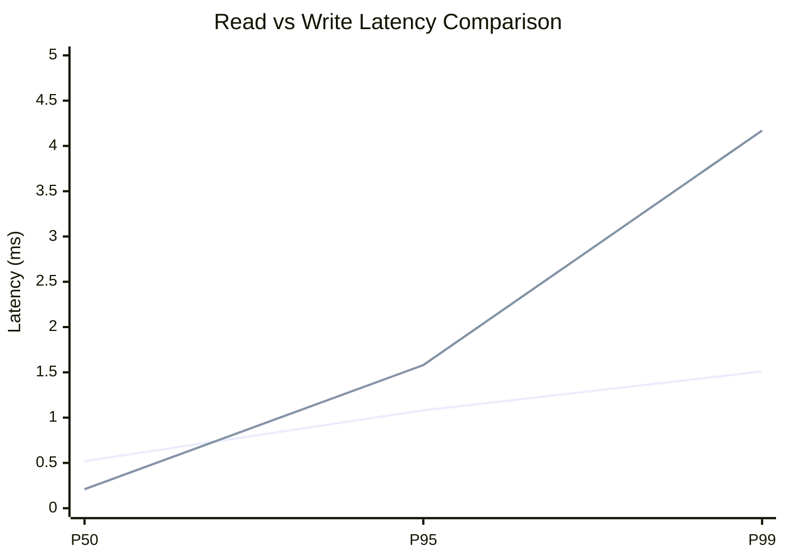
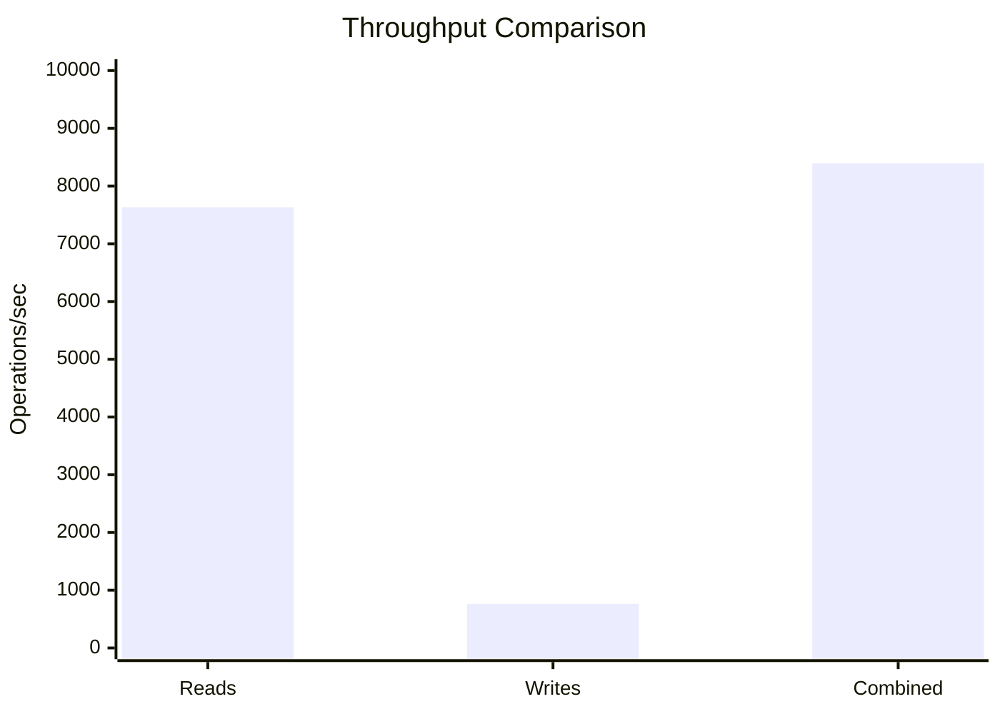
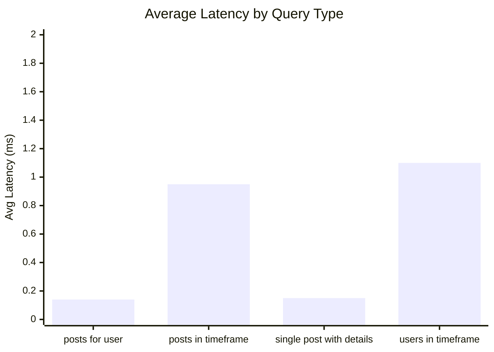
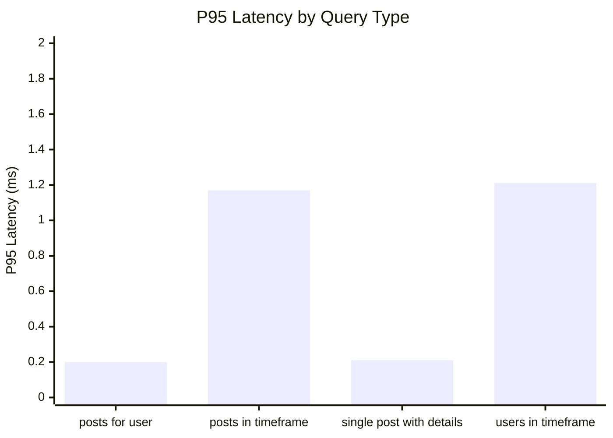
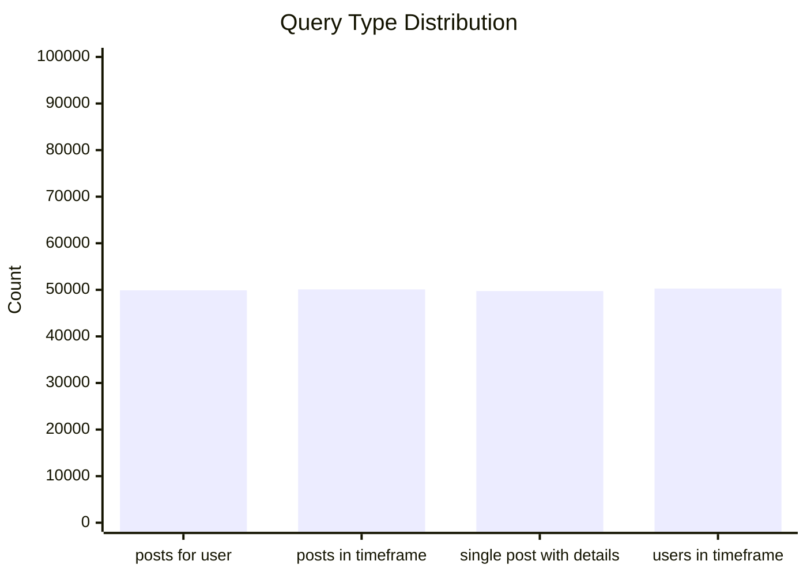
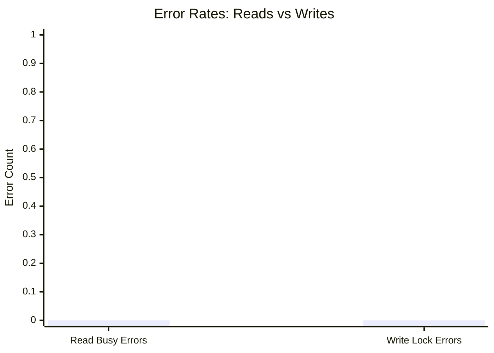
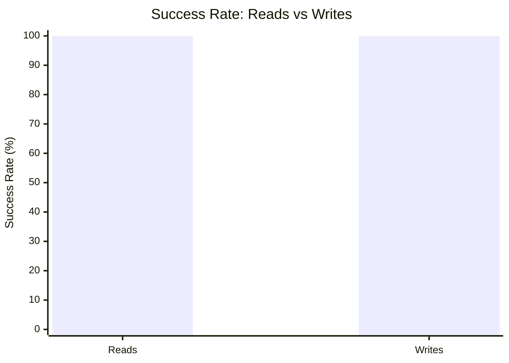

# Mixed Read/Write Benchmark: r10_w2_R200k_W20k_c20mb

**Test Run:** 12/25/2025, 6:00:49 PM

## Configuration

| Setting | Value |
|---------|-------|
| ID | r10_w2_R200k_W20k_c20mb |
| Read Workers | 10 |
| Write Workers | 2 |
| Total Reads | 200,000 |
| Total Writes | 20,000 |
| Total Operations | 220,000 |
| Read:Write Ratio | 10.0:1 |
| Cache Size | 20000 KB (20 MB) |

## Summary

| Metric | Reads | Writes | Combined |
|--------|-------|--------|----------|
| Total | 200,000 | 20,000 | 220,000 |
| Successful | 200,000 | 20,000 | - |
| Success Rate | 100.0% | 100.0% | - |
| Throughput | 7632/sec | 763/sec | 8395/sec |
| Avg Latency | 0.59ms | 0.55ms | - |
| P50 Latency | 0.52ms | 0.21ms | - |
| P95 Latency | 1.08ms | 1.58ms | - |
| P99 Latency | 1.51ms | 4.17ms | - |
| Errors | 0 (busy: 0) | 0 (lock: 0) | - |

**Total Duration:** 26.21 seconds

## Read Query Breakdown

| Query Type | Count | Avg (ms) | P95 (ms) | P99 (ms) | Avg Rows |
|------------|-------|----------|----------|----------|----------|
| posts_for_user | 49,901 | 0.14 | 0.20 | 0.30 | 0.3 |
| posts_in_timeframe | 50,098 | 0.95 | 1.17 | 1.57 | 100.0 |
| single_post_with_details | 49,734 | 0.15 | 0.21 | 0.31 | 1.4 |
| users_in_timeframe | 50,267 | 1.10 | 1.21 | 9.47 | 247.4 |


## Charts

### Read vs Write Latency Comparison

This chart compares latency percentiles (P50, P95, P99) between read and write operations. It shows how read and write latencies differ under concurrent load.



### Throughput Comparison

This chart compares the throughput of reads, writes, and combined operations. It shows the relative performance of read vs write operations.



### Average Latency by Query Type

This chart shows the average latency for each read query type. It helps identify which queries are the slowest.



### P95 Latency by Query Type

This chart shows the P95 latency (95th percentile) for each read query type. It highlights the worst-case performance for each query type.



### Query Type Distribution

This chart shows the distribution of query types executed during the test. It helps verify that queries are evenly distributed.



### Error Rates

This chart compares error rates between reads (SQLITE_BUSY errors) and writes (lock errors). It helps identify contention issues.



### Success Rate Comparison

This chart compares the success rate of read vs write operations. Both should ideally be at 100%.



## Key Observations

### Read Performance
- **200,000** successful reads out of 200,000 (100.0% success rate)
- Average read latency: **0.59ms**, P99: **1.51ms**
- Read throughput: **7632 reads/sec**
- ✅ No busy errors during reads (WAL mode working well)

### Write Performance
- **20,000** successful writes out of 20,000 (100.0% success rate)
- Average write latency: **0.55ms**, P99: **4.17ms**
- Write throughput: **763 writes/sec**
- ✅ No lock errors during writes

### Combined Throughput
- Total operations completed: **220,000**
- Combined throughput: **8395 ops/sec**

## Raw Data

<details>
<summary>Click to expand raw JSON data</summary>

```json
{
  "testName": "mixedReadWrite-r10_w2_R200k_W20k_c20mb",
  "timestamp": "2025-12-25T12:30:49.220Z",
  "configuration": {
    "id": "r10_w2_R200k_W20k_c20mb",
    "readWorkers": 10,
    "writeWorkers": 2,
    "readsPerWorker": 20000,
    "writesPerWorker": 10000,
    "totalReads": 200000,
    "totalWrites": 20000,
    "totalOperations": 220000,
    "readWriteRatio": 10,
    "cacheSize": 20000
  },
  "duration": 26205.873939999998,
  "reads": {
    "total": 200000,
    "successful": 200000,
    "errors": 0,
    "busyErrors": 0,
    "successRate": 100,
    "avgTime": 0.5862970258799962,
    "minTime": 0.04875499999980093,
    "maxTime": 57.22629400000005,
    "p50": 0.5228439999991679,
    "p95": 1.0834259999974165,
    "p99": 1.505484000001161,
    "readsPerSec": 7631.876748621802,
    "byQueryType": {
      "posts_for_user": {
        "count": 49901,
        "avgTime": 0.13933242967074772,
        "p95": 0.2008720000012545,
        "p99": 0.2984039999973902,
        "avgRowCount": 0.319933468267169
      },
      "posts_in_timeframe": {
        "count": 50098,
        "avgTime": 0.9546362359575151,
        "p95": 1.1701499999981024,
        "p99": 1.5708830000003218,
        "avgRowCount": 100
      },
      "single_post_with_details": {
        "count": 49734,
        "avgTime": 0.14659066409296742,
        "p95": 0.21278999999958614,
        "p99": 0.31181400000014037,
        "avgRowCount": 1.403587083283066
      },
      "users_in_timeframe": {
        "count": 50267,
        "avgTime": 1.097950372331745,
        "p95": 1.2076519999973243,
        "p99": 9.472780000000057,
        "avgRowCount": 247.39286211629897
      }
    }
  },
  "writes": {
    "total": 20000,
    "successful": 20000,
    "errors": 0,
    "lockErrors": 0,
    "successRate": 100,
    "avgTime": 0.5525944789500059,
    "minTime": 0.06146000000080676,
    "maxTime": 108.3297279999988,
    "p50": 0.2072350000003098,
    "p95": 1.5786459999999352,
    "p99": 4.168026999999711,
    "writesPerSec": 763.1876748621802
  },
  "combined": {
    "totalOps": 220000,
    "opsPerSec": 8395.064423483982
  }
}
```

</details>
