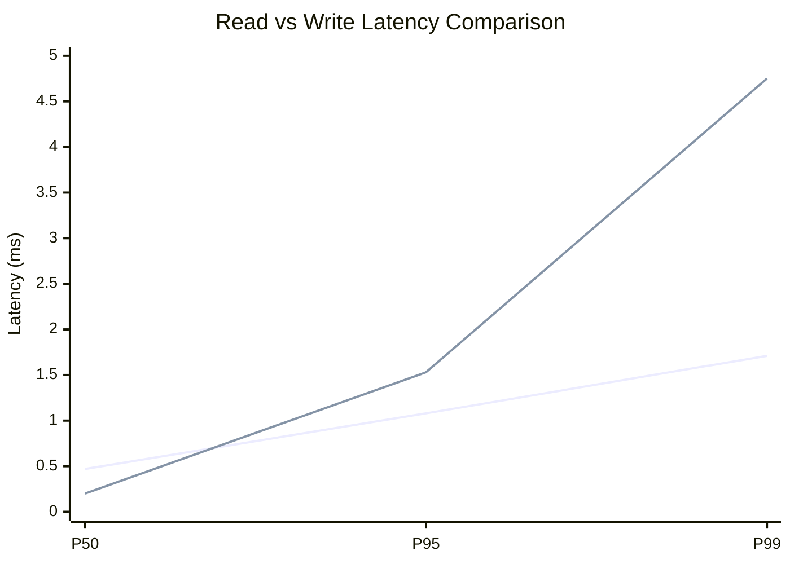
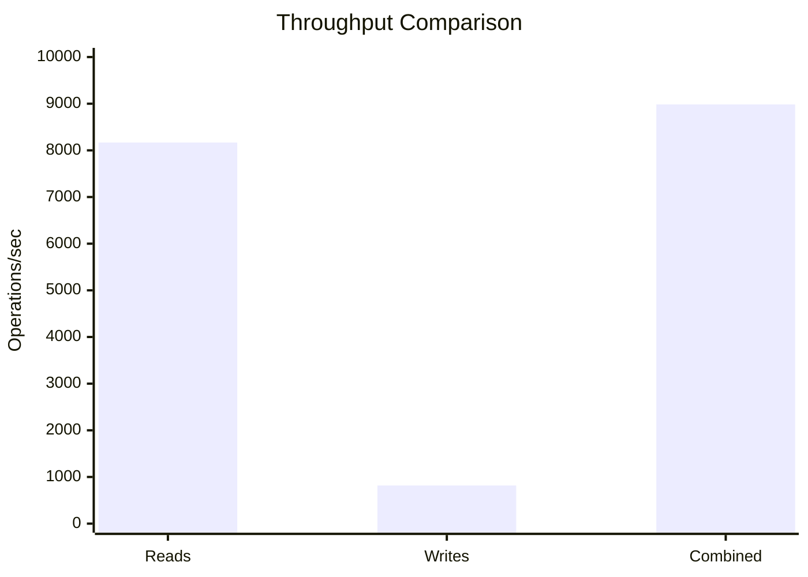
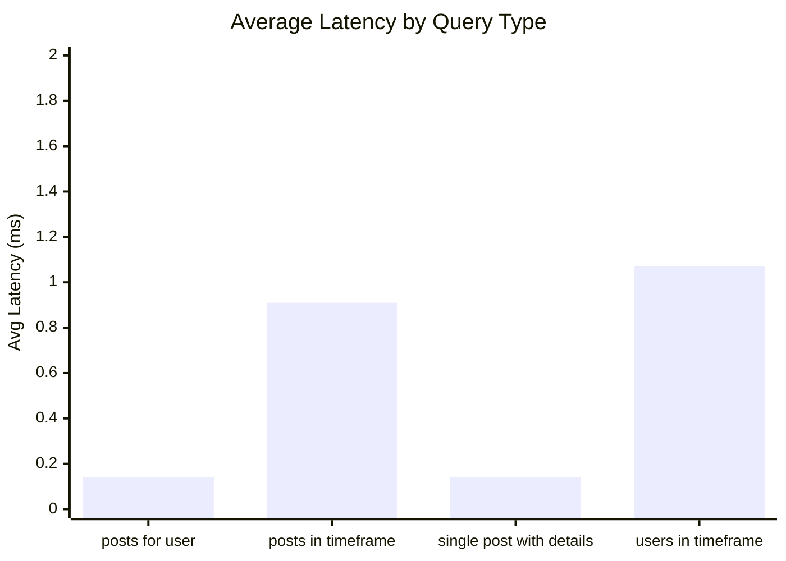
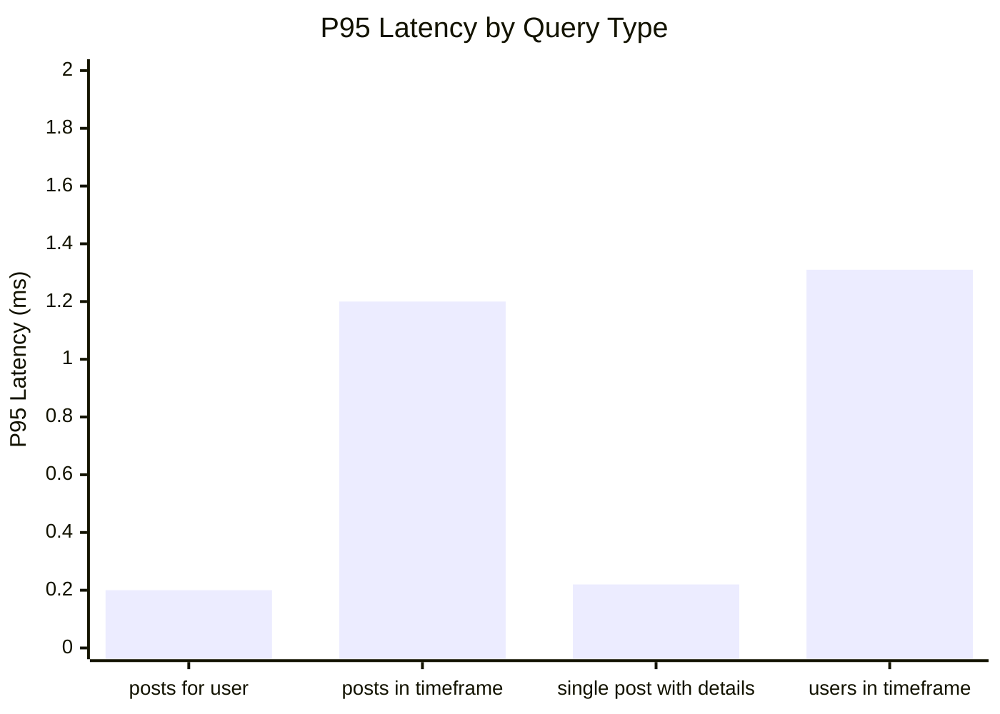
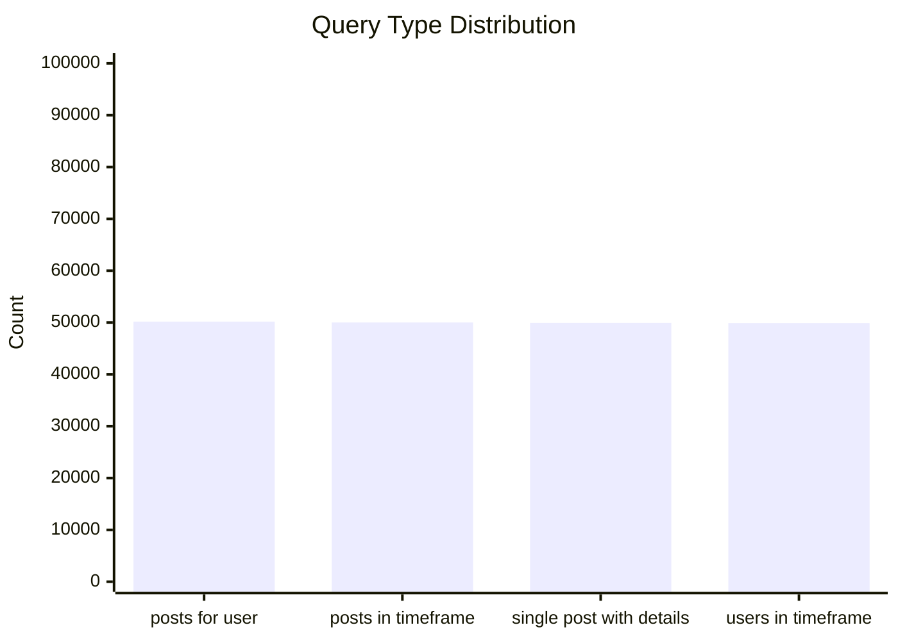
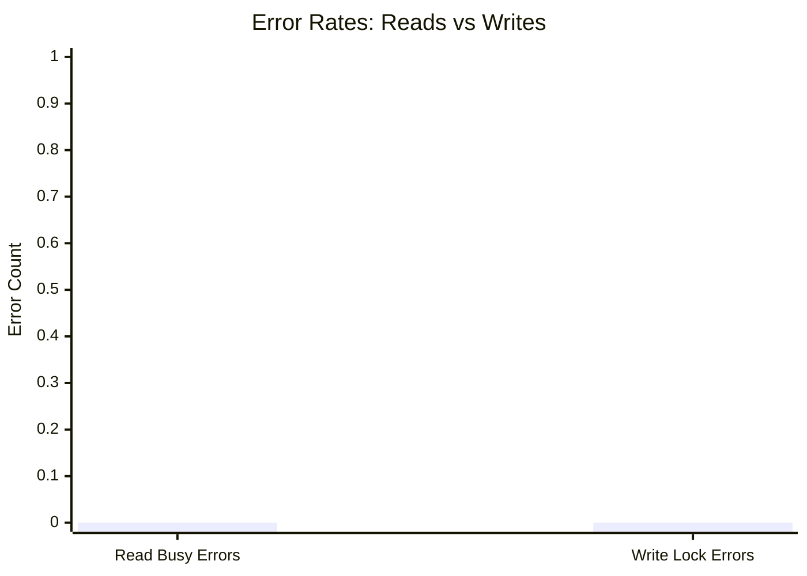
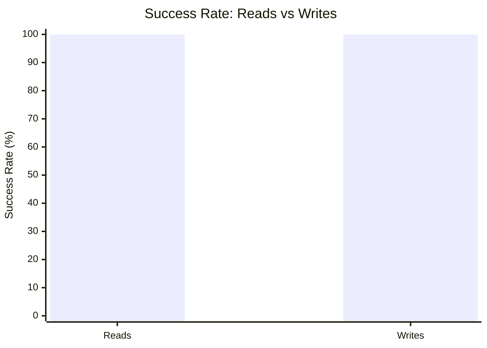

# Mixed Read/Write Benchmark: r10_w2_R200k_W20k_c24mb

**Test Run:** 12/25/2025, 6:09:43 PM

## Configuration

| Setting | Value |
|---------|-------|
| ID | r10_w2_R200k_W20k_c24mb |
| Read Workers | 10 |
| Write Workers | 2 |
| Total Reads | 200,000 |
| Total Writes | 20,000 |
| Total Operations | 220,000 |
| Read:Write Ratio | 10.0:1 |
| Cache Size | 24000 KB (24 MB) |

## Summary

| Metric | Reads | Writes | Combined |
|--------|-------|--------|----------|
| Total | 200,000 | 20,000 | 220,000 |
| Successful | 200,000 | 20,000 | - |
| Success Rate | 100.0% | 100.0% | - |
| Throughput | 8168/sec | 817/sec | 8985/sec |
| Avg Latency | 0.56ms | 0.52ms | - |
| P50 Latency | 0.47ms | 0.20ms | - |
| P95 Latency | 1.08ms | 1.53ms | - |
| P99 Latency | 1.71ms | 4.75ms | - |
| Errors | 0 (busy: 0) | 0 (lock: 0) | - |

**Total Duration:** 24.49 seconds

## Read Query Breakdown

| Query Type | Count | Avg (ms) | P95 (ms) | P99 (ms) | Avg Rows |
|------------|-------|----------|----------|----------|----------|
| posts_for_user | 50,178 | 0.14 | 0.20 | 0.31 | 0.3 |
| posts_in_timeframe | 50,012 | 0.91 | 1.20 | 1.74 | 100.0 |
| single_post_with_details | 49,929 | 0.14 | 0.22 | 0.32 | 1.4 |
| users_in_timeframe | 49,881 | 1.07 | 1.31 | 9.17 | 253.8 |


## Charts

### Read vs Write Latency Comparison

This chart compares latency percentiles (P50, P95, P99) between read and write operations. It shows how read and write latencies differ under concurrent load.



### Throughput Comparison

This chart compares the throughput of reads, writes, and combined operations. It shows the relative performance of read vs write operations.



### Average Latency by Query Type

This chart shows the average latency for each read query type. It helps identify which queries are the slowest.



### P95 Latency by Query Type

This chart shows the P95 latency (95th percentile) for each read query type. It highlights the worst-case performance for each query type.



### Query Type Distribution

This chart shows the distribution of query types executed during the test. It helps verify that queries are evenly distributed.



### Error Rates

This chart compares error rates between reads (SQLITE_BUSY errors) and writes (lock errors). It helps identify contention issues.



### Success Rate Comparison

This chart compares the success rate of read vs write operations. Both should ideally be at 100%.



## Key Observations

### Read Performance
- **200,000** successful reads out of 200,000 (100.0% success rate)
- Average read latency: **0.56ms**, P99: **1.71ms**
- Read throughput: **8168 reads/sec**
- ✅ No busy errors during reads (WAL mode working well)

### Write Performance
- **20,000** successful writes out of 20,000 (100.0% success rate)
- Average write latency: **0.52ms**, P99: **4.75ms**
- Write throughput: **817 writes/sec**
- ✅ No lock errors during writes

### Combined Throughput
- Total operations completed: **220,000**
- Combined throughput: **8985 ops/sec**

## Raw Data

<details>
<summary>Click to expand raw JSON data</summary>

```json
{
  "testName": "mixedReadWrite-r10_w2_R200k_W20k_c24mb",
  "timestamp": "2025-12-25T12:39:43.252Z",
  "configuration": {
    "id": "r10_w2_R200k_W20k_c24mb",
    "readWorkers": 10,
    "writeWorkers": 2,
    "readsPerWorker": 20000,
    "writesPerWorker": 10000,
    "totalReads": 200000,
    "totalWrites": 20000,
    "totalOperations": 220000,
    "readWriteRatio": 10,
    "cacheSize": 24000
  },
  "duration": 24486.585944000002,
  "reads": {
    "total": 200000,
    "successful": 200000,
    "errors": 0,
    "busyErrors": 0,
    "successRate": 100,
    "avgTime": 0.5648575640599989,
    "minTime": 0.04585999999926571,
    "maxTime": 77.18855700000131,
    "p50": 0.4693649999990157,
    "p95": 1.0787660000005417,
    "p99": 1.7061950000006618,
    "readsPerSec": 8167.737244277061,
    "byQueryType": {
      "posts_for_user": {
        "count": 50178,
        "avgTime": 0.13597507531189254,
        "p95": 0.20201700000006895,
        "p99": 0.3100300000005518,
        "avgRowCount": 0.3250428474630316
      },
      "posts_in_timeframe": {
        "count": 50012,
        "avgTime": 0.9129449942014034,
        "p95": 1.2030500000000757,
        "p99": 1.7424030000001949,
        "avgRowCount": 100
      },
      "single_post_with_details": {
        "count": 49929,
        "avgTime": 0.14217044657413988,
        "p95": 0.2171550000020943,
        "p99": 0.3245290000004388,
        "avgRowCount": 1.4063570269783092
      },
      "users_in_timeframe": {
        "count": 49881,
        "avgTime": 1.070385962711252,
        "p95": 1.3053899999995338,
        "p99": 9.171700000002602,
        "avgRowCount": 253.81022834345742
      }
    }
  },
  "writes": {
    "total": 20000,
    "successful": 20000,
    "errors": 0,
    "lockErrors": 0,
    "successRate": 100,
    "avgTime": 0.5231128209999961,
    "minTime": 0.06740700000045763,
    "maxTime": 87.81695500000023,
    "p50": 0.19858899999962887,
    "p95": 1.5269529999995939,
    "p99": 4.75398099999984,
    "writesPerSec": 816.7737244277062
  },
  "combined": {
    "totalOps": 220000,
    "opsPerSec": 8984.510968704768
  }
}
```

</details>
