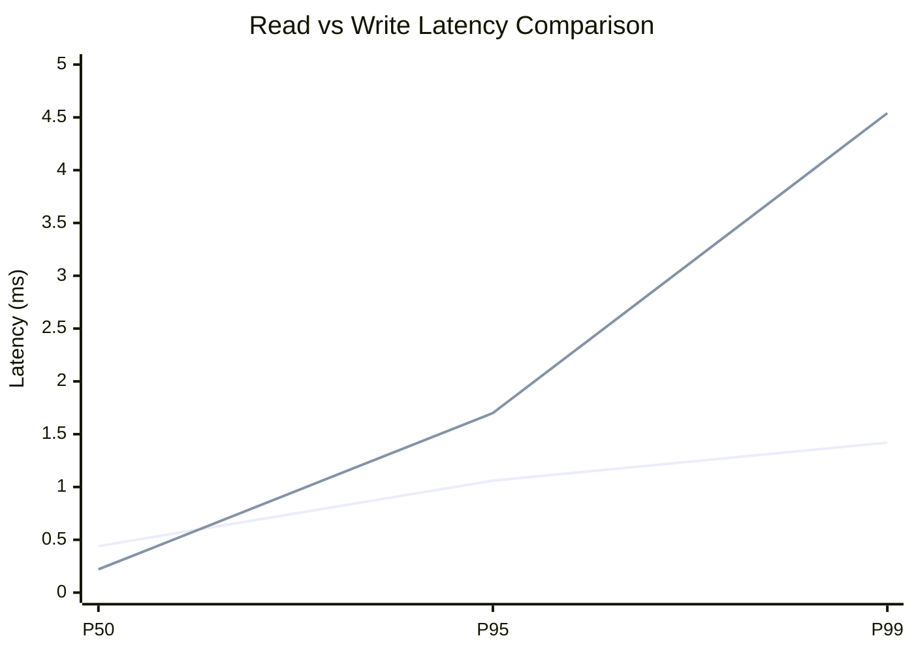
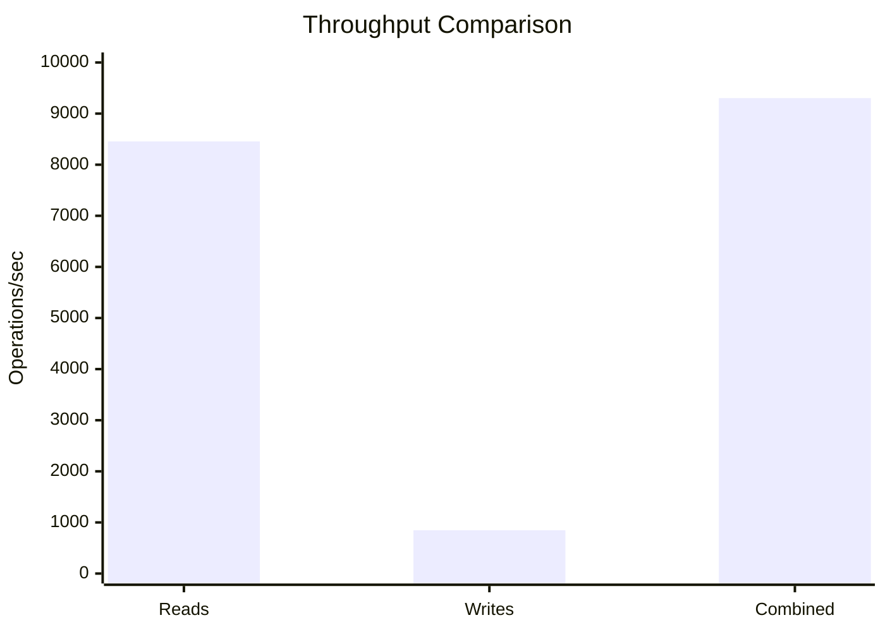
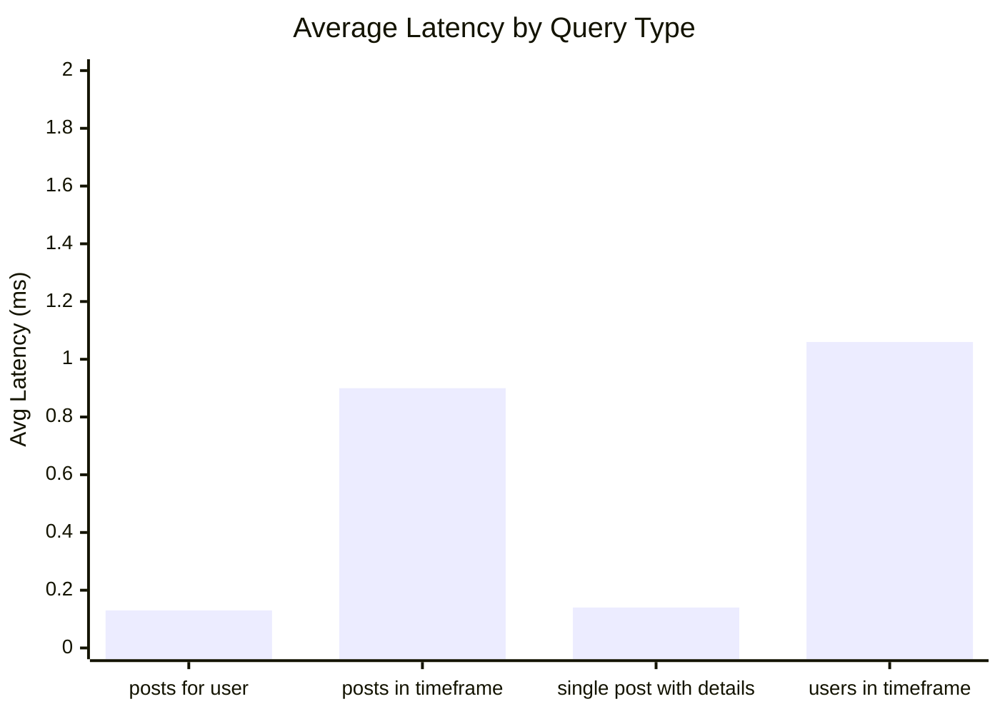
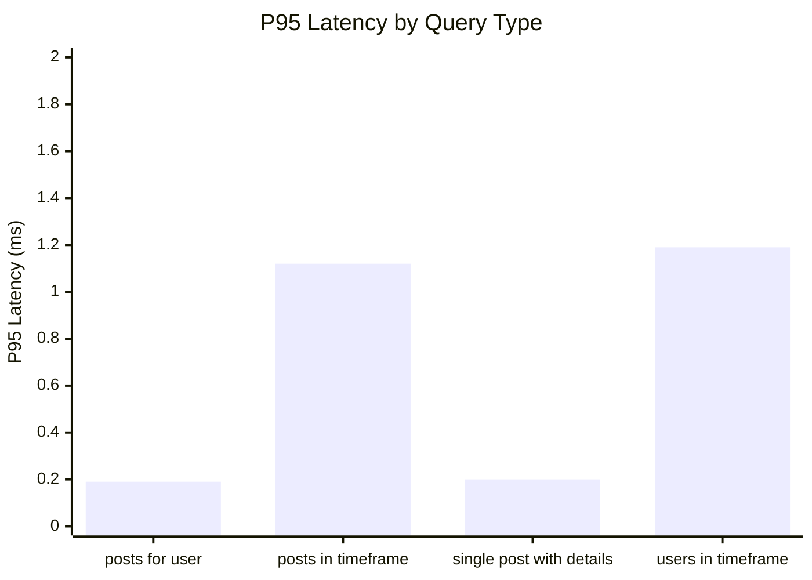
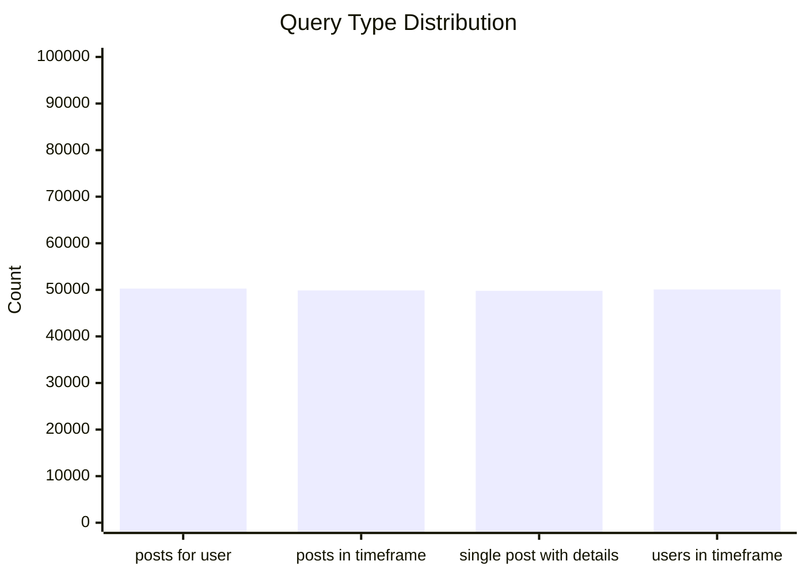
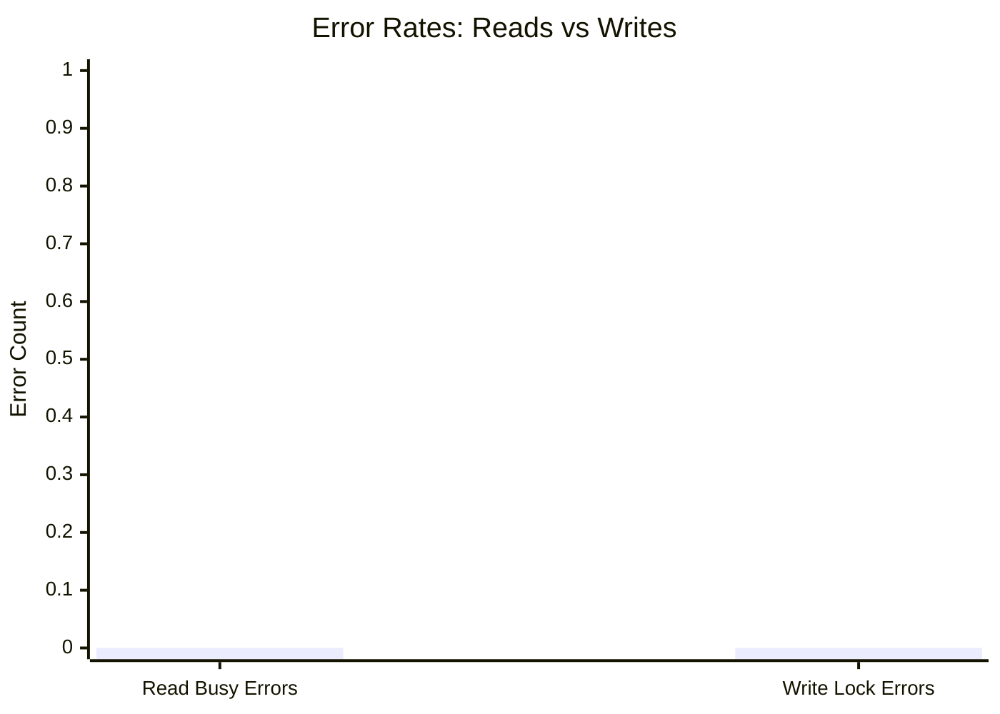
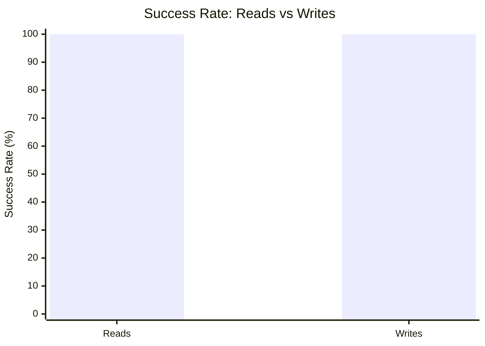

# Mixed Read/Write Benchmark: r10_w2_R200k_W20k_c32mb

**Test Run:** 12/25/2025, 6:10:56 PM

## Configuration

| Setting | Value |
|---------|-------|
| ID | r10_w2_R200k_W20k_c32mb |
| Read Workers | 10 |
| Write Workers | 2 |
| Total Reads | 200,000 |
| Total Writes | 20,000 |
| Total Operations | 220,000 |
| Read:Write Ratio | 10.0:1 |
| Cache Size | 32000 KB (32 MB) |

## Summary

| Metric | Reads | Writes | Combined |
|--------|-------|--------|----------|
| Total | 200,000 | 20,000 | 220,000 |
| Successful | 200,000 | 20,000 | - |
| Success Rate | 100.0% | 100.0% | - |
| Throughput | 8456/sec | 846/sec | 9302/sec |
| Avg Latency | 0.56ms | 0.63ms | - |
| P50 Latency | 0.44ms | 0.22ms | - |
| P95 Latency | 1.06ms | 1.70ms | - |
| P99 Latency | 1.42ms | 4.54ms | - |
| Errors | 0 (busy: 0) | 0 (lock: 0) | - |

**Total Duration:** 23.65 seconds

## Read Query Breakdown

| Query Type | Count | Avg (ms) | P95 (ms) | P99 (ms) | Avg Rows |
|------------|-------|----------|----------|----------|----------|
| posts_for_user | 50,260 | 0.13 | 0.19 | 0.27 | 0.3 |
| posts_in_timeframe | 49,868 | 0.90 | 1.12 | 1.44 | 100.0 |
| single_post_with_details | 49,791 | 0.14 | 0.20 | 0.27 | 1.4 |
| users_in_timeframe | 50,081 | 1.06 | 1.19 | 8.83 | 258.9 |


## Charts

### Read vs Write Latency Comparison

This chart compares latency percentiles (P50, P95, P99) between read and write operations. It shows how read and write latencies differ under concurrent load.



### Throughput Comparison

This chart compares the throughput of reads, writes, and combined operations. It shows the relative performance of read vs write operations.



### Average Latency by Query Type

This chart shows the average latency for each read query type. It helps identify which queries are the slowest.



### P95 Latency by Query Type

This chart shows the P95 latency (95th percentile) for each read query type. It highlights the worst-case performance for each query type.



### Query Type Distribution

This chart shows the distribution of query types executed during the test. It helps verify that queries are evenly distributed.



### Error Rates

This chart compares error rates between reads (SQLITE_BUSY errors) and writes (lock errors). It helps identify contention issues.



### Success Rate Comparison

This chart compares the success rate of read vs write operations. Both should ideally be at 100%.



## Key Observations

### Read Performance
- **200,000** successful reads out of 200,000 (100.0% success rate)
- Average read latency: **0.56ms**, P99: **1.42ms**
- Read throughput: **8456 reads/sec**
- ✅ No busy errors during reads (WAL mode working well)

### Write Performance
- **20,000** successful writes out of 20,000 (100.0% success rate)
- Average write latency: **0.63ms**, P99: **4.54ms**
- Write throughput: **846 writes/sec**
- ✅ No lock errors during writes

### Combined Throughput
- Total operations completed: **220,000**
- Combined throughput: **9302 ops/sec**

## Raw Data

<details>
<summary>Click to expand raw JSON data</summary>

```json
{
  "testName": "mixedReadWrite-r10_w2_R200k_W20k_c32mb",
  "timestamp": "2025-12-25T12:40:56.480Z",
  "configuration": {
    "id": "r10_w2_R200k_W20k_c32mb",
    "readWorkers": 10,
    "writeWorkers": 2,
    "readsPerWorker": 20000,
    "writesPerWorker": 10000,
    "totalReads": 200000,
    "totalWrites": 20000,
    "totalOperations": 220000,
    "readWriteRatio": 10,
    "cacheSize": 32000
  },
  "duration": 23650.845787000002,
  "reads": {
    "total": 200000,
    "successful": 200000,
    "errors": 0,
    "busyErrors": 0,
    "successRate": 100,
    "avgTime": 0.5563881498100017,
    "minTime": 0.04599199999938719,
    "maxTime": 54.68143500000042,
    "p50": 0.4360450000003766,
    "p95": 1.0630599999994956,
    "p99": 1.4231110000000626,
    "readsPerSec": 8456.357197590482,
    "byQueryType": {
      "posts_for_user": {
        "count": 50260,
        "avgTime": 0.13047041008753663,
        "p95": 0.190972000000329,
        "p99": 0.2667760000003909,
        "avgRowCount": 0.32924791086350974
      },
      "posts_in_timeframe": {
        "count": 49868,
        "avgTime": 0.8971443840138077,
        "p95": 1.1192009999995207,
        "p99": 1.444260000000213,
        "avgRowCount": 100
      },
      "single_post_with_details": {
        "count": 49791,
        "avgTime": 0.13792934466067638,
        "p95": 0.19834300000002258,
        "p99": 0.2738119999994524,
        "avgRowCount": 1.399991966419634
      },
      "users_in_timeframe": {
        "count": 50081,
        "avgTime": 1.0605569179728824,
        "p95": 1.1868169999997917,
        "p99": 8.828122999999323,
        "avgRowCount": 258.8660170523751
      }
    }
  },
  "writes": {
    "total": 20000,
    "successful": 20000,
    "errors": 0,
    "lockErrors": 0,
    "successRate": 100,
    "avgTime": 0.6311191250499972,
    "minTime": 0.08470499999930325,
    "maxTime": 106.50246599999991,
    "p50": 0.22192700000050536,
    "p95": 1.7002700000002733,
    "p99": 4.543265999998766,
    "writesPerSec": 845.6357197590482
  },
  "combined": {
    "totalOps": 220000,
    "opsPerSec": 9301.99291734953
  }
}
```

</details>
