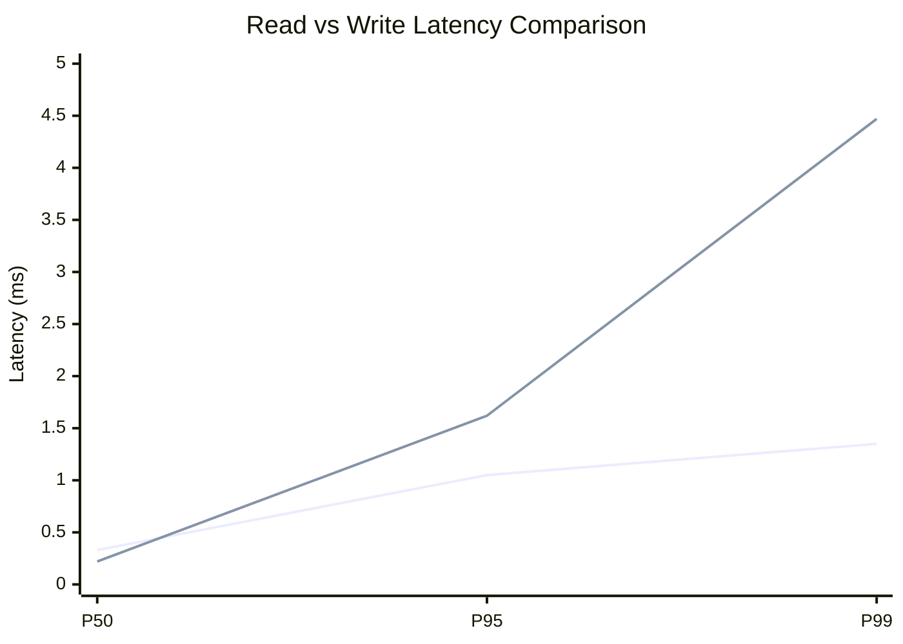
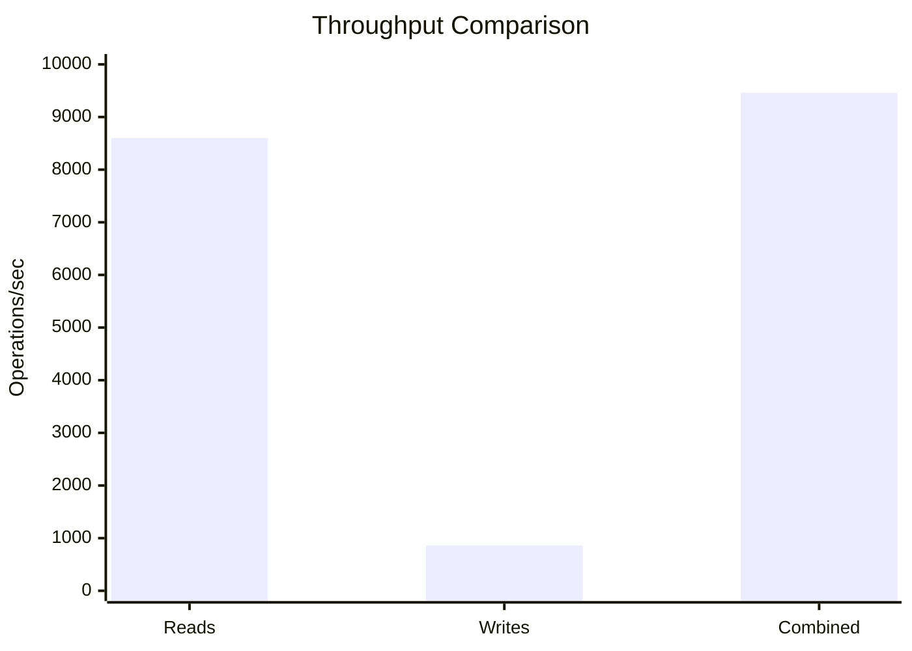
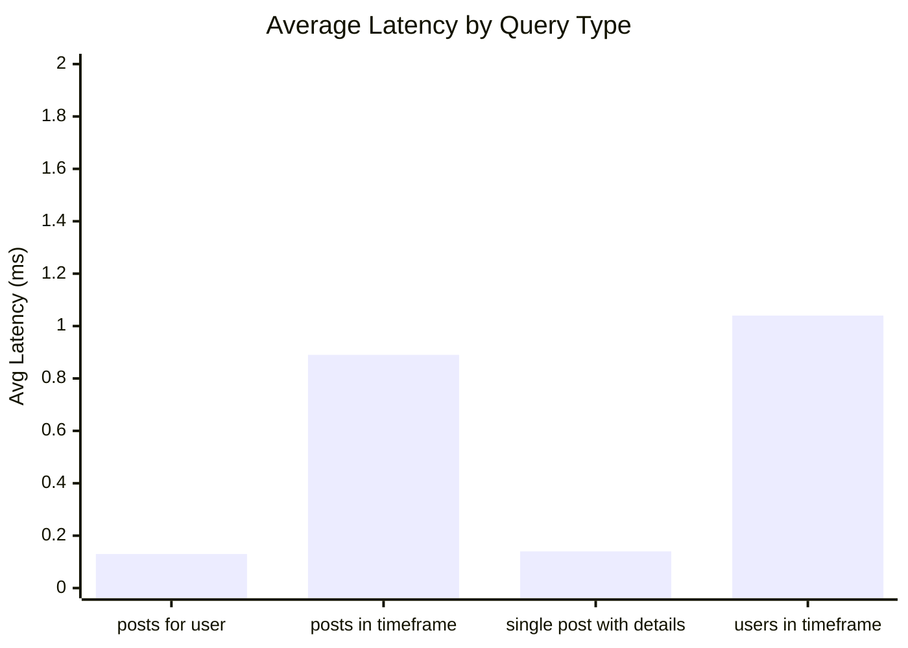
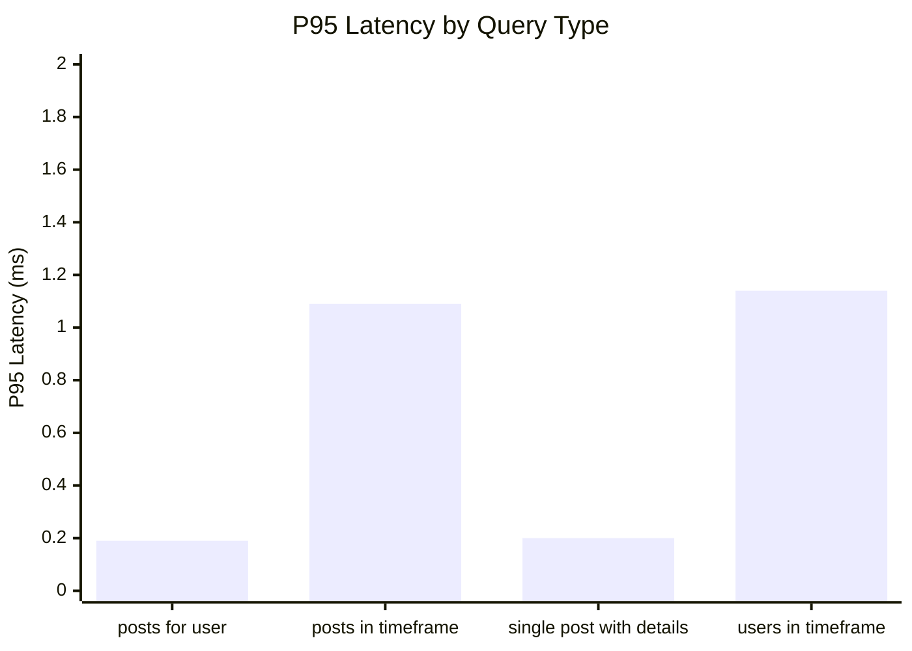
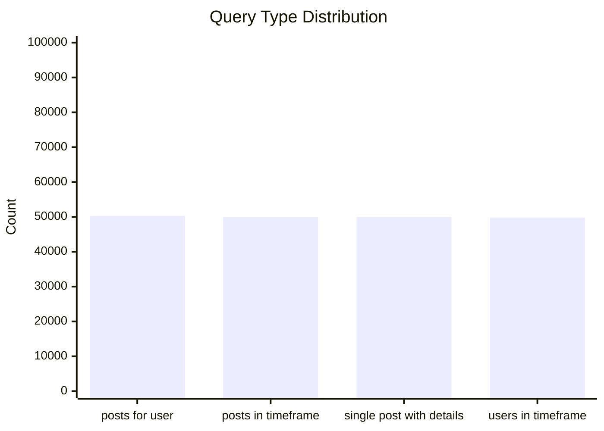
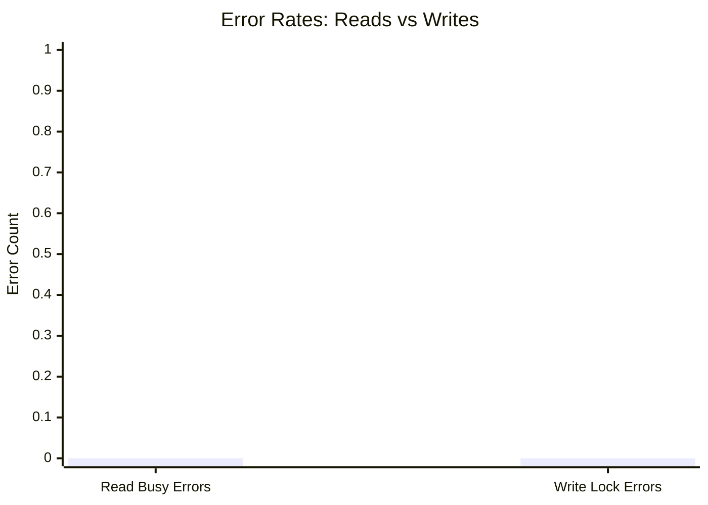
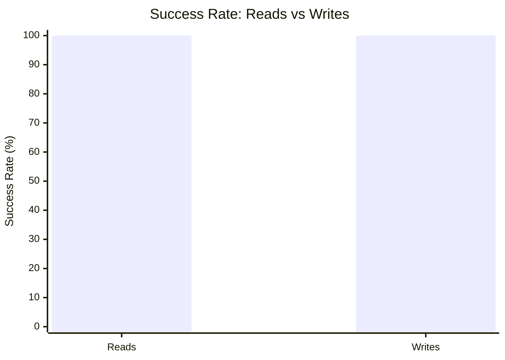

# Mixed Read/Write Benchmark: r10_w2_R200k_W20k_c48mb

**Test Run:** 12/25/2025, 6:11:28 PM

## Configuration

| Setting | Value |
|---------|-------|
| ID | r10_w2_R200k_W20k_c48mb |
| Read Workers | 10 |
| Write Workers | 2 |
| Total Reads | 200,000 |
| Total Writes | 20,000 |
| Total Operations | 220,000 |
| Read:Write Ratio | 10.0:1 |
| Cache Size | 48000 KB (48 MB) |

## Summary

| Metric | Reads | Writes | Combined |
|--------|-------|--------|----------|
| Total | 200,000 | 20,000 | 220,000 |
| Successful | 200,000 | 20,000 | - |
| Success Rate | 100.0% | 100.0% | - |
| Throughput | 8601/sec | 860/sec | 9461/sec |
| Avg Latency | 0.55ms | 0.60ms | - |
| P50 Latency | 0.33ms | 0.22ms | - |
| P95 Latency | 1.05ms | 1.62ms | - |
| P99 Latency | 1.35ms | 4.47ms | - |
| Errors | 0 (busy: 0) | 0 (lock: 0) | - |

**Total Duration:** 23.25 seconds

## Read Query Breakdown

| Query Type | Count | Avg (ms) | P95 (ms) | P99 (ms) | Avg Rows |
|------------|-------|----------|----------|----------|----------|
| posts_for_user | 50,305 | 0.13 | 0.19 | 0.25 | 0.3 |
| posts_in_timeframe | 49,889 | 0.89 | 1.09 | 1.41 | 100.0 |
| single_post_with_details | 49,985 | 0.14 | 0.20 | 0.27 | 1.4 |
| users_in_timeframe | 49,821 | 1.04 | 1.14 | 8.08 | 252.9 |


## Charts

### Read vs Write Latency Comparison

This chart compares latency percentiles (P50, P95, P99) between read and write operations. It shows how read and write latencies differ under concurrent load.



### Throughput Comparison

This chart compares the throughput of reads, writes, and combined operations. It shows the relative performance of read vs write operations.



### Average Latency by Query Type

This chart shows the average latency for each read query type. It helps identify which queries are the slowest.



### P95 Latency by Query Type

This chart shows the P95 latency (95th percentile) for each read query type. It highlights the worst-case performance for each query type.



### Query Type Distribution

This chart shows the distribution of query types executed during the test. It helps verify that queries are evenly distributed.



### Error Rates

This chart compares error rates between reads (SQLITE_BUSY errors) and writes (lock errors). It helps identify contention issues.



### Success Rate Comparison

This chart compares the success rate of read vs write operations. Both should ideally be at 100%.



## Key Observations

### Read Performance
- **200,000** successful reads out of 200,000 (100.0% success rate)
- Average read latency: **0.55ms**, P99: **1.35ms**
- Read throughput: **8601 reads/sec**
- ✅ No busy errors during reads (WAL mode working well)

### Write Performance
- **20,000** successful writes out of 20,000 (100.0% success rate)
- Average write latency: **0.60ms**, P99: **4.47ms**
- Write throughput: **860 writes/sec**
- ✅ No lock errors during writes

### Combined Throughput
- Total operations completed: **220,000**
- Combined throughput: **9461 ops/sec**

## Raw Data

<details>
<summary>Click to expand raw JSON data</summary>

```json
{
  "testName": "mixedReadWrite-r10_w2_R200k_W20k_c48mb",
  "timestamp": "2025-12-25T12:41:28.001Z",
  "configuration": {
    "id": "r10_w2_R200k_W20k_c48mb",
    "readWorkers": 10,
    "writeWorkers": 2,
    "readsPerWorker": 20000,
    "writesPerWorker": 10000,
    "totalReads": 200000,
    "totalWrites": 20000,
    "totalOperations": 220000,
    "readWriteRatio": 10,
    "cacheSize": 48000
  },
  "duration": 23252.329912,
  "reads": {
    "total": 200000,
    "successful": 200000,
    "errors": 0,
    "busyErrors": 0,
    "successRate": 100,
    "avgTime": 0.5468711616500099,
    "minTime": 0.04816599999958271,
    "maxTime": 19.674058999999033,
    "p50": 0.3325139999997191,
    "p95": 1.0487280000002102,
    "p99": 1.351182999998855,
    "readsPerSec": 8601.288591591181,
    "byQueryType": {
      "posts_for_user": {
        "count": 50305,
        "avgTime": 0.13022090863731772,
        "p95": 0.1886240000003454,
        "p99": 0.2476600000009057,
        "avgRowCount": 0.32213497664248086
      },
      "posts_in_timeframe": {
        "count": 49889,
        "avgTime": 0.8868275161057737,
        "p95": 1.092797999999675,
        "p99": 1.4128970000001573,
        "avgRowCount": 100
      },
      "single_post_with_details": {
        "count": 49985,
        "avgTime": 0.13734152891868304,
        "p95": 0.19900000000052387,
        "p99": 0.27141800000026706,
        "avgRowCount": 1.4104631389416824
      },
      "users_in_timeframe": {
        "count": 49821,
        "avgTime": 1.0380264395937555,
        "p95": 1.1379029999989143,
        "p99": 8.076935999997659,
        "avgRowCount": 252.94241384155276
      }
    }
  },
  "writes": {
    "total": 20000,
    "successful": 20000,
    "errors": 0,
    "lockErrors": 0,
    "successRate": 100,
    "avgTime": 0.5951310309999998,
    "minTime": 0.07910999999876367,
    "maxTime": 58.81654200000048,
    "p50": 0.22204499999998006,
    "p95": 1.615421000000424,
    "p99": 4.470894000000044,
    "writesPerSec": 860.1288591591182
  },
  "combined": {
    "totalOps": 220000,
    "opsPerSec": 9461.4174507503
  }
}
```

</details>
