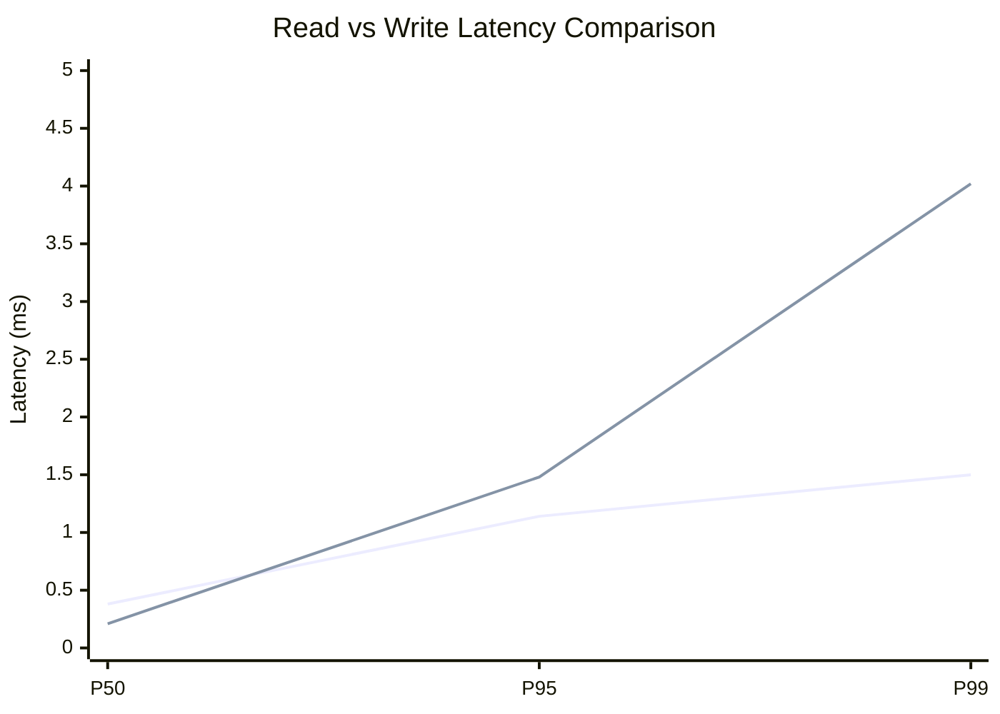
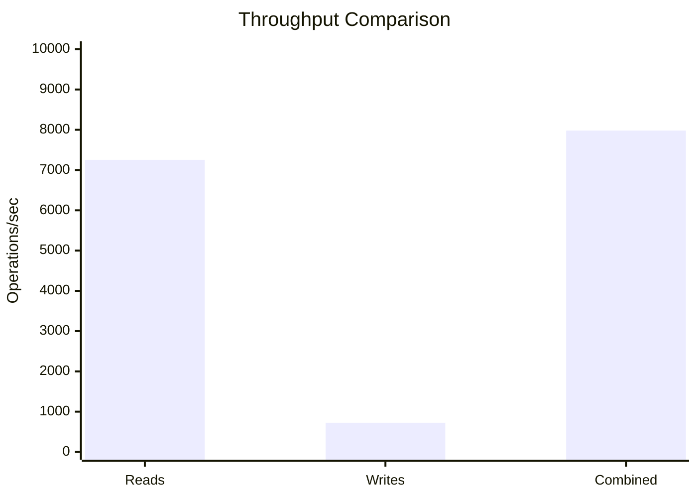
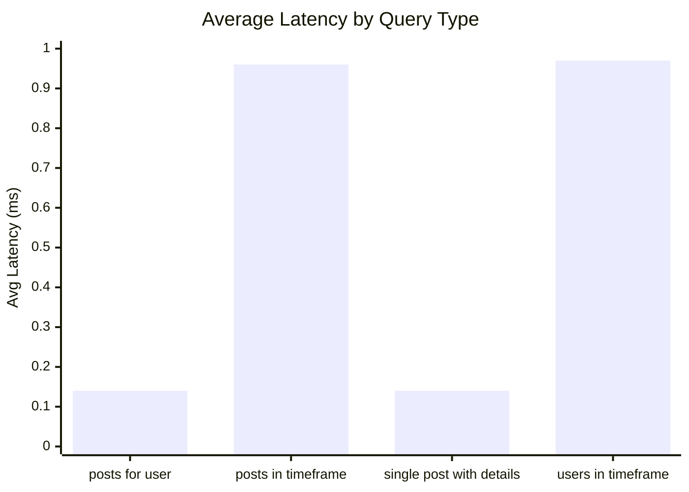
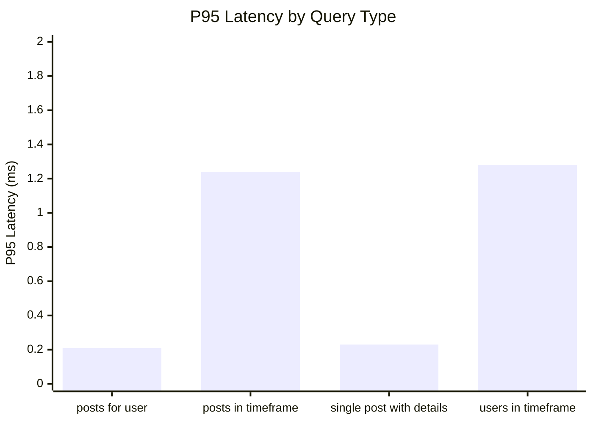
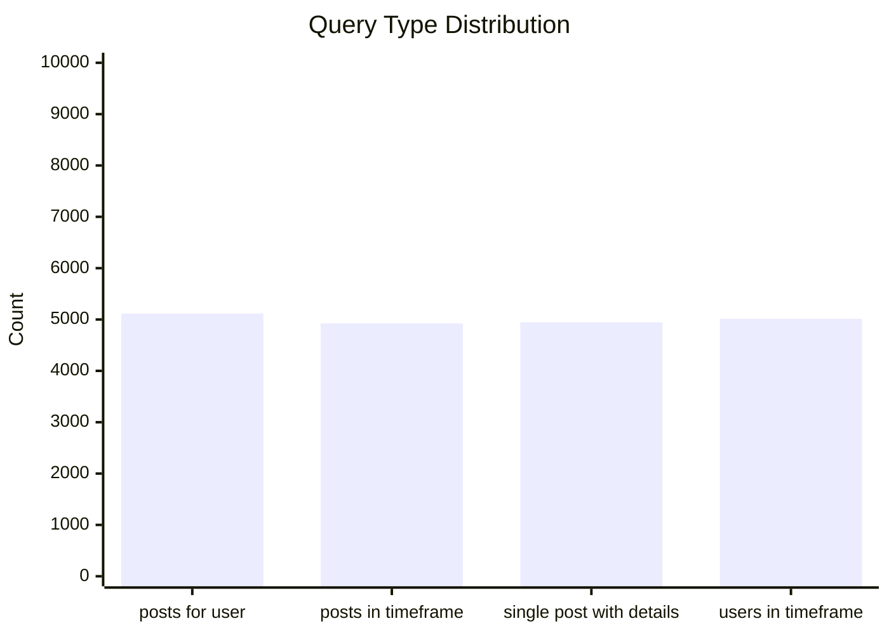
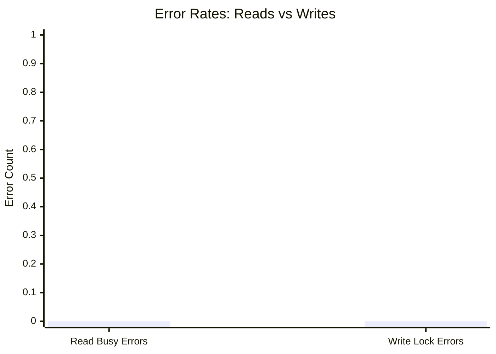
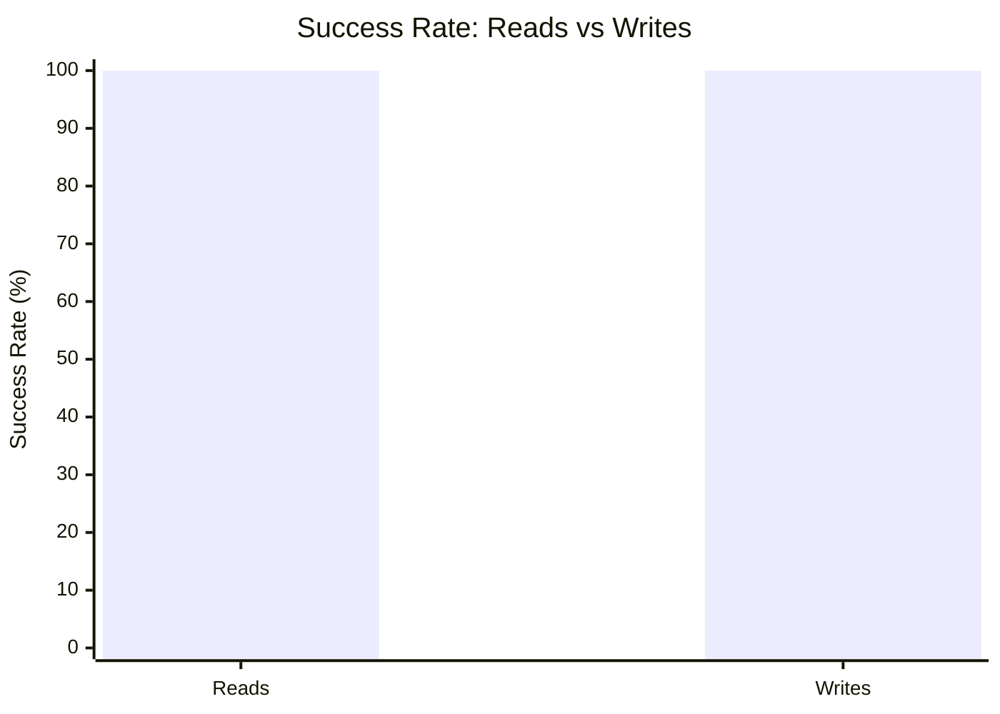

# Mixed Read/Write Benchmark: r10_w2_R20k_W2000_c24mb

**Test Run:** 12/25/2025, 5:46:38 PM

## Configuration

| Setting | Value |
|---------|-------|
| ID | r10_w2_R20k_W2000_c24mb |
| Read Workers | 10 |
| Write Workers | 2 |
| Total Reads | 20,000 |
| Total Writes | 2,000 |
| Total Operations | 22,000 |
| Read:Write Ratio | 10.0:1 |
| Cache Size | 24000 KB (24 MB) |

## Summary

| Metric | Reads | Writes | Combined |
|--------|-------|--------|----------|
| Total | 20,000 | 2,000 | 22,000 |
| Successful | 20,000 | 2,000 | - |
| Success Rate | 100.0% | 100.0% | - |
| Throughput | 7254/sec | 725/sec | 7979/sec |
| Avg Latency | 0.55ms | 0.47ms | - |
| P50 Latency | 0.38ms | 0.21ms | - |
| P95 Latency | 1.14ms | 1.48ms | - |
| P99 Latency | 1.50ms | 4.02ms | - |
| Errors | 0 (busy: 0) | 0 (lock: 0) | - |

**Total Duration:** 2.76 seconds

## Read Query Breakdown

| Query Type | Count | Avg (ms) | P95 (ms) | P99 (ms) | Avg Rows |
|------------|-------|----------|----------|----------|----------|
| posts_for_user | 5,116 | 0.14 | 0.21 | 0.33 | 0.3 |
| posts_in_timeframe | 4,924 | 0.96 | 1.24 | 1.58 | 100.0 |
| single_post_with_details | 4,947 | 0.14 | 0.23 | 0.33 | 1.3 |
| users_in_timeframe | 5,013 | 0.97 | 1.28 | 1.88 | 203.9 |


## Charts

### Read vs Write Latency Comparison

This chart compares latency percentiles (P50, P95, P99) between read and write operations. It shows how read and write latencies differ under concurrent load.



### Throughput Comparison

This chart compares the throughput of reads, writes, and combined operations. It shows the relative performance of read vs write operations.



### Average Latency by Query Type

This chart shows the average latency for each read query type. It helps identify which queries are the slowest.



### P95 Latency by Query Type

This chart shows the P95 latency (95th percentile) for each read query type. It highlights the worst-case performance for each query type.



### Query Type Distribution

This chart shows the distribution of query types executed during the test. It helps verify that queries are evenly distributed.



### Error Rates

This chart compares error rates between reads (SQLITE_BUSY errors) and writes (lock errors). It helps identify contention issues.



### Success Rate Comparison

This chart compares the success rate of read vs write operations. Both should ideally be at 100%.



## Key Observations

### Read Performance
- **20,000** successful reads out of 20,000 (100.0% success rate)
- Average read latency: **0.55ms**, P99: **1.50ms**
- Read throughput: **7254 reads/sec**
- ✅ No busy errors during reads (WAL mode working well)

### Write Performance
- **2,000** successful writes out of 2,000 (100.0% success rate)
- Average write latency: **0.47ms**, P99: **4.02ms**
- Write throughput: **725 writes/sec**
- ✅ No lock errors during writes

### Combined Throughput
- Total operations completed: **22,000**
- Combined throughput: **7979 ops/sec**

## Raw Data

<details>
<summary>Click to expand raw JSON data</summary>

```json
{
  "testName": "mixedReadWrite-r10_w2_R20k_W2000_c24mb",
  "timestamp": "2025-12-25T12:16:38.142Z",
  "configuration": {
    "id": "r10_w2_R20k_W2000_c24mb",
    "readWorkers": 10,
    "writeWorkers": 2,
    "readsPerWorker": 2000,
    "writesPerWorker": 1000,
    "totalReads": 20000,
    "totalWrites": 2000,
    "totalOperations": 22000,
    "readWriteRatio": 10,
    "cacheSize": 24000
  },
  "duration": 2757.1071389999997,
  "reads": {
    "total": 20000,
    "successful": 20000,
    "errors": 0,
    "busyErrors": 0,
    "successRate": 100,
    "avgTime": 0.5514725141500038,
    "minTime": 0.05099999999993088,
    "maxTime": 4.076524999999947,
    "p50": 0.37980900000002293,
    "p95": 1.1444609999998647,
    "p99": 1.4983039999999619,
    "readsPerSec": 7253.979983982045,
    "byQueryType": {
      "posts_for_user": {
        "count": 5116,
        "avgTime": 0.13546569077404516,
        "p95": 0.2124479999997675,
        "p99": 0.3348359999999957,
        "avgRowCount": 0.28068803752931976
      },
      "posts_in_timeframe": {
        "count": 4924,
        "avgTime": 0.9621171925264059,
        "p95": 1.2361949999999524,
        "p99": 1.5795790000001944,
        "avgRowCount": 100
      },
      "single_post_with_details": {
        "count": 4947,
        "avgTime": 0.14389274550232672,
        "p95": 0.22566600000004655,
        "p99": 0.3340499999999338,
        "avgRowCount": 1.2530826763695169
      },
      "users_in_timeframe": {
        "count": 5013,
        "avgTime": 0.9748863636545004,
        "p95": 1.277947999999924,
        "p99": 1.8807020000003831,
        "avgRowCount": 203.87991222820665
      }
    }
  },
  "writes": {
    "total": 2000,
    "successful": 2000,
    "errors": 0,
    "lockErrors": 0,
    "successRate": 100,
    "avgTime": 0.46809563749999916,
    "minTime": 0.08963399999993271,
    "maxTime": 35.075406999999814,
    "p50": 0.21301499999981388,
    "p95": 1.47524999999996,
    "p99": 4.019118000000162,
    "writesPerSec": 725.3979983982045
  },
  "combined": {
    "totalOps": 22000,
    "opsPerSec": 7979.37798238025
  }
}
```

</details>
