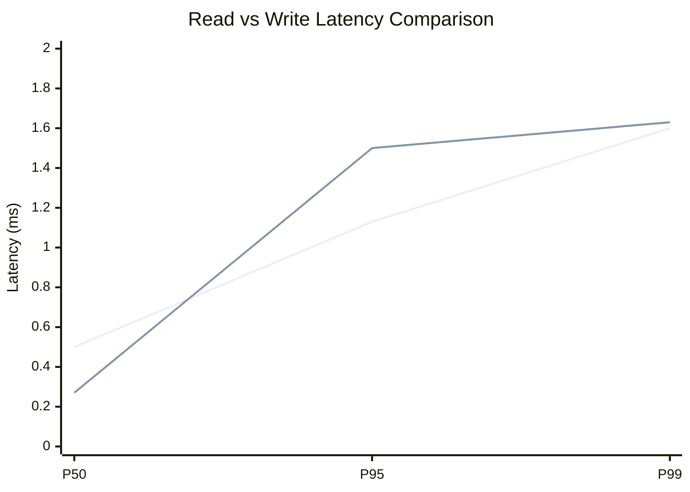
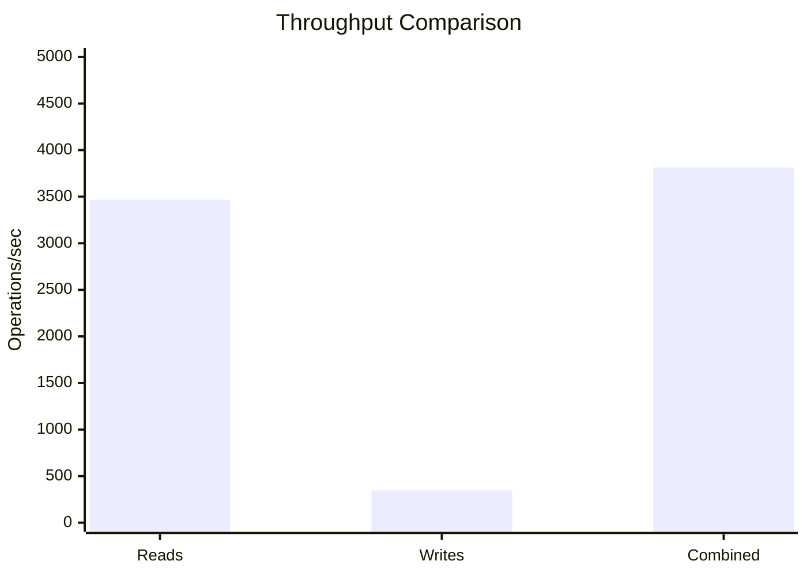
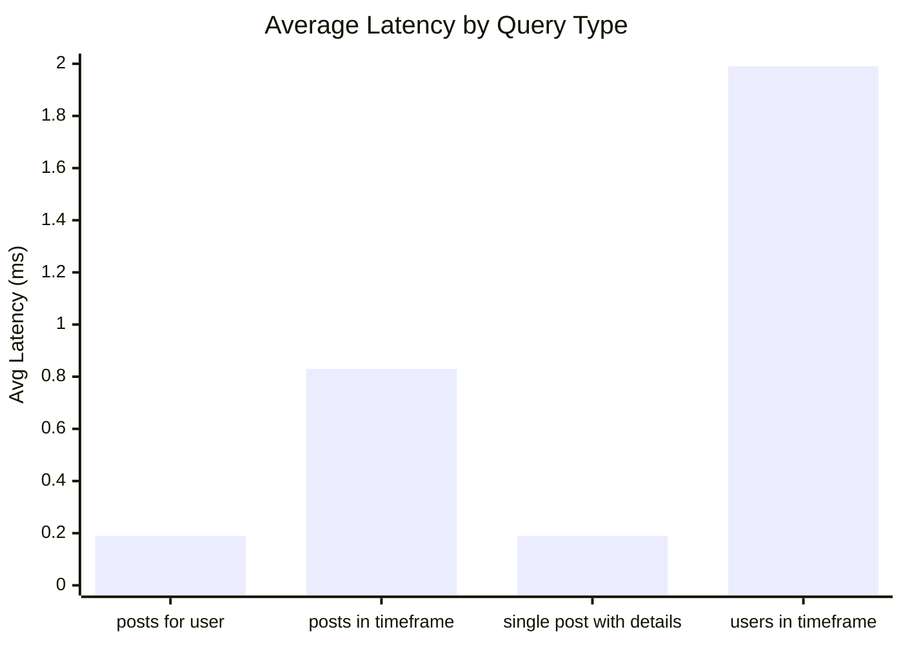
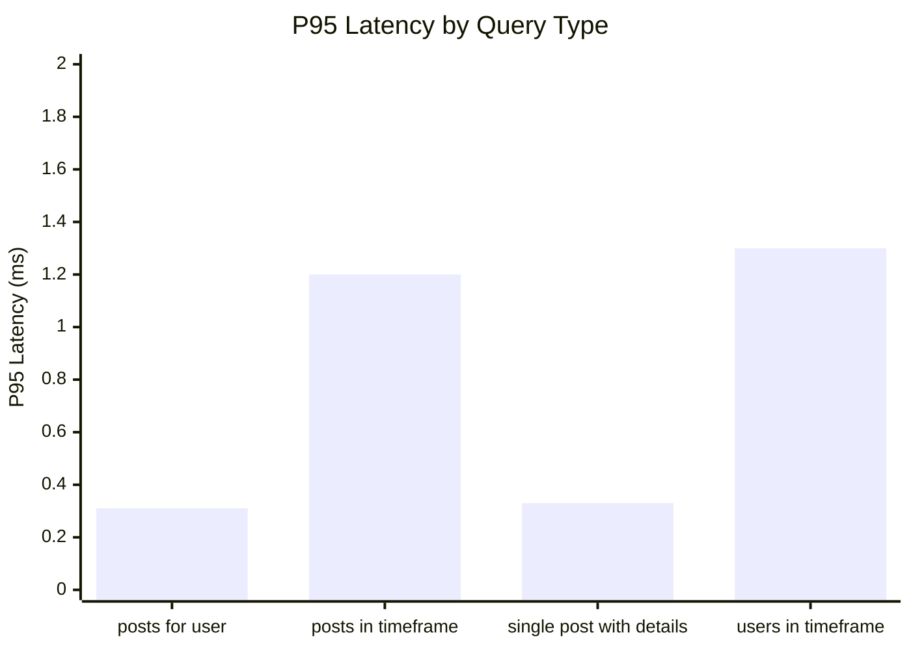
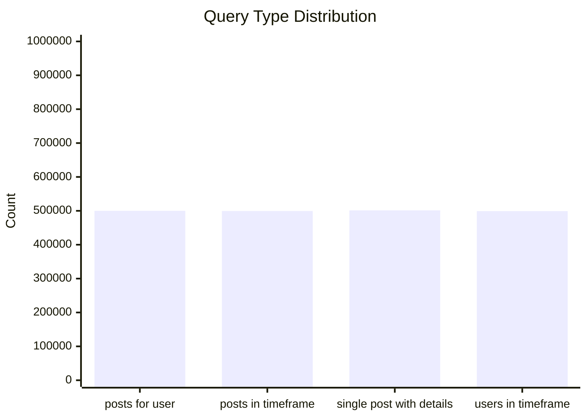
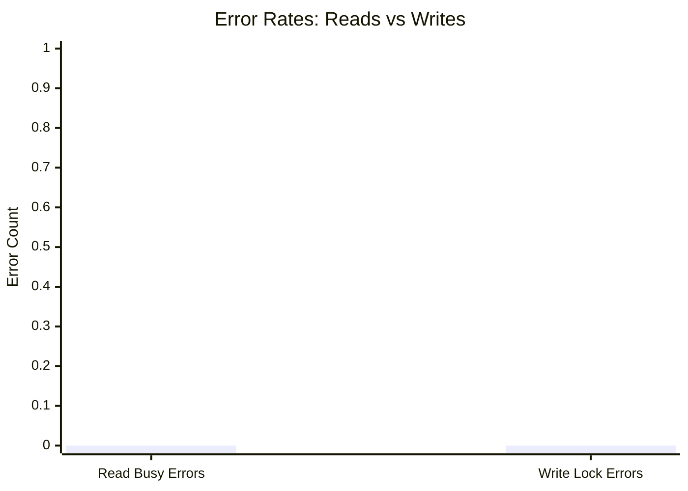
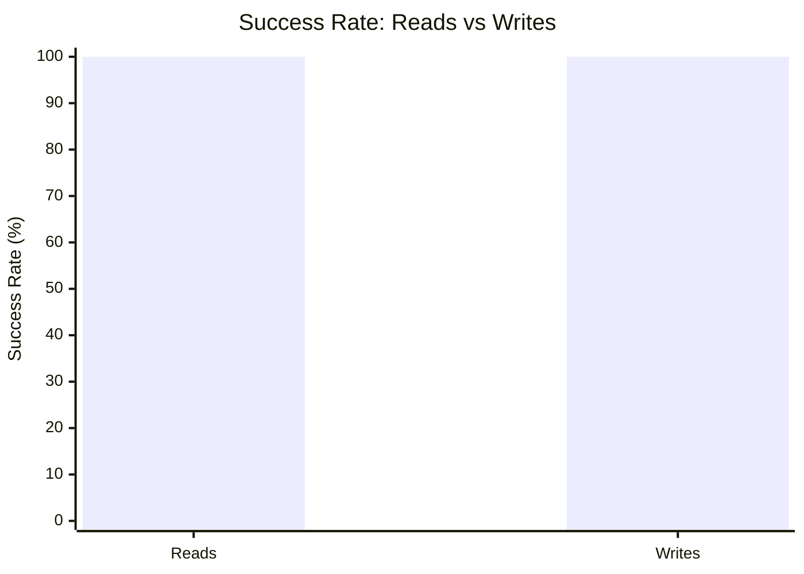

# Mixed Read/Write Benchmark: r10_w2_R2m_W200k_c16mb

**Test Run:** 12/25/2025, 3:58:17 PM

## Configuration

| Setting | Value |
|---------|-------|
| ID | r10_w2_R2m_W200k_c16mb |
| Read Workers | 10 |
| Write Workers | 2 |
| Total Reads | 2,000,000 |
| Total Writes | 200,000 |
| Total Operations | 2,200,000 |
| Read:Write Ratio | 10.0:1 |
| Cache Size | 16000 KB (16 MB) |

## Summary

| Metric | Reads | Writes | Combined |
|--------|-------|--------|----------|
| Total | 2,000,000 | 200,000 | 2,200,000 |
| Successful | 2,000,000 | 200,000 | - |
| Success Rate | 100.0% | 100.0% | - |
| Throughput | 3468/sec | 347/sec | 3814/sec |
| Avg Latency | 0.80ms | 0.65ms | - |
| P50 Latency | 0.50ms | 0.27ms | - |
| P95 Latency | 1.13ms | 1.50ms | - |
| P99 Latency | 1.60ms | 1.63ms | - |
| Errors | 0 (busy: 0) | 0 (lock: 0) | - |

**Total Duration:** 576.76 seconds

## Read Query Breakdown

| Query Type | Count | Avg (ms) | P95 (ms) | P99 (ms) | Avg Rows |
|------------|-------|----------|----------|----------|----------|
| posts_for_user | 500,034 | 0.19 | 0.31 | 0.43 | 0.8 |
| posts_in_timeframe | 499,536 | 0.83 | 1.20 | 1.70 | 100.0 |
| single_post_with_details | 501,314 | 0.19 | 0.33 | 0.47 | 5.0 |
| users_in_timeframe | 499,116 | 1.99 | 1.30 | 46.63 | 627.6 |


## Charts

### Read vs Write Latency Comparison

This chart compares latency percentiles (P50, P95, P99) between read and write operations. It shows how read and write latencies differ under concurrent load.



### Throughput Comparison

This chart compares the throughput of reads, writes, and combined operations. It shows the relative performance of read vs write operations.



### Average Latency by Query Type

This chart shows the average latency for each read query type. It helps identify which queries are the slowest.



### P95 Latency by Query Type

This chart shows the P95 latency (95th percentile) for each read query type. It highlights the worst-case performance for each query type.



### Query Type Distribution

This chart shows the distribution of query types executed during the test. It helps verify that queries are evenly distributed.



### Error Rates

This chart compares error rates between reads (SQLITE_BUSY errors) and writes (lock errors). It helps identify contention issues.



### Success Rate Comparison

This chart compares the success rate of read vs write operations. Both should ideally be at 100%.



## Key Observations

### Read Performance
- **2,000,000** successful reads out of 2,000,000 (100.0% success rate)
- Average read latency: **0.80ms**, P99: **1.60ms**
- Read throughput: **3468 reads/sec**
- ✅ No busy errors during reads (WAL mode working well)

### Write Performance
- **200,000** successful writes out of 200,000 (100.0% success rate)
- Average write latency: **0.65ms**, P99: **1.63ms**
- Write throughput: **347 writes/sec**
- ✅ No lock errors during writes

### Combined Throughput
- Total operations completed: **2,200,000**
- Combined throughput: **3814 ops/sec**

## Raw Data

<details>
<summary>Click to expand raw JSON data</summary>

```json
{
  "testName": "mixedReadWrite-r10_w2_R2m_W200k_c16mb",
  "timestamp": "2025-12-25T10:28:17.436Z",
  "configuration": {
    "id": "r10_w2_R2m_W200k_c16mb",
    "readWorkers": 10,
    "writeWorkers": 2,
    "readsPerWorker": 200000,
    "writesPerWorker": 100000,
    "totalReads": 2000000,
    "totalWrites": 200000,
    "totalOperations": 2200000,
    "readWriteRatio": 10,
    "cacheSize": 16000
  },
  "duration": 576756.399532,
  "reads": {
    "total": 2000000,
    "successful": 2000000,
    "errors": 0,
    "busyErrors": 0,
    "successRate": 100,
    "avgTime": 0.800052197469733,
    "minTime": 0.05016500000056112,
    "maxTime": 340.8403030000045,
    "p50": 0.4982160000363365,
    "p95": 1.1312829999951646,
    "p99": 1.5998600000166334,
    "readsPerSec": 3467.6685020276655,
    "byQueryType": {
      "posts_for_user": {
        "count": 500034,
        "avgTime": 0.1897729390962232,
        "p95": 0.30794099997729063,
        "p99": 0.42927600000984967,
        "avgRowCount": 0.8227520528604055
      },
      "posts_in_timeframe": {
        "count": 499536,
        "avgTime": 0.8329711782754768,
        "p95": 1.200654000043869,
        "p99": 1.702567000000272,
        "avgRowCount": 100
      },
      "single_post_with_details": {
        "count": 501314,
        "avgTime": 0.19093547525708243,
        "p95": 0.3331239999970421,
        "p99": 0.4665859999367967,
        "avgRowCount": 5.016859692727512
      },
      "users_in_timeframe": {
        "count": 499116,
        "avgTime": 1.9903063731817343,
        "p95": 1.302787000022363,
        "p99": 46.6338429999887,
        "avgRowCount": 627.6466572900889
      }
    }
  },
  "writes": {
    "total": 200000,
    "successful": 200000,
    "errors": 0,
    "lockErrors": 0,
    "successRate": 100,
    "avgTime": 0.6461687065800421,
    "minTime": 0.06782900000689551,
    "maxTime": 134.1510769999877,
    "p50": 0.27257400000235066,
    "p95": 1.5044050000142306,
    "p99": 1.634267000015825,
    "writesPerSec": 346.76685020276653
  },
  "combined": {
    "totalOps": 2200000,
    "opsPerSec": 3814.435352230432
  }
}
```

</details>
