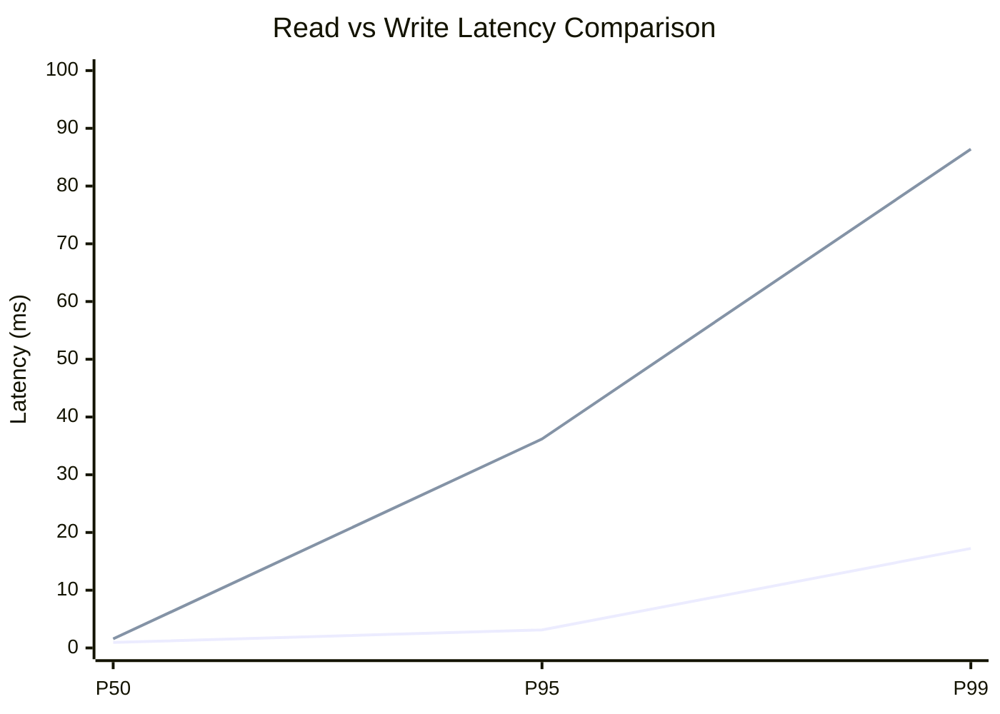
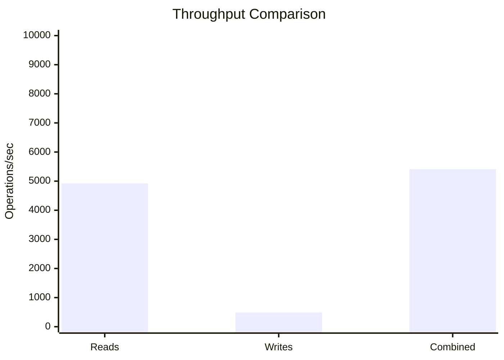
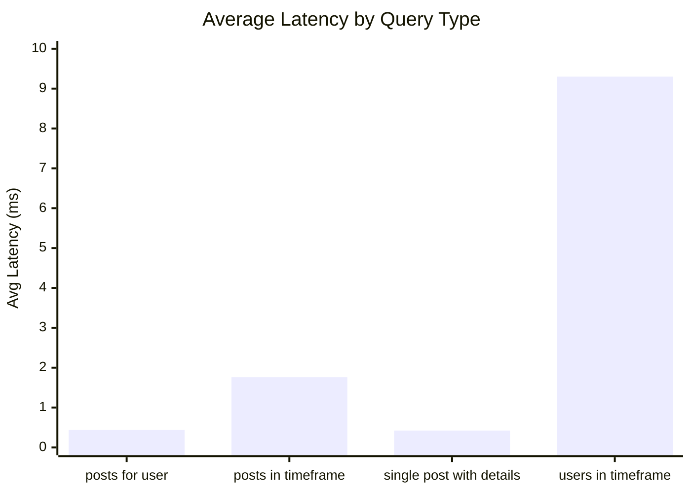
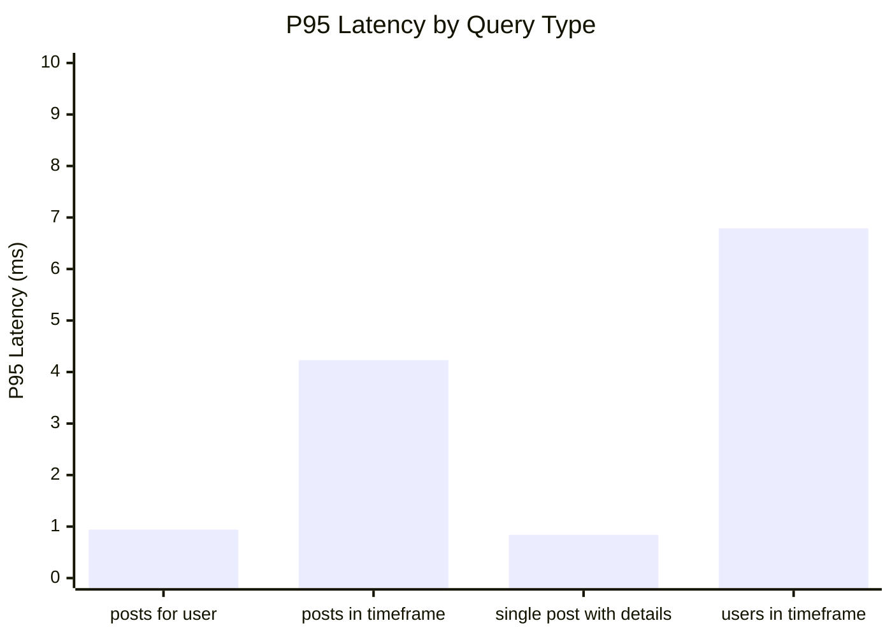
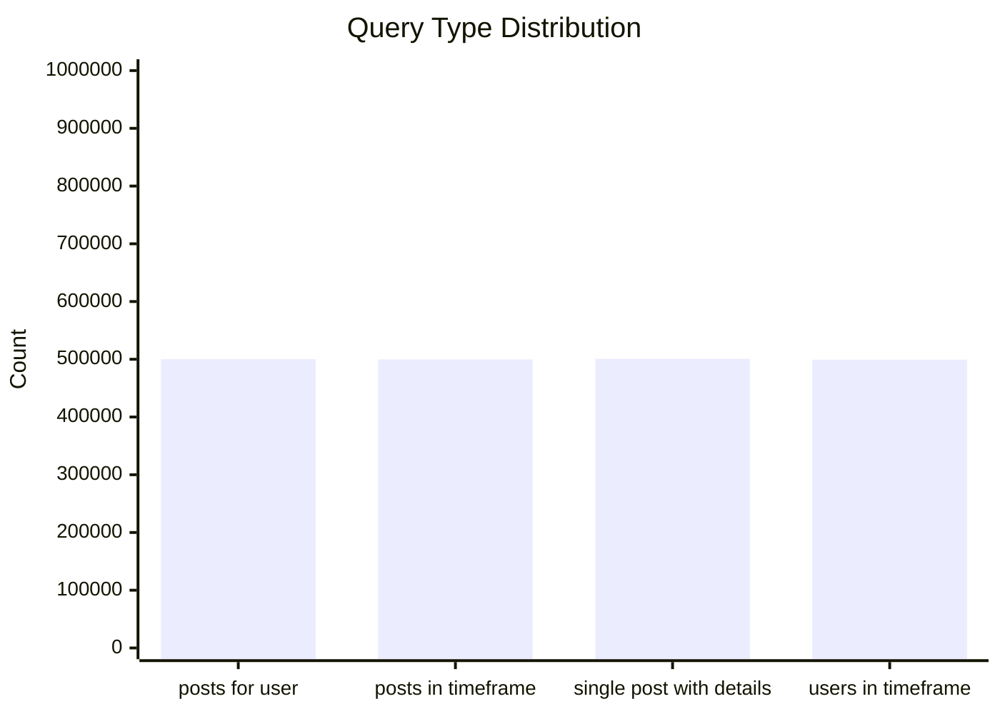
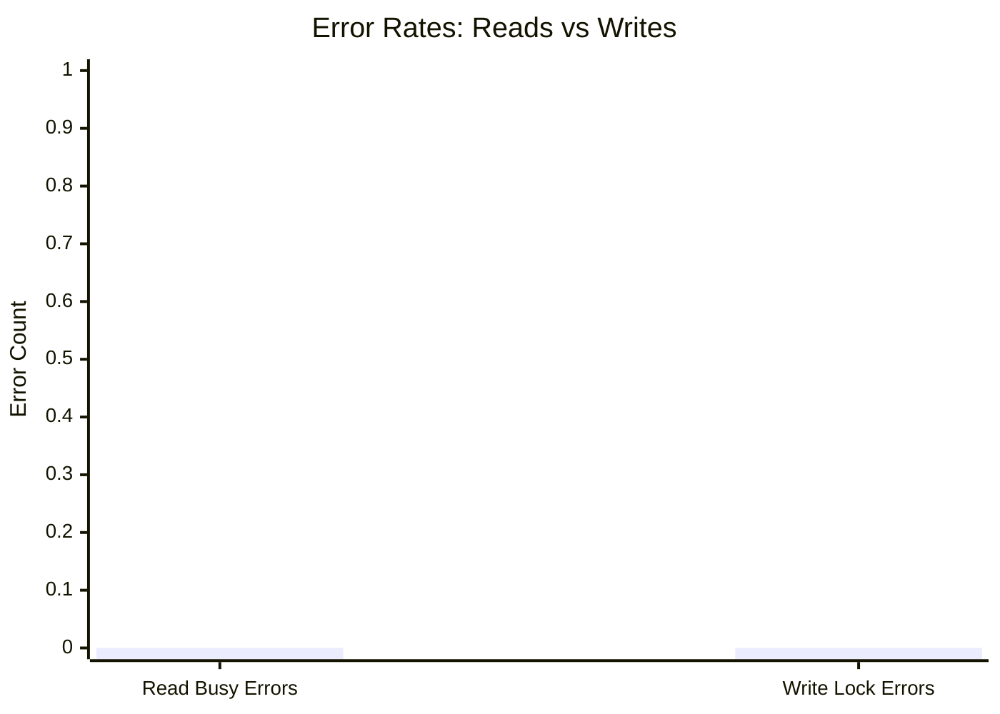
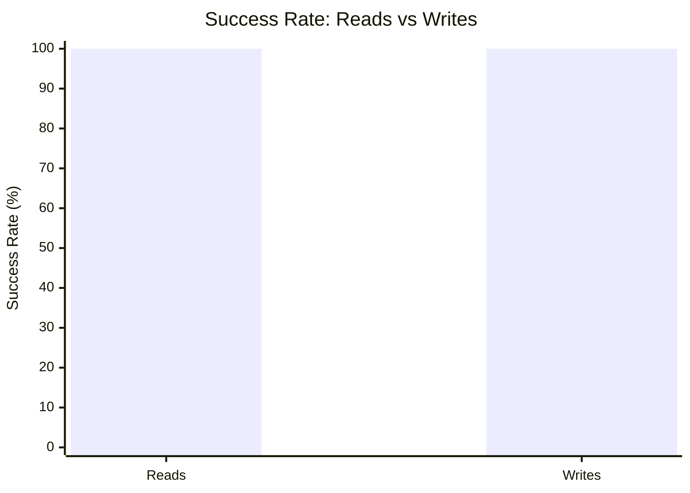

# Mixed Read/Write Benchmark: r10_w2_R2m_W200k_c20mb

**Test Run:** 12/25/2025, 1:59:11 AM

## Configuration

| Setting | Value |
|---------|-------|
| ID | r10_w2_R2m_W200k_c20mb |
| Read Workers | 80 |
| Write Workers | 20 |
| Total Reads | 2,000,000 |
| Total Writes | 200,000 |
| Total Operations | 2,200,000 |
| Read:Write Ratio | 10.0:1 |
| Cache Size | 20000 KB (20 MB) |

## Summary

| Metric | Reads | Writes | Combined |
|--------|-------|--------|----------|
| Total | 2,000,000 | 200,000 | 2,200,000 |
| Successful | 2,000,000 | 200,000 | - |
| Success Rate | 100.0% | 100.0% | - |
| Throughput | 4921/sec | 492/sec | 5413/sec |
| Avg Latency | 2.97ms | 7.37ms | - |
| P50 Latency | 0.95ms | 1.57ms | - |
| P95 Latency | 3.12ms | 36.19ms | - |
| P99 Latency | 17.24ms | 86.40ms | - |
| Errors | 0 (busy: 0) | 0 (lock: 0) | - |

**Total Duration:** 406.42 seconds

## Read Query Breakdown

| Query Type | Count | Avg (ms) | P95 (ms) | P99 (ms) | Avg Rows |
|------------|-------|----------|----------|----------|----------|
| posts_for_user | 500,172 | 0.44 | 0.94 | 4.84 | 0.8 |
| posts_in_timeframe | 499,717 | 1.76 | 4.23 | 12.19 | 100.0 |
| single_post_with_details | 500,833 | 0.42 | 0.84 | 4.38 | 4.8 |
| users_in_timeframe | 499,278 | 9.30 | 6.79 | 335.53 | 1023.9 |


## Charts

### Read vs Write Latency Comparison

This chart compares latency percentiles (P50, P95, P99) between read and write operations. It shows how read and write latencies differ under concurrent load.



### Throughput Comparison

This chart compares the throughput of reads, writes, and combined operations. It shows the relative performance of read vs write operations.



### Average Latency by Query Type

This chart shows the average latency for each read query type. It helps identify which queries are the slowest.



### P95 Latency by Query Type

This chart shows the P95 latency (95th percentile) for each read query type. It highlights the worst-case performance for each query type.



### Query Type Distribution

This chart shows the distribution of query types executed during the test. It helps verify that queries are evenly distributed.



### Error Rates

This chart compares error rates between reads (SQLITE_BUSY errors) and writes (lock errors). It helps identify contention issues.



### Success Rate Comparison

This chart compares the success rate of read vs write operations. Both should ideally be at 100%.



## Key Observations

### Read Performance
- **2,000,000** successful reads out of 2,000,000 (100.0% success rate)
- Average read latency: **2.97ms**, P99: **17.24ms**
- Read throughput: **4921 reads/sec**
- ✅ No busy errors during reads (WAL mode working well)

### Write Performance
- **200,000** successful writes out of 200,000 (100.0% success rate)
- Average write latency: **7.37ms**, P99: **86.40ms**
- Write throughput: **492 writes/sec**
- ✅ No lock errors during writes

### Combined Throughput
- Total operations completed: **2,200,000**
- Combined throughput: **5413 ops/sec**

## Raw Data

<details>
<summary>Click to expand raw JSON data</summary>

```json
{
  "testName": "mixedReadWrite-r10_w2_R2m_W200k_c20mb",
  "timestamp": "2025-12-24T20:29:11.538Z",
  "configuration": {
    "id": "r10_w2_R2m_W200k_c20mb",
    "readWorkers": 80,
    "writeWorkers": 20,
    "readsPerWorker": 25000,
    "writesPerWorker": 10000,
    "totalReads": 2000000,
    "totalWrites": 200000,
    "totalOperations": 2200000,
    "readWriteRatio": 10,
    "cacheSize": 20000
  },
  "duration": 406416.43002,
  "reads": {
    "total": 2000000,
    "successful": 2000000,
    "errors": 0,
    "busyErrors": 0,
    "successRate": 100,
    "avgTime": 2.974199252644758,
    "minTime": 0.05264800000441028,
    "maxTime": 1177.3614479999524,
    "p50": 0.9537549999949988,
    "p95": 3.124978999985615,
    "p99": 17.23865100002149,
    "readsPerSec": 4921.060892891507,
    "byQueryType": {
      "posts_for_user": {
        "count": 500172,
        "avgTime": 0.4372636116575751,
        "p95": 0.9407590000191703,
        "p99": 4.840649000019766,
        "avgRowCount": 0.8019201394720217
      },
      "posts_in_timeframe": {
        "count": 499717,
        "avgTime": 1.761089676701086,
        "p95": 4.230219999997644,
        "p99": 12.186177000010503,
        "avgRowCount": 100
      },
      "single_post_with_details": {
        "count": 500833,
        "avgTime": 0.4168487786547774,
        "p95": 0.836514000002353,
        "p99": 4.382856999989599,
        "avgRowCount": 4.848710049058269
      },
      "users_in_timeframe": {
        "count": 499278,
        "avgTime": 9.295169055690542,
        "p95": 6.7878619999974035,
        "p99": 335.5335789999808,
        "avgRowCount": 1023.9472858808119
      }
    }
  },
  "writes": {
    "total": 200000,
    "successful": 200000,
    "errors": 0,
    "lockErrors": 0,
    "successRate": 100,
    "avgTime": 7.371738427975002,
    "minTime": 0.06668400000125985,
    "maxTime": 865.5200820000027,
    "p50": 1.574378000019351,
    "p95": 36.19280099999742,
    "p99": 86.39627999998629,
    "writesPerSec": 492.10608928915065
  },
  "combined": {
    "totalOps": 2200000,
    "opsPerSec": 5413.166982180658
  }
}
```

</details>
