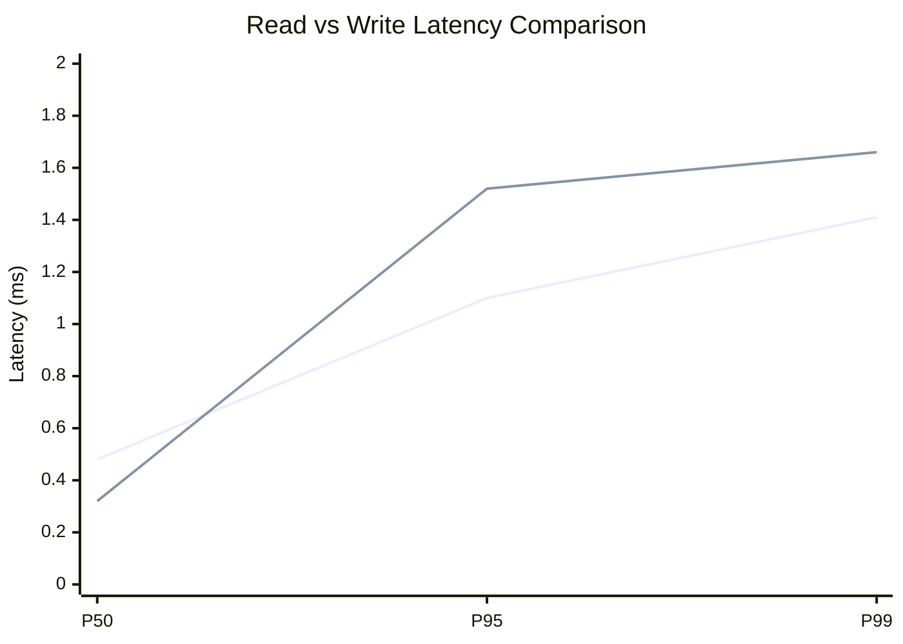
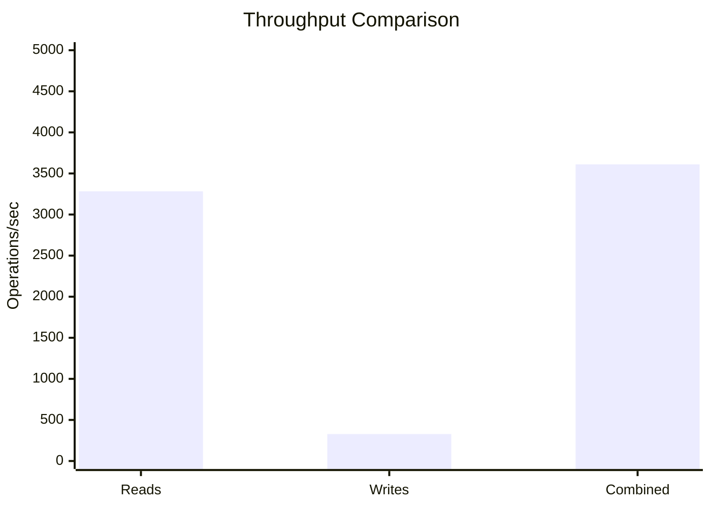
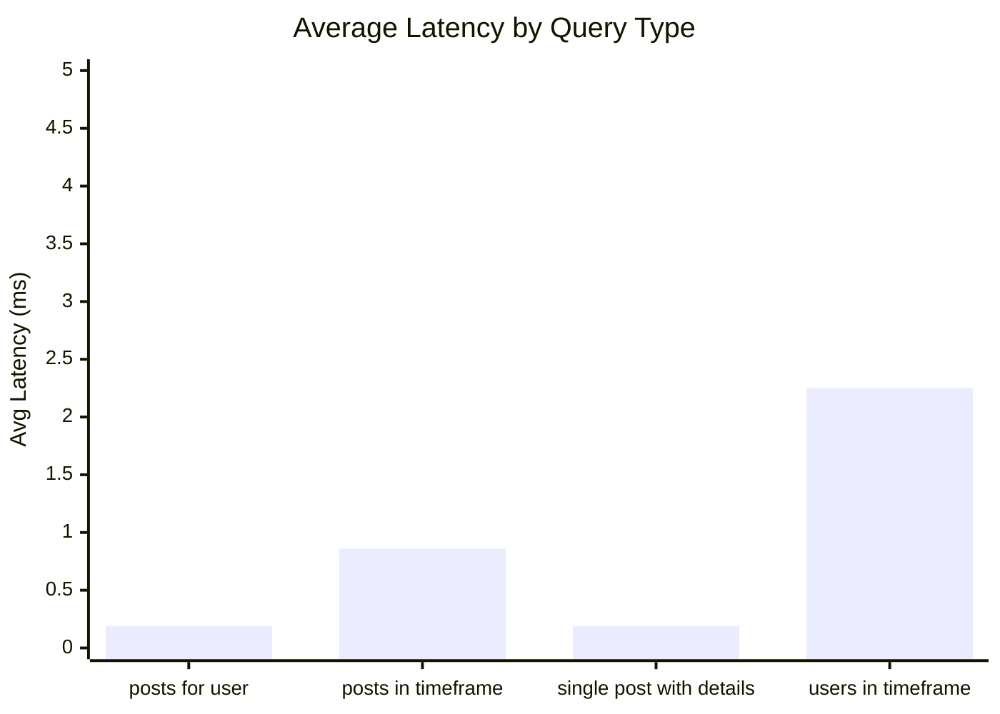
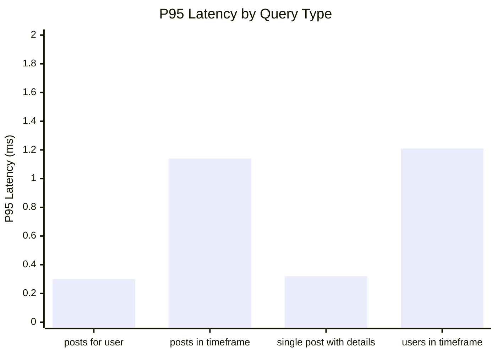
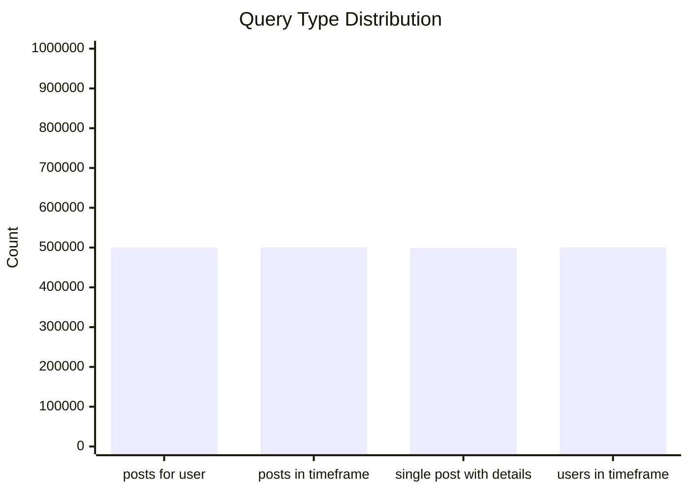
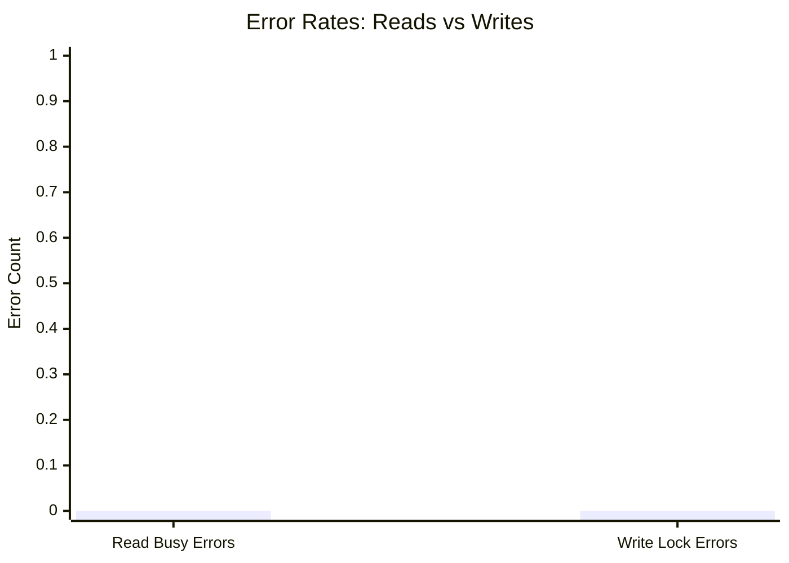
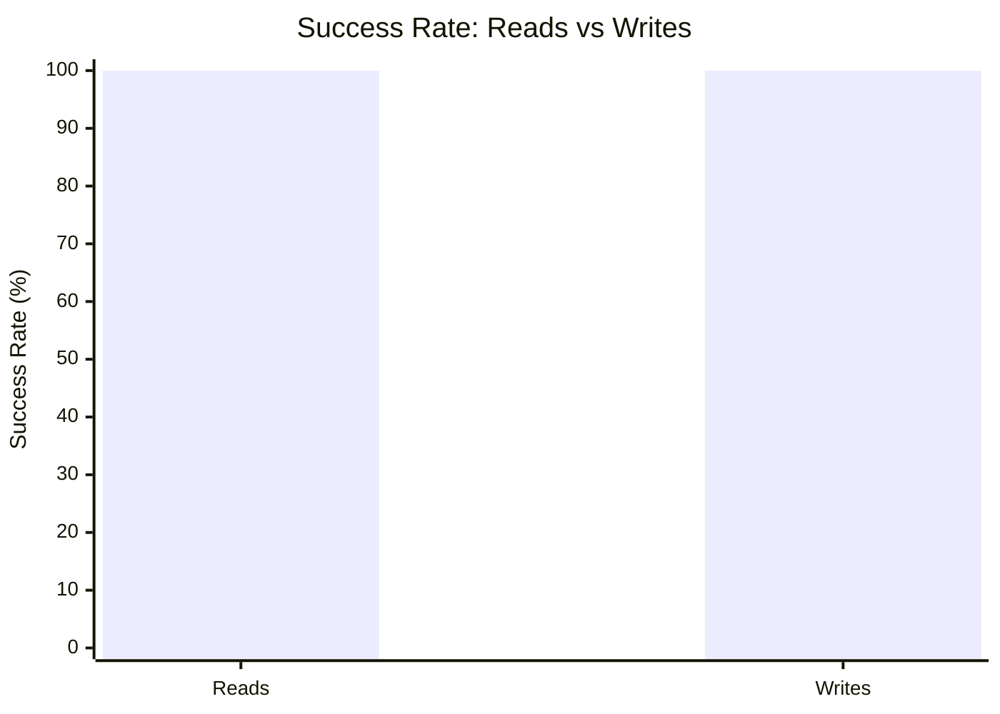

# Mixed Read/Write Benchmark: r10_w2_R2m_W200k_c24mb

**Test Run:** 12/25/2025, 5:57:02 PM

## Configuration

| Setting | Value |
|---------|-------|
| ID | r10_w2_R2m_W200k_c24mb |
| Read Workers | 10 |
| Write Workers | 2 |
| Total Reads | 2,000,000 |
| Total Writes | 200,000 |
| Total Operations | 2,200,000 |
| Read:Write Ratio | 10.0:1 |
| Cache Size | 24000 KB (24 MB) |

## Summary

| Metric | Reads | Writes | Combined |
|--------|-------|--------|----------|
| Total | 2,000,000 | 200,000 | 2,200,000 |
| Successful | 2,000,000 | 200,000 | - |
| Success Rate | 100.0% | 100.0% | - |
| Throughput | 3283/sec | 328/sec | 3611/sec |
| Avg Latency | 0.87ms | 0.67ms | - |
| P50 Latency | 0.48ms | 0.32ms | - |
| P95 Latency | 1.10ms | 1.52ms | - |
| P99 Latency | 1.41ms | 1.66ms | - |
| Errors | 0 (busy: 0) | 0 (lock: 0) | - |

**Total Duration:** 609.29 seconds

## Read Query Breakdown

| Query Type | Count | Avg (ms) | P95 (ms) | P99 (ms) | Avg Rows |
|------------|-------|----------|----------|----------|----------|
| posts_for_user | 499,880 | 0.19 | 0.30 | 0.37 | 0.8 |
| posts_in_timeframe | 500,566 | 0.86 | 1.14 | 1.47 | 100.0 |
| single_post_with_details | 499,270 | 0.19 | 0.32 | 0.42 | 5.0 |
| users_in_timeframe | 500,284 | 2.25 | 1.21 | 76.37 | 717.9 |


## Charts

### Read vs Write Latency Comparison

This chart compares latency percentiles (P50, P95, P99) between read and write operations. It shows how read and write latencies differ under concurrent load.



### Throughput Comparison

This chart compares the throughput of reads, writes, and combined operations. It shows the relative performance of read vs write operations.



### Average Latency by Query Type

This chart shows the average latency for each read query type. It helps identify which queries are the slowest.



### P95 Latency by Query Type

This chart shows the P95 latency (95th percentile) for each read query type. It highlights the worst-case performance for each query type.



### Query Type Distribution

This chart shows the distribution of query types executed during the test. It helps verify that queries are evenly distributed.



### Error Rates

This chart compares error rates between reads (SQLITE_BUSY errors) and writes (lock errors). It helps identify contention issues.



### Success Rate Comparison

This chart compares the success rate of read vs write operations. Both should ideally be at 100%.



## Key Observations

### Read Performance
- **2,000,000** successful reads out of 2,000,000 (100.0% success rate)
- Average read latency: **0.87ms**, P99: **1.41ms**
- Read throughput: **3283 reads/sec**
- ✅ No busy errors during reads (WAL mode working well)

### Write Performance
- **200,000** successful writes out of 200,000 (100.0% success rate)
- Average write latency: **0.67ms**, P99: **1.66ms**
- Write throughput: **328 writes/sec**
- ✅ No lock errors during writes

### Combined Throughput
- Total operations completed: **2,200,000**
- Combined throughput: **3611 ops/sec**

## Raw Data

<details>
<summary>Click to expand raw JSON data</summary>

```json
{
  "testName": "mixedReadWrite-r10_w2_R2m_W200k_c24mb",
  "timestamp": "2025-12-25T12:27:02.559Z",
  "configuration": {
    "id": "r10_w2_R2m_W200k_c24mb",
    "readWorkers": 10,
    "writeWorkers": 2,
    "readsPerWorker": 200000,
    "writesPerWorker": 100000,
    "totalReads": 2000000,
    "totalWrites": 200000,
    "totalOperations": 2200000,
    "readWriteRatio": 10,
    "cacheSize": 24000
  },
  "duration": 609288.1270219999,
  "reads": {
    "total": 2000000,
    "successful": 2000000,
    "errors": 0,
    "busyErrors": 0,
    "successRate": 100,
    "avgTime": 0.8739221796606396,
    "minTime": 0.051928000000771135,
    "maxTime": 235.52623399998993,
    "p50": 0.4849590000230819,
    "p95": 1.0992550000082701,
    "p99": 1.4131170000036946,
    "readsPerSec": 3282.51924056906,
    "byQueryType": {
      "posts_for_user": {
        "count": 499880,
        "avgTime": 0.19124321780432177,
        "p95": 0.29752199997892603,
        "p99": 0.37120600003981963,
        "avgRowCount": 0.8178302792670241
      },
      "posts_in_timeframe": {
        "count": 500566,
        "avgTime": 0.8568342275644624,
        "p95": 1.136744000017643,
        "p99": 1.468427000043448,
        "avgRowCount": 100
      },
      "single_post_with_details": {
        "count": 499270,
        "avgTime": 0.19293517375368927,
        "p95": 0.3238330000312999,
        "p99": 0.4203400000697002,
        "avgRowCount": 5.016327838644421
      },
      "users_in_timeframe": {
        "count": 500284,
        "avgTime": 2.2527541825243347,
        "p95": 1.2070890000322834,
        "p99": 76.3725319999503,
        "avgRowCount": 717.8550443348179
      }
    }
  },
  "writes": {
    "total": 200000,
    "successful": 200000,
    "errors": 0,
    "lockErrors": 0,
    "successRate": 100,
    "avgTime": 0.6719959670250666,
    "minTime": 0.07759500003885478,
    "maxTime": 100.7361779999992,
    "p50": 0.3187580000376329,
    "p95": 1.517569999967236,
    "p99": 1.6574409999884665,
    "writesPerSec": 328.251924056906
  },
  "combined": {
    "totalOps": 2200000,
    "opsPerSec": 3610.771164625966
  }
}
```

</details>
