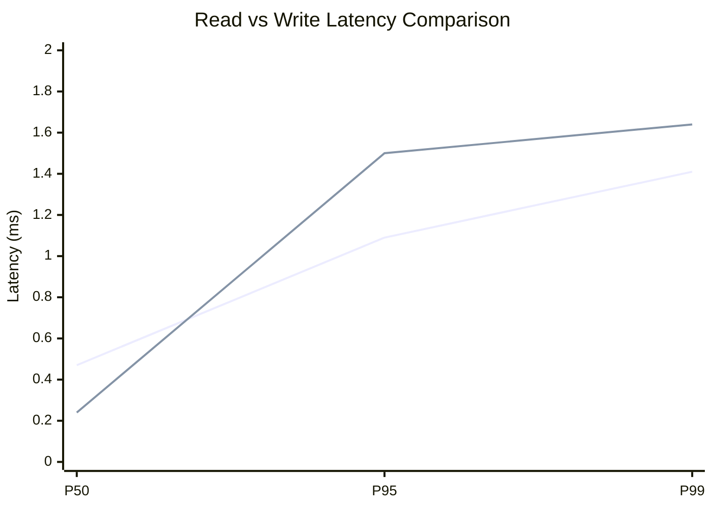
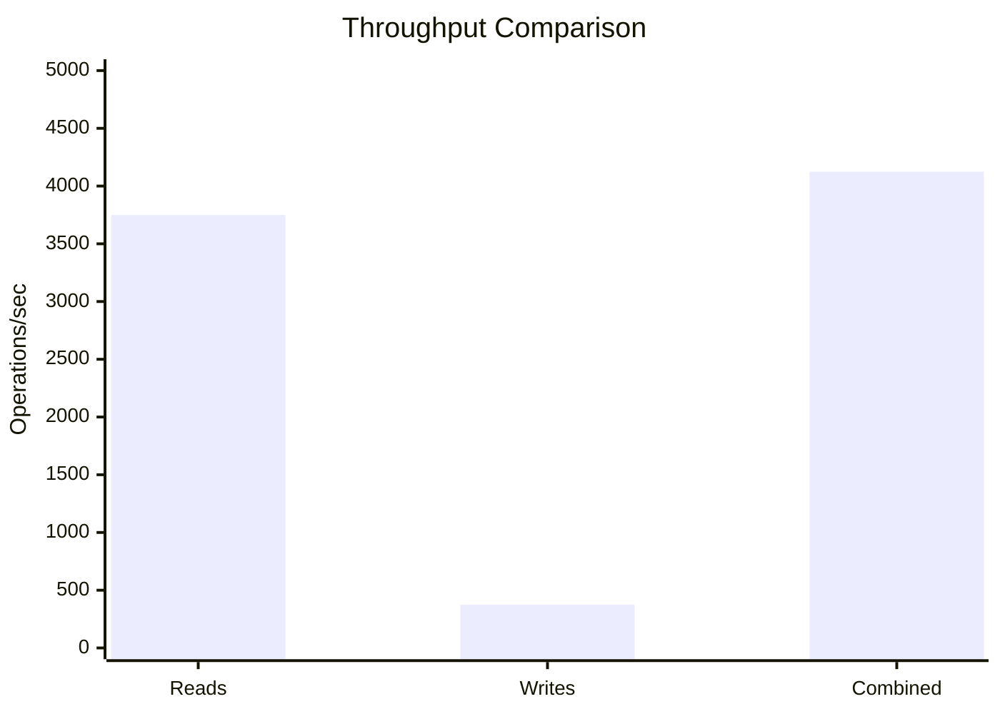
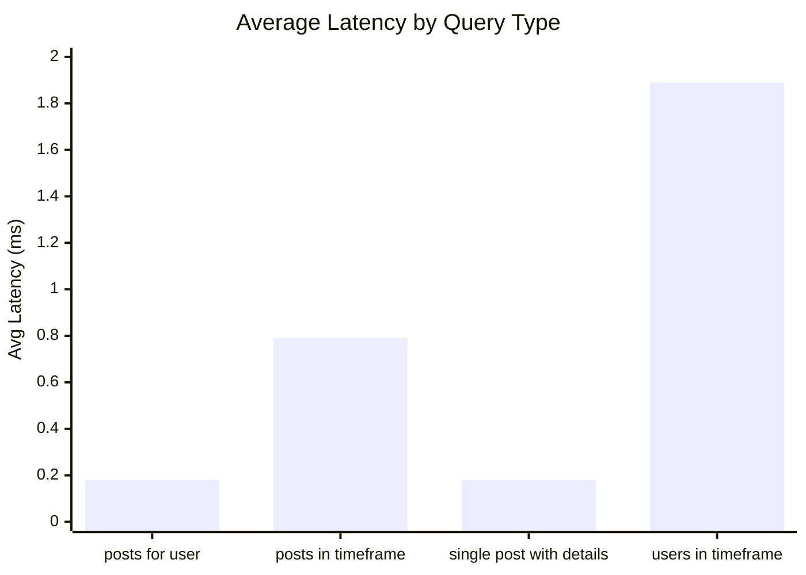
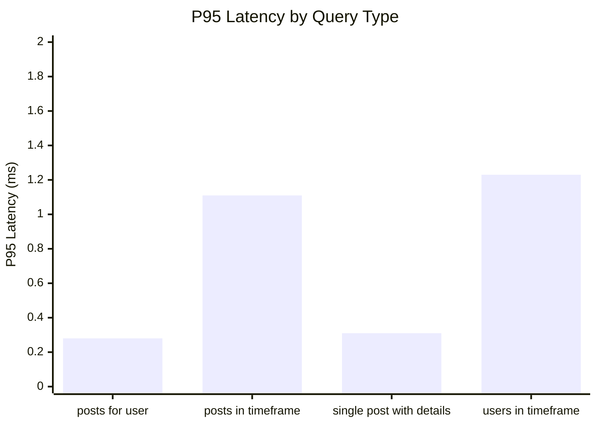
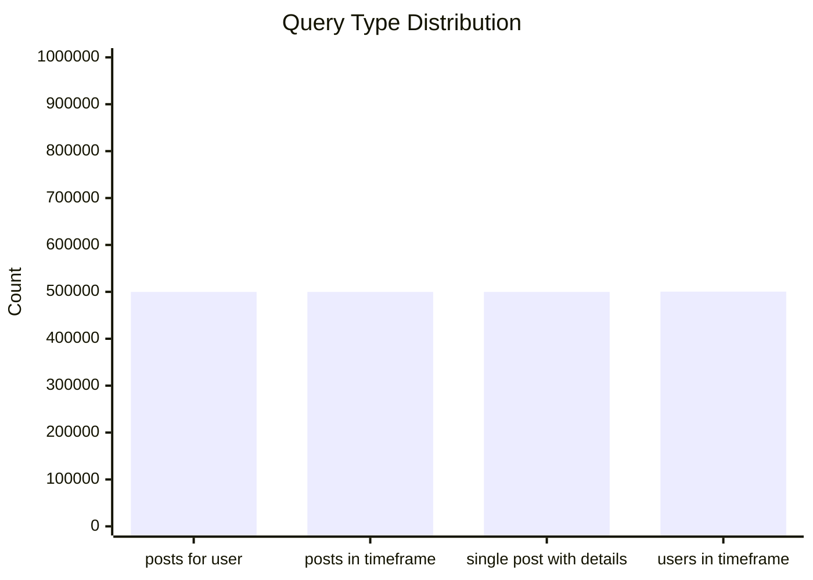
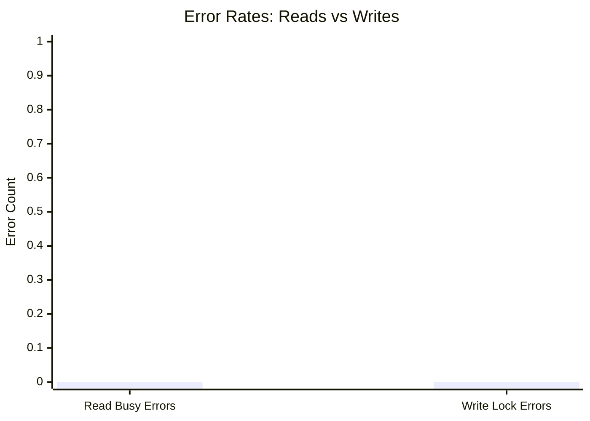
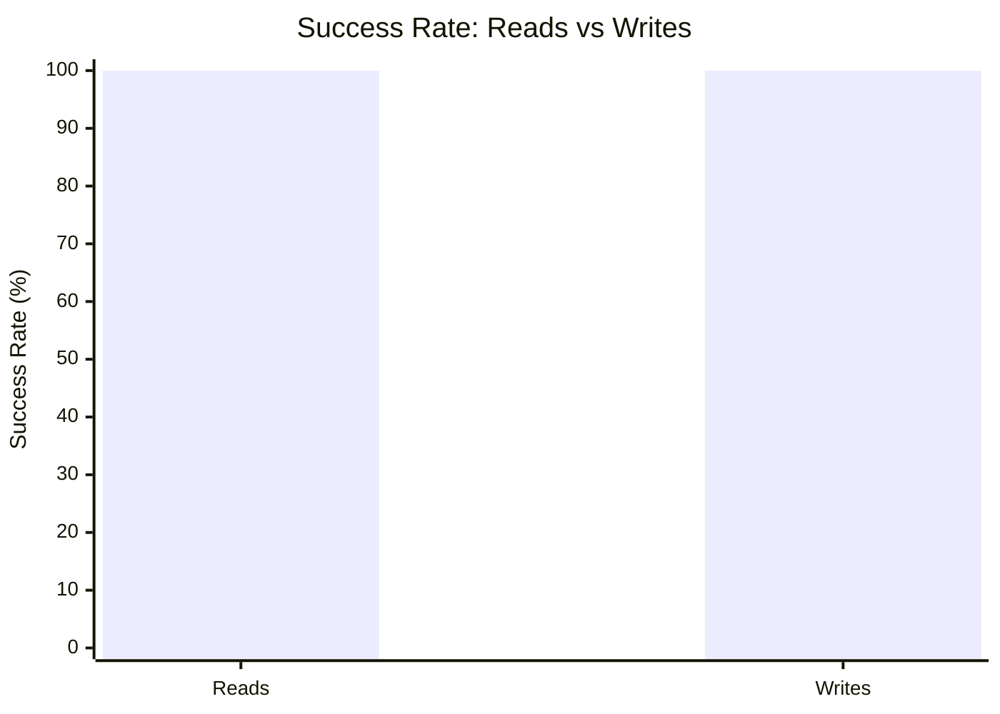

# Mixed Read/Write Benchmark: r10_w2_R2m_W200k_c32mb

**Test Run:** 12/25/2025, 3:28:29 PM

## Configuration

| Setting | Value |
|---------|-------|
| ID | r10_w2_R2m_W200k_c32mb |
| Read Workers | 10 |
| Write Workers | 2 |
| Total Reads | 2,000,000 |
| Total Writes | 200,000 |
| Total Operations | 2,200,000 |
| Read:Write Ratio | 10.0:1 |
| Cache Size | 32000 KB (32 MB) |

## Summary

| Metric | Reads | Writes | Combined |
|--------|-------|--------|----------|
| Total | 2,000,000 | 200,000 | 2,200,000 |
| Successful | 2,000,000 | 200,000 | - |
| Success Rate | 100.0% | 100.0% | - |
| Throughput | 3750/sec | 375/sec | 4125/sec |
| Avg Latency | 0.76ms | 0.62ms | - |
| P50 Latency | 0.47ms | 0.24ms | - |
| P95 Latency | 1.09ms | 1.50ms | - |
| P99 Latency | 1.41ms | 1.64ms | - |
| Errors | 0 (busy: 0) | 0 (lock: 0) | - |

**Total Duration:** 533.39 seconds

## Read Query Breakdown

| Query Type | Count | Avg (ms) | P95 (ms) | P99 (ms) | Avg Rows |
|------------|-------|----------|----------|----------|----------|
| posts_for_user | 499,858 | 0.18 | 0.28 | 0.36 | 0.8 |
| posts_in_timeframe | 499,854 | 0.79 | 1.11 | 1.48 | 100.0 |
| single_post_with_details | 499,785 | 0.18 | 0.31 | 0.41 | 5.0 |
| users_in_timeframe | 500,503 | 1.89 | 1.23 | 45.25 | 626.0 |


## Charts

### Read vs Write Latency Comparison

This chart compares latency percentiles (P50, P95, P99) between read and write operations. It shows how read and write latencies differ under concurrent load.



### Throughput Comparison

This chart compares the throughput of reads, writes, and combined operations. It shows the relative performance of read vs write operations.



### Average Latency by Query Type

This chart shows the average latency for each read query type. It helps identify which queries are the slowest.



### P95 Latency by Query Type

This chart shows the P95 latency (95th percentile) for each read query type. It highlights the worst-case performance for each query type.



### Query Type Distribution

This chart shows the distribution of query types executed during the test. It helps verify that queries are evenly distributed.



### Error Rates

This chart compares error rates between reads (SQLITE_BUSY errors) and writes (lock errors). It helps identify contention issues.



### Success Rate Comparison

This chart compares the success rate of read vs write operations. Both should ideally be at 100%.



## Key Observations

### Read Performance
- **2,000,000** successful reads out of 2,000,000 (100.0% success rate)
- Average read latency: **0.76ms**, P99: **1.41ms**
- Read throughput: **3750 reads/sec**
- ✅ No busy errors during reads (WAL mode working well)

### Write Performance
- **200,000** successful writes out of 200,000 (100.0% success rate)
- Average write latency: **0.62ms**, P99: **1.64ms**
- Write throughput: **375 writes/sec**
- ✅ No lock errors during writes

### Combined Throughput
- Total operations completed: **2,200,000**
- Combined throughput: **4125 ops/sec**

## Raw Data

<details>
<summary>Click to expand raw JSON data</summary>

```json
{
  "testName": "mixedReadWrite-r10_w2_R2m_W200k_c32mb",
  "timestamp": "2025-12-25T09:58:29.856Z",
  "configuration": {
    "id": "r10_w2_R2m_W200k_c32mb",
    "readWorkers": 10,
    "writeWorkers": 2,
    "readsPerWorker": 200000,
    "writesPerWorker": 100000,
    "totalReads": 2000000,
    "totalWrites": 200000,
    "totalOperations": 2200000,
    "readWriteRatio": 10,
    "cacheSize": 32000
  },
  "duration": 533393.302781,
  "reads": {
    "total": 2000000,
    "successful": 2000000,
    "errors": 0,
    "busyErrors": 0,
    "successRate": 100,
    "avgTime": 0.7612984057538377,
    "minTime": 0.04711100000713486,
    "maxTime": 228.50361899996642,
    "p50": 0.4713120000087656,
    "p95": 1.0932550000143237,
    "p99": 1.4149999999790452,
    "readsPerSec": 3749.578387228378,
    "byQueryType": {
      "posts_for_user": {
        "count": 499858,
        "avgTime": 0.17635204838372837,
        "p95": 0.28371899999910966,
        "p99": 0.3601450000423938,
        "avgRowCount": 0.8185424660603612
      },
      "posts_in_timeframe": {
        "count": 499854,
        "avgTime": 0.7933043796988699,
        "p95": 1.106922000006307,
        "p99": 1.4804609999991953,
        "avgRowCount": 100
      },
      "single_post_with_details": {
        "count": 499785,
        "avgTime": 0.17922272000355782,
        "p95": 0.30866099998820573,
        "p99": 0.40924800001084805,
        "avgRowCount": 4.954272337104955
      },
      "users_in_timeframe": {
        "count": 500503,
        "avgTime": 1.8947671338213867,
        "p95": 1.2268530000001192,
        "p99": 45.25290600000881,
        "avgRowCount": 626.0102676707232
      }
    }
  },
  "writes": {
    "total": 200000,
    "successful": 200000,
    "errors": 0,
    "lockErrors": 0,
    "successRate": 100,
    "avgTime": 0.6226346225350397,
    "minTime": 0.061845999967772514,
    "maxTime": 114.39278100000229,
    "p50": 0.23887899998226203,
    "p95": 1.4959789999993518,
    "p99": 1.6444019999762531,
    "writesPerSec": 374.9578387228378
  },
  "combined": {
    "totalOps": 2200000,
    "opsPerSec": 4124.536225951216
  }
}
```

</details>
