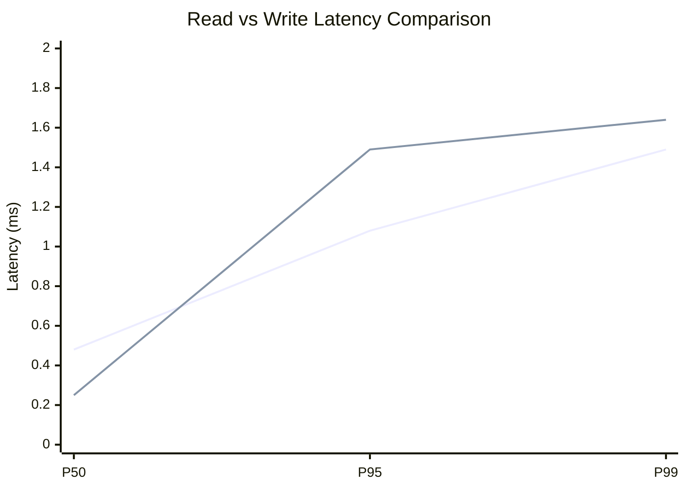
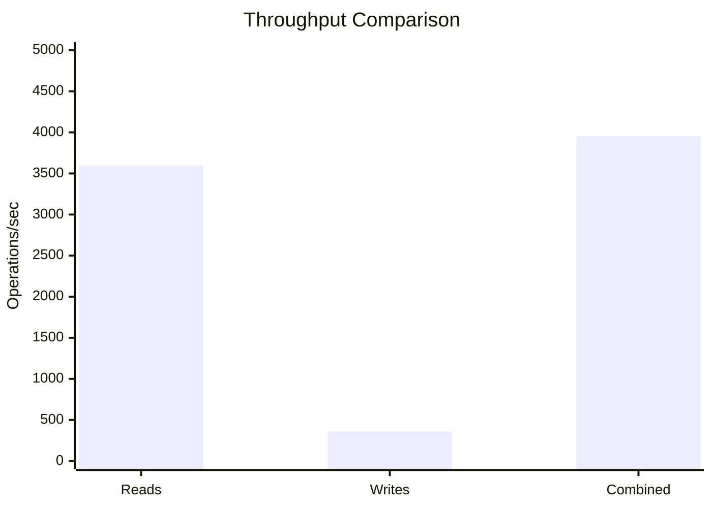
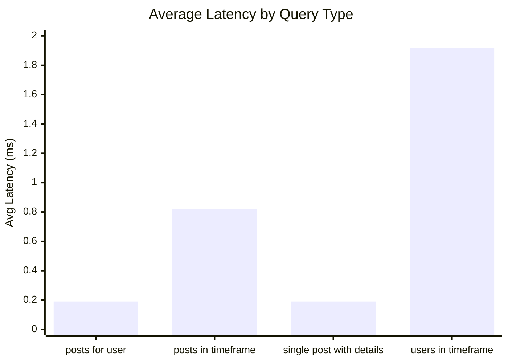
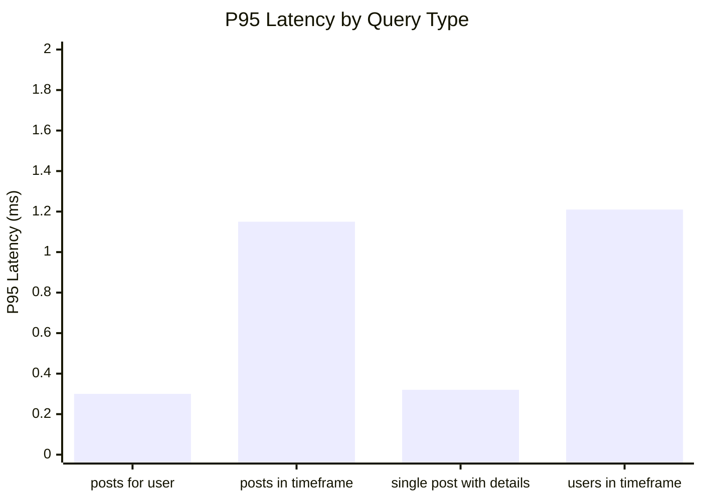
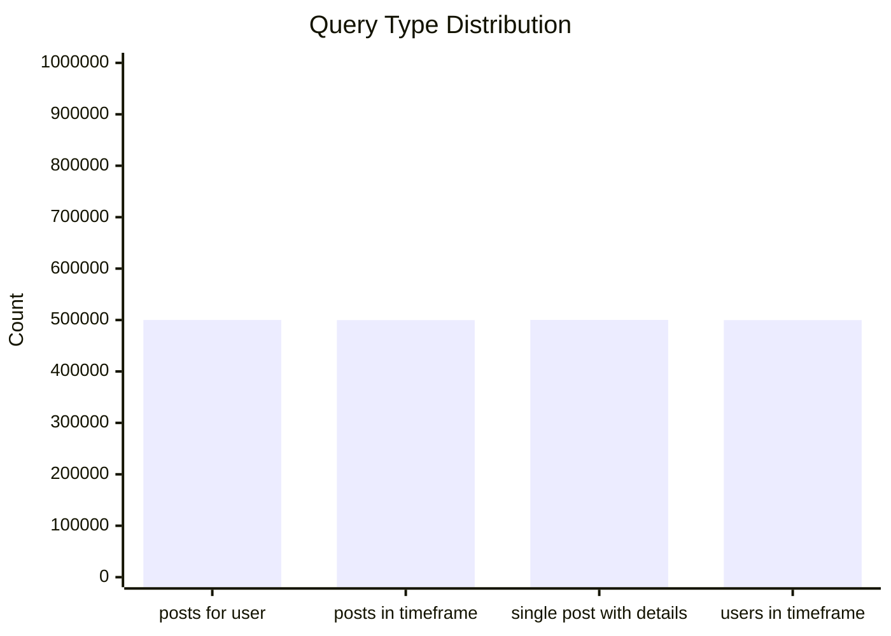
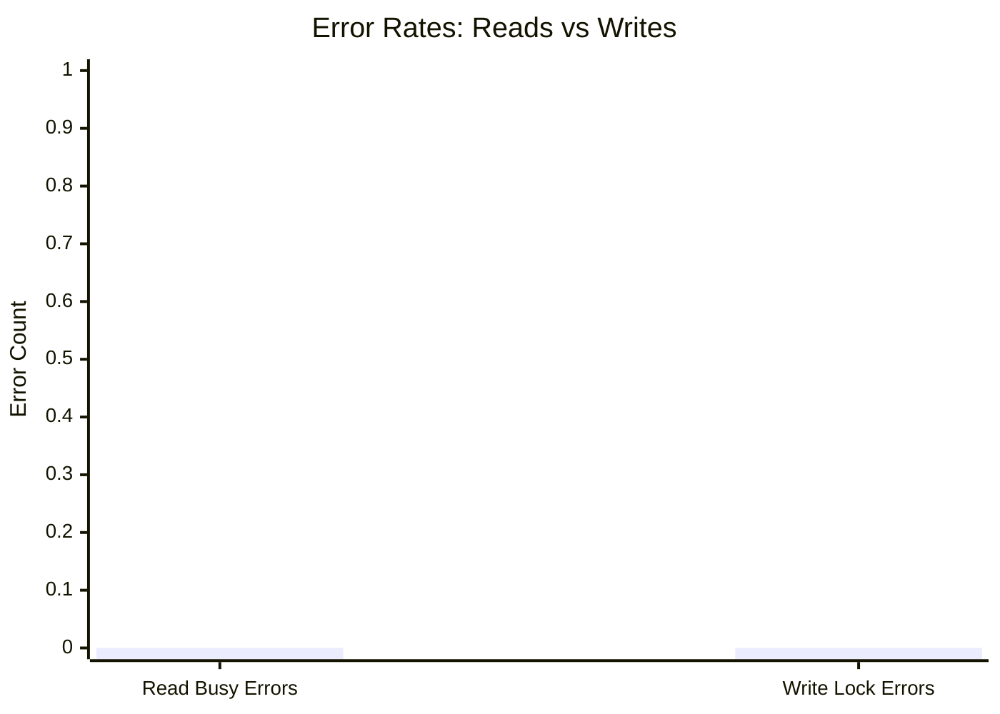
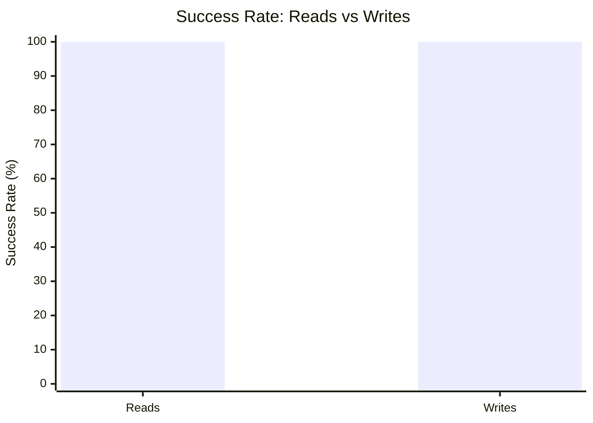

# Mixed Read/Write Benchmark: r10_w2_R2m_W200k_c8mb

**Test Run:** 12/25/2025, 3:45:23 PM

## Configuration

| Setting | Value |
|---------|-------|
| ID | r10_w2_R2m_W200k_c8mb |
| Read Workers | 10 |
| Write Workers | 2 |
| Total Reads | 2,000,000 |
| Total Writes | 200,000 |
| Total Operations | 2,200,000 |
| Read:Write Ratio | 10.0:1 |
| Cache Size | 8000 KB (8 MB) |

## Summary

| Metric | Reads | Writes | Combined |
|--------|-------|--------|----------|
| Total | 2,000,000 | 200,000 | 2,200,000 |
| Successful | 2,000,000 | 200,000 | - |
| Success Rate | 100.0% | 100.0% | - |
| Throughput | 3595/sec | 359/sec | 3954/sec |
| Avg Latency | 0.78ms | 0.63ms | - |
| P50 Latency | 0.48ms | 0.25ms | - |
| P95 Latency | 1.08ms | 1.49ms | - |
| P99 Latency | 1.49ms | 1.64ms | - |
| Errors | 0 (busy: 0) | 0 (lock: 0) | - |

**Total Duration:** 556.35 seconds

## Read Query Breakdown

| Query Type | Count | Avg (ms) | P95 (ms) | P99 (ms) | Avg Rows |
|------------|-------|----------|----------|----------|----------|
| posts_for_user | 500,078 | 0.19 | 0.30 | 0.40 | 0.8 |
| posts_in_timeframe | 499,842 | 0.82 | 1.15 | 1.61 | 100.0 |
| single_post_with_details | 500,232 | 0.19 | 0.32 | 0.43 | 5.0 |
| users_in_timeframe | 499,848 | 1.92 | 1.21 | 47.35 | 617.6 |


## Charts

### Read vs Write Latency Comparison

This chart compares latency percentiles (P50, P95, P99) between read and write operations. It shows how read and write latencies differ under concurrent load.



### Throughput Comparison

This chart compares the throughput of reads, writes, and combined operations. It shows the relative performance of read vs write operations.



### Average Latency by Query Type

This chart shows the average latency for each read query type. It helps identify which queries are the slowest.



### P95 Latency by Query Type

This chart shows the P95 latency (95th percentile) for each read query type. It highlights the worst-case performance for each query type.



### Query Type Distribution

This chart shows the distribution of query types executed during the test. It helps verify that queries are evenly distributed.



### Error Rates

This chart compares error rates between reads (SQLITE_BUSY errors) and writes (lock errors). It helps identify contention issues.



### Success Rate Comparison

This chart compares the success rate of read vs write operations. Both should ideally be at 100%.



## Key Observations

### Read Performance
- **2,000,000** successful reads out of 2,000,000 (100.0% success rate)
- Average read latency: **0.78ms**, P99: **1.49ms**
- Read throughput: **3595 reads/sec**
- ✅ No busy errors during reads (WAL mode working well)

### Write Performance
- **200,000** successful writes out of 200,000 (100.0% success rate)
- Average write latency: **0.63ms**, P99: **1.64ms**
- Write throughput: **359 writes/sec**
- ✅ No lock errors during writes

### Combined Throughput
- Total operations completed: **2,200,000**
- Combined throughput: **3954 ops/sec**

## Raw Data

<details>
<summary>Click to expand raw JSON data</summary>

```json
{
  "testName": "mixedReadWrite-r10_w2_R2m_W200k_c8mb",
  "timestamp": "2025-12-25T10:15:23.015Z",
  "configuration": {
    "id": "r10_w2_R2m_W200k_c8mb",
    "readWorkers": 10,
    "writeWorkers": 2,
    "readsPerWorker": 200000,
    "writesPerWorker": 100000,
    "totalReads": 2000000,
    "totalWrites": 200000,
    "totalOperations": 2200000,
    "readWriteRatio": 10,
    "cacheSize": 8000
  },
  "duration": 556350.135191,
  "reads": {
    "total": 2000000,
    "successful": 2000000,
    "errors": 0,
    "busyErrors": 0,
    "successRate": 100,
    "avgTime": 0.776124644726776,
    "minTime": 0.04880100000082166,
    "maxTime": 304.1384400000097,
    "p50": 0.47731100002420135,
    "p95": 1.0786490000318736,
    "p99": 1.4895240000332706,
    "readsPerSec": 3594.8584775905233,
    "byQueryType": {
      "posts_for_user": {
        "count": 500078,
        "avgTime": 0.18557849718048294,
        "p95": 0.29715300002135336,
        "p99": 0.3972300000023097,
        "avgRowCount": 0.8242494170909338
      },
      "posts_in_timeframe": {
        "count": 499842,
        "avgTime": 0.8172291329260564,
        "p95": 1.1492229999857955,
        "p99": 1.611906000005547,
        "avgRowCount": 100
      },
      "single_post_with_details": {
        "count": 500232,
        "avgTime": 0.18508872249077668,
        "p95": 0.31871800002409145,
        "p99": 0.43497199995908886,
        "avgRowCount": 4.998732588079132
      },
      "users_in_timeframe": {
        "count": 499848,
        "avgTime": 1.9173285071681685,
        "p95": 1.2133810000959784,
        "p99": 47.34888900001533,
        "avgRowCount": 617.6438557321426
      }
    }
  },
  "writes": {
    "total": 200000,
    "successful": 200000,
    "errors": 0,
    "lockErrors": 0,
    "successRate": 100,
    "avgTime": 0.6329618097749854,
    "minTime": 0.06554000003961846,
    "maxTime": 113.50352500000736,
    "p50": 0.25130600002012216,
    "p95": 1.4949840000044787,
    "p99": 1.6425410000083502,
    "writesPerSec": 359.4858477590523
  },
  "combined": {
    "totalOps": 2200000,
    "opsPerSec": 3954.344325349576
  }
}
```

</details>
