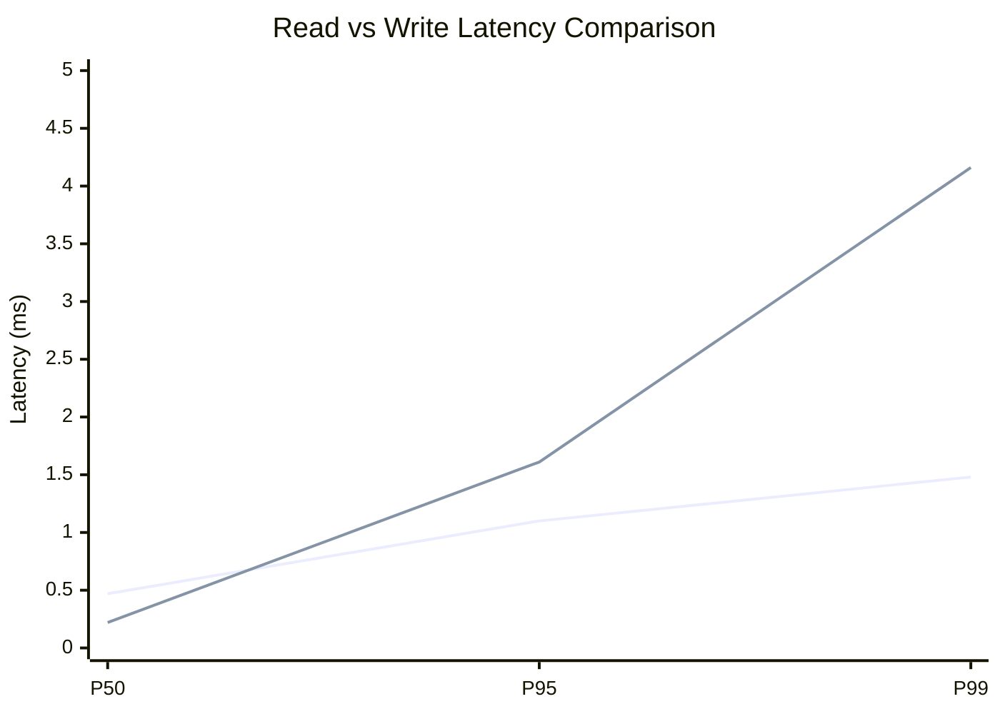
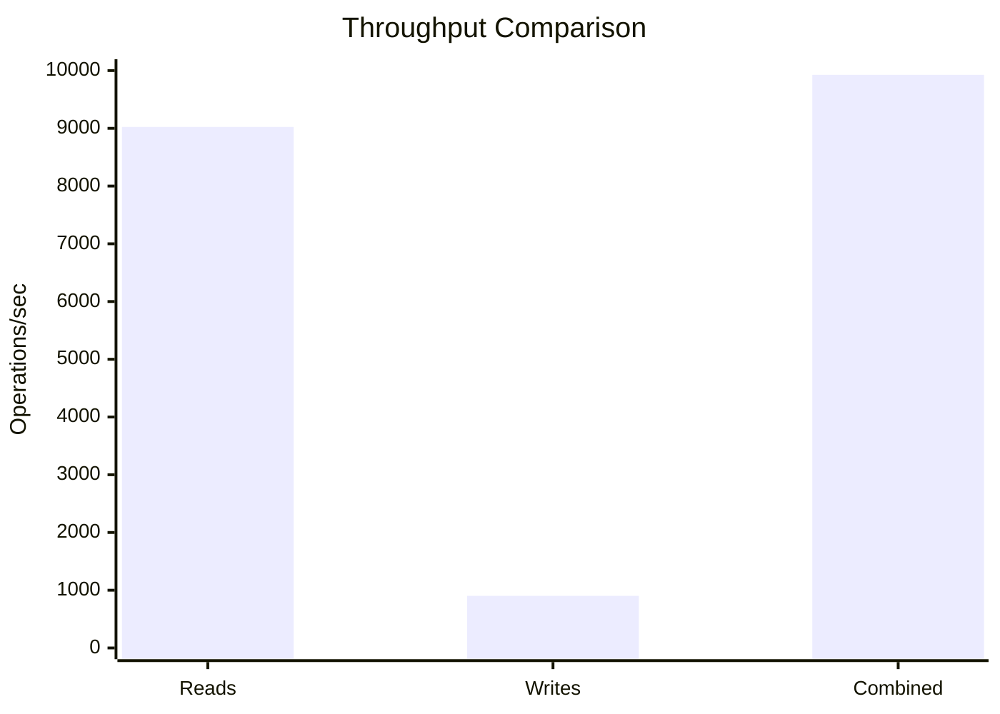
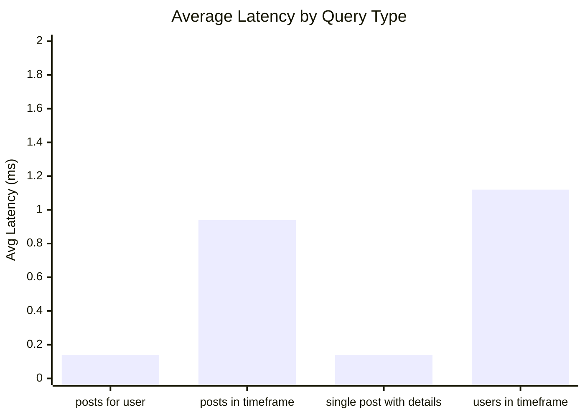
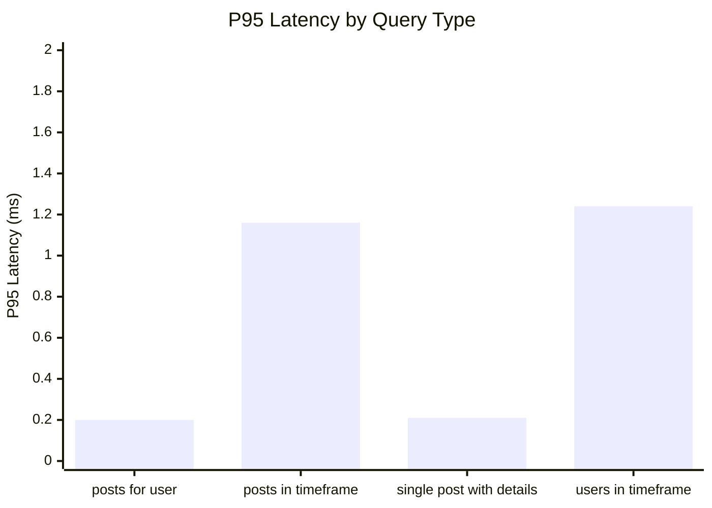
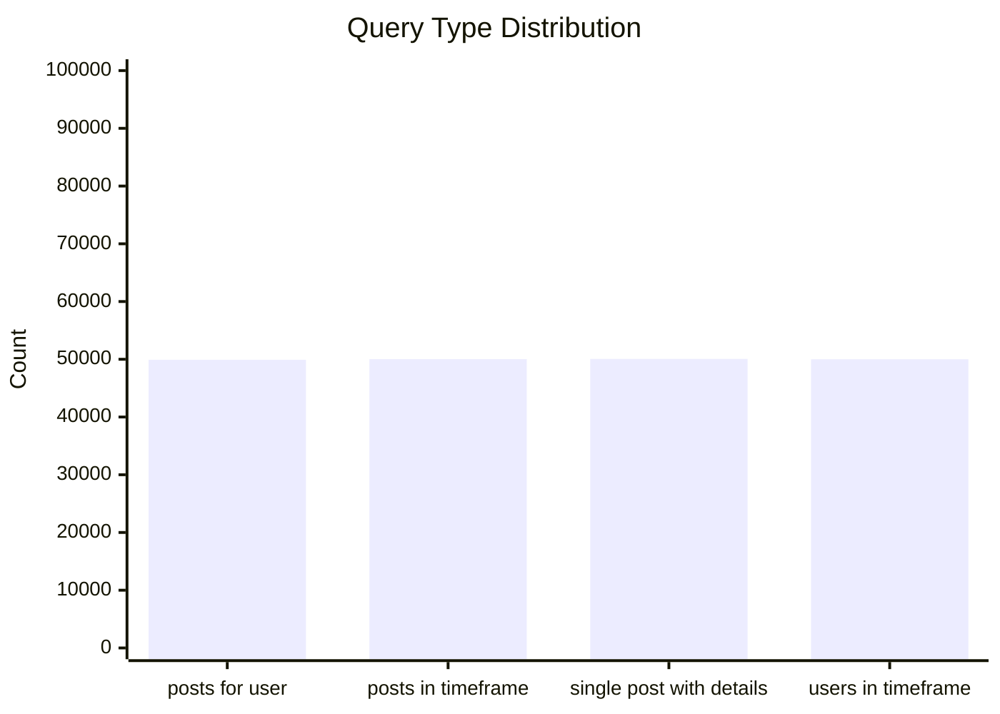
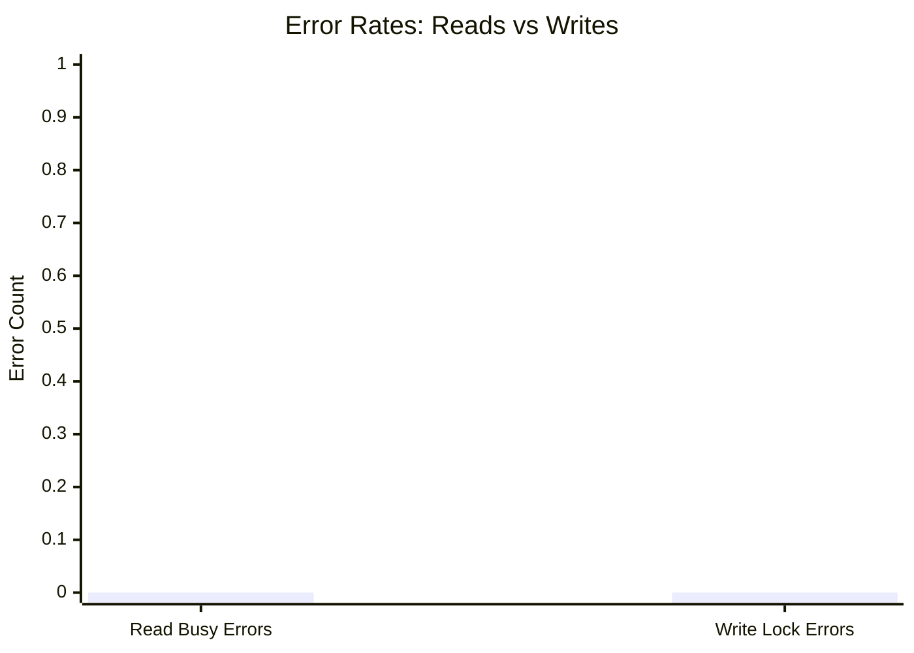
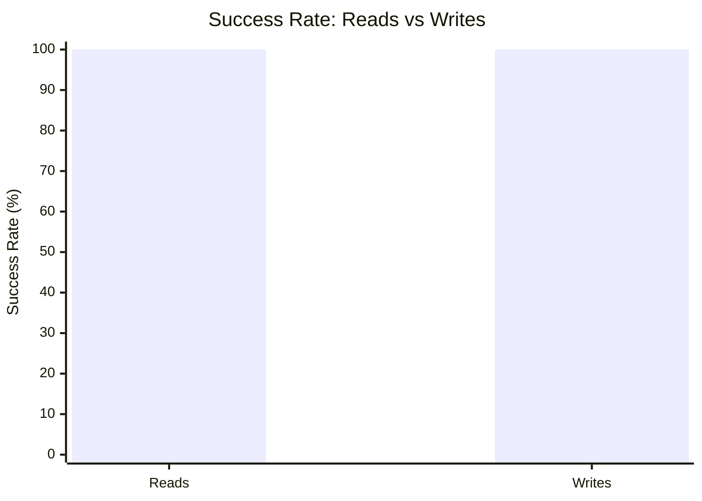

# Mixed Read/Write Benchmark: r11_w2_R200k_W20k_c48mb

**Test Run:** 12/25/2025, 6:13:07 PM

## Configuration

| Setting | Value |
|---------|-------|
| ID | r11_w2_R200k_W20k_c48mb |
| Read Workers | 11 |
| Write Workers | 2 |
| Total Reads | 200,002 |
| Total Writes | 20,000 |
| Total Operations | 220,002 |
| Read:Write Ratio | 10.0:1 |
| Cache Size | 48000 KB (48 MB) |

## Summary

| Metric | Reads | Writes | Combined |
|--------|-------|--------|----------|
| Total | 200,002 | 20,000 | 220,002 |
| Successful | 200,002 | 20,000 | - |
| Success Rate | 100.0% | 100.0% | - |
| Throughput | 9024/sec | 902/sec | 9926/sec |
| Avg Latency | 0.59ms | 0.60ms | - |
| P50 Latency | 0.47ms | 0.22ms | - |
| P95 Latency | 1.10ms | 1.61ms | - |
| P99 Latency | 1.48ms | 4.16ms | - |
| Errors | 0 (busy: 0) | 0 (lock: 0) | - |

**Total Duration:** 22.16 seconds

## Read Query Breakdown

| Query Type | Count | Avg (ms) | P95 (ms) | P99 (ms) | Avg Rows |
|------------|-------|----------|----------|----------|----------|
| posts_for_user | 49,914 | 0.14 | 0.20 | 0.26 | 0.3 |
| posts_in_timeframe | 50,031 | 0.94 | 1.16 | 1.50 | 100.0 |
| single_post_with_details | 50,055 | 0.14 | 0.21 | 0.28 | 1.4 |
| users_in_timeframe | 50,002 | 1.12 | 1.24 | 9.21 | 257.1 |


## Charts

### Read vs Write Latency Comparison

This chart compares latency percentiles (P50, P95, P99) between read and write operations. It shows how read and write latencies differ under concurrent load.



### Throughput Comparison

This chart compares the throughput of reads, writes, and combined operations. It shows the relative performance of read vs write operations.



### Average Latency by Query Type

This chart shows the average latency for each read query type. It helps identify which queries are the slowest.



### P95 Latency by Query Type

This chart shows the P95 latency (95th percentile) for each read query type. It highlights the worst-case performance for each query type.



### Query Type Distribution

This chart shows the distribution of query types executed during the test. It helps verify that queries are evenly distributed.



### Error Rates

This chart compares error rates between reads (SQLITE_BUSY errors) and writes (lock errors). It helps identify contention issues.



### Success Rate Comparison

This chart compares the success rate of read vs write operations. Both should ideally be at 100%.



## Key Observations

### Read Performance
- **200,002** successful reads out of 200,002 (100.0% success rate)
- Average read latency: **0.59ms**, P99: **1.48ms**
- Read throughput: **9024 reads/sec**
- ✅ No busy errors during reads (WAL mode working well)

### Write Performance
- **20,000** successful writes out of 20,000 (100.0% success rate)
- Average write latency: **0.60ms**, P99: **4.16ms**
- Write throughput: **902 writes/sec**
- ✅ No lock errors during writes

### Combined Throughput
- Total operations completed: **220,002**
- Combined throughput: **9926 ops/sec**

## Raw Data

<details>
<summary>Click to expand raw JSON data</summary>

```json
{
  "testName": "mixedReadWrite-r11_w2_R200k_W20k_c48mb",
  "timestamp": "2025-12-25T12:43:07.157Z",
  "configuration": {
    "id": "r11_w2_R200k_W20k_c48mb",
    "readWorkers": 11,
    "writeWorkers": 2,
    "readsPerWorker": 18182,
    "writesPerWorker": 10000,
    "totalReads": 200002,
    "totalWrites": 20000,
    "totalOperations": 220002,
    "readWriteRatio": 10.0001,
    "cacheSize": 48000
  },
  "duration": 22163.87279,
  "reads": {
    "total": 200002,
    "successful": 200002,
    "errors": 0,
    "busyErrors": 0,
    "successRate": 100,
    "avgTime": 0.5860930239047609,
    "minTime": 0.04649399999925663,
    "maxTime": 22.252300000000105,
    "p50": 0.4746110000014596,
    "p95": 1.0980369999997492,
    "p99": 1.4778610000012122,
    "readsPerSec": 9023.783970202077,
    "byQueryType": {
      "posts_for_user": {
        "count": 49914,
        "avgTime": 0.13581713240773668,
        "p95": 0.19721800000115763,
        "p99": 0.26456900000084715,
        "avgRowCount": 0.3297471651240133
      },
      "posts_in_timeframe": {
        "count": 50031,
        "avgTime": 0.9443548437368864,
        "p95": 1.1601710000013554,
        "p99": 1.4999760000000606,
        "avgRowCount": 100
      },
      "single_post_with_details": {
        "count": 50055,
        "avgTime": 0.14194323859754027,
        "p95": 0.2061390000017127,
        "p99": 0.2843159999993077,
        "avgRowCount": 1.3899310758166017
      },
      "users_in_timeframe": {
        "count": 50002,
        "avgTime": 1.121727423403092,
        "p95": 1.2364379999999073,
        "p99": 9.212384000000384,
        "avgRowCount": 257.0862965481381
      }
    }
  },
  "writes": {
    "total": 20000,
    "successful": 20000,
    "errors": 0,
    "lockErrors": 0,
    "successRate": 100,
    "avgTime": 0.6002061921500055,
    "minTime": 0.08242799999970885,
    "maxTime": 109.26241300000038,
    "p50": 0.22483100000044942,
    "p95": 1.6137030000008963,
    "p99": 4.164871999999377,
    "writesPerSec": 902.3693733264745
  },
  "combined": {
    "totalOps": 220002,
    "opsPerSec": 9926.153343528551
  }
}
```

</details>
