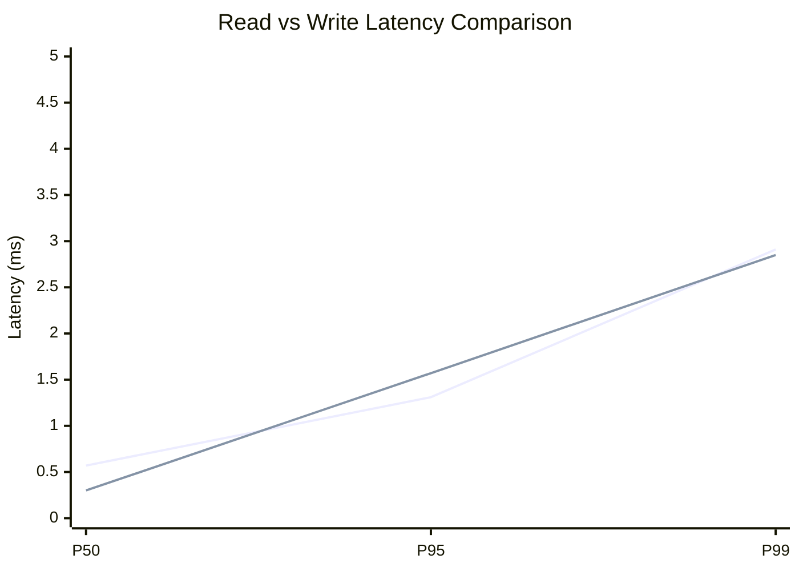
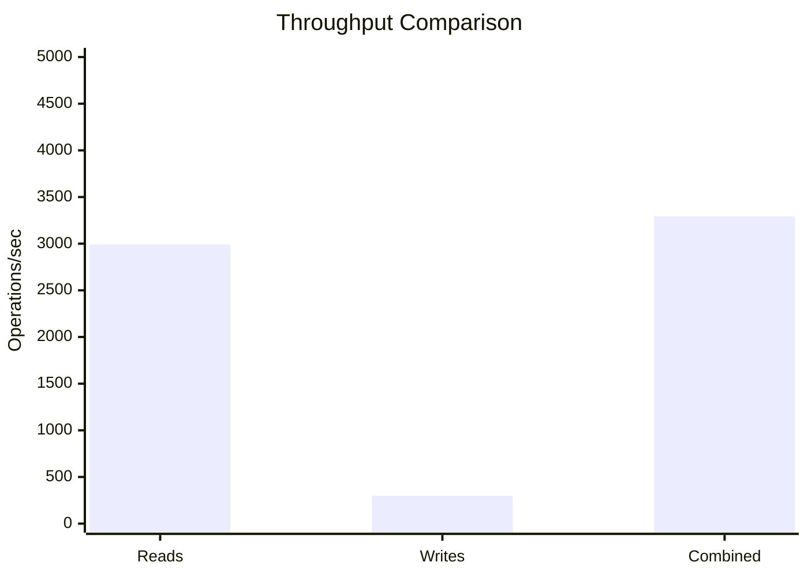
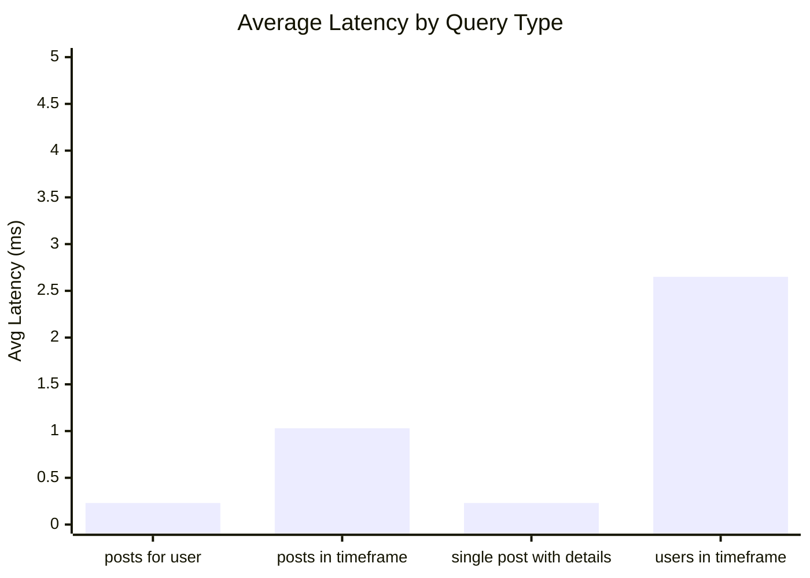
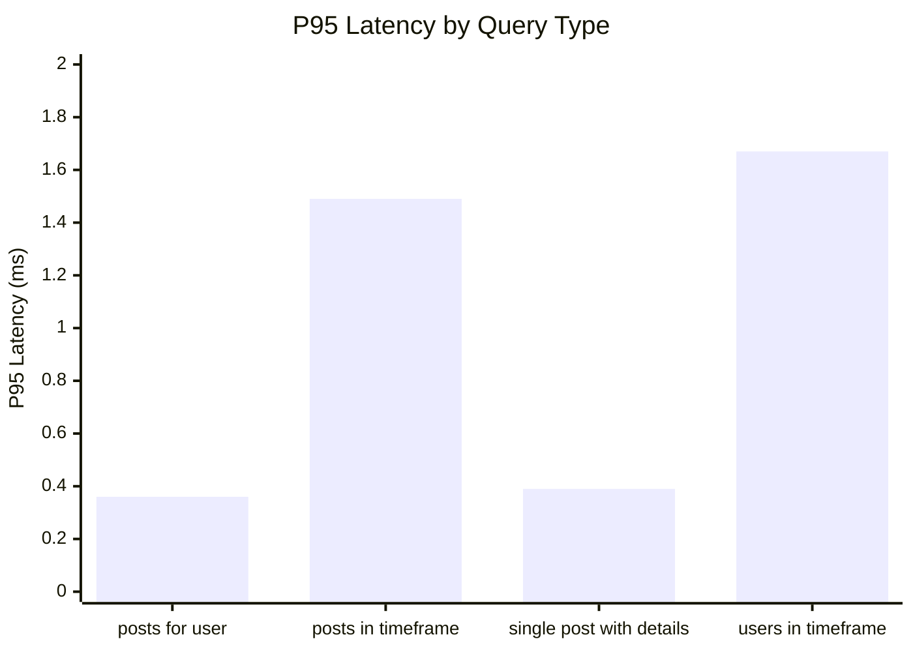
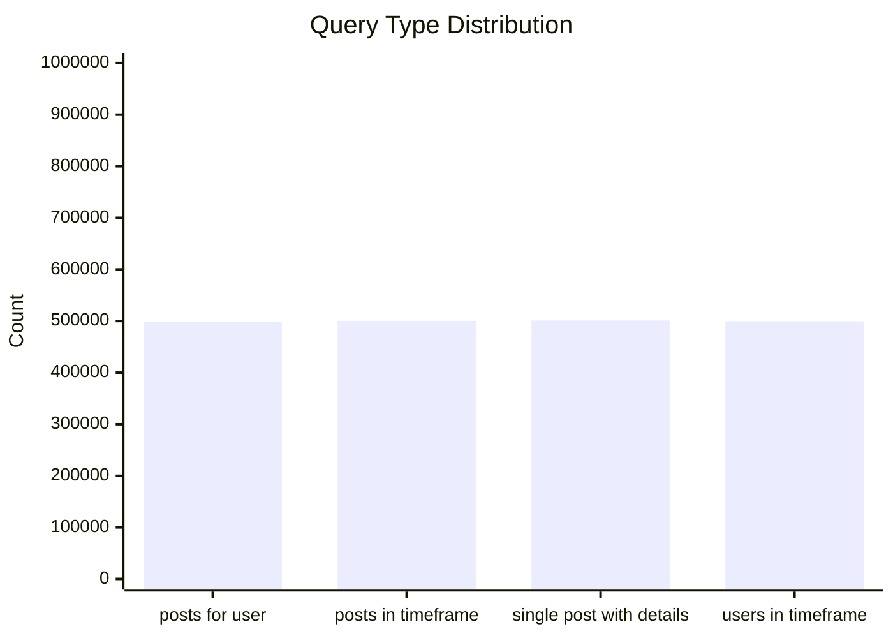
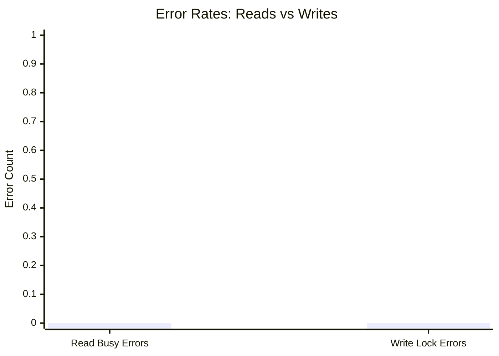
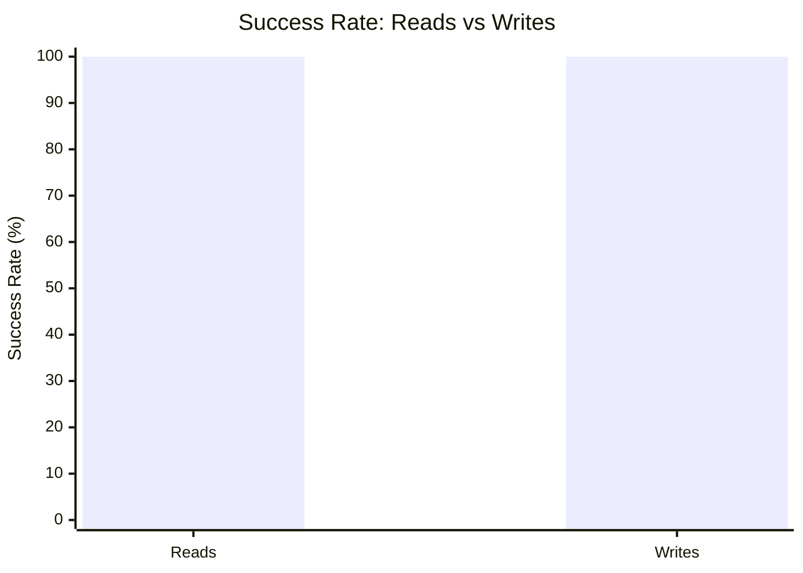

# Mixed Read/Write Benchmark: r12_w2_R2m_W200k_c100mb

**Test Run:** 12/25/2025, 4:48:45 PM

## Configuration

| Setting | Value |
|---------|-------|
| ID | r12_w2_R2m_W200k_c100mb |
| Read Workers | 12 |
| Write Workers | 2 |
| Total Reads | 2,000,004 |
| Total Writes | 200,000 |
| Total Operations | 2,200,004 |
| Read:Write Ratio | 10.0:1 |
| Cache Size | 100000 KB (100 MB) |

## Summary

| Metric | Reads | Writes | Combined |
|--------|-------|--------|----------|
| Total | 2,000,004 | 200,000 | 2,200,004 |
| Successful | 2,000,004 | 200,000 | - |
| Success Rate | 100.0% | 100.0% | - |
| Throughput | 2992/sec | 299/sec | 3292/sec |
| Avg Latency | 1.04ms | 0.70ms | - |
| P50 Latency | 0.57ms | 0.30ms | - |
| P95 Latency | 1.31ms | 1.57ms | - |
| P99 Latency | 2.91ms | 2.85ms | - |
| Errors | 0 (busy: 0) | 0 (lock: 0) | - |

**Total Duration:** 668.38 seconds

## Read Query Breakdown

| Query Type | Count | Avg (ms) | P95 (ms) | P99 (ms) | Avg Rows |
|------------|-------|----------|----------|----------|----------|
| posts_for_user | 499,021 | 0.23 | 0.36 | 0.67 | 0.8 |
| posts_in_timeframe | 500,292 | 1.03 | 1.49 | 3.10 | 100.0 |
| single_post_with_details | 500,993 | 0.23 | 0.39 | 0.68 | 4.7 |
| users_in_timeframe | 499,698 | 2.65 | 1.67 | 70.65 | 637.9 |


## Charts

### Read vs Write Latency Comparison

This chart compares latency percentiles (P50, P95, P99) between read and write operations. It shows how read and write latencies differ under concurrent load.



### Throughput Comparison

This chart compares the throughput of reads, writes, and combined operations. It shows the relative performance of read vs write operations.



### Average Latency by Query Type

This chart shows the average latency for each read query type. It helps identify which queries are the slowest.



### P95 Latency by Query Type

This chart shows the P95 latency (95th percentile) for each read query type. It highlights the worst-case performance for each query type.



### Query Type Distribution

This chart shows the distribution of query types executed during the test. It helps verify that queries are evenly distributed.



### Error Rates

This chart compares error rates between reads (SQLITE_BUSY errors) and writes (lock errors). It helps identify contention issues.



### Success Rate Comparison

This chart compares the success rate of read vs write operations. Both should ideally be at 100%.



## Key Observations

### Read Performance
- **2,000,004** successful reads out of 2,000,004 (100.0% success rate)
- Average read latency: **1.04ms**, P99: **2.91ms**
- Read throughput: **2992 reads/sec**
- ✅ No busy errors during reads (WAL mode working well)

### Write Performance
- **200,000** successful writes out of 200,000 (100.0% success rate)
- Average write latency: **0.70ms**, P99: **2.85ms**
- Write throughput: **299 writes/sec**
- ✅ No lock errors during writes

### Combined Throughput
- Total operations completed: **2,200,004**
- Combined throughput: **3292 ops/sec**

## Raw Data

<details>
<summary>Click to expand raw JSON data</summary>

```json
{
  "testName": "mixedReadWrite-r12_w2_R2m_W200k_c100mb",
  "timestamp": "2025-12-25T11:18:45.321Z",
  "configuration": {
    "id": "r12_w2_R2m_W200k_c100mb",
    "readWorkers": 12,
    "writeWorkers": 2,
    "readsPerWorker": 166667,
    "writesPerWorker": 100000,
    "totalReads": 2000004,
    "totalWrites": 200000,
    "totalOperations": 2200004,
    "readWriteRatio": 10.00002,
    "cacheSize": 100000
  },
  "duration": 668378.442236,
  "reads": {
    "total": 2000004,
    "successful": 2000004,
    "errors": 0,
    "busyErrors": 0,
    "successRate": 100,
    "avgTime": 1.0351445409449562,
    "minTime": 0.052671000001282664,
    "maxTime": 459.29906500002835,
    "p50": 0.5658649999968475,
    "p95": 1.311238000052981,
    "p99": 2.9078309999313205,
    "readsPerSec": 2992.322722601834,
    "byQueryType": {
      "posts_for_user": {
        "count": 499021,
        "avgTime": 0.22638324168924515,
        "p95": 0.35550700000021607,
        "p99": 0.6693560000276193,
        "avgRowCount": 0.7822436330334795
      },
      "posts_in_timeframe": {
        "count": 500292,
        "avgTime": 1.0336571933151568,
        "p95": 1.490996999957133,
        "p99": 3.0965240000514314,
        "avgRowCount": 100
      },
      "single_post_with_details": {
        "count": 500993,
        "avgTime": 0.22923310073195344,
        "p95": 0.3853320000343956,
        "p99": 0.6798439999693073,
        "avgRowCount": 4.683847878114065
      },
      "users_in_timeframe": {
        "count": 499698,
        "avgTime": 2.6522992435910795,
        "p95": 1.6695839999010786,
        "p99": 70.64839599997504,
        "avgRowCount": 637.9371960664241
      }
    }
  },
  "writes": {
    "total": 200000,
    "successful": 200000,
    "errors": 0,
    "lockErrors": 0,
    "successRate": 100,
    "avgTime": 0.698180410204963,
    "minTime": 0.07529399998020381,
    "maxTime": 148.95292000001064,
    "p50": 0.30306399999244604,
    "p95": 1.5664289999986067,
    "p99": 2.854859999992186,
    "writesPerSec": 299.2316737968358
  },
  "combined": {
    "totalOps": 2200004,
    "opsPerSec": 3291.5543963986697
  }
}
```

</details>
