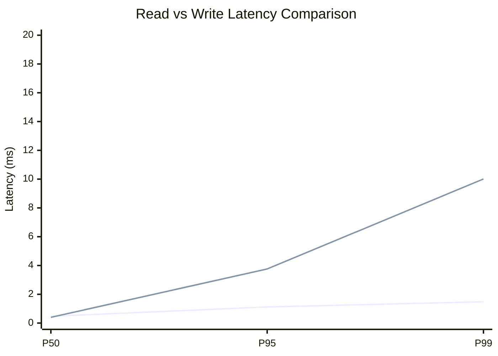
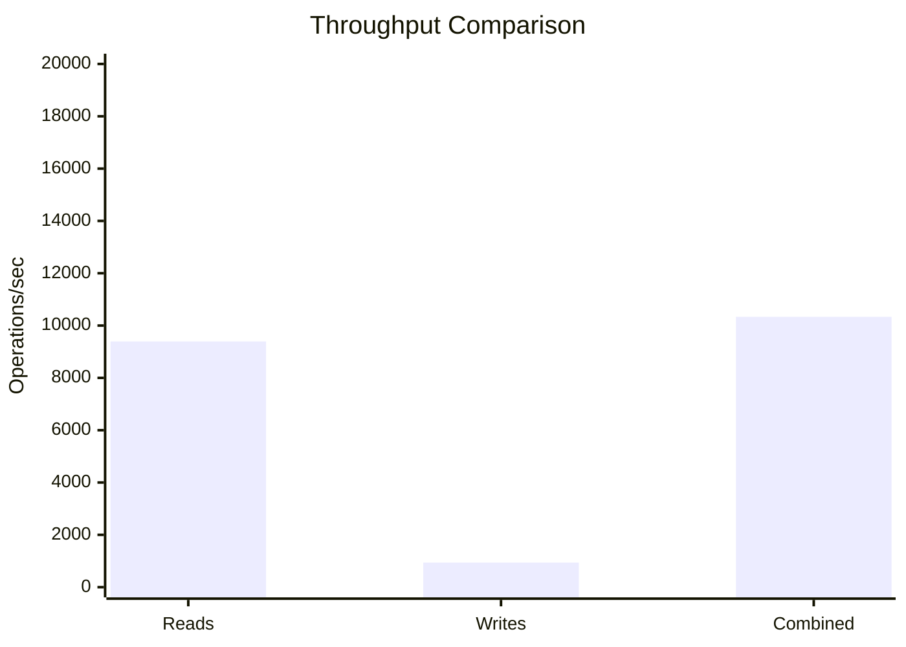
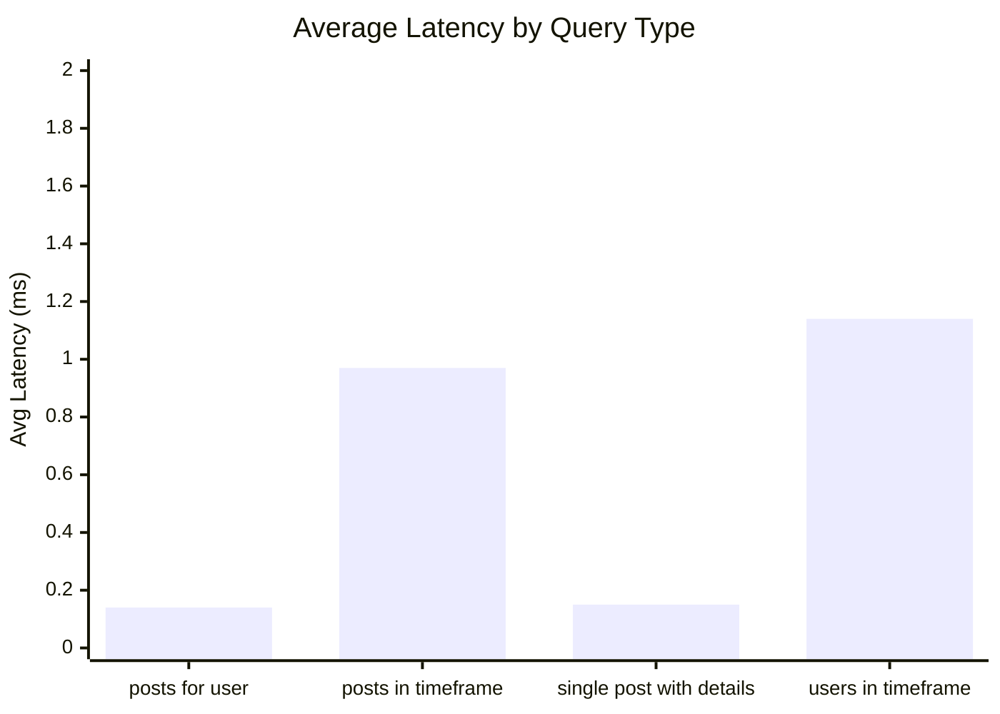
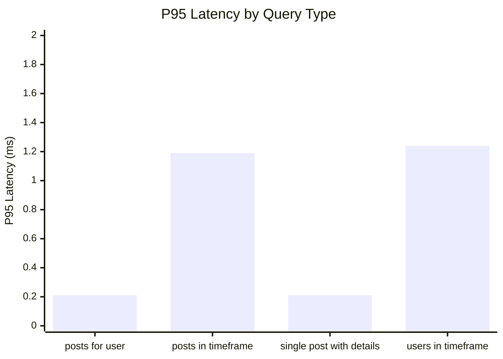
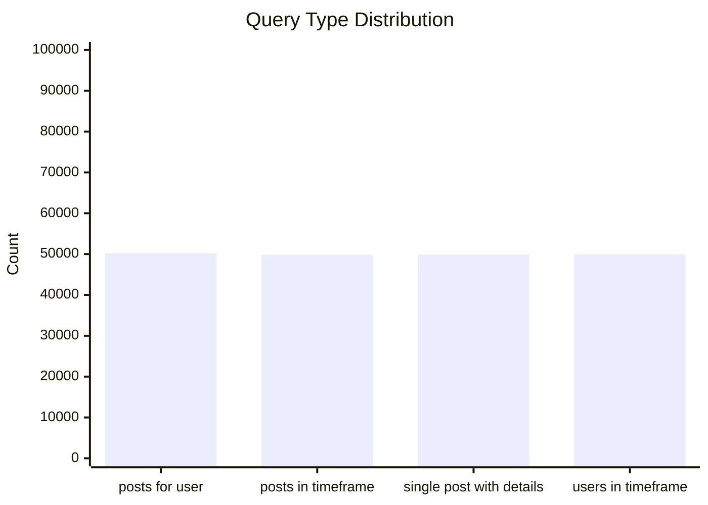
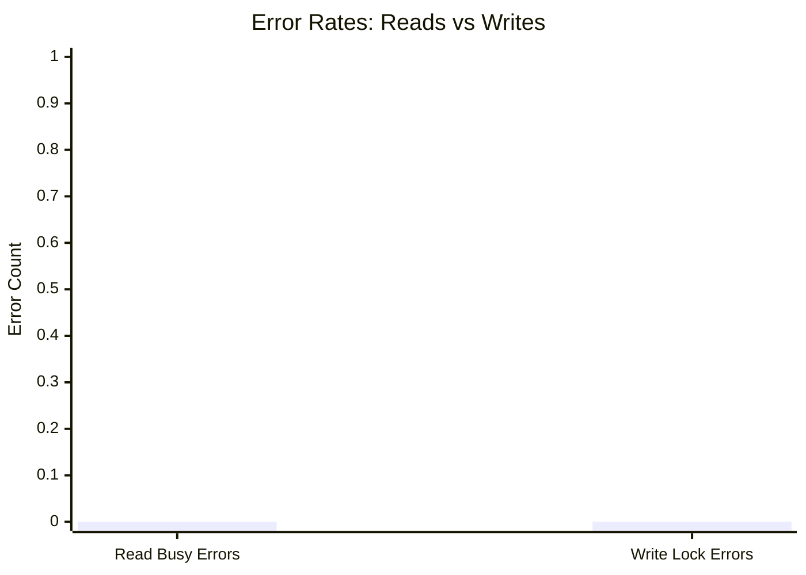
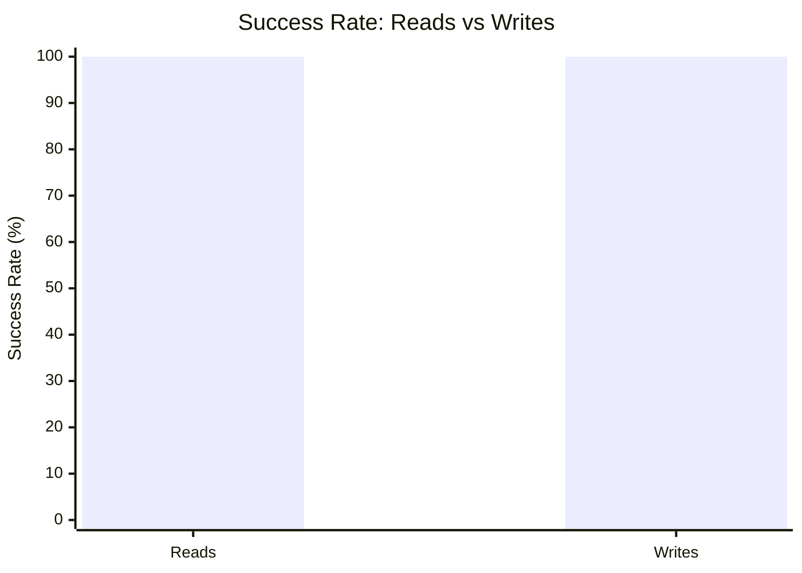

# Mixed Read/Write Benchmark: r12_w3_R200k_W20k_c48mb

**Test Run:** 12/25/2025, 6:13:40 PM

## Configuration

| Setting | Value |
|---------|-------|
| ID | r12_w3_R200k_W20k_c48mb |
| Read Workers | 12 |
| Write Workers | 3 |
| Total Reads | 200,004 |
| Total Writes | 20,001 |
| Total Operations | 220,005 |
| Read:Write Ratio | 10.0:1 |
| Cache Size | 48000 KB (48 MB) |

## Summary

| Metric | Reads | Writes | Combined |
|--------|-------|--------|----------|
| Total | 200,004 | 20,001 | 220,005 |
| Successful | 200,004 | 20,001 | - |
| Success Rate | 100.0% | 100.0% | - |
| Throughput | 9394/sec | 939/sec | 10333/sec |
| Avg Latency | 0.60ms | 1.03ms | - |
| P50 Latency | 0.47ms | 0.40ms | - |
| P95 Latency | 1.12ms | 3.76ms | - |
| P99 Latency | 1.48ms | 10.01ms | - |
| Errors | 0 (busy: 0) | 0 (lock: 0) | - |

**Total Duration:** 21.29 seconds

## Read Query Breakdown

| Query Type | Count | Avg (ms) | P95 (ms) | P99 (ms) | Avg Rows |
|------------|-------|----------|----------|----------|----------|
| posts_for_user | 50,228 | 0.14 | 0.21 | 0.32 | 0.3 |
| posts_in_timeframe | 49,864 | 0.97 | 1.19 | 1.53 | 100.0 |
| single_post_with_details | 49,949 | 0.15 | 0.21 | 0.33 | 1.4 |
| users_in_timeframe | 49,963 | 1.14 | 1.24 | 9.79 | 257.6 |


## Charts

### Read vs Write Latency Comparison

This chart compares latency percentiles (P50, P95, P99) between read and write operations. It shows how read and write latencies differ under concurrent load.



### Throughput Comparison

This chart compares the throughput of reads, writes, and combined operations. It shows the relative performance of read vs write operations.



### Average Latency by Query Type

This chart shows the average latency for each read query type. It helps identify which queries are the slowest.



### P95 Latency by Query Type

This chart shows the P95 latency (95th percentile) for each read query type. It highlights the worst-case performance for each query type.



### Query Type Distribution

This chart shows the distribution of query types executed during the test. It helps verify that queries are evenly distributed.



### Error Rates

This chart compares error rates between reads (SQLITE_BUSY errors) and writes (lock errors). It helps identify contention issues.



### Success Rate Comparison

This chart compares the success rate of read vs write operations. Both should ideally be at 100%.



## Key Observations

### Read Performance
- **200,004** successful reads out of 200,004 (100.0% success rate)
- Average read latency: **0.60ms**, P99: **1.48ms**
- Read throughput: **9394 reads/sec**
- ✅ No busy errors during reads (WAL mode working well)

### Write Performance
- **20,001** successful writes out of 20,001 (100.0% success rate)
- Average write latency: **1.03ms**, P99: **10.01ms**
- Write throughput: **939 writes/sec**
- ✅ No lock errors during writes

### Combined Throughput
- Total operations completed: **220,005**
- Combined throughput: **10333 ops/sec**

## Raw Data

<details>
<summary>Click to expand raw JSON data</summary>

```json
{
  "testName": "mixedReadWrite-r12_w3_R200k_W20k_c48mb",
  "timestamp": "2025-12-25T12:43:40.075Z",
  "configuration": {
    "id": "r12_w3_R200k_W20k_c48mb",
    "readWorkers": 12,
    "writeWorkers": 3,
    "readsPerWorker": 16667,
    "writesPerWorker": 6667,
    "totalReads": 200004,
    "totalWrites": 20001,
    "totalOperations": 220005,
    "readWriteRatio": 9.99970001499925,
    "cacheSize": 48000
  },
  "duration": 21291.521372,
  "reads": {
    "total": 200004,
    "successful": 200004,
    "errors": 0,
    "busyErrors": 0,
    "successRate": 100,
    "avgTime": 0.5992244144017109,
    "minTime": 0.048166999999921245,
    "maxTime": 17.14829699999973,
    "p50": 0.4709609999990789,
    "p95": 1.1188739999997779,
    "p99": 1.478914999999688,
    "readsPerSec": 9393.598348637535,
    "byQueryType": {
      "posts_for_user": {
        "count": 50228,
        "avgTime": 0.13890948218125204,
        "p95": 0.20625899999959074,
        "p99": 0.3163400000003094,
        "avgRowCount": 0.3204587082901967
      },
      "posts_in_timeframe": {
        "count": 49864,
        "avgTime": 0.9703696214302957,
        "p95": 1.188521000000037,
        "p99": 1.5336399999996502,
        "avgRowCount": 100
      },
      "single_post_with_details": {
        "count": 49949,
        "avgTime": 0.14588606979118687,
        "p95": 0.21262399999977788,
        "p99": 0.3309769999996206,
        "avgRowCount": 1.4017698052013052
      },
      "users_in_timeframe": {
        "count": 49963,
        "avgTime": 1.1447823430138417,
        "p95": 1.2357969999993657,
        "p99": 9.785165000001143,
        "avgRowCount": 257.57898845145405
      }
    }
  },
  "writes": {
    "total": 20001,
    "successful": 20001,
    "errors": 0,
    "lockErrors": 0,
    "successRate": 100,
    "avgTime": 1.0334328848557588,
    "minTime": 0.07863100000031409,
    "maxTime": 134.35305300000027,
    "p50": 0.40103499999986525,
    "p95": 3.758969000000434,
    "p99": 10.008598000000347,
    "writesPerSec": 939.3880150951949
  },
  "combined": {
    "totalOps": 220005,
    "opsPerSec": 10332.98636373273
  }
}
```

</details>
