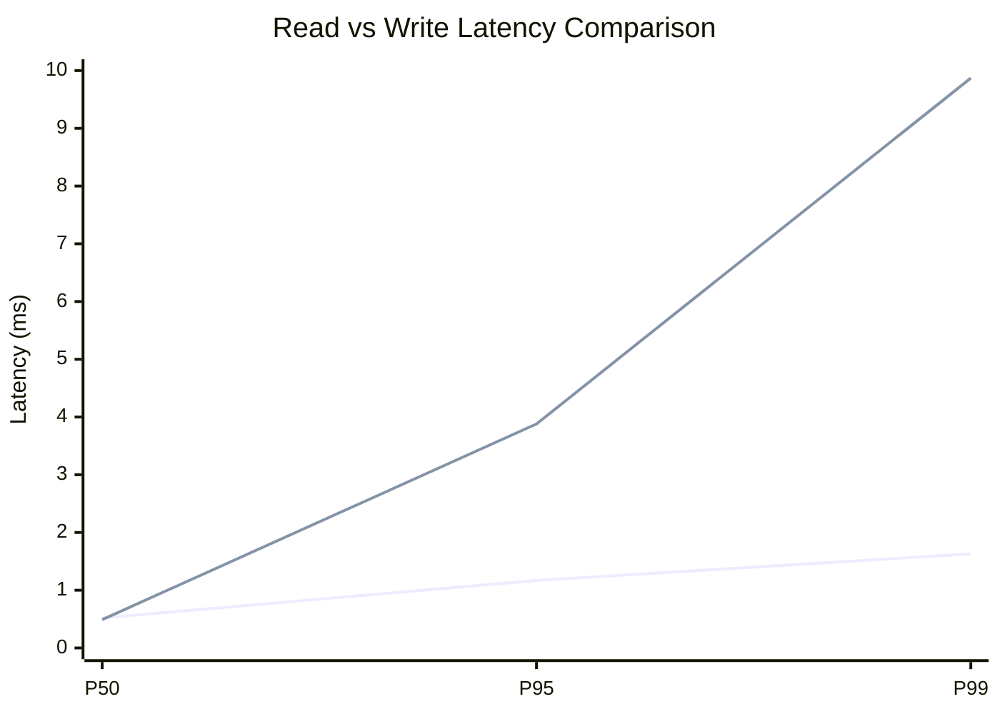
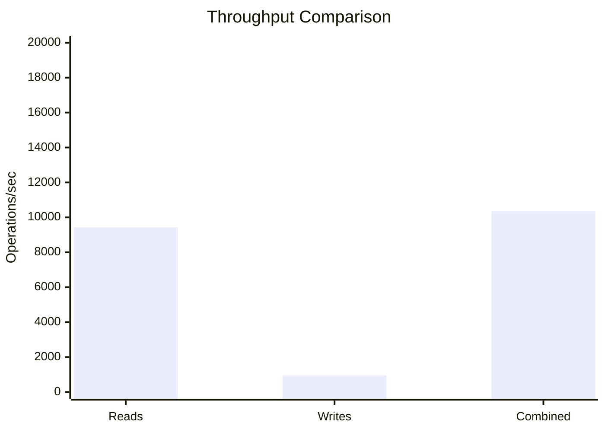
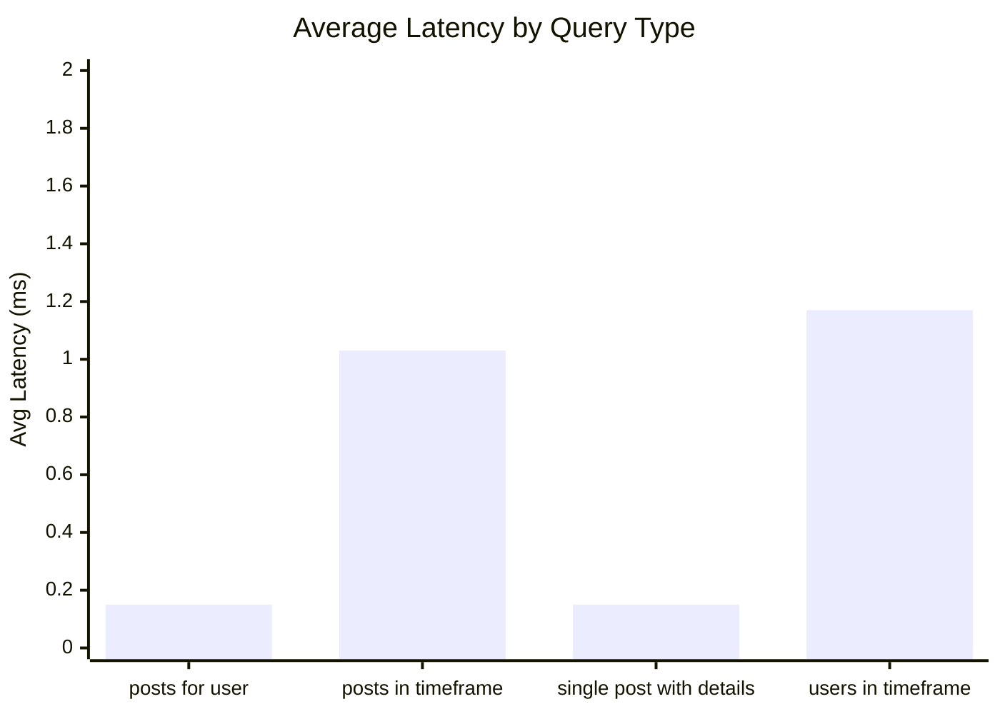
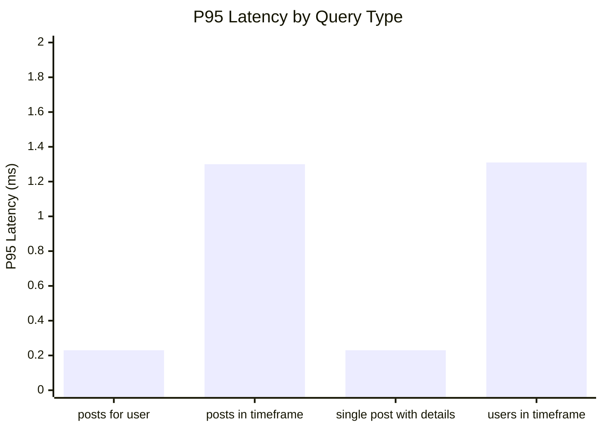
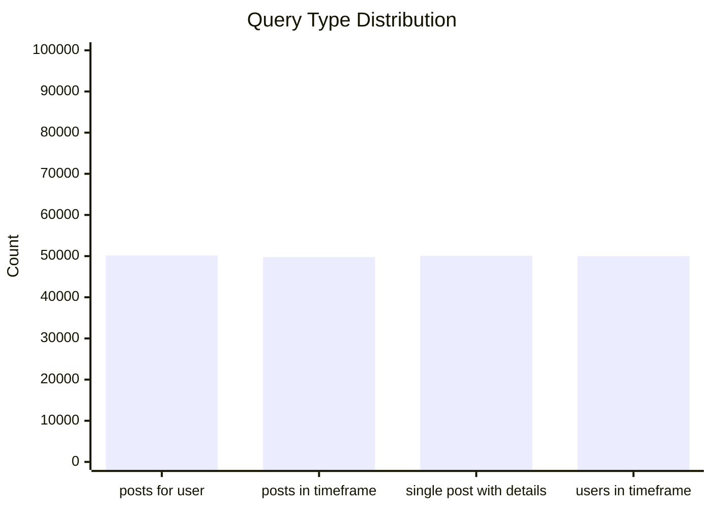
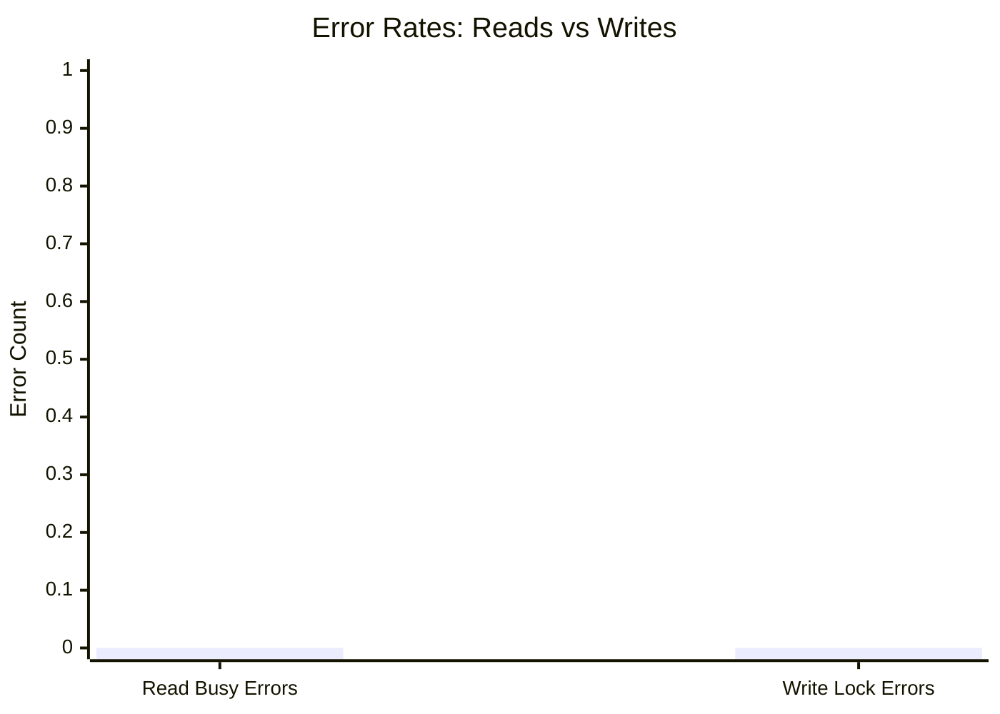
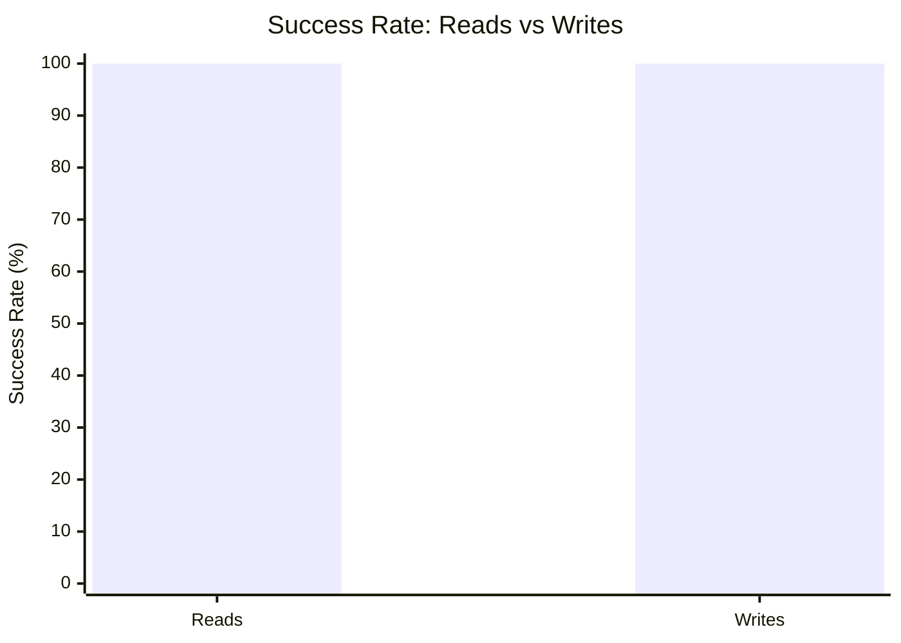

# Mixed Read/Write Benchmark: r13_w3_R200k_W20k_c48mb

**Test Run:** 12/25/2025, 6:14:09 PM

## Configuration

| Setting | Value |
|---------|-------|
| ID | r13_w3_R200k_W20k_c48mb |
| Read Workers | 13 |
| Write Workers | 3 |
| Total Reads | 200,005 |
| Total Writes | 20,001 |
| Total Operations | 220,006 |
| Read:Write Ratio | 10.0:1 |
| Cache Size | 48000 KB (48 MB) |

## Summary

| Metric | Reads | Writes | Combined |
|--------|-------|--------|----------|
| Total | 200,005 | 20,001 | 220,006 |
| Successful | 200,005 | 20,001 | - |
| Success Rate | 100.0% | 100.0% | - |
| Throughput | 9425/sec | 943/sec | 10368/sec |
| Avg Latency | 0.63ms | 1.04ms | - |
| P50 Latency | 0.52ms | 0.49ms | - |
| P95 Latency | 1.17ms | 3.88ms | - |
| P99 Latency | 1.63ms | 9.87ms | - |
| Errors | 0 (busy: 0) | 0 (lock: 0) | - |

**Total Duration:** 21.22 seconds

## Read Query Breakdown

| Query Type | Count | Avg (ms) | P95 (ms) | P99 (ms) | Avg Rows |
|------------|-------|----------|----------|----------|----------|
| posts_for_user | 50,144 | 0.15 | 0.23 | 0.40 | 0.3 |
| posts_in_timeframe | 49,771 | 1.03 | 1.30 | 1.71 | 100.0 |
| single_post_with_details | 50,076 | 0.15 | 0.23 | 0.41 | 1.4 |
| users_in_timeframe | 50,014 | 1.17 | 1.31 | 9.65 | 243.6 |


## Charts

### Read vs Write Latency Comparison

This chart compares latency percentiles (P50, P95, P99) between read and write operations. It shows how read and write latencies differ under concurrent load.



### Throughput Comparison

This chart compares the throughput of reads, writes, and combined operations. It shows the relative performance of read vs write operations.



### Average Latency by Query Type

This chart shows the average latency for each read query type. It helps identify which queries are the slowest.



### P95 Latency by Query Type

This chart shows the P95 latency (95th percentile) for each read query type. It highlights the worst-case performance for each query type.



### Query Type Distribution

This chart shows the distribution of query types executed during the test. It helps verify that queries are evenly distributed.



### Error Rates

This chart compares error rates between reads (SQLITE_BUSY errors) and writes (lock errors). It helps identify contention issues.



### Success Rate Comparison

This chart compares the success rate of read vs write operations. Both should ideally be at 100%.



## Key Observations

### Read Performance
- **200,005** successful reads out of 200,005 (100.0% success rate)
- Average read latency: **0.63ms**, P99: **1.63ms**
- Read throughput: **9425 reads/sec**
- ✅ No busy errors during reads (WAL mode working well)

### Write Performance
- **20,001** successful writes out of 20,001 (100.0% success rate)
- Average write latency: **1.04ms**, P99: **9.87ms**
- Write throughput: **943 writes/sec**
- ✅ No lock errors during writes

### Combined Throughput
- Total operations completed: **220,006**
- Combined throughput: **10368 ops/sec**

## Raw Data

<details>
<summary>Click to expand raw JSON data</summary>

```json
{
  "testName": "mixedReadWrite-r13_w3_R200k_W20k_c48mb",
  "timestamp": "2025-12-25T12:44:09.743Z",
  "configuration": {
    "id": "r13_w3_R200k_W20k_c48mb",
    "readWorkers": 13,
    "writeWorkers": 3,
    "readsPerWorker": 15385,
    "writesPerWorker": 6667,
    "totalReads": 200005,
    "totalWrites": 20001,
    "totalOperations": 220006,
    "readWriteRatio": 9.999750012499375,
    "cacheSize": 48000
  },
  "duration": 21220.093171,
  "reads": {
    "total": 200005,
    "successful": 200005,
    "errors": 0,
    "busyErrors": 0,
    "successRate": 100,
    "avgTime": 0.6254370244593858,
    "minTime": 0.04655399999955989,
    "maxTime": 62.9554169999974,
    "p50": 0.5183889999989333,
    "p95": 1.174539999999979,
    "p99": 1.6296809999985271,
    "readsPerSec": 9425.264931132946,
    "byQueryType": {
      "posts_for_user": {
        "count": 50144,
        "avgTime": 0.1475614720205807,
        "p95": 0.22886099999959697,
        "p99": 0.39957499999945867,
        "avgRowCount": 0.3265993937460115
      },
      "posts_in_timeframe": {
        "count": 49771,
        "avgTime": 1.0288272620803423,
        "p95": 1.2998139999999694,
        "p99": 1.7130180000003747,
        "avgRowCount": 100
      },
      "single_post_with_details": {
        "count": 50076,
        "avgTime": 0.1545724584631329,
        "p95": 0.23466499999994994,
        "p99": 0.40955700000085926,
        "avgRowCount": 1.392563303778257
      },
      "users_in_timeframe": {
        "count": 50014,
        "avgTime": 1.1745726703123291,
        "p95": 1.312112999999954,
        "p99": 9.653293999999732,
        "avgRowCount": 243.61250849762067
      }
    }
  },
  "writes": {
    "total": 20001,
    "successful": 20001,
    "errors": 0,
    "lockErrors": 0,
    "successRate": 100,
    "avgTime": 1.0440508261586912,
    "minTime": 0.08327999999983149,
    "maxTime": 85.19497500000034,
    "p50": 0.48560600000018894,
    "p95": 3.8831260000006296,
    "p99": 9.87109799999962,
    "writesPerSec": 942.550055686558
  },
  "combined": {
    "totalOps": 220006,
    "opsPerSec": 10367.814986819503
  }
}
```

</details>
