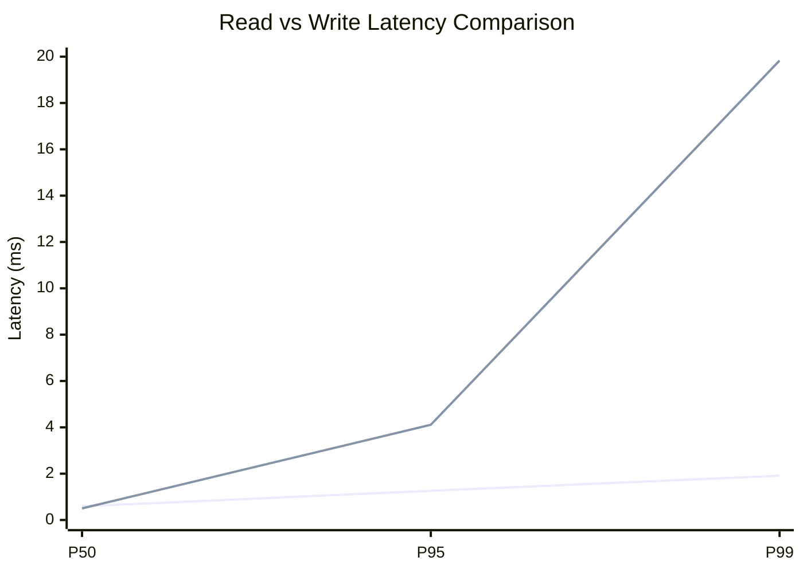
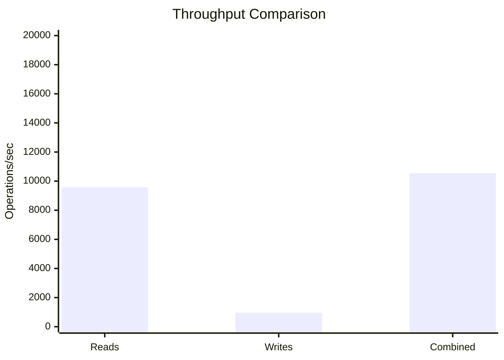
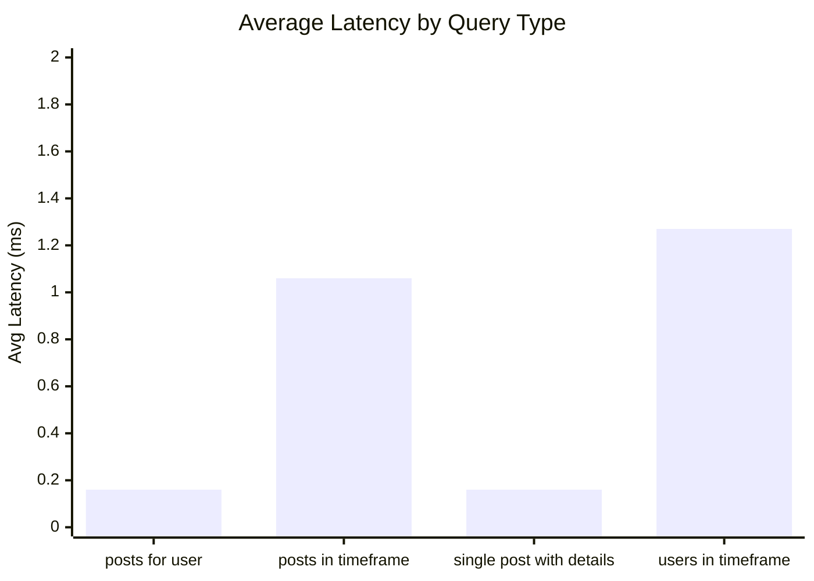
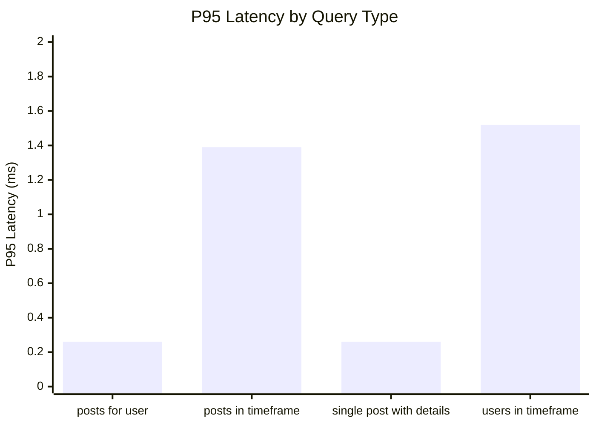
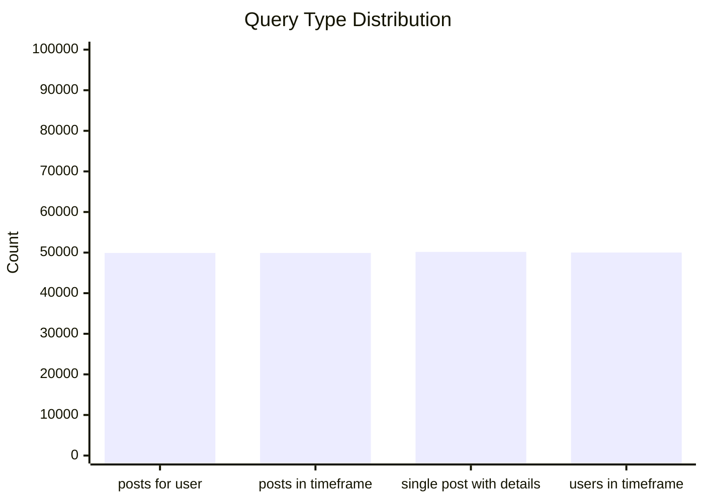
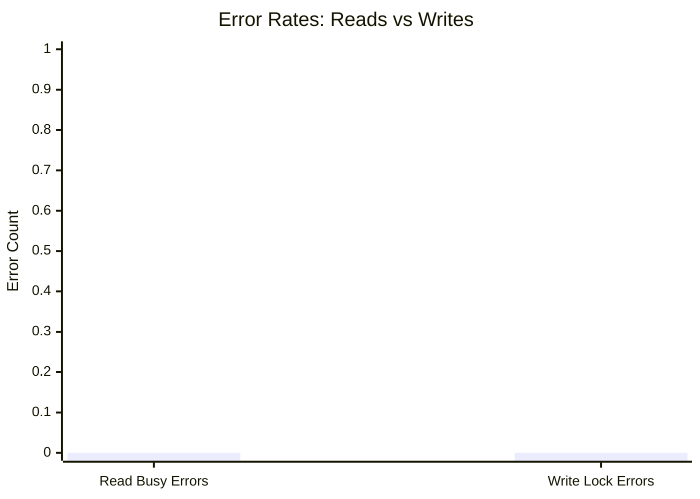
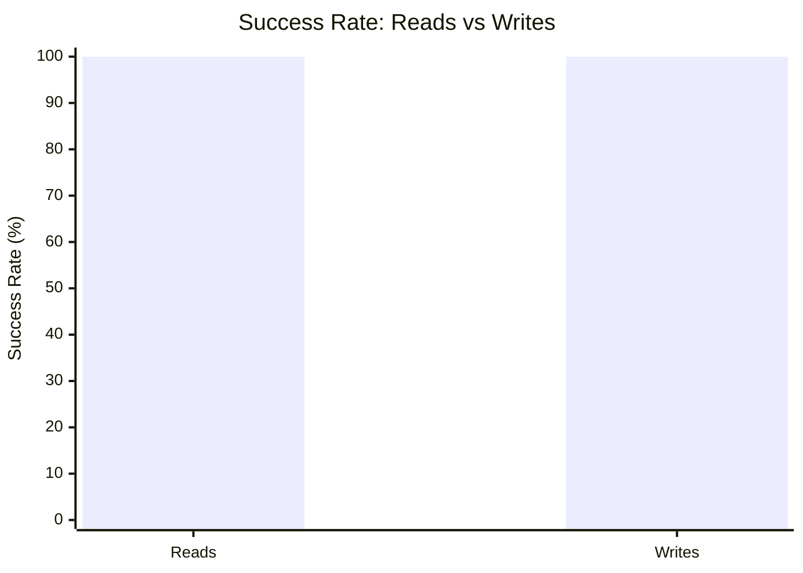

# Mixed Read/Write Benchmark: r14_w4_R200k_W20k_c48mb

**Test Run:** 12/25/2025, 6:15:05 PM

## Configuration

| Setting | Value |
|---------|-------|
| ID | r14_w4_R200k_W20k_c48mb |
| Read Workers | 14 |
| Write Workers | 4 |
| Total Reads | 200,004 |
| Total Writes | 20,000 |
| Total Operations | 220,004 |
| Read:Write Ratio | 10.0:1 |
| Cache Size | 48000 KB (48 MB) |

## Summary

| Metric | Reads | Writes | Combined |
|--------|-------|--------|----------|
| Total | 200,004 | 20,000 | 220,004 |
| Successful | 200,004 | 20,000 | - |
| Success Rate | 100.0% | 100.0% | - |
| Throughput | 9590/sec | 959/sec | 10549/sec |
| Avg Latency | 0.66ms | 1.37ms | - |
| P50 Latency | 0.59ms | 0.50ms | - |
| P95 Latency | 1.26ms | 4.11ms | - |
| P99 Latency | 1.91ms | 19.83ms | - |
| Errors | 0 (busy: 0) | 0 (lock: 0) | - |

**Total Duration:** 20.86 seconds

## Read Query Breakdown

| Query Type | Count | Avg (ms) | P95 (ms) | P99 (ms) | Avg Rows |
|------------|-------|----------|----------|----------|----------|
| posts_for_user | 49,917 | 0.16 | 0.26 | 0.59 | 0.3 |
| posts_in_timeframe | 49,910 | 1.06 | 1.39 | 1.94 | 100.0 |
| single_post_with_details | 50,171 | 0.16 | 0.26 | 0.52 | 1.4 |
| users_in_timeframe | 50,006 | 1.27 | 1.52 | 10.67 | 257.2 |


## Charts

### Read vs Write Latency Comparison

This chart compares latency percentiles (P50, P95, P99) between read and write operations. It shows how read and write latencies differ under concurrent load.



### Throughput Comparison

This chart compares the throughput of reads, writes, and combined operations. It shows the relative performance of read vs write operations.



### Average Latency by Query Type

This chart shows the average latency for each read query type. It helps identify which queries are the slowest.



### P95 Latency by Query Type

This chart shows the P95 latency (95th percentile) for each read query type. It highlights the worst-case performance for each query type.



### Query Type Distribution

This chart shows the distribution of query types executed during the test. It helps verify that queries are evenly distributed.



### Error Rates

This chart compares error rates between reads (SQLITE_BUSY errors) and writes (lock errors). It helps identify contention issues.



### Success Rate Comparison

This chart compares the success rate of read vs write operations. Both should ideally be at 100%.



## Key Observations

### Read Performance
- **200,004** successful reads out of 200,004 (100.0% success rate)
- Average read latency: **0.66ms**, P99: **1.91ms**
- Read throughput: **9590 reads/sec**
- ✅ No busy errors during reads (WAL mode working well)

### Write Performance
- **20,000** successful writes out of 20,000 (100.0% success rate)
- Average write latency: **1.37ms**, P99: **19.83ms**
- Write throughput: **959 writes/sec**
- ✅ No lock errors during writes

### Combined Throughput
- Total operations completed: **220,004**
- Combined throughput: **10549 ops/sec**

## Raw Data

<details>
<summary>Click to expand raw JSON data</summary>

```json
{
  "testName": "mixedReadWrite-r14_w4_R200k_W20k_c48mb",
  "timestamp": "2025-12-25T12:45:05.502Z",
  "configuration": {
    "id": "r14_w4_R200k_W20k_c48mb",
    "readWorkers": 14,
    "writeWorkers": 4,
    "readsPerWorker": 14286,
    "writesPerWorker": 5000,
    "totalReads": 200004,
    "totalWrites": 20000,
    "totalOperations": 220004,
    "readWriteRatio": 10.0002,
    "cacheSize": 48000
  },
  "duration": 20855.872648999997,
  "reads": {
    "total": 200004,
    "successful": 200004,
    "errors": 0,
    "busyErrors": 0,
    "successRate": 100,
    "avgTime": 0.6600460841983324,
    "minTime": 0.05308999999942898,
    "maxTime": 109.61733000000095,
    "p50": 0.5867400000006455,
    "p95": 1.2570199999991019,
    "p99": 1.9104279999992286,
    "readsPerSec": 9589.816900305528,
    "byQueryType": {
      "posts_for_user": {
        "count": 49917,
        "avgTime": 0.15682077041889492,
        "p95": 0.2637460000005376,
        "p99": 0.5880760000000009,
        "avgRowCount": 0.3238976701324198
      },
      "posts_in_timeframe": {
        "count": 49910,
        "avgTime": 1.057936319555201,
        "p95": 1.3947610000004715,
        "p99": 1.944962999999916,
        "avgRowCount": 100
      },
      "single_post_with_details": {
        "count": 50171,
        "avgTime": 0.16042030374121174,
        "p95": 0.26454000000012456,
        "p99": 0.5246320000001106,
        "avgRowCount": 1.4023439835761695
      },
      "users_in_timeframe": {
        "count": 50006,
        "avgTime": 1.2665237343319025,
        "p95": 1.5222830000002432,
        "p99": 10.674807000001238,
        "avgRowCount": 257.22693276806785
      }
    }
  },
  "writes": {
    "total": 20000,
    "successful": 20000,
    "errors": 0,
    "lockErrors": 0,
    "successRate": 100,
    "avgTime": 1.3662678576499985,
    "minTime": 0.08200399999986985,
    "maxTime": 202.55077299999994,
    "p50": 0.5028260000003684,
    "p95": 4.110340000000178,
    "p99": 19.82517700000062,
    "writesPerSec": 958.9625107803372
  },
  "combined": {
    "totalOps": 220004,
    "opsPerSec": 10548.779411085865
  }
}
```

</details>
