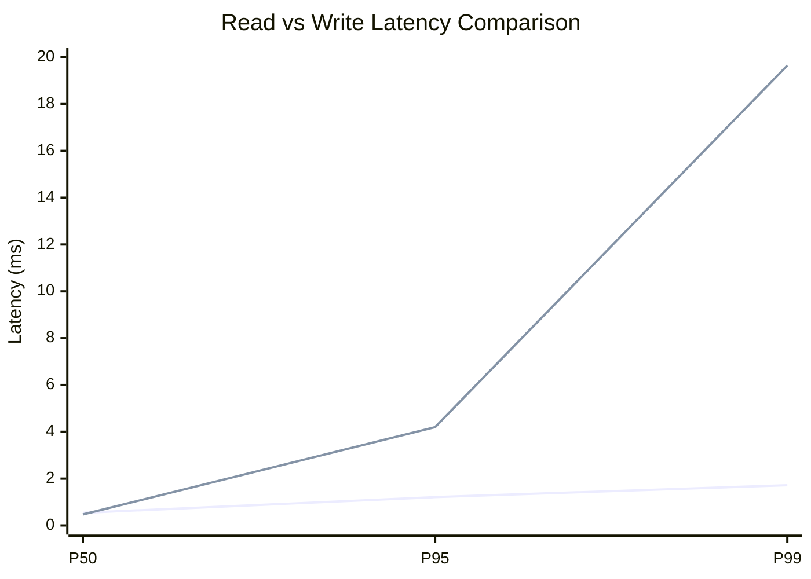
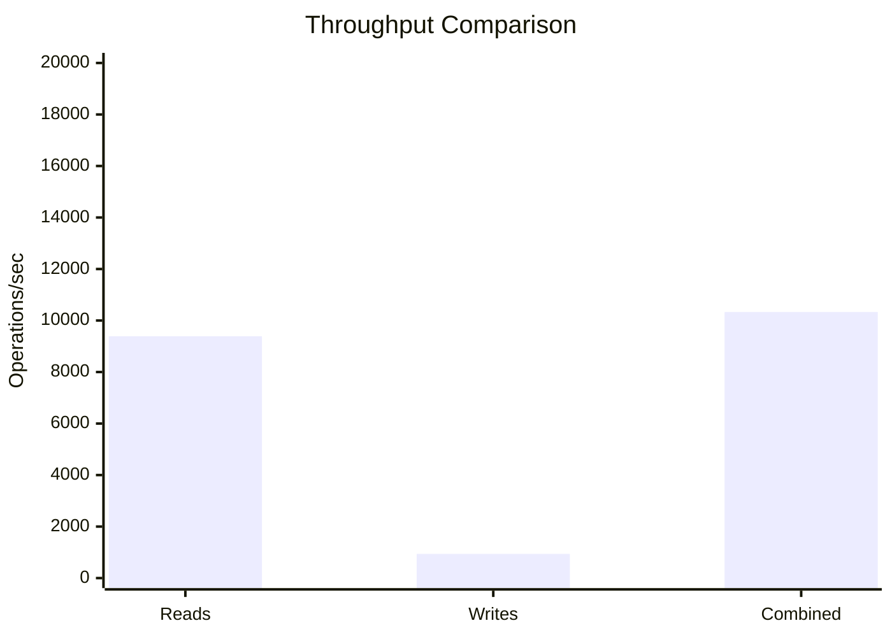
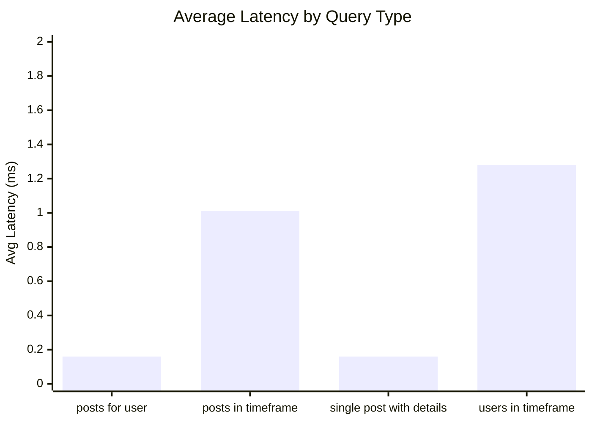
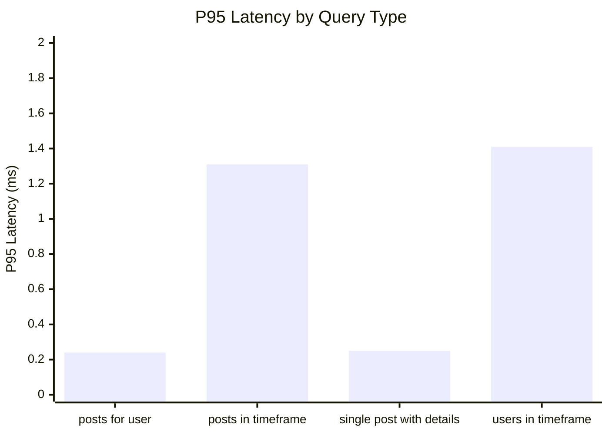
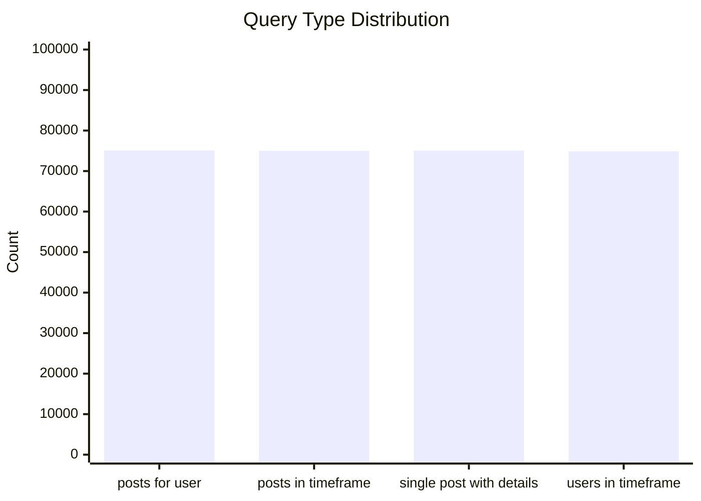
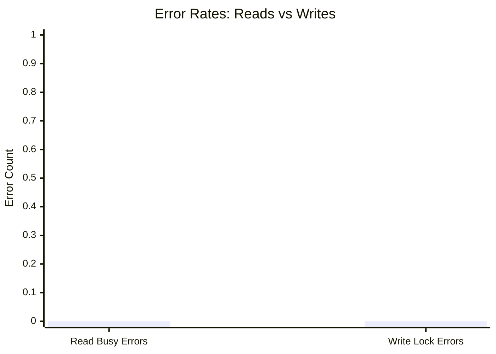
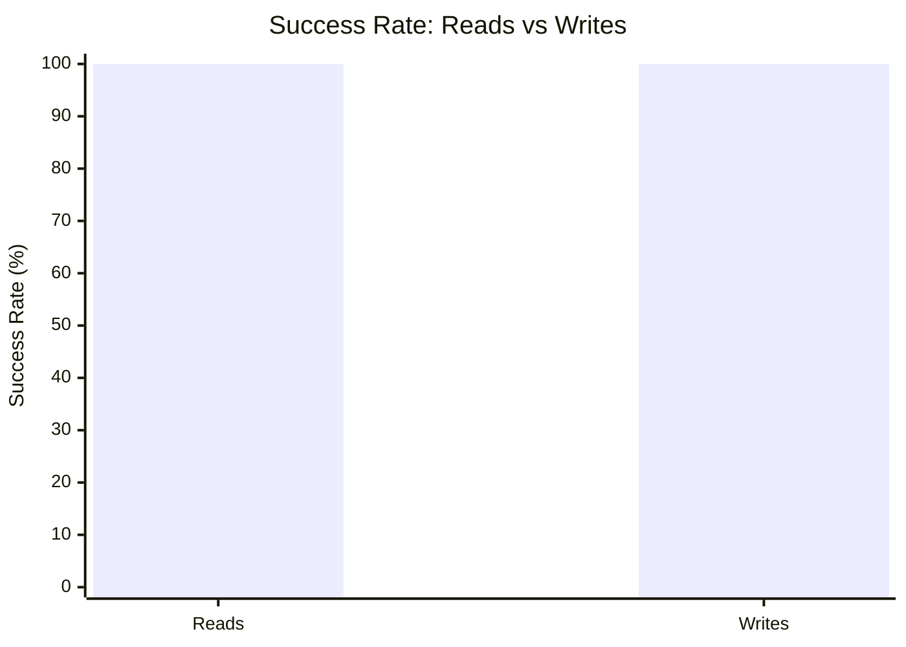

# Mixed Read/Write Benchmark: r14_w4_R300k_W30k_c48mb

**Test Run:** 12/25/2025, 6:18:13 PM

## Configuration

| Setting | Value |
|---------|-------|
| ID | r14_w4_R300k_W30k_c48mb |
| Read Workers | 14 |
| Write Workers | 4 |
| Total Reads | 300,006 |
| Total Writes | 30,000 |
| Total Operations | 330,006 |
| Read:Write Ratio | 10.0:1 |
| Cache Size | 48000 KB (48 MB) |

## Summary

| Metric | Reads | Writes | Combined |
|--------|-------|--------|----------|
| Total | 300,006 | 30,000 | 330,006 |
| Successful | 300,006 | 30,000 | - |
| Success Rate | 100.0% | 100.0% | - |
| Throughput | 9392/sec | 939/sec | 10331/sec |
| Avg Latency | 0.65ms | 1.38ms | - |
| P50 Latency | 0.54ms | 0.47ms | - |
| P95 Latency | 1.21ms | 4.20ms | - |
| P99 Latency | 1.72ms | 19.65ms | - |
| Errors | 0 (busy: 0) | 0 (lock: 0) | - |

**Total Duration:** 31.94 seconds

## Read Query Breakdown

| Query Type | Count | Avg (ms) | P95 (ms) | P99 (ms) | Avg Rows |
|------------|-------|----------|----------|----------|----------|
| posts_for_user | 75,065 | 0.16 | 0.24 | 0.47 | 0.4 |
| posts_in_timeframe | 74,992 | 1.01 | 1.31 | 1.74 | 100.0 |
| single_post_with_details | 75,063 | 0.16 | 0.25 | 0.45 | 1.5 |
| users_in_timeframe | 74,886 | 1.28 | 1.41 | 15.50 | 286.1 |


## Charts

### Read vs Write Latency Comparison

This chart compares latency percentiles (P50, P95, P99) between read and write operations. It shows how read and write latencies differ under concurrent load.



### Throughput Comparison

This chart compares the throughput of reads, writes, and combined operations. It shows the relative performance of read vs write operations.



### Average Latency by Query Type

This chart shows the average latency for each read query type. It helps identify which queries are the slowest.



### P95 Latency by Query Type

This chart shows the P95 latency (95th percentile) for each read query type. It highlights the worst-case performance for each query type.



### Query Type Distribution

This chart shows the distribution of query types executed during the test. It helps verify that queries are evenly distributed.



### Error Rates

This chart compares error rates between reads (SQLITE_BUSY errors) and writes (lock errors). It helps identify contention issues.



### Success Rate Comparison

This chart compares the success rate of read vs write operations. Both should ideally be at 100%.



## Key Observations

### Read Performance
- **300,006** successful reads out of 300,006 (100.0% success rate)
- Average read latency: **0.65ms**, P99: **1.72ms**
- Read throughput: **9392 reads/sec**
- ✅ No busy errors during reads (WAL mode working well)

### Write Performance
- **30,000** successful writes out of 30,000 (100.0% success rate)
- Average write latency: **1.38ms**, P99: **19.65ms**
- Write throughput: **939 writes/sec**
- ✅ No lock errors during writes

### Combined Throughput
- Total operations completed: **330,006**
- Combined throughput: **10331 ops/sec**

## Raw Data

<details>
<summary>Click to expand raw JSON data</summary>

```json
{
  "testName": "mixedReadWrite-r14_w4_R300k_W30k_c48mb",
  "timestamp": "2025-12-25T12:48:13.502Z",
  "configuration": {
    "id": "r14_w4_R300k_W30k_c48mb",
    "readWorkers": 14,
    "writeWorkers": 4,
    "readsPerWorker": 21429,
    "writesPerWorker": 7500,
    "totalReads": 300006,
    "totalWrites": 30000,
    "totalOperations": 330006,
    "readWriteRatio": 10.0002,
    "cacheSize": 48000
  },
  "duration": 31942.898822,
  "reads": {
    "total": 300006,
    "successful": 300006,
    "errors": 0,
    "busyErrors": 0,
    "successRate": 100,
    "avgTime": 0.6509926063378798,
    "minTime": 0.04840199999853212,
    "maxTime": 49.3009209999982,
    "p50": 0.5404889999999796,
    "p95": 1.214270000000397,
    "p99": 1.7215370000012626,
    "readsPerSec": 9391.946600456224,
    "byQueryType": {
      "posts_for_user": {
        "count": 75065,
        "avgTime": 0.15601469358556272,
        "p95": 0.24305100000128732,
        "p99": 0.4739869999993971,
        "avgRowCount": 0.35515886231932325
      },
      "posts_in_timeframe": {
        "count": 74992,
        "avgTime": 1.0131452400656074,
        "p95": 1.3081339999989723,
        "p99": 1.743345999999292,
        "avgRowCount": 100
      },
      "single_post_with_details": {
        "count": 75063,
        "avgTime": 0.1576553993312243,
        "p95": 0.24709100000109174,
        "p99": 0.44664100000045437,
        "avgRowCount": 1.4862315654849927
      },
      "users_in_timeframe": {
        "count": 74886,
        "avgTime": 1.2789916646636086,
        "p95": 1.4076249999998254,
        "p99": 15.504364999997051,
        "avgRowCount": 286.13475148892985
      }
    }
  },
  "writes": {
    "total": 30000,
    "successful": 30000,
    "errors": 0,
    "lockErrors": 0,
    "successRate": 100,
    "avgTime": 1.3784017366000036,
    "minTime": 0.06174399999963498,
    "maxTime": 187.15747199999896,
    "p50": 0.47415800000089803,
    "p95": 4.196641999999883,
    "p99": 19.64642300000014,
    "writesPerSec": 939.1758765280917
  },
  "combined": {
    "totalOps": 330006,
    "opsPerSec": 10331.122476984316
  }
}
```

</details>
