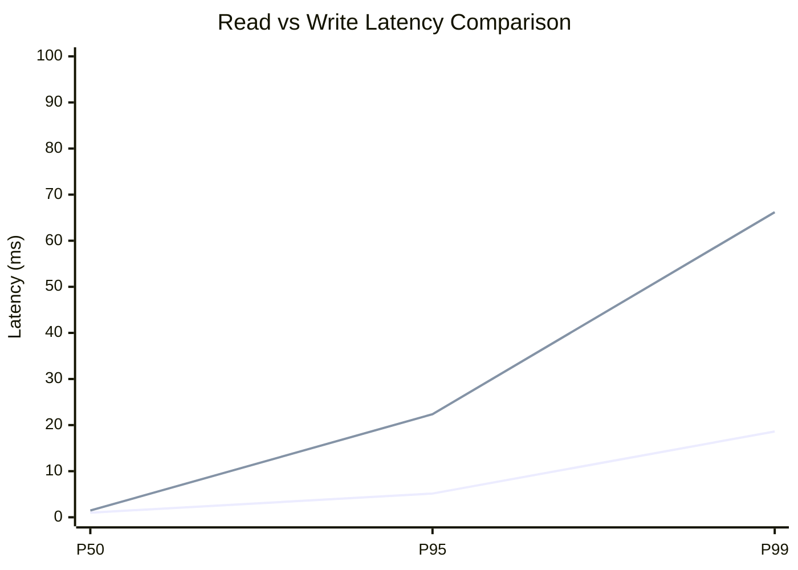
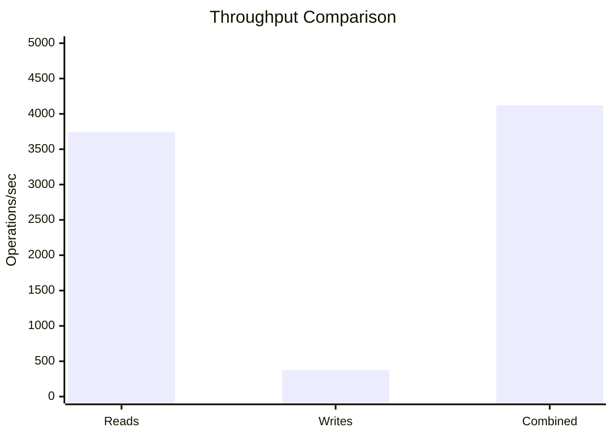
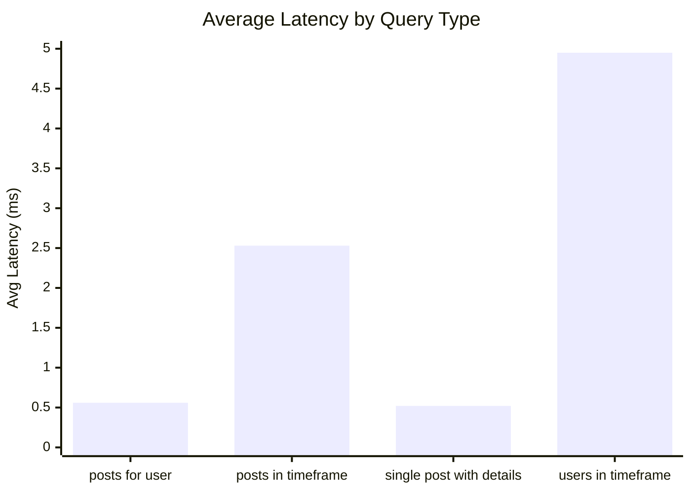
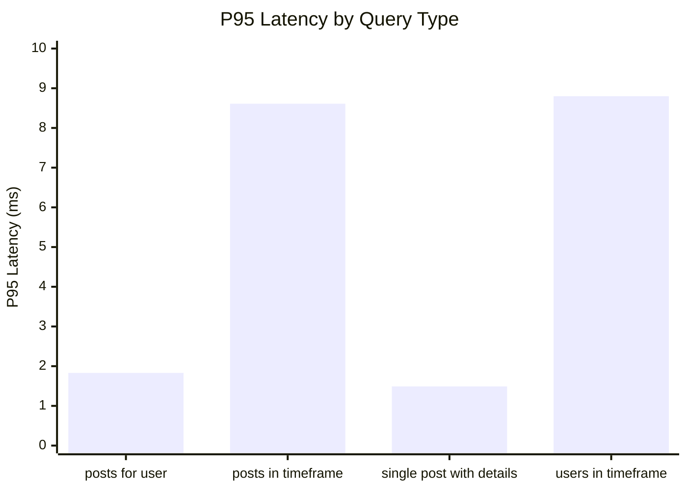
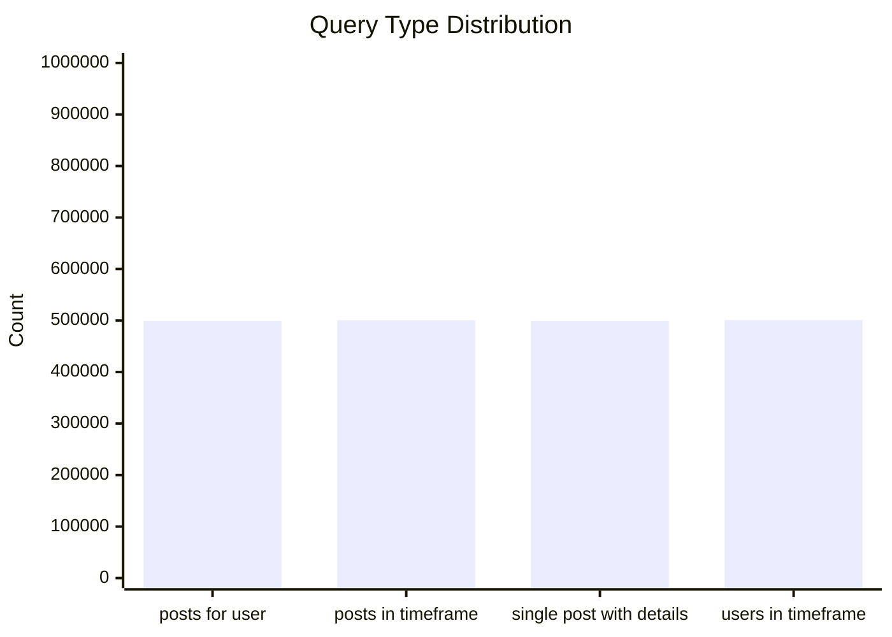
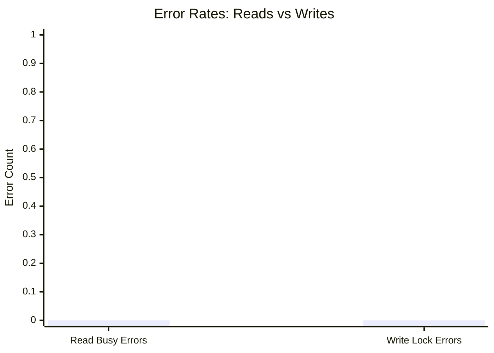
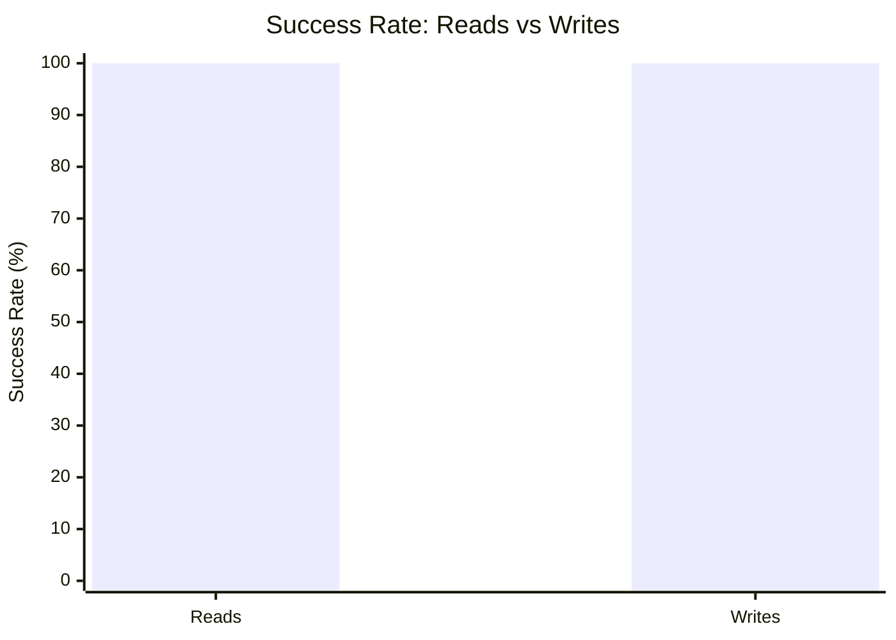

# Mixed Read/Write Benchmark: r160_w16_R2m_W200k_c100mb

**Test Run:** 12/25/2025, 1:07:00 PM

## Configuration

| Setting | Value |
|---------|-------|
| ID | r160_w16_R2m_W200k_c100mb |
| Read Workers | 160 |
| Write Workers | 16 |
| Total Reads | 2,000,000 |
| Total Writes | 200,000 |
| Total Operations | 2,200,000 |
| Read:Write Ratio | 10.0:1 |
| Cache Size | 100000 KB (100 MB) |

## Summary

| Metric | Reads | Writes | Combined |
|--------|-------|--------|----------|
| Total | 2,000,000 | 200,000 | 2,200,000 |
| Successful | 2,000,000 | 200,000 | - |
| Success Rate | 100.0% | 100.0% | - |
| Throughput | 3745/sec | 375/sec | 4120/sec |
| Avg Latency | 2.14ms | 5.91ms | - |
| P50 Latency | 1.00ms | 1.46ms | - |
| P95 Latency | 5.15ms | 22.36ms | - |
| P99 Latency | 18.61ms | 66.19ms | - |
| Errors | 0 (busy: 0) | 0 (lock: 0) | - |

**Total Duration:** 534.00 seconds

## Read Query Breakdown

| Query Type | Count | Avg (ms) | P95 (ms) | P99 (ms) | Avg Rows |
|------------|-------|----------|----------|----------|----------|
| posts_for_user | 499,332 | 0.56 | 1.83 | 6.83 | 0.6 |
| posts_in_timeframe | 500,532 | 2.53 | 8.61 | 23.13 | 100.0 |
| single_post_with_details | 499,134 | 0.52 | 1.49 | 6.02 | 3.0 |
| users_in_timeframe | 501,002 | 4.95 | 8.80 | 45.85 | 401.7 |


## Charts

### Read vs Write Latency Comparison

This chart compares latency percentiles (P50, P95, P99) between read and write operations. It shows how read and write latencies differ under concurrent load.



### Throughput Comparison

This chart compares the throughput of reads, writes, and combined operations. It shows the relative performance of read vs write operations.



### Average Latency by Query Type

This chart shows the average latency for each read query type. It helps identify which queries are the slowest.



### P95 Latency by Query Type

This chart shows the P95 latency (95th percentile) for each read query type. It highlights the worst-case performance for each query type.



### Query Type Distribution

This chart shows the distribution of query types executed during the test. It helps verify that queries are evenly distributed.



### Error Rates

This chart compares error rates between reads (SQLITE_BUSY errors) and writes (lock errors). It helps identify contention issues.



### Success Rate Comparison

This chart compares the success rate of read vs write operations. Both should ideally be at 100%.



## Key Observations

### Read Performance
- **2,000,000** successful reads out of 2,000,000 (100.0% success rate)
- Average read latency: **2.14ms**, P99: **18.61ms**
- Read throughput: **3745 reads/sec**
- ✅ No busy errors during reads (WAL mode working well)

### Write Performance
- **200,000** successful writes out of 200,000 (100.0% success rate)
- Average write latency: **5.91ms**, P99: **66.19ms**
- Write throughput: **375 writes/sec**
- ✅ No lock errors during writes

### Combined Throughput
- Total operations completed: **2,200,000**
- Combined throughput: **4120 ops/sec**

## Raw Data

<details>
<summary>Click to expand raw JSON data</summary>

```json
{
  "testName": "mixedReadWrite-r160_w16_R2m_W200k_c100mb",
  "timestamp": "2025-12-25T07:37:00.409Z",
  "configuration": {
    "id": "r160_w16_R2m_W200k_c100mb",
    "readWorkers": 160,
    "writeWorkers": 16,
    "readsPerWorker": 12500,
    "writesPerWorker": 12500,
    "totalReads": 2000000,
    "totalWrites": 200000,
    "totalOperations": 2200000,
    "readWriteRatio": 10,
    "cacheSize": 100000
  },
  "duration": 533996.5072410001,
  "reads": {
    "total": 2000000,
    "successful": 2000000,
    "errors": 0,
    "busyErrors": 0,
    "successRate": 100,
    "avgTime": 2.1438932823587673,
    "minTime": 0.05655499999556923,
    "maxTime": 3255.201582000009,
    "p50": 0.9982430000018212,
    "p95": 5.1470120000012685,
    "p99": 18.614056999998866,
    "readsPerSec": 3745.342849400646,
    "byQueryType": {
      "posts_for_user": {
        "count": 499332,
        "avgTime": 0.5647687857777827,
        "p95": 1.834482999984175,
        "p99": 6.829116000008071,
        "avgRowCount": 0.5976484583403427
      },
      "posts_in_timeframe": {
        "count": 500532,
        "avgTime": 2.5305271657637634,
        "p95": 8.611456000013277,
        "p99": 23.132263000006787,
        "avgRowCount": 100
      },
      "single_post_with_details": {
        "count": 499134,
        "avgTime": 0.5171104576366471,
        "p95": 1.4891760000027716,
        "p99": 6.023041000007652,
        "avgRowCount": 2.987672649028117
      },
      "users_in_timeframe": {
        "count": 501002,
        "avgTime": 4.952200196568254,
        "p95": 8.80150300002424,
        "p99": 45.850222000008216,
        "avgRowCount": 401.74016870192133
      }
    }
  },
  "writes": {
    "total": 200000,
    "successful": 200000,
    "errors": 0,
    "lockErrors": 0,
    "successRate": 100,
    "avgTime": 5.908184774540001,
    "minTime": 0.06842500000493601,
    "maxTime": 1373.358122000005,
    "p50": 1.4610860000102548,
    "p95": 22.35906800000521,
    "p99": 66.1933849999914,
    "writesPerSec": 374.53428494006465
  },
  "combined": {
    "totalOps": 2200000,
    "opsPerSec": 4119.877134340711
  }
}
```

</details>
