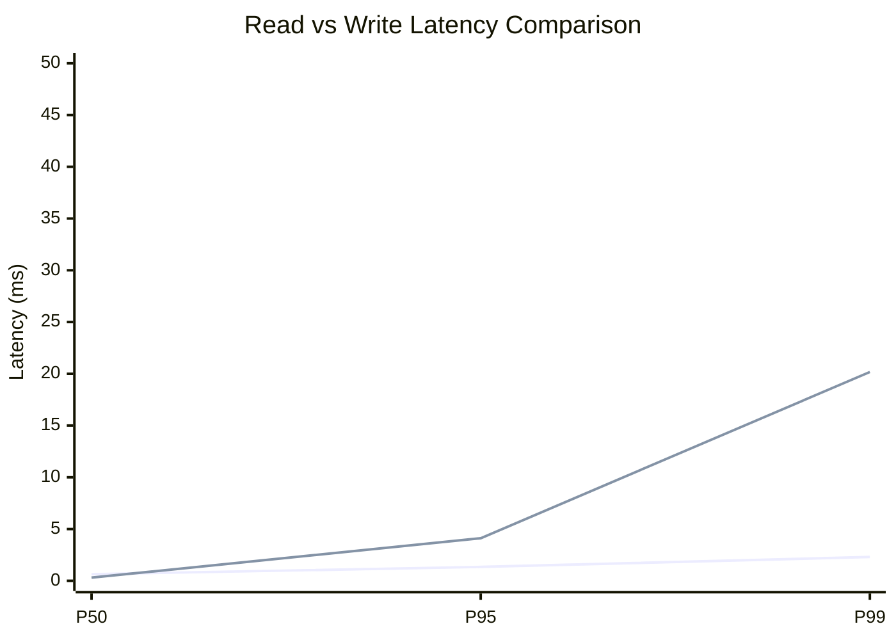
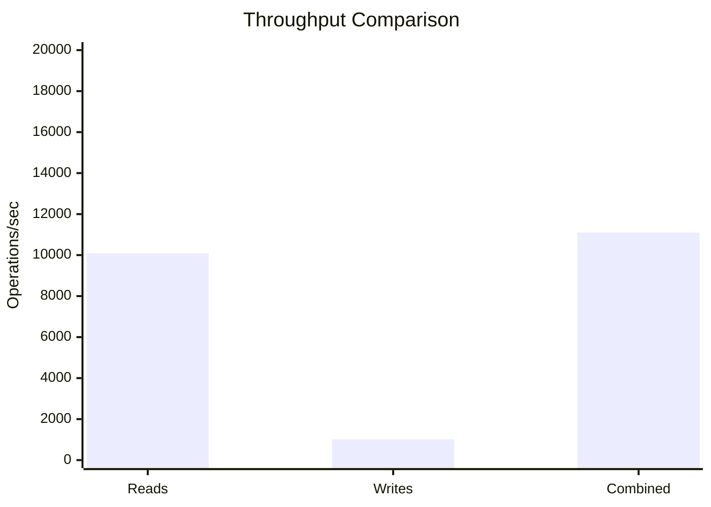
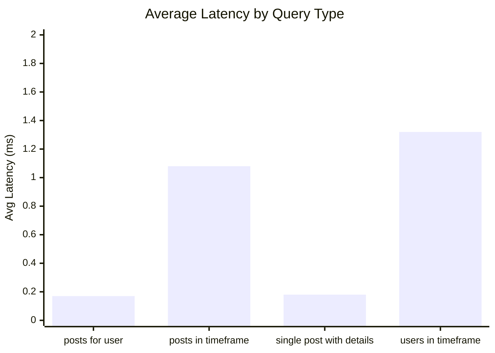
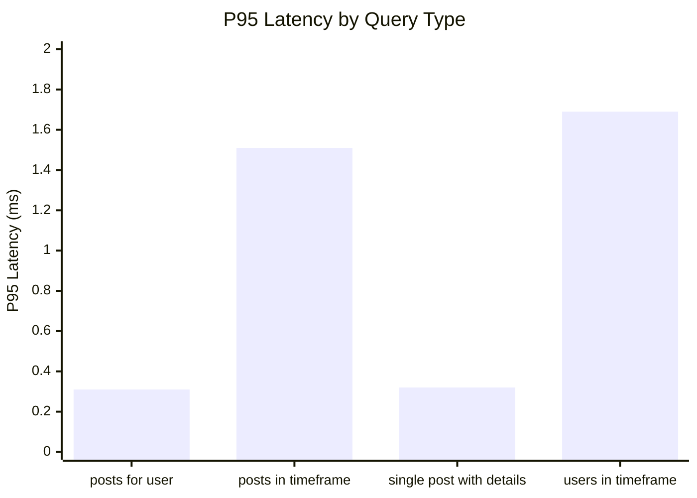
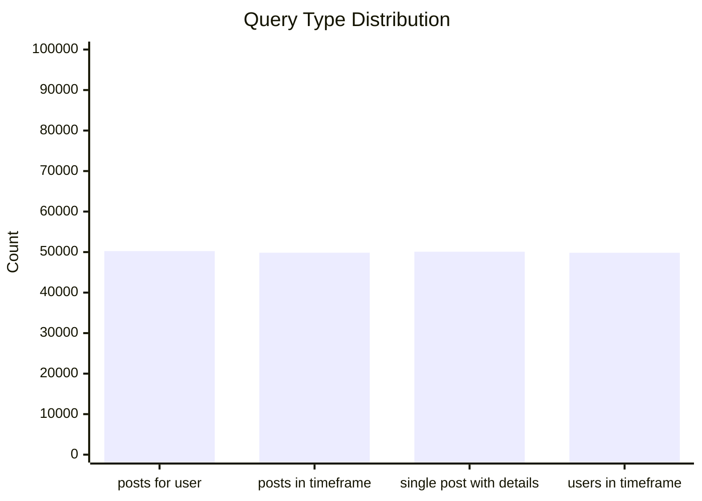
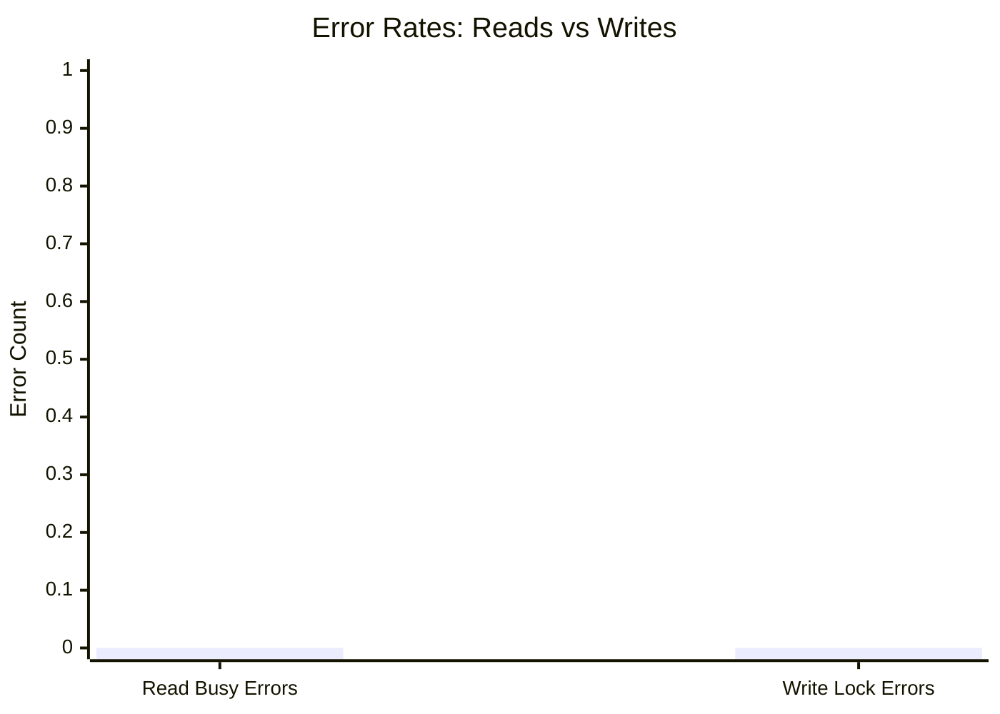
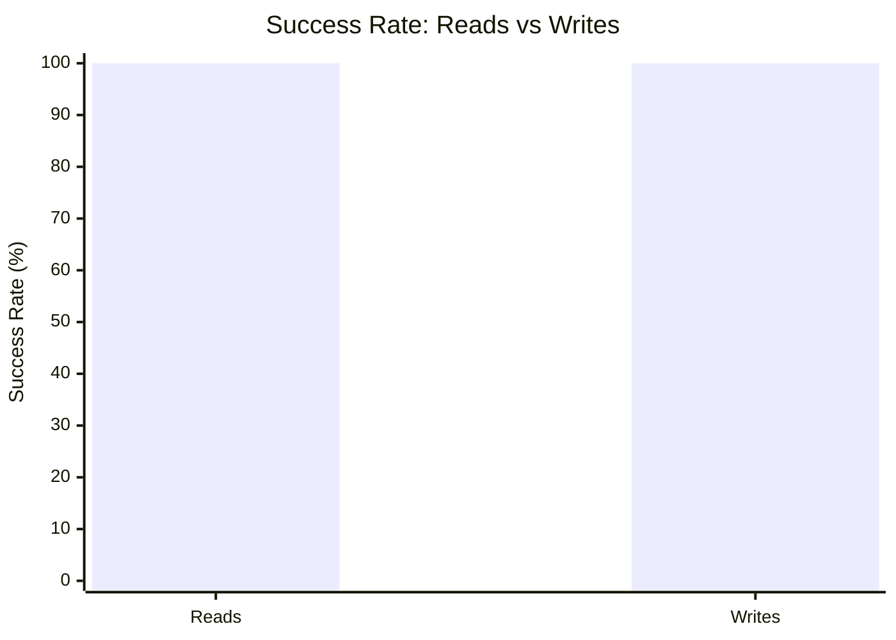

# Mixed Read/Write Benchmark: r16_w4_R200k_W20k_c48mb

**Test Run:** 12/25/2025, 6:15:36 PM

## Configuration

| Setting | Value |
|---------|-------|
| ID | r16_w4_R200k_W20k_c48mb |
| Read Workers | 16 |
| Write Workers | 4 |
| Total Reads | 200,000 |
| Total Writes | 20,000 |
| Total Operations | 220,000 |
| Read:Write Ratio | 10.0:1 |
| Cache Size | 48000 KB (48 MB) |

## Summary

| Metric | Reads | Writes | Combined |
|--------|-------|--------|----------|
| Total | 200,000 | 20,000 | 220,000 |
| Successful | 200,000 | 20,000 | - |
| Success Rate | 100.0% | 100.0% | - |
| Throughput | 10092/sec | 1009/sec | 11102/sec |
| Avg Latency | 0.69ms | 1.34ms | - |
| P50 Latency | 0.64ms | 0.31ms | - |
| P95 Latency | 1.34ms | 4.11ms | - |
| P99 Latency | 2.30ms | 20.17ms | - |
| Errors | 0 (busy: 0) | 0 (lock: 0) | - |

**Total Duration:** 19.82 seconds

## Read Query Breakdown

| Query Type | Count | Avg (ms) | P95 (ms) | P99 (ms) | Avg Rows |
|------------|-------|----------|----------|----------|----------|
| posts_for_user | 50,232 | 0.17 | 0.31 | 0.73 | 0.3 |
| posts_in_timeframe | 49,850 | 1.08 | 1.51 | 2.36 | 100.0 |
| single_post_with_details | 50,089 | 0.18 | 0.32 | 0.78 | 1.4 |
| users_in_timeframe | 49,829 | 1.32 | 1.69 | 11.05 | 261.0 |


## Charts

### Read vs Write Latency Comparison

This chart compares latency percentiles (P50, P95, P99) between read and write operations. It shows how read and write latencies differ under concurrent load.



### Throughput Comparison

This chart compares the throughput of reads, writes, and combined operations. It shows the relative performance of read vs write operations.



### Average Latency by Query Type

This chart shows the average latency for each read query type. It helps identify which queries are the slowest.



### P95 Latency by Query Type

This chart shows the P95 latency (95th percentile) for each read query type. It highlights the worst-case performance for each query type.



### Query Type Distribution

This chart shows the distribution of query types executed during the test. It helps verify that queries are evenly distributed.



### Error Rates

This chart compares error rates between reads (SQLITE_BUSY errors) and writes (lock errors). It helps identify contention issues.



### Success Rate Comparison

This chart compares the success rate of read vs write operations. Both should ideally be at 100%.



## Key Observations

### Read Performance
- **200,000** successful reads out of 200,000 (100.0% success rate)
- Average read latency: **0.69ms**, P99: **2.30ms**
- Read throughput: **10092 reads/sec**
- ✅ No busy errors during reads (WAL mode working well)

### Write Performance
- **20,000** successful writes out of 20,000 (100.0% success rate)
- Average write latency: **1.34ms**, P99: **20.17ms**
- Write throughput: **1009 writes/sec**
- ✅ No lock errors during writes

### Combined Throughput
- Total operations completed: **220,000**
- Combined throughput: **11102 ops/sec**

## Raw Data

<details>
<summary>Click to expand raw JSON data</summary>

```json
{
  "testName": "mixedReadWrite-r16_w4_R200k_W20k_c48mb",
  "timestamp": "2025-12-25T12:45:36.190Z",
  "configuration": {
    "id": "r16_w4_R200k_W20k_c48mb",
    "readWorkers": 16,
    "writeWorkers": 4,
    "readsPerWorker": 12500,
    "writesPerWorker": 5000,
    "totalReads": 200000,
    "totalWrites": 20000,
    "totalOperations": 220000,
    "readWriteRatio": 10,
    "cacheSize": 48000
  },
  "duration": 19816.943841,
  "reads": {
    "total": 200000,
    "successful": 200000,
    "errors": 0,
    "busyErrors": 0,
    "successRate": 100,
    "avgTime": 0.6852980424000135,
    "minTime": 0.051172999999835156,
    "maxTime": 135.5944950000012,
    "p50": 0.6357100000000173,
    "p95": 1.3350209999989602,
    "p99": 2.2990490000001955,
    "readsPerSec": 10092.373556926203,
    "byQueryType": {
      "posts_for_user": {
        "count": 50232,
        "avgTime": 0.16757280996177412,
        "p95": 0.3060750000004191,
        "p99": 0.7272800000000643,
        "avgRowCount": 0.3308846950151298
      },
      "posts_in_timeframe": {
        "count": 49850,
        "avgTime": 1.078967778375152,
        "p95": 1.51299599999993,
        "p99": 2.360529999999926,
        "avgRowCount": 100
      },
      "single_post_with_details": {
        "count": 50089,
        "avgTime": 0.17643546625007445,
        "p95": 0.3160570000000007,
        "p99": 0.7807199999997465,
        "avgRowCount": 1.3967737427379265
      },
      "users_in_timeframe": {
        "count": 49829,
        "avgTime": 1.3248925579281388,
        "p95": 1.690256999999292,
        "p99": 11.046068999999989,
        "avgRowCount": 260.98049328704167
      }
    }
  },
  "writes": {
    "total": 20000,
    "successful": 20000,
    "errors": 0,
    "lockErrors": 0,
    "successRate": 100,
    "avgTime": 1.3433987016999933,
    "minTime": 0.08843400000023394,
    "maxTime": 197.43574400000034,
    "p50": 0.3062189999996008,
    "p95": 4.111053000000538,
    "p99": 20.172311000000263,
    "writesPerSec": 1009.2373556926204
  },
  "combined": {
    "totalOps": 220000,
    "opsPerSec": 11101.610912618824
  }
}
```

</details>
