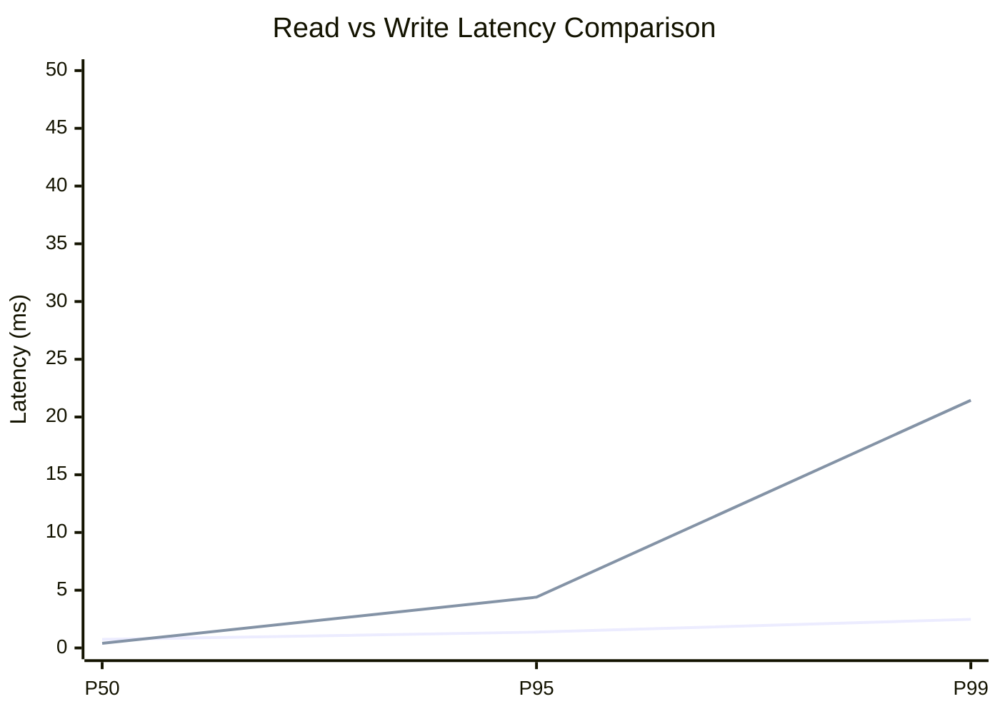
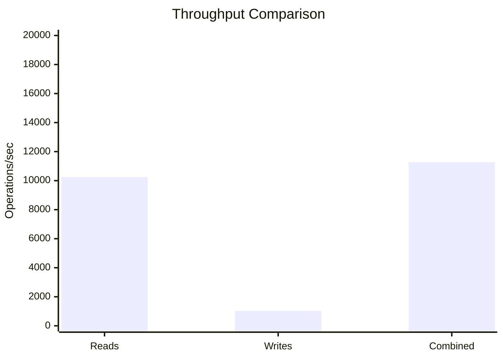
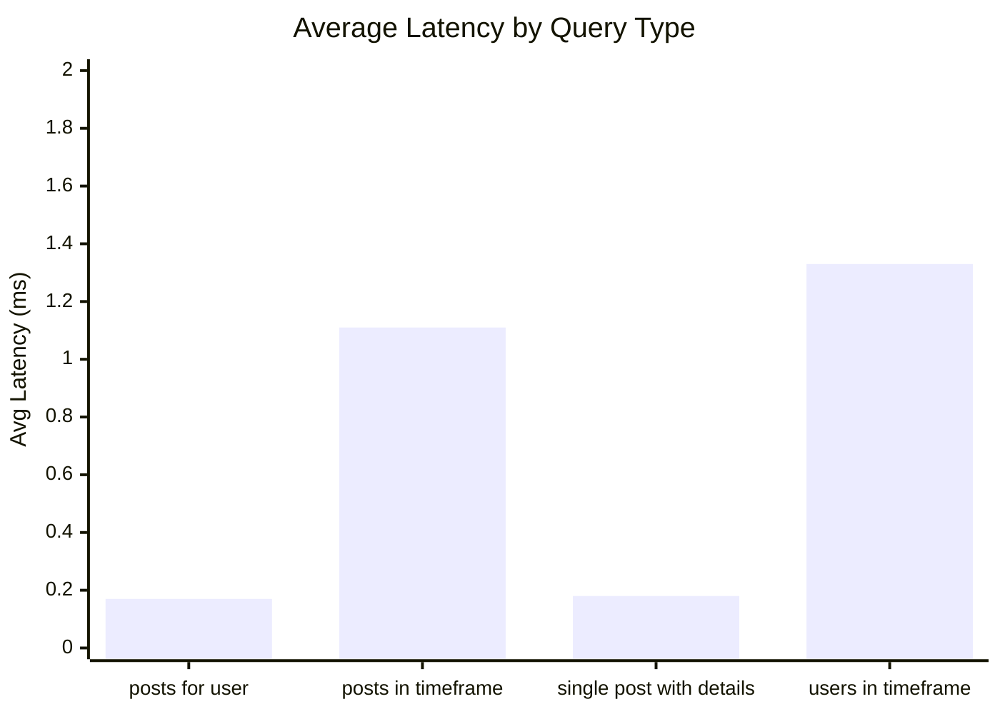
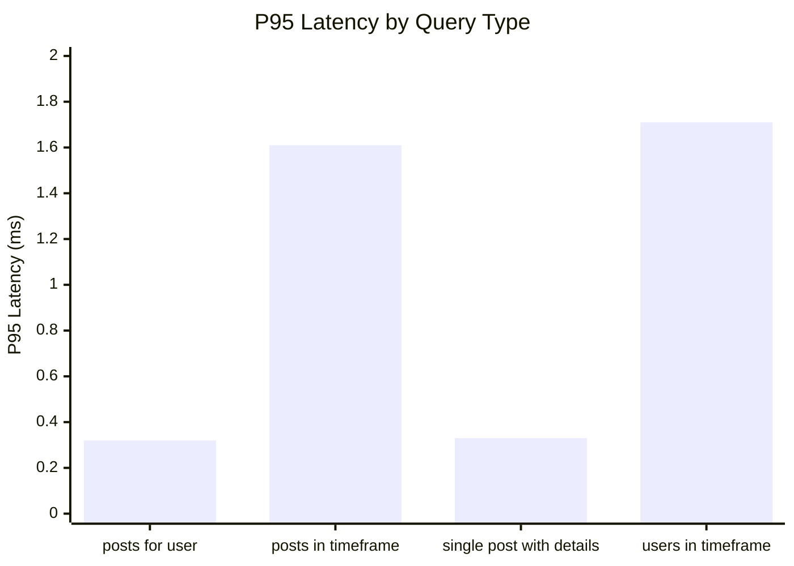
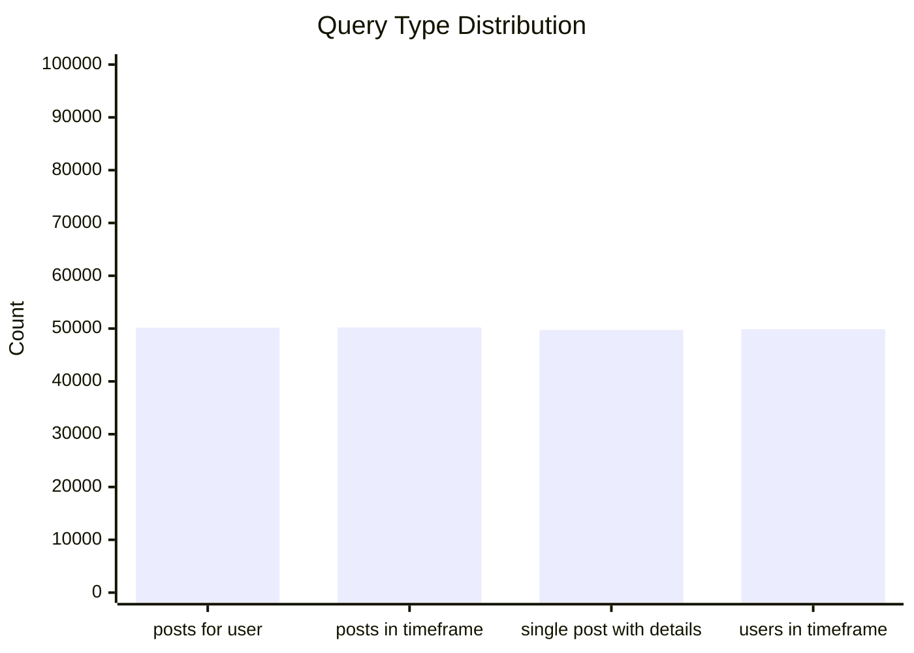
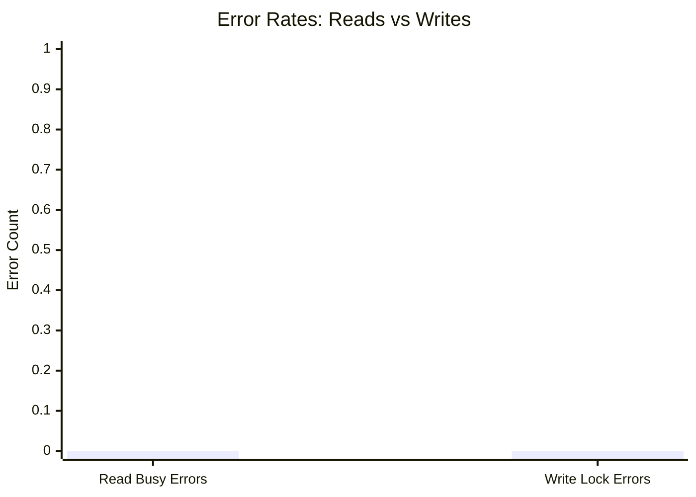
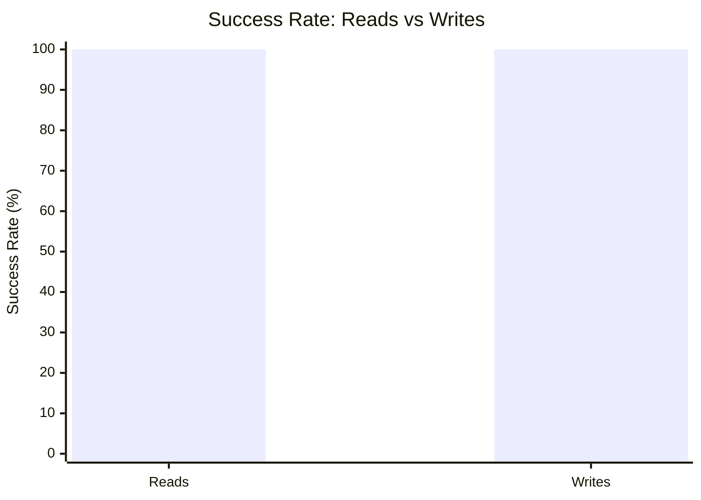

# Mixed Read/Write Benchmark: r17_w5_R200k_W20k_c48mb

**Test Run:** 12/25/2025, 6:16:40 PM

## Configuration

| Setting | Value |
|---------|-------|
| ID | r17_w5_R200k_W20k_c48mb |
| Read Workers | 17 |
| Write Workers | 5 |
| Total Reads | 200,005 |
| Total Writes | 20,000 |
| Total Operations | 220,005 |
| Read:Write Ratio | 10.0:1 |
| Cache Size | 48000 KB (48 MB) |

## Summary

| Metric | Reads | Writes | Combined |
|--------|-------|--------|----------|
| Total | 200,005 | 20,000 | 220,005 |
| Successful | 200,005 | 20,000 | - |
| Success Rate | 100.0% | 100.0% | - |
| Throughput | 10246/sec | 1025/sec | 11270/sec |
| Avg Latency | 0.70ms | 1.70ms | - |
| P50 Latency | 0.74ms | 0.40ms | - |
| P95 Latency | 1.37ms | 4.40ms | - |
| P99 Latency | 2.48ms | 21.45ms | - |
| Errors | 0 (busy: 0) | 0 (lock: 0) | - |

**Total Duration:** 19.52 seconds

## Read Query Breakdown

| Query Type | Count | Avg (ms) | P95 (ms) | P99 (ms) | Avg Rows |
|------------|-------|----------|----------|----------|----------|
| posts_for_user | 50,164 | 0.17 | 0.32 | 0.87 | 0.3 |
| posts_in_timeframe | 50,213 | 1.11 | 1.61 | 2.63 | 100.0 |
| single_post_with_details | 49,739 | 0.18 | 0.33 | 0.92 | 1.4 |
| users_in_timeframe | 49,889 | 1.33 | 1.71 | 10.43 | 248.7 |


## Charts

### Read vs Write Latency Comparison

This chart compares latency percentiles (P50, P95, P99) between read and write operations. It shows how read and write latencies differ under concurrent load.



### Throughput Comparison

This chart compares the throughput of reads, writes, and combined operations. It shows the relative performance of read vs write operations.



### Average Latency by Query Type

This chart shows the average latency for each read query type. It helps identify which queries are the slowest.



### P95 Latency by Query Type

This chart shows the P95 latency (95th percentile) for each read query type. It highlights the worst-case performance for each query type.



### Query Type Distribution

This chart shows the distribution of query types executed during the test. It helps verify that queries are evenly distributed.



### Error Rates

This chart compares error rates between reads (SQLITE_BUSY errors) and writes (lock errors). It helps identify contention issues.



### Success Rate Comparison

This chart compares the success rate of read vs write operations. Both should ideally be at 100%.



## Key Observations

### Read Performance
- **200,005** successful reads out of 200,005 (100.0% success rate)
- Average read latency: **0.70ms**, P99: **2.48ms**
- Read throughput: **10246 reads/sec**
- ✅ No busy errors during reads (WAL mode working well)

### Write Performance
- **20,000** successful writes out of 20,000 (100.0% success rate)
- Average write latency: **1.70ms**, P99: **21.45ms**
- Write throughput: **1025 writes/sec**
- ✅ No lock errors during writes

### Combined Throughput
- Total operations completed: **220,005**
- Combined throughput: **11270 ops/sec**

## Raw Data

<details>
<summary>Click to expand raw JSON data</summary>

```json
{
  "testName": "mixedReadWrite-r17_w5_R200k_W20k_c48mb",
  "timestamp": "2025-12-25T12:46:40.918Z",
  "configuration": {
    "id": "r17_w5_R200k_W20k_c48mb",
    "readWorkers": 17,
    "writeWorkers": 5,
    "readsPerWorker": 11765,
    "writesPerWorker": 4000,
    "totalReads": 200005,
    "totalWrites": 20000,
    "totalOperations": 220005,
    "readWriteRatio": 10.00025,
    "cacheSize": 48000
  },
  "duration": 19520.518839,
  "reads": {
    "total": 200005,
    "successful": 200005,
    "errors": 0,
    "busyErrors": 0,
    "successRate": 100,
    "avgTime": 0.6978516418489538,
    "minTime": 0.051961000000119384,
    "maxTime": 73.5187590000005,
    "p50": 0.7417750000004162,
    "p95": 1.368162000000666,
    "p99": 2.4751470000001063,
    "readsPerSec": 10245.885452614633,
    "byQueryType": {
      "posts_for_user": {
        "count": 50164,
        "avgTime": 0.17449915692528503,
        "p95": 0.31977999999980966,
        "p99": 0.8695770000003904,
        "avgRowCount": 0.3244159157961885
      },
      "posts_in_timeframe": {
        "count": 50213,
        "avgTime": 1.1063407662557616,
        "p95": 1.608234999999695,
        "p99": 2.631706000000122,
        "avgRowCount": 100
      },
      "single_post_with_details": {
        "count": 49739,
        "avgTime": 0.1835169274412408,
        "p95": 0.32723599999917496,
        "p99": 0.9179919999996855,
        "avgRowCount": 1.4047729146142867
      },
      "users_in_timeframe": {
        "count": 49889,
        "avgTime": 1.3257352235964008,
        "p95": 1.7067889999998442,
        "p99": 10.433310999998866,
        "avgRowCount": 248.69067329471426
      }
    }
  },
  "writes": {
    "total": 20000,
    "successful": 20000,
    "errors": 0,
    "lockErrors": 0,
    "successRate": 100,
    "avgTime": 1.6995978080500012,
    "minTime": 0.08477500000026339,
    "maxTime": 442.90640900000017,
    "p50": 0.4015479999998206,
    "p95": 4.403443000000152,
    "p99": 21.446297999998933,
    "writesPerSec": 1024.5629311881837
  },
  "combined": {
    "totalOps": 220005,
    "opsPerSec": 11270.448383802817
  }
}
```

</details>
