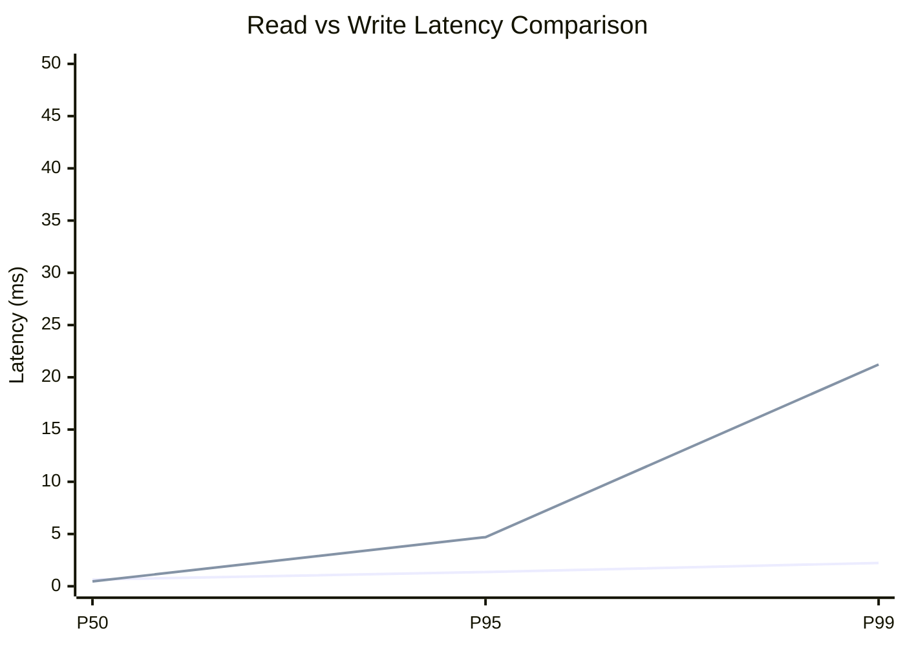
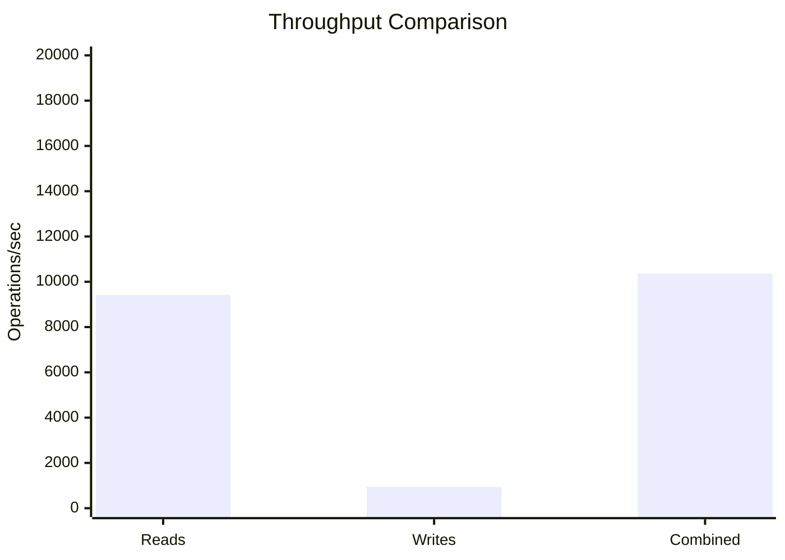
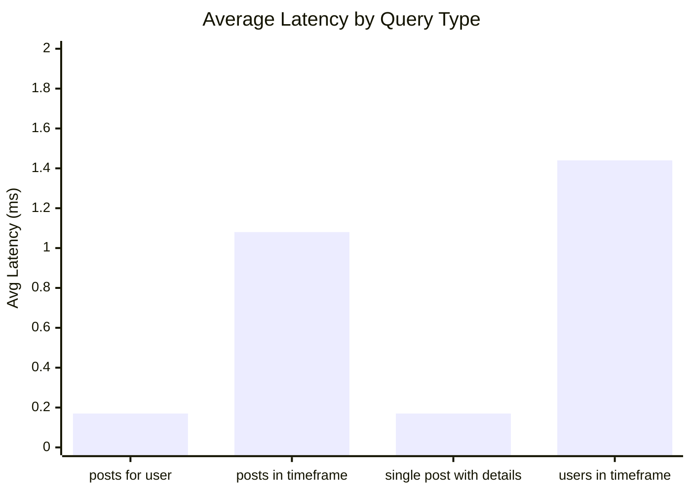
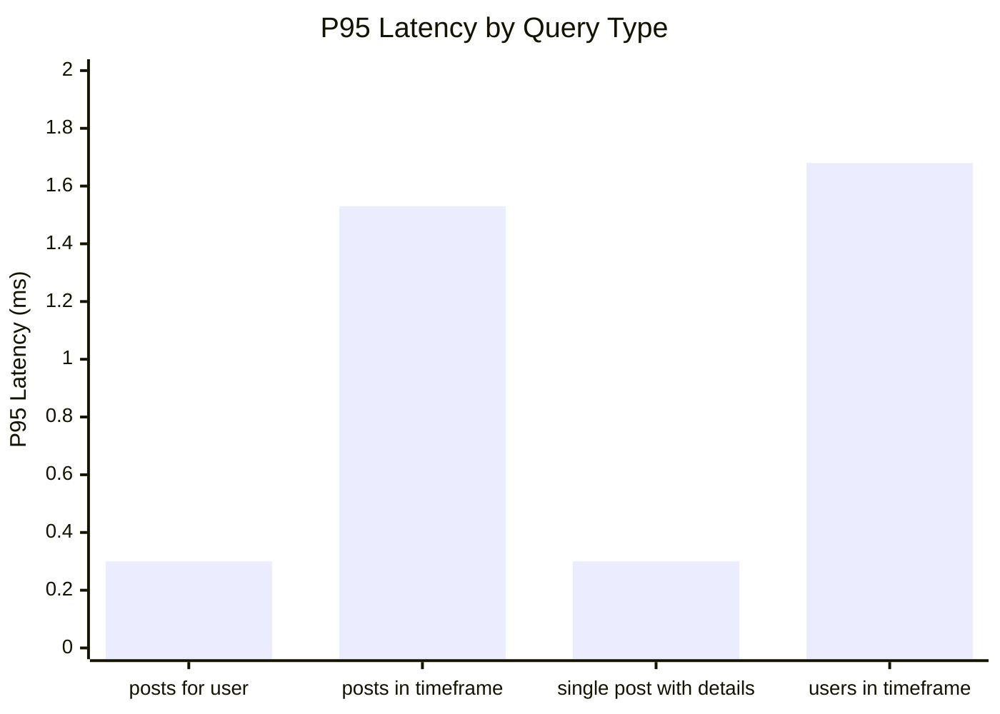
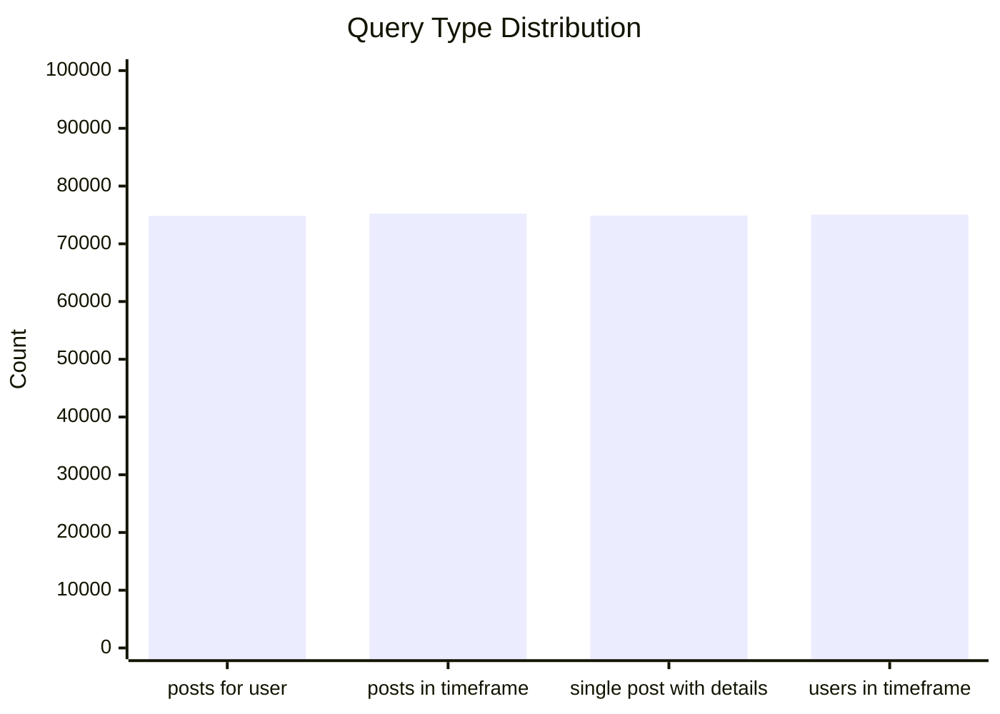
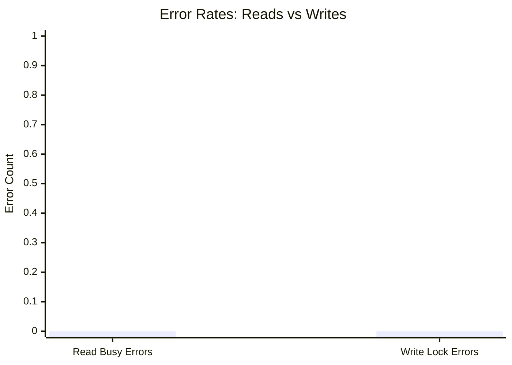
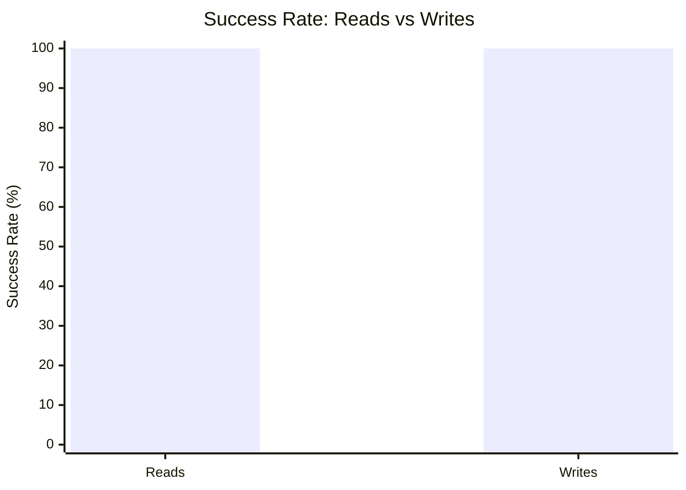

# Mixed Read/Write Benchmark: r17_w5_R300k_W30k_c48mb

**Test Run:** 12/25/2025, 6:17:26 PM

## Configuration

| Setting | Value |
|---------|-------|
| ID | r17_w5_R300k_W30k_c48mb |
| Read Workers | 17 |
| Write Workers | 5 |
| Total Reads | 300,016 |
| Total Writes | 30,000 |
| Total Operations | 330,016 |
| Read:Write Ratio | 10.0:1 |
| Cache Size | 48000 KB (48 MB) |

## Summary

| Metric | Reads | Writes | Combined |
|--------|-------|--------|----------|
| Total | 300,016 | 30,000 | 330,016 |
| Successful | 300,016 | 30,000 | - |
| Success Rate | 100.0% | 100.0% | - |
| Throughput | 9418/sec | 942/sec | 10360/sec |
| Avg Latency | 0.72ms | 1.75ms | - |
| P50 Latency | 0.64ms | 0.46ms | - |
| P95 Latency | 1.36ms | 4.70ms | - |
| P99 Latency | 2.23ms | 21.22ms | - |
| Errors | 0 (busy: 0) | 0 (lock: 0) | - |

**Total Duration:** 31.85 seconds

## Read Query Breakdown

| Query Type | Count | Avg (ms) | P95 (ms) | P99 (ms) | Avg Rows |
|------------|-------|----------|----------|----------|----------|
| posts_for_user | 74,836 | 0.17 | 0.30 | 0.76 | 0.4 |
| posts_in_timeframe | 75,227 | 1.08 | 1.53 | 2.30 | 100.0 |
| single_post_with_details | 74,895 | 0.17 | 0.30 | 0.70 | 1.5 |
| users_in_timeframe | 75,058 | 1.44 | 1.68 | 17.48 | 286.7 |


## Charts

### Read vs Write Latency Comparison

This chart compares latency percentiles (P50, P95, P99) between read and write operations. It shows how read and write latencies differ under concurrent load.



### Throughput Comparison

This chart compares the throughput of reads, writes, and combined operations. It shows the relative performance of read vs write operations.



### Average Latency by Query Type

This chart shows the average latency for each read query type. It helps identify which queries are the slowest.



### P95 Latency by Query Type

This chart shows the P95 latency (95th percentile) for each read query type. It highlights the worst-case performance for each query type.



### Query Type Distribution

This chart shows the distribution of query types executed during the test. It helps verify that queries are evenly distributed.



### Error Rates

This chart compares error rates between reads (SQLITE_BUSY errors) and writes (lock errors). It helps identify contention issues.



### Success Rate Comparison

This chart compares the success rate of read vs write operations. Both should ideally be at 100%.



## Key Observations

### Read Performance
- **300,016** successful reads out of 300,016 (100.0% success rate)
- Average read latency: **0.72ms**, P99: **2.23ms**
- Read throughput: **9418 reads/sec**
- ✅ No busy errors during reads (WAL mode working well)

### Write Performance
- **30,000** successful writes out of 30,000 (100.0% success rate)
- Average write latency: **1.75ms**, P99: **21.22ms**
- Write throughput: **942 writes/sec**
- ✅ No lock errors during writes

### Combined Throughput
- Total operations completed: **330,016**
- Combined throughput: **10360 ops/sec**

## Raw Data

<details>
<summary>Click to expand raw JSON data</summary>

```json
{
  "testName": "mixedReadWrite-r17_w5_R300k_W30k_c48mb",
  "timestamp": "2025-12-25T12:47:26.584Z",
  "configuration": {
    "id": "r17_w5_R300k_W30k_c48mb",
    "readWorkers": 17,
    "writeWorkers": 5,
    "readsPerWorker": 17648,
    "writesPerWorker": 6000,
    "totalReads": 300016,
    "totalWrites": 30000,
    "totalOperations": 330016,
    "readWriteRatio": 10.000533333333333,
    "cacheSize": 48000
  },
  "duration": 31853.991193,
  "reads": {
    "total": 300016,
    "successful": 300016,
    "errors": 0,
    "busyErrors": 0,
    "successRate": 100,
    "avgTime": 0.7184174812643422,
    "minTime": 0.050975000000107684,
    "maxTime": 76.35078199999771,
    "p50": 0.6368489999986195,
    "p95": 1.3579699999991135,
    "p99": 2.2330499999989115,
    "readsPerSec": 9418.474381506368,
    "byQueryType": {
      "posts_for_user": {
        "count": 74836,
        "avgTime": 0.1737760544390439,
        "p95": 0.2960000000002765,
        "p99": 0.756905000002007,
        "avgRowCount": 0.3611229889358063
      },
      "posts_in_timeframe": {
        "count": 75227,
        "avgTime": 1.0832772162388544,
        "p95": 1.5277380000006815,
        "p99": 2.304480999999214,
        "avgRowCount": 100
      },
      "single_post_with_details": {
        "count": 74895,
        "avgTime": 0.17341237525869344,
        "p95": 0.29679700000087905,
        "p99": 0.7012800000011339,
        "avgRowCount": 1.4803391414647173
      },
      "users_in_timeframe": {
        "count": 75058,
        "avgTime": 1.439588308481428,
        "p95": 1.6840830000001006,
        "p99": 17.482310999999754,
        "avgRowCount": 286.681486317248
      }
    }
  },
  "writes": {
    "total": 30000,
    "successful": 30000,
    "errors": 0,
    "lockErrors": 0,
    "successRate": 100,
    "avgTime": 1.7534959868666697,
    "minTime": 0.06380900000021938,
    "maxTime": 239.5746190000009,
    "p50": 0.45619600000009086,
    "p95": 4.703796000000693,
    "p99": 21.220131999998557,
    "writesPerSec": 941.7972089661587
  },
  "combined": {
    "totalOps": 330016,
    "opsPerSec": 10360.271590472526
  }
}
```

</details>
