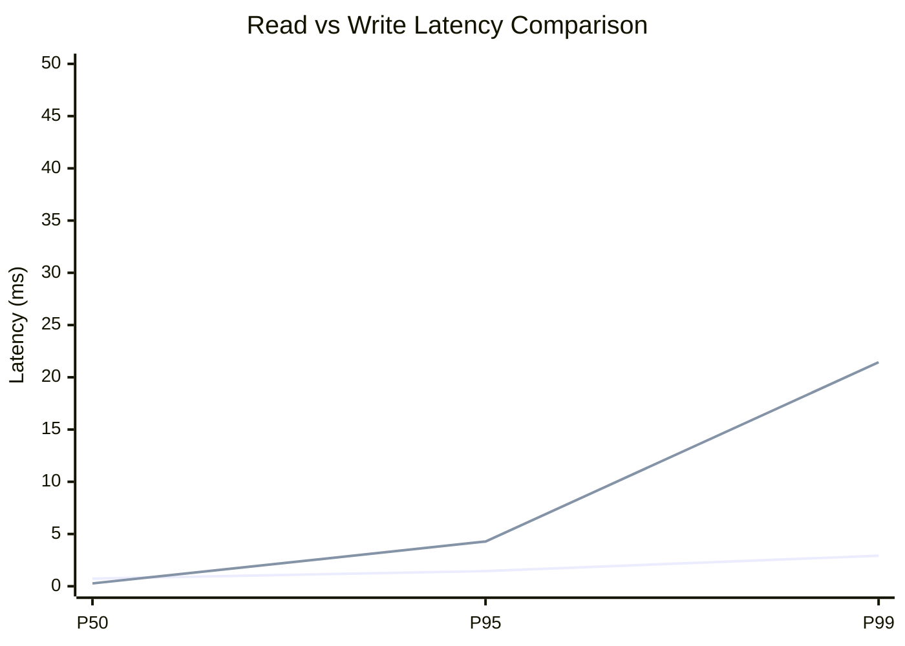
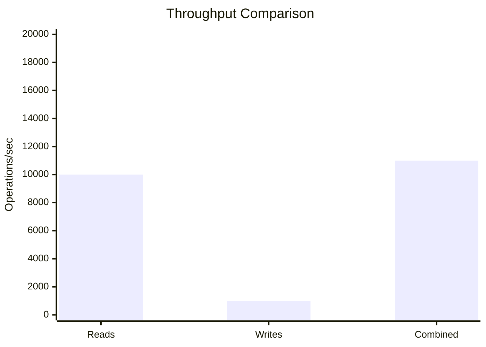
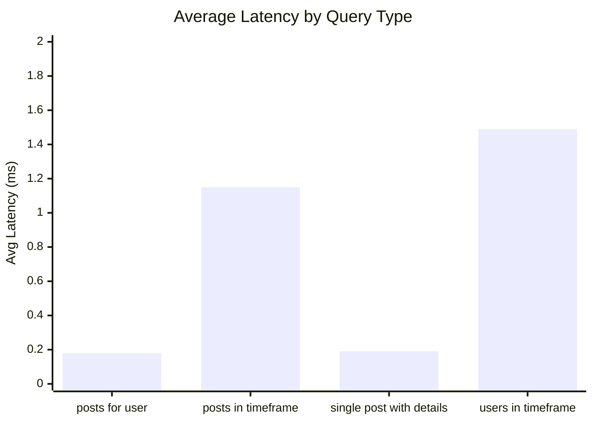
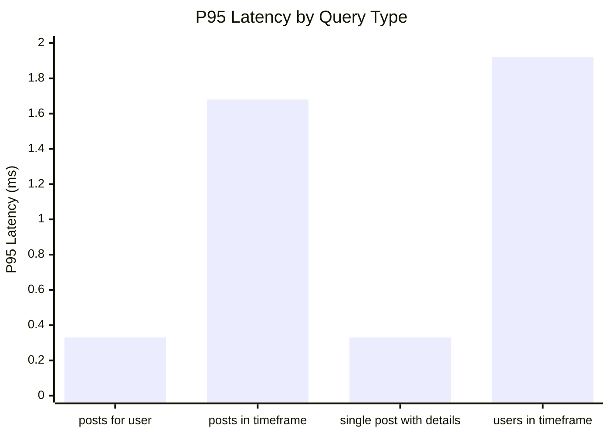
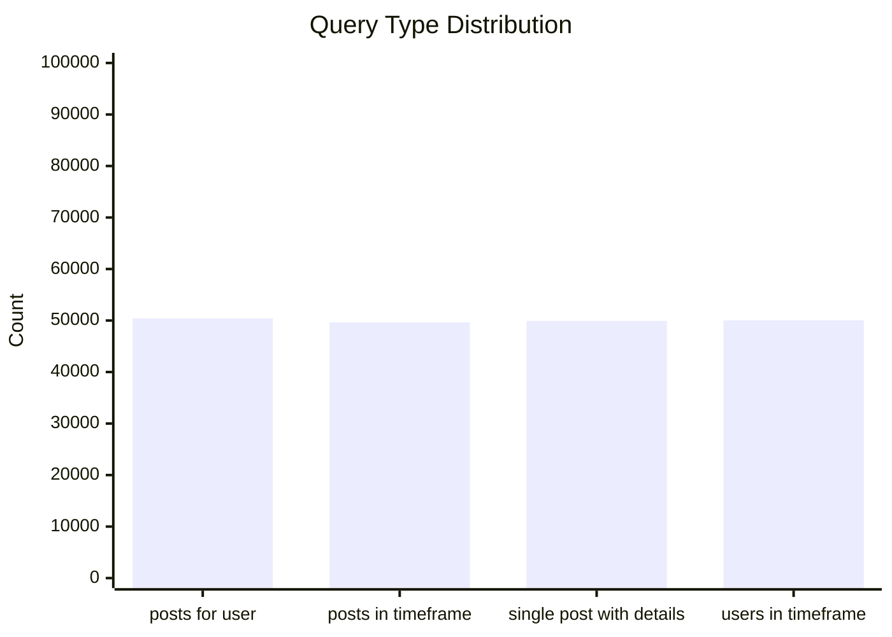
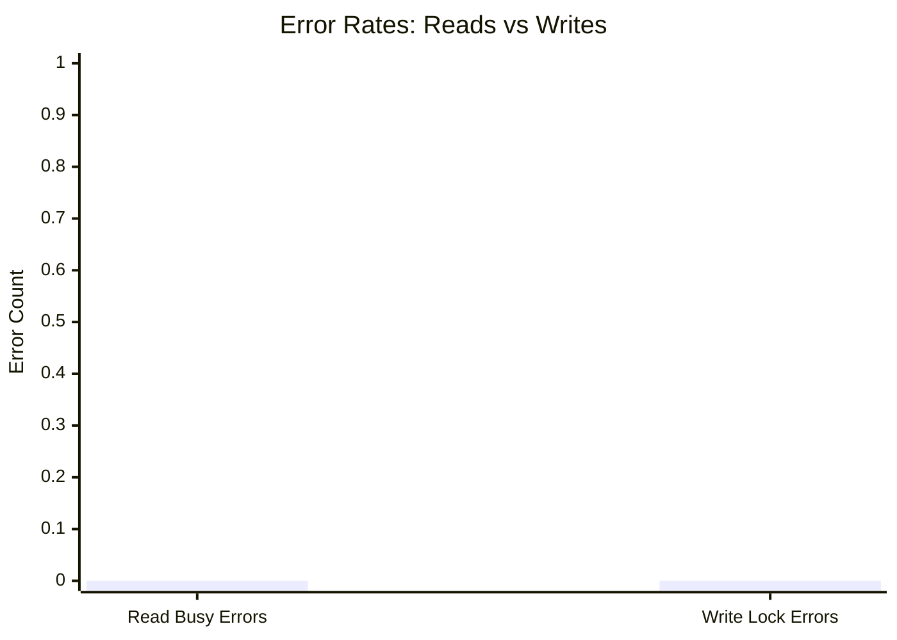
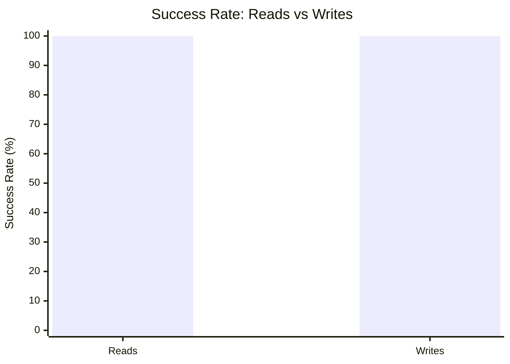

# Mixed Read/Write Benchmark: r18_w5_R200k_W20k_c48mb

**Test Run:** 12/25/2025, 6:16:10 PM

## Configuration

| Setting | Value |
|---------|-------|
| ID | r18_w5_R200k_W20k_c48mb |
| Read Workers | 18 |
| Write Workers | 5 |
| Total Reads | 200,016 |
| Total Writes | 20,000 |
| Total Operations | 220,016 |
| Read:Write Ratio | 10.0:1 |
| Cache Size | 48000 KB (48 MB) |

## Summary

| Metric | Reads | Writes | Combined |
|--------|-------|--------|----------|
| Total | 200,016 | 20,000 | 220,016 |
| Successful | 200,016 | 20,000 | - |
| Success Rate | 100.0% | 100.0% | - |
| Throughput | 9999/sec | 1000/sec | 10998/sec |
| Avg Latency | 0.75ms | 1.63ms | - |
| P50 Latency | 0.73ms | 0.27ms | - |
| P95 Latency | 1.45ms | 4.28ms | - |
| P99 Latency | 2.92ms | 21.44ms | - |
| Errors | 0 (busy: 0) | 0 (lock: 0) | - |

**Total Duration:** 20.00 seconds

## Read Query Breakdown

| Query Type | Count | Avg (ms) | P95 (ms) | P99 (ms) | Avg Rows |
|------------|-------|----------|----------|----------|----------|
| posts_for_user | 50,412 | 0.18 | 0.33 | 0.99 | 0.3 |
| posts_in_timeframe | 49,634 | 1.15 | 1.68 | 2.91 | 100.0 |
| single_post_with_details | 49,936 | 0.19 | 0.33 | 0.94 | 1.4 |
| users_in_timeframe | 50,034 | 1.49 | 1.92 | 12.58 | 268.7 |


## Charts

### Read vs Write Latency Comparison

This chart compares latency percentiles (P50, P95, P99) between read and write operations. It shows how read and write latencies differ under concurrent load.



### Throughput Comparison

This chart compares the throughput of reads, writes, and combined operations. It shows the relative performance of read vs write operations.



### Average Latency by Query Type

This chart shows the average latency for each read query type. It helps identify which queries are the slowest.



### P95 Latency by Query Type

This chart shows the P95 latency (95th percentile) for each read query type. It highlights the worst-case performance for each query type.



### Query Type Distribution

This chart shows the distribution of query types executed during the test. It helps verify that queries are evenly distributed.



### Error Rates

This chart compares error rates between reads (SQLITE_BUSY errors) and writes (lock errors). It helps identify contention issues.



### Success Rate Comparison

This chart compares the success rate of read vs write operations. Both should ideally be at 100%.



## Key Observations

### Read Performance
- **200,016** successful reads out of 200,016 (100.0% success rate)
- Average read latency: **0.75ms**, P99: **2.92ms**
- Read throughput: **9999 reads/sec**
- ✅ No busy errors during reads (WAL mode working well)

### Write Performance
- **20,000** successful writes out of 20,000 (100.0% success rate)
- Average write latency: **1.63ms**, P99: **21.44ms**
- Write throughput: **1000 writes/sec**
- ✅ No lock errors during writes

### Combined Throughput
- Total operations completed: **220,016**
- Combined throughput: **10998 ops/sec**

## Raw Data

<details>
<summary>Click to expand raw JSON data</summary>

```json
{
  "testName": "mixedReadWrite-r18_w5_R200k_W20k_c48mb",
  "timestamp": "2025-12-25T12:46:10.187Z",
  "configuration": {
    "id": "r18_w5_R200k_W20k_c48mb",
    "readWorkers": 18,
    "writeWorkers": 5,
    "readsPerWorker": 11112,
    "writesPerWorker": 4000,
    "totalReads": 200016,
    "totalWrites": 20000,
    "totalOperations": 220016,
    "readWriteRatio": 10.0008,
    "cacheSize": 48000
  },
  "duration": 20004.303731,
  "reads": {
    "total": 200016,
    "successful": 200016,
    "errors": 0,
    "busyErrors": 0,
    "successRate": 100,
    "avgTime": 0.7493997358161444,
    "minTime": 0.05408700000043609,
    "maxTime": 112.06546100000014,
    "p50": 0.726265000001149,
    "p95": 1.449137999999948,
    "p99": 2.9183759999996255,
    "readsPerSec": 9998.648425340689,
    "byQueryType": {
      "posts_for_user": {
        "count": 50412,
        "avgTime": 0.17944293981591458,
        "p95": 0.3272960000003877,
        "p99": 0.9947960000008607,
        "avgRowCount": 0.3267872728715385
      },
      "posts_in_timeframe": {
        "count": 49634,
        "avgTime": 1.1471715039489094,
        "p95": 1.681561999999758,
        "p99": 2.9052360000005137,
        "avgRowCount": 100
      },
      "single_post_with_details": {
        "count": 49936,
        "avgTime": 0.18717329810157143,
        "p95": 0.3262799999993149,
        "p99": 0.9424020000005839,
        "avgRowCount": 1.400032041012496
      },
      "users_in_timeframe": {
        "count": 50034,
        "avgTime": 1.4901959434784402,
        "p95": 1.9171519999999873,
        "p99": 12.582832999998573,
        "avgRowCount": 268.66298916736616
      }
    }
  },
  "writes": {
    "total": 20000,
    "successful": 20000,
    "errors": 0,
    "lockErrors": 0,
    "successRate": 100,
    "avgTime": 1.6336744303500015,
    "minTime": 0.08707200000026205,
    "maxTime": 444.0692320000003,
    "p50": 0.27458999999998923,
    "p95": 4.284734000000753,
    "p99": 21.43583100000069,
    "writesPerSec": 999.7848597452892
  },
  "combined": {
    "totalOps": 220016,
    "opsPerSec": 10998.433285085977
  }
}
```

</details>
