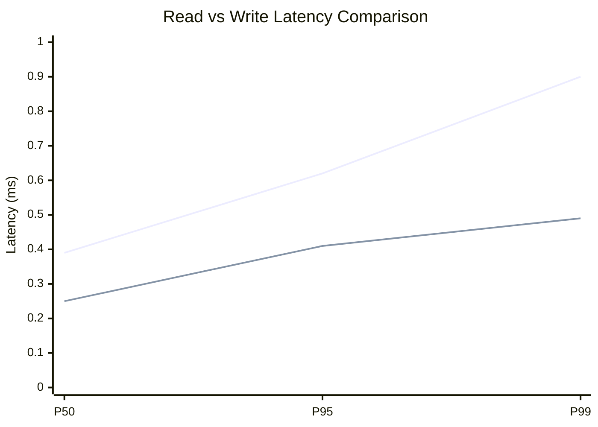
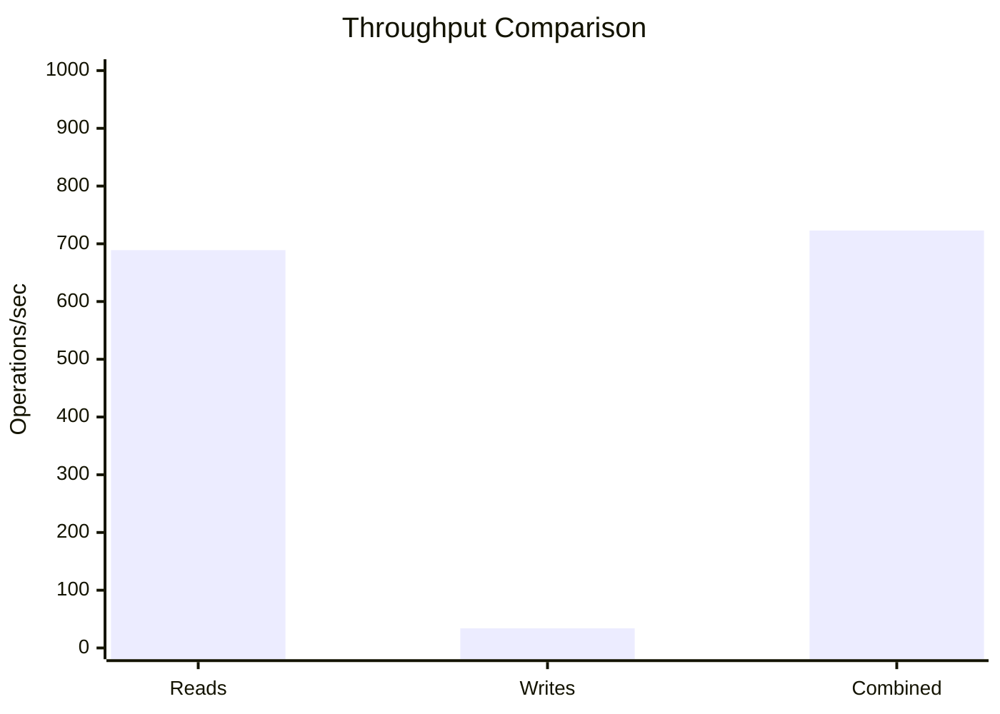
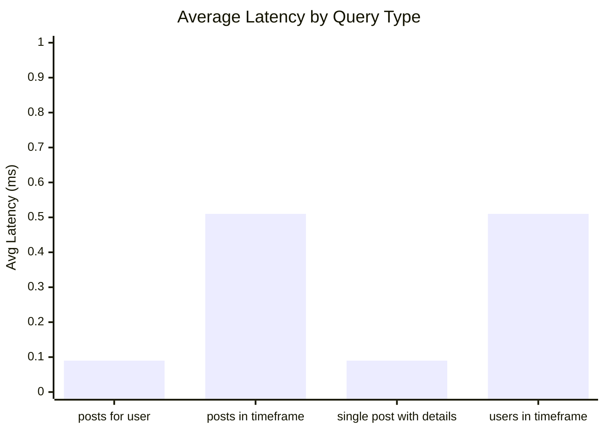
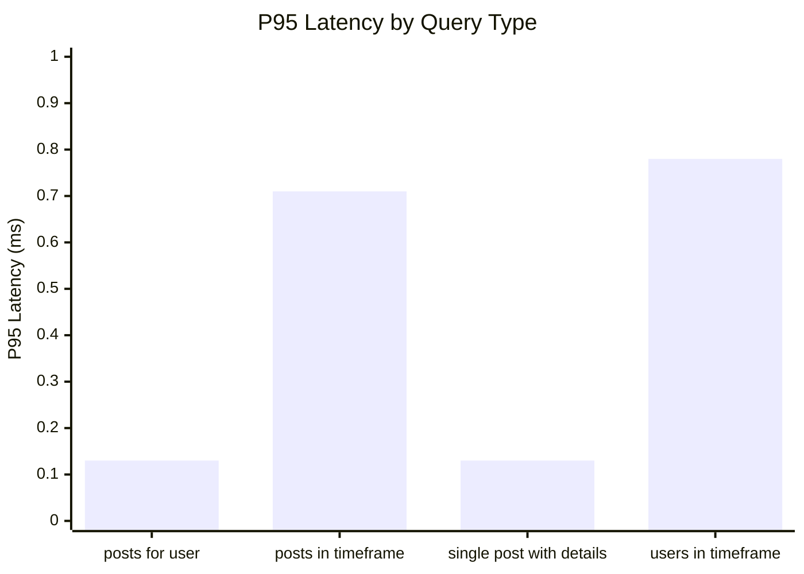
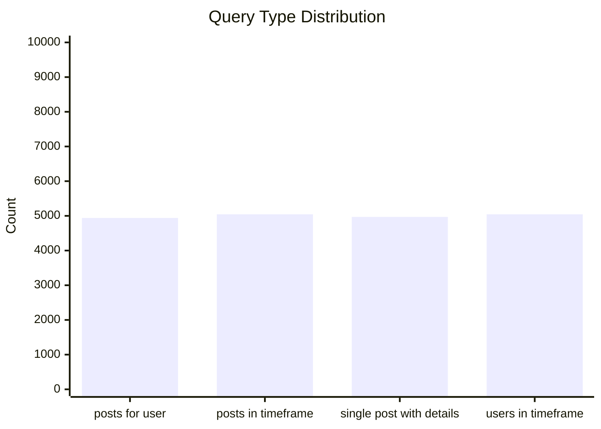
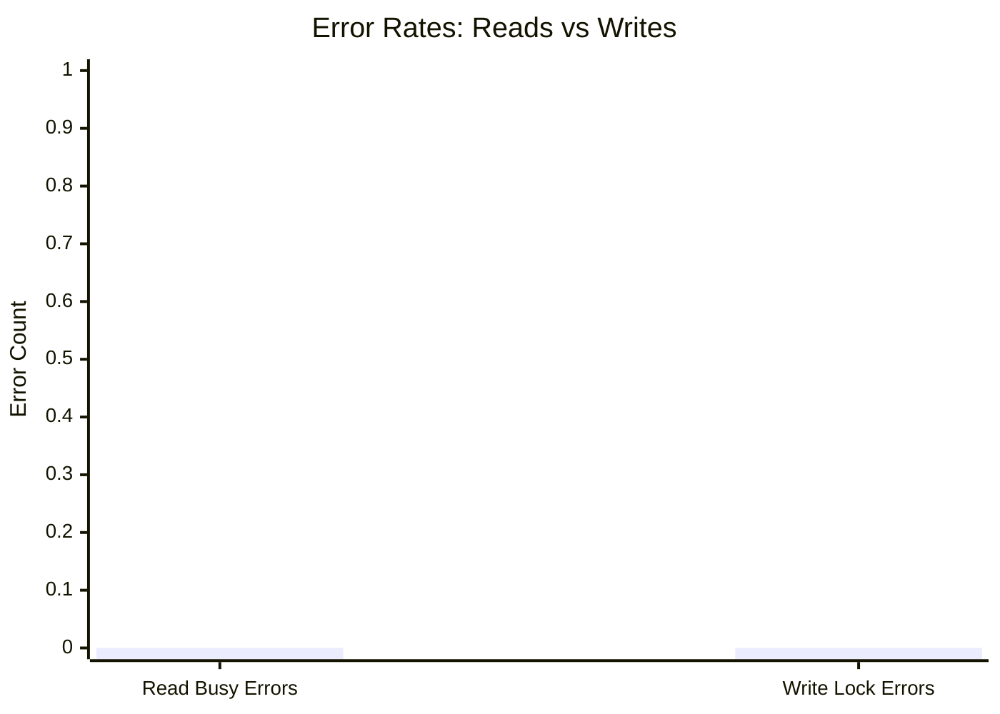
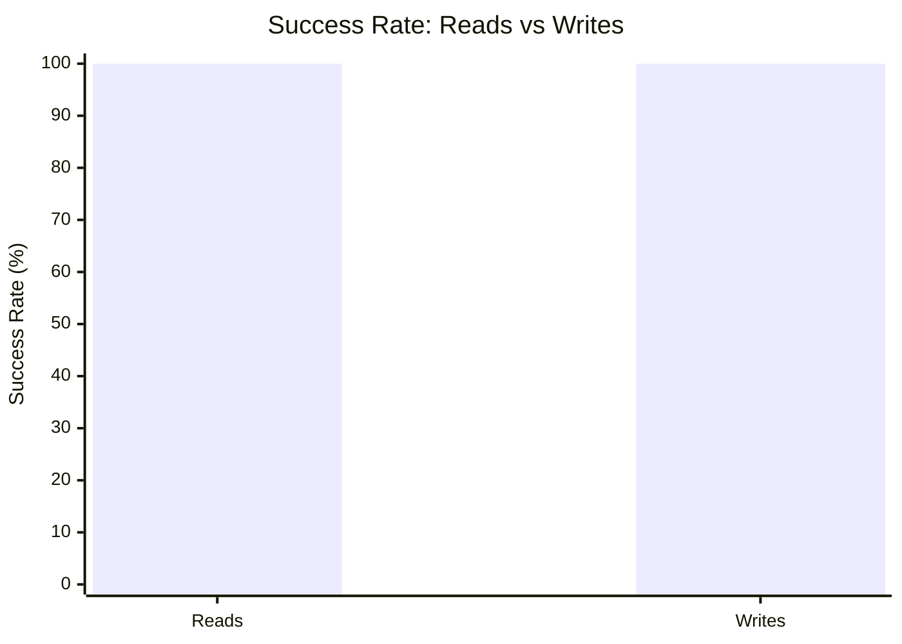

# Mixed Read/Write Benchmark: r1_w1_R20k_W1k_c16mb

**Test Run:** 12/25/2025, 1:46:17 AM

## Configuration

| Setting | Value |
|---------|-------|
| ID | r1_w1_R20k_W1k_c16mb |
| Read Workers | 1 |
| Write Workers | 1 |
| Total Reads | 20,000 |
| Total Writes | 1,000 |
| Total Operations | 21,000 |
| Read:Write Ratio | 20.0:1 |
| Cache Size | 16000 KB (16 MB) |

## Summary

| Metric | Reads | Writes | Combined |
|--------|-------|--------|----------|
| Total | 20,000 | 1,000 | 21,000 |
| Successful | 20,000 | 1,000 | - |
| Success Rate | 100.0% | 100.0% | - |
| Throughput | 689/sec | 34/sec | 723/sec |
| Avg Latency | 0.30ms | 0.22ms | - |
| P50 Latency | 0.39ms | 0.25ms | - |
| P95 Latency | 0.62ms | 0.41ms | - |
| P99 Latency | 0.90ms | 0.49ms | - |
| Errors | 0 (busy: 0) | 0 (lock: 0) | - |

**Total Duration:** 29.05 seconds

## Read Query Breakdown

| Query Type | Count | Avg (ms) | P95 (ms) | P99 (ms) | Avg Rows |
|------------|-------|----------|----------|----------|----------|
| posts_for_user | 4,939 | 0.09 | 0.13 | 0.20 | 0.3 |
| posts_in_timeframe | 5,045 | 0.51 | 0.71 | 1.09 | 100.0 |
| single_post_with_details | 4,970 | 0.09 | 0.13 | 0.20 | 1.3 |
| users_in_timeframe | 5,046 | 0.51 | 0.78 | 1.04 | 189.4 |


## Charts

### Read vs Write Latency Comparison

This chart compares latency percentiles (P50, P95, P99) between read and write operations. It shows how read and write latencies differ under concurrent load.



### Throughput Comparison

This chart compares the throughput of reads, writes, and combined operations. It shows the relative performance of read vs write operations.



### Average Latency by Query Type

This chart shows the average latency for each read query type. It helps identify which queries are the slowest.



### P95 Latency by Query Type

This chart shows the P95 latency (95th percentile) for each read query type. It highlights the worst-case performance for each query type.



### Query Type Distribution

This chart shows the distribution of query types executed during the test. It helps verify that queries are evenly distributed.



### Error Rates

This chart compares error rates between reads (SQLITE_BUSY errors) and writes (lock errors). It helps identify contention issues.



### Success Rate Comparison

This chart compares the success rate of read vs write operations. Both should ideally be at 100%.



## Key Observations

### Read Performance
- **20,000** successful reads out of 20,000 (100.0% success rate)
- Average read latency: **0.30ms**, P99: **0.90ms**
- Read throughput: **689 reads/sec**
- ✅ No busy errors during reads (WAL mode working well)

### Write Performance
- **1,000** successful writes out of 1,000 (100.0% success rate)
- Average write latency: **0.22ms**, P99: **0.49ms**
- Write throughput: **34 writes/sec**
- ✅ No lock errors during writes

### Combined Throughput
- Total operations completed: **21,000**
- Combined throughput: **723 ops/sec**

## Raw Data

<details>
<summary>Click to expand raw JSON data</summary>

```json
{
  "testName": "mixedReadWrite-r1_w1_R20k_W1k_c16mb",
  "timestamp": "2025-12-24T20:16:17.887Z",
  "configuration": {
    "id": "r1_w1_R20k_W1k_c16mb",
    "readWorkers": 1,
    "writeWorkers": 1,
    "readsPerWorker": 20000,
    "writesPerWorker": 1000,
    "totalReads": 20000,
    "totalWrites": 1000,
    "totalOperations": 21000,
    "readWriteRatio": 20,
    "cacheSize": -16000
  },
  "duration": 29045.397634,
  "reads": {
    "total": 20000,
    "successful": 20000,
    "errors": 0,
    "busyErrors": 0,
    "successRate": 100,
    "avgTime": 0.3027295967000019,
    "minTime": 0.0472210000002633,
    "maxTime": 11.243352999998024,
    "p50": 0.39068200000019715,
    "p95": 0.6160500000005413,
    "p99": 0.8974589999997988,
    "readsPerSec": 688.5772490368103,
    "byQueryType": {
      "posts_for_user": {
        "count": 4939,
        "avgTime": 0.09034496659244562,
        "p95": 0.12984899999992194,
        "p99": 0.19615999999950873,
        "avgRowCount": 0.2739420935412027
      },
      "posts_in_timeframe": {
        "count": 5045,
        "avgTime": 0.5084058681863076,
        "p95": 0.712242999998125,
        "p99": 1.0883229999999458,
        "avgRowCount": 100
      },
      "single_post_with_details": {
        "count": 4970,
        "avgTime": 0.09219706760562262,
        "p95": 0.1308590000003278,
        "p99": 0.20129300000007788,
        "avgRowCount": 1.256539235412475
      },
      "users_in_timeframe": {
        "count": 5046,
        "avgTime": 0.5123367247324767,
        "p95": 0.7758510000021488,
        "p99": 1.039161000000604,
        "avgRowCount": 189.375941339675
      }
    }
  },
  "writes": {
    "total": 1000,
    "successful": 1000,
    "errors": 0,
    "lockErrors": 0,
    "successRate": 100,
    "avgTime": 0.22331442300000184,
    "minTime": 0.06468700000004901,
    "maxTime": 0.598173000000088,
    "p50": 0.25204699999994773,
    "p95": 0.40929099999993923,
    "p99": 0.48763899999994464,
    "writesPerSec": 34.428862451840516
  },
  "combined": {
    "totalOps": 21000,
    "opsPerSec": 723.0061114886508
  }
}
```

</details>
