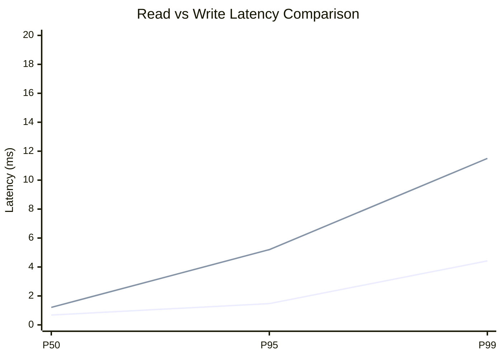
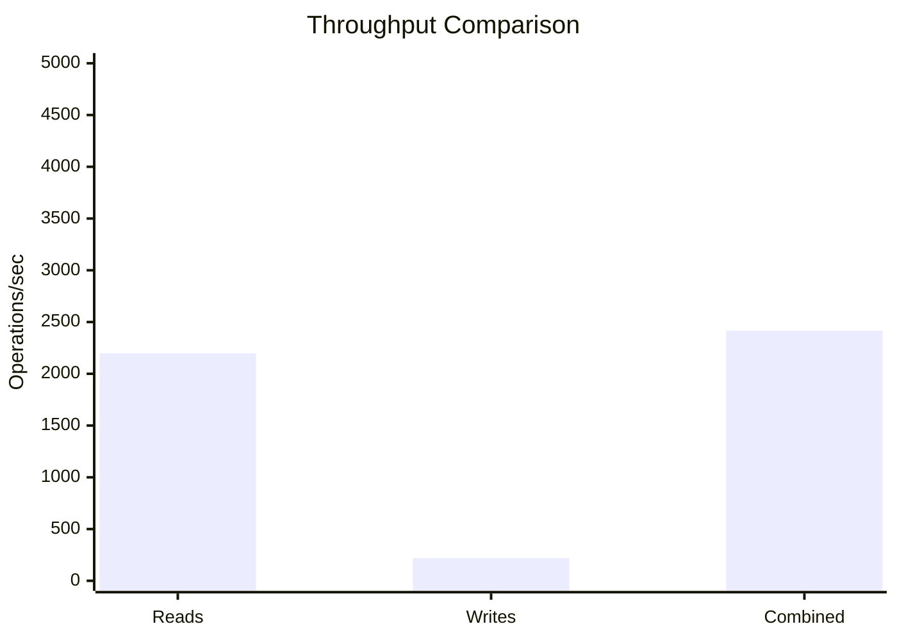
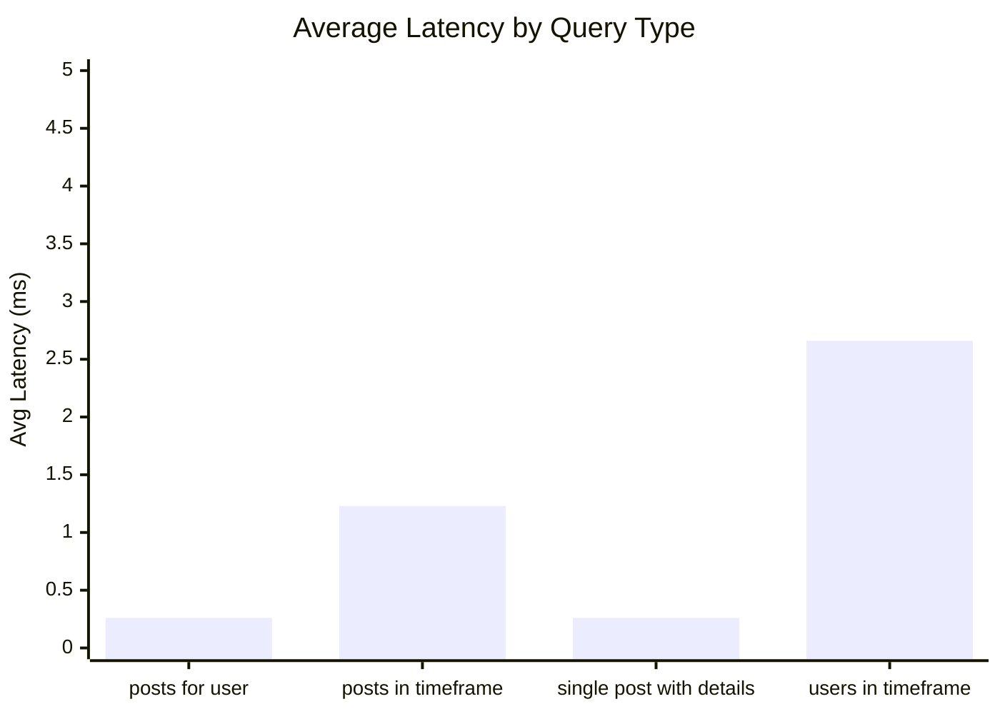
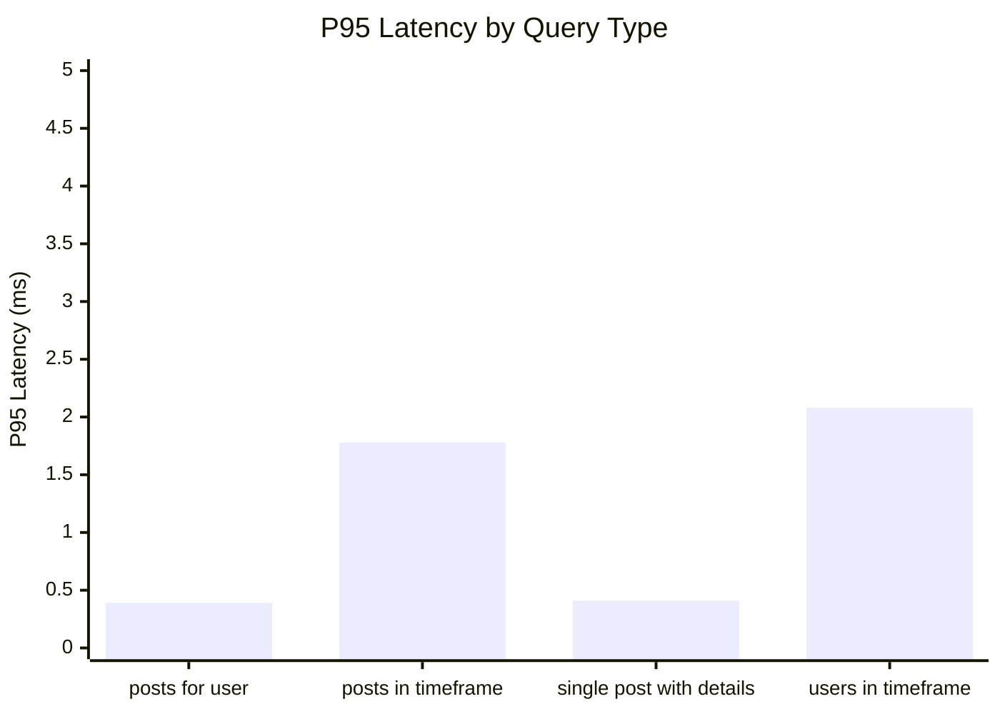
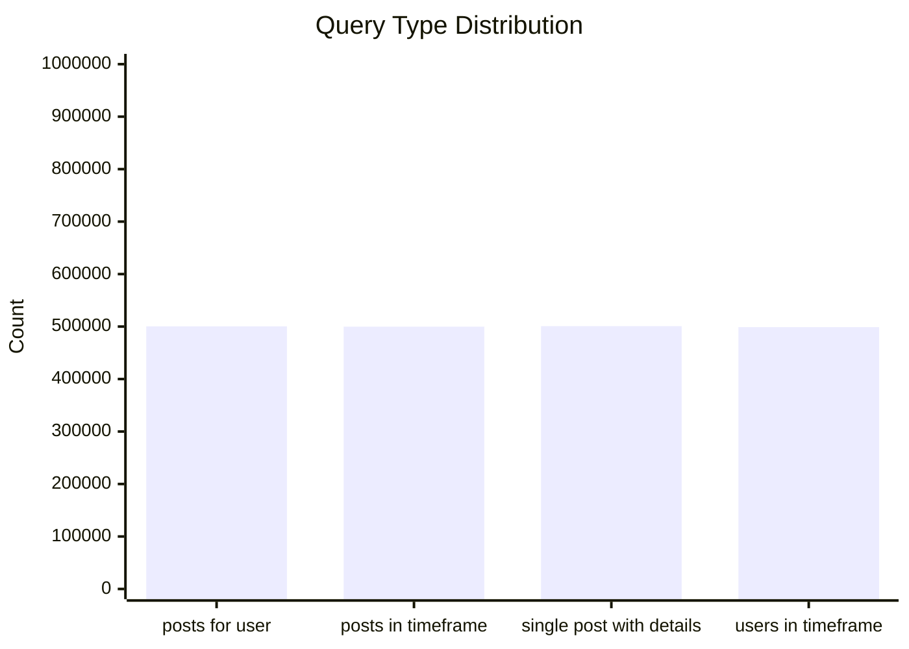
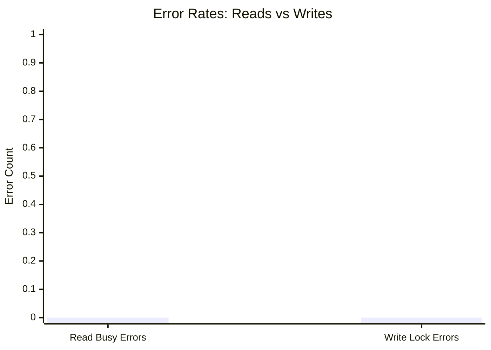
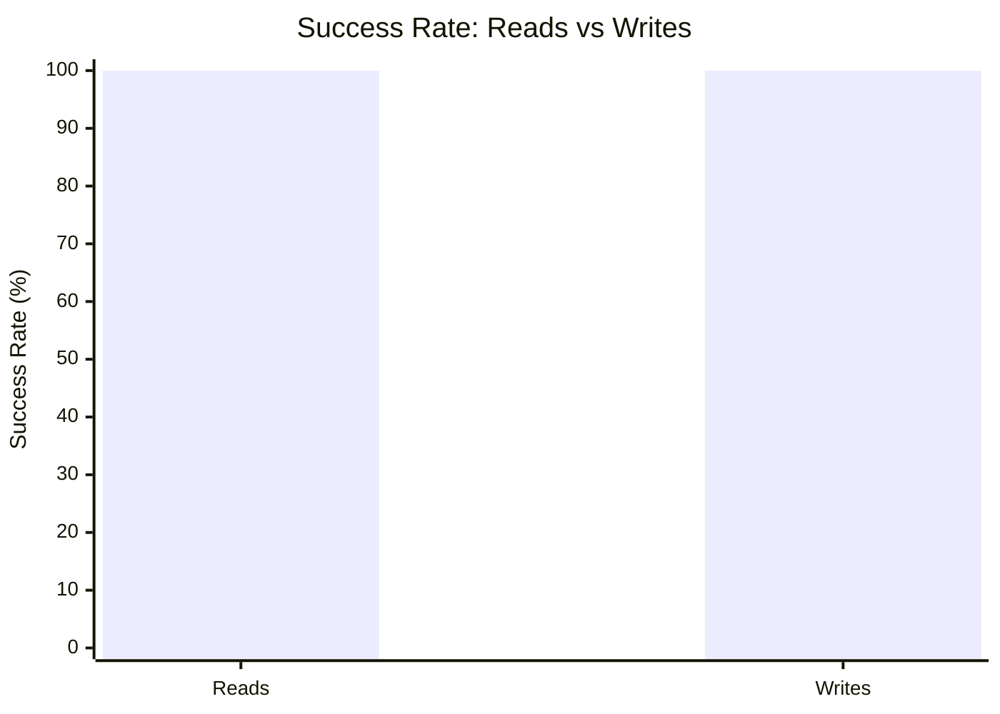

# Mixed Read/Write Benchmark: r20_w4_R2m_W200k_c100mb

**Test Run:** 12/25/2025, 12:56:12 PM

## Configuration

| Setting | Value |
|---------|-------|
| ID | r20_w4_R2m_W200k_c100mb |
| Read Workers | 20 |
| Write Workers | 4 |
| Total Reads | 2,000,000 |
| Total Writes | 200,000 |
| Total Operations | 2,200,000 |
| Read:Write Ratio | 10.0:1 |
| Cache Size | 100000 KB (100 MB) |

## Summary

| Metric | Reads | Writes | Combined |
|--------|-------|--------|----------|
| Total | 2,000,000 | 200,000 | 2,200,000 |
| Successful | 2,000,000 | 200,000 | - |
| Success Rate | 100.0% | 100.0% | - |
| Throughput | 2197/sec | 220/sec | 2417/sec |
| Avg Latency | 1.10ms | 1.80ms | - |
| P50 Latency | 0.68ms | 1.21ms | - |
| P95 Latency | 1.47ms | 5.20ms | - |
| P99 Latency | 4.42ms | 11.50ms | - |
| Errors | 0 (busy: 0) | 0 (lock: 0) | - |

**Total Duration:** 910.24 seconds

## Read Query Breakdown

| Query Type | Count | Avg (ms) | P95 (ms) | P99 (ms) | Avg Rows |
|------------|-------|----------|----------|----------|----------|
| posts_for_user | 500,473 | 0.26 | 0.39 | 1.07 | 0.8 |
| posts_in_timeframe | 499,841 | 1.23 | 1.78 | 5.49 | 100.0 |
| single_post_with_details | 500,789 | 0.26 | 0.41 | 1.01 | 4.9 |
| users_in_timeframe | 498,897 | 2.66 | 2.08 | 21.78 | 504.0 |


## Charts

### Read vs Write Latency Comparison

This chart compares latency percentiles (P50, P95, P99) between read and write operations. It shows how read and write latencies differ under concurrent load.



### Throughput Comparison

This chart compares the throughput of reads, writes, and combined operations. It shows the relative performance of read vs write operations.



### Average Latency by Query Type

This chart shows the average latency for each read query type. It helps identify which queries are the slowest.



### P95 Latency by Query Type

This chart shows the P95 latency (95th percentile) for each read query type. It highlights the worst-case performance for each query type.



### Query Type Distribution

This chart shows the distribution of query types executed during the test. It helps verify that queries are evenly distributed.



### Error Rates

This chart compares error rates between reads (SQLITE_BUSY errors) and writes (lock errors). It helps identify contention issues.



### Success Rate Comparison

This chart compares the success rate of read vs write operations. Both should ideally be at 100%.



## Key Observations

### Read Performance
- **2,000,000** successful reads out of 2,000,000 (100.0% success rate)
- Average read latency: **1.10ms**, P99: **4.42ms**
- Read throughput: **2197 reads/sec**
- ✅ No busy errors during reads (WAL mode working well)

### Write Performance
- **200,000** successful writes out of 200,000 (100.0% success rate)
- Average write latency: **1.80ms**, P99: **11.50ms**
- Write throughput: **220 writes/sec**
- ✅ No lock errors during writes

### Combined Throughput
- Total operations completed: **2,200,000**
- Combined throughput: **2417 ops/sec**

## Raw Data

<details>
<summary>Click to expand raw JSON data</summary>

```json
{
  "testName": "mixedReadWrite-r20_w4_R2m_W200k_c100mb",
  "timestamp": "2025-12-25T07:26:12.084Z",
  "configuration": {
    "id": "r20_w4_R2m_W200k_c100mb",
    "readWorkers": 20,
    "writeWorkers": 4,
    "readsPerWorker": 100000,
    "writesPerWorker": 50000,
    "totalReads": 2000000,
    "totalWrites": 200000,
    "totalOperations": 2200000,
    "readWriteRatio": 10,
    "cacheSize": 100000
  },
  "duration": 910238.56589,
  "reads": {
    "total": 2000000,
    "successful": 2000000,
    "errors": 0,
    "busyErrors": 0,
    "successRate": 100,
    "avgTime": 1.1016032600897627,
    "minTime": 0.05331999999907566,
    "maxTime": 564.6181619999697,
    "p50": 0.6848560000071302,
    "p95": 1.4683080000104383,
    "p99": 4.422717000008561,
    "readsPerSec": 2197.226172288656,
    "byQueryType": {
      "posts_for_user": {
        "count": 500473,
        "avgTime": 0.26060161722203934,
        "p95": 0.38519500009715557,
        "p99": 1.0672660000273027,
        "avgRowCount": 0.8131287801739554
      },
      "posts_in_timeframe": {
        "count": 499841,
        "avgTime": 1.2319669765524852,
        "p95": 1.7816430000821128,
        "p99": 5.494838999999047,
        "avgRowCount": 100
      },
      "single_post_with_details": {
        "count": 500789,
        "avgTime": 0.2607085602239494,
        "p95": 0.4089300000014191,
        "p99": 1.0066650000517257,
        "avgRowCount": 4.894752081215842
      },
      "users_in_timeframe": {
        "count": 498897,
        "avgTime": 2.6587348937977895,
        "p95": 2.082771999994293,
        "p99": 21.777264000003925,
        "avgRowCount": 503.9968751064849
      }
    }
  },
  "writes": {
    "total": 200000,
    "successful": 200000,
    "errors": 0,
    "lockErrors": 0,
    "successRate": 100,
    "avgTime": 1.7953210748400632,
    "minTime": 0.07599299994762987,
    "maxTime": 249.91468100000202,
    "p50": 1.213830999971833,
    "p95": 5.200554000097327,
    "p99": 11.496578000020236,
    "writesPerSec": 219.72261722886557
  },
  "combined": {
    "totalOps": 2200000,
    "opsPerSec": 2416.948789517521
  }
}
```

</details>
