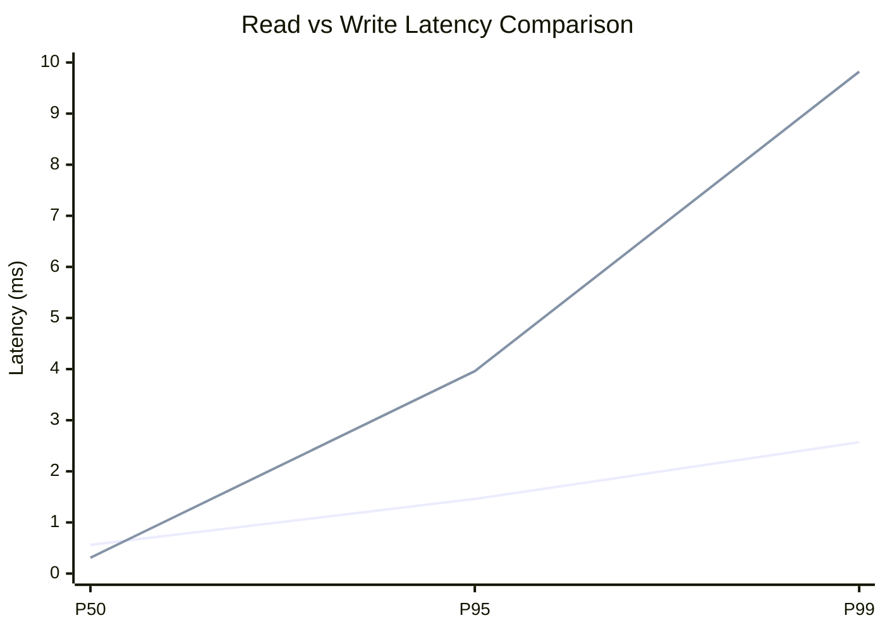
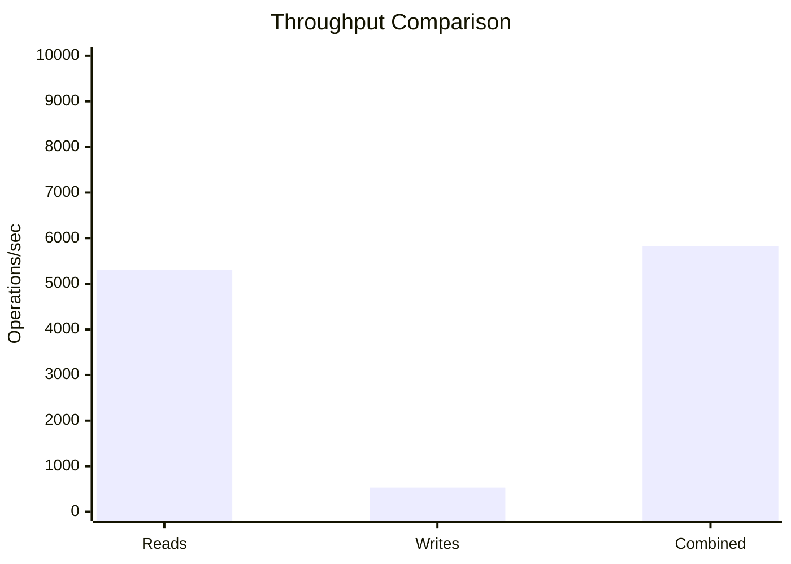
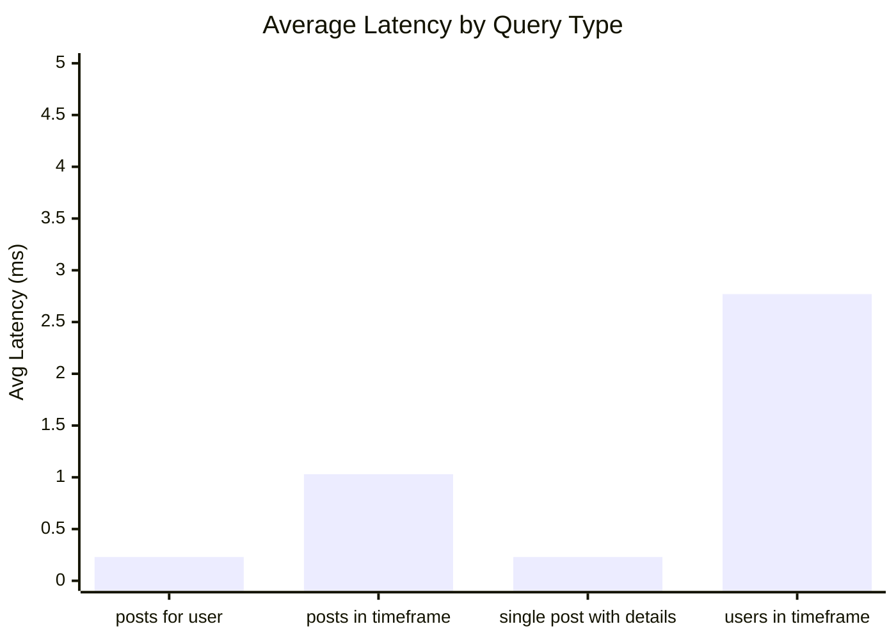
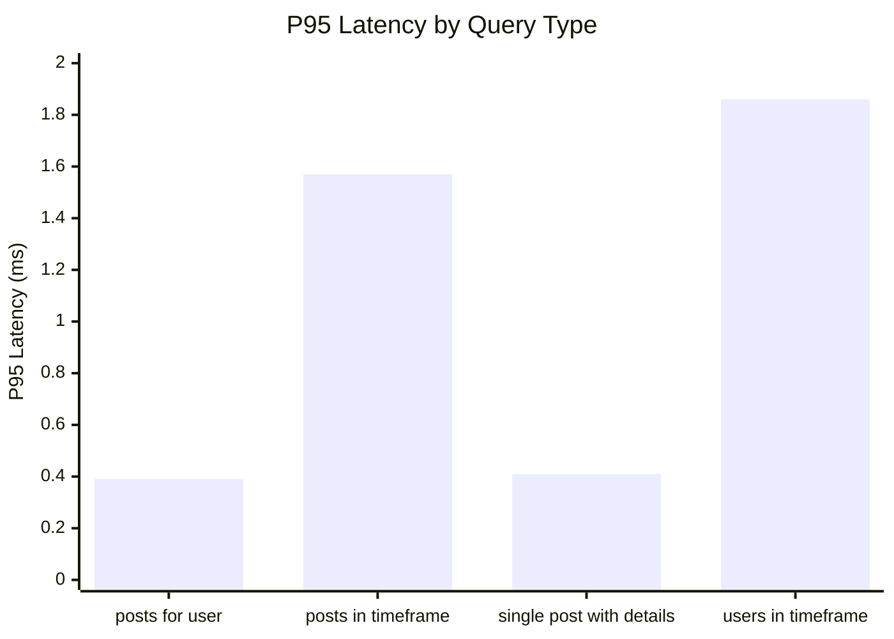
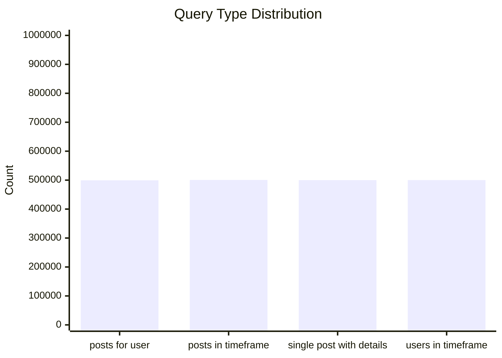
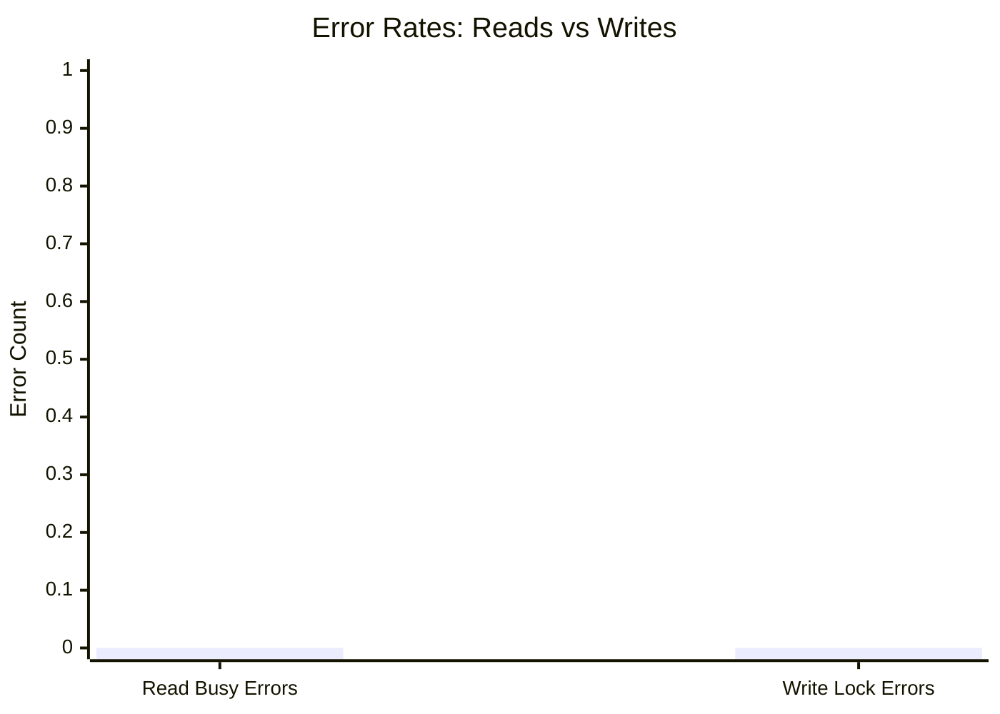
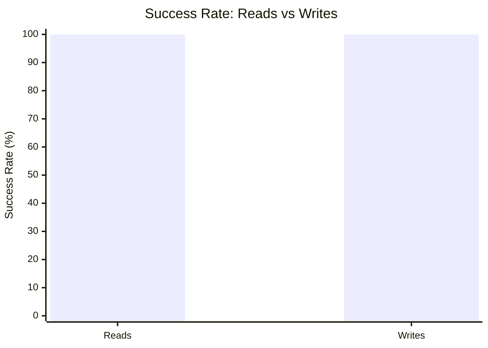

# Mixed Read/Write Benchmark: r20_w4_R2m_W200k_c24mb

**Test Run:** 12/25/2025, 2:45:22 PM

## Configuration

| Setting | Value |
|---------|-------|
| ID | r20_w4_R2m_W200k_c24mb |
| Read Workers | 20 |
| Write Workers | 4 |
| Total Reads | 2,000,000 |
| Total Writes | 200,000 |
| Total Operations | 2,200,000 |
| Read:Write Ratio | 10.0:1 |
| Cache Size | 24000 KB (24 MB) |

## Summary

| Metric | Reads | Writes | Combined |
|--------|-------|--------|----------|
| Total | 2,000,000 | 200,000 | 2,200,000 |
| Successful | 2,000,000 | 200,000 | - |
| Success Rate | 100.0% | 100.0% | - |
| Throughput | 5300/sec | 530/sec | 5830/sec |
| Avg Latency | 1.07ms | 1.29ms | - |
| P50 Latency | 0.56ms | 0.31ms | - |
| P95 Latency | 1.46ms | 3.96ms | - |
| P99 Latency | 2.57ms | 9.82ms | - |
| Errors | 0 (busy: 0) | 0 (lock: 0) | - |

**Total Duration:** 377.38 seconds

## Read Query Breakdown

| Query Type | Count | Avg (ms) | P95 (ms) | P99 (ms) | Avg Rows |
|------------|-------|----------|----------|----------|----------|
| posts_for_user | 499,463 | 0.23 | 0.39 | 0.78 | 0.8 |
| posts_in_timeframe | 500,552 | 1.03 | 1.57 | 2.72 | 100.0 |
| single_post_with_details | 499,931 | 0.23 | 0.41 | 0.77 | 4.7 |
| users_in_timeframe | 500,054 | 2.77 | 1.86 | 34.10 | 587.5 |


## Charts

### Read vs Write Latency Comparison

This chart compares latency percentiles (P50, P95, P99) between read and write operations. It shows how read and write latencies differ under concurrent load.



### Throughput Comparison

This chart compares the throughput of reads, writes, and combined operations. It shows the relative performance of read vs write operations.



### Average Latency by Query Type

This chart shows the average latency for each read query type. It helps identify which queries are the slowest.



### P95 Latency by Query Type

This chart shows the P95 latency (95th percentile) for each read query type. It highlights the worst-case performance for each query type.



### Query Type Distribution

This chart shows the distribution of query types executed during the test. It helps verify that queries are evenly distributed.



### Error Rates

This chart compares error rates between reads (SQLITE_BUSY errors) and writes (lock errors). It helps identify contention issues.



### Success Rate Comparison

This chart compares the success rate of read vs write operations. Both should ideally be at 100%.



## Key Observations

### Read Performance
- **2,000,000** successful reads out of 2,000,000 (100.0% success rate)
- Average read latency: **1.07ms**, P99: **2.57ms**
- Read throughput: **5300 reads/sec**
- ✅ No busy errors during reads (WAL mode working well)

### Write Performance
- **200,000** successful writes out of 200,000 (100.0% success rate)
- Average write latency: **1.29ms**, P99: **9.82ms**
- Write throughput: **530 writes/sec**
- ✅ No lock errors during writes

### Combined Throughput
- Total operations completed: **2,200,000**
- Combined throughput: **5830 ops/sec**

## Raw Data

<details>
<summary>Click to expand raw JSON data</summary>

```json
{
  "testName": "mixedReadWrite-r20_w4_R2m_W200k_c24mb",
  "timestamp": "2025-12-25T09:15:22.900Z",
  "configuration": {
    "id": "r20_w4_R2m_W200k_c24mb",
    "readWorkers": 20,
    "writeWorkers": 4,
    "readsPerWorker": 100000,
    "writesPerWorker": 50000,
    "totalReads": 2000000,
    "totalWrites": 200000,
    "totalOperations": 2200000,
    "readWriteRatio": 10,
    "cacheSize": 24000
  },
  "duration": 377384.67640500003,
  "reads": {
    "total": 2000000,
    "successful": 2000000,
    "errors": 0,
    "busyErrors": 0,
    "successRate": 100,
    "avgTime": 1.065157289409987,
    "minTime": 0.049302999999781605,
    "maxTime": 534.5787869999767,
    "p50": 0.5586369999982708,
    "p95": 1.4551339999889024,
    "p99": 2.568654999980936,
    "readsPerSec": 5299.632245411175,
    "byQueryType": {
      "posts_for_user": {
        "count": 499463,
        "avgTime": 0.22781444644548723,
        "p95": 0.389089000003878,
        "p99": 0.7798429999966174,
        "avgRowCount": 0.7891455423124436
      },
      "posts_in_timeframe": {
        "count": 500552,
        "avgTime": 1.029506171025175,
        "p95": 1.5661620000028051,
        "p99": 2.7176060000201687,
        "avgRowCount": 100
      },
      "single_post_with_details": {
        "count": 499931,
        "avgTime": 0.22809877077432236,
        "p95": 0.4103420000174083,
        "p99": 0.7667250000231434,
        "avgRowCount": 4.698876444949403
      },
      "users_in_timeframe": {
        "count": 500054,
        "avgTime": 2.7740497475532693,
        "p95": 1.8622869999962859,
        "p99": 34.0968259999936,
        "avgRowCount": 587.4999740028077
      }
    }
  },
  "writes": {
    "total": 200000,
    "successful": 200000,
    "errors": 0,
    "lockErrors": 0,
    "successRate": 100,
    "avgTime": 1.2855136367549629,
    "minTime": 0.06230999997933395,
    "maxTime": 192.69316300000355,
    "p50": 0.30523600001470186,
    "p95": 3.9551569999894127,
    "p99": 9.820896000001085,
    "writesPerSec": 529.9632245411176
  },
  "combined": {
    "totalOps": 2200000,
    "opsPerSec": 5829.595469952293
  }
}
```

</details>
