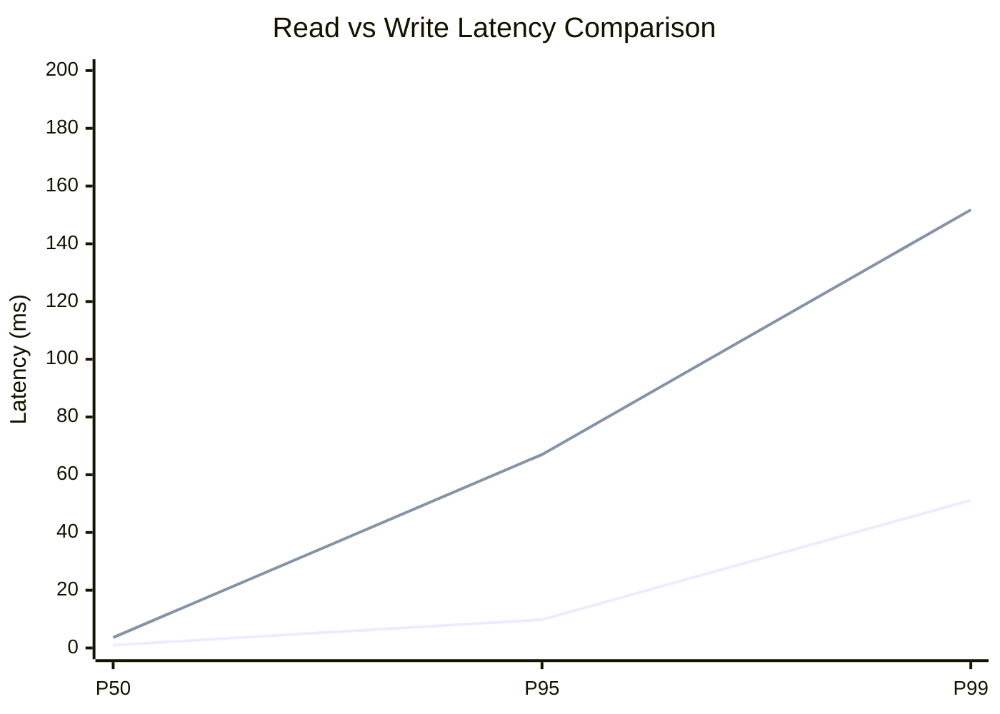
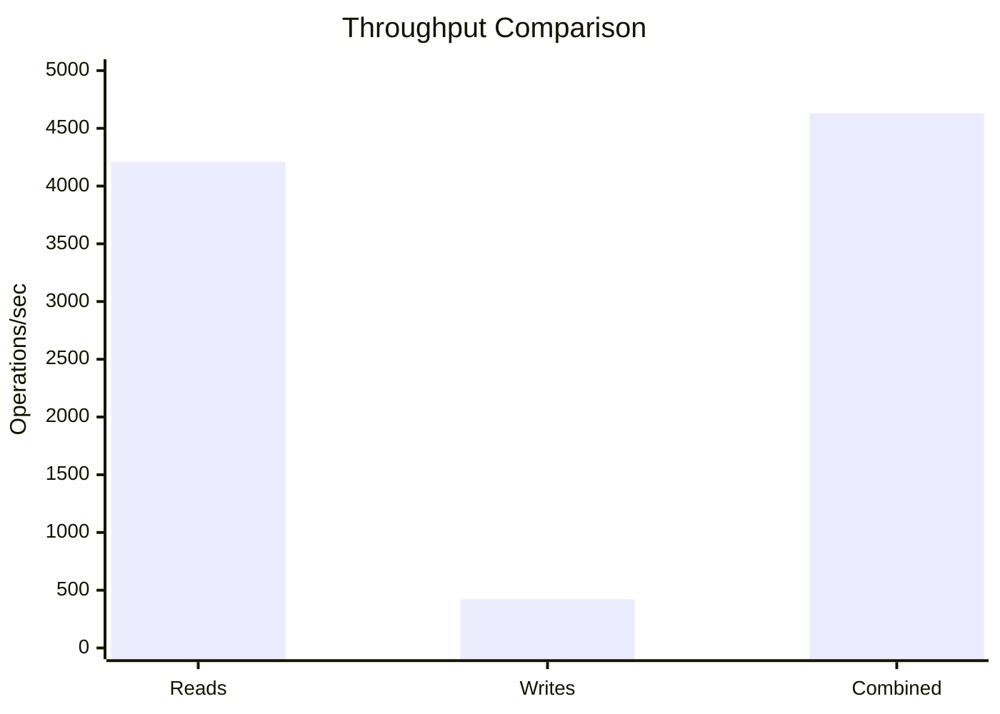
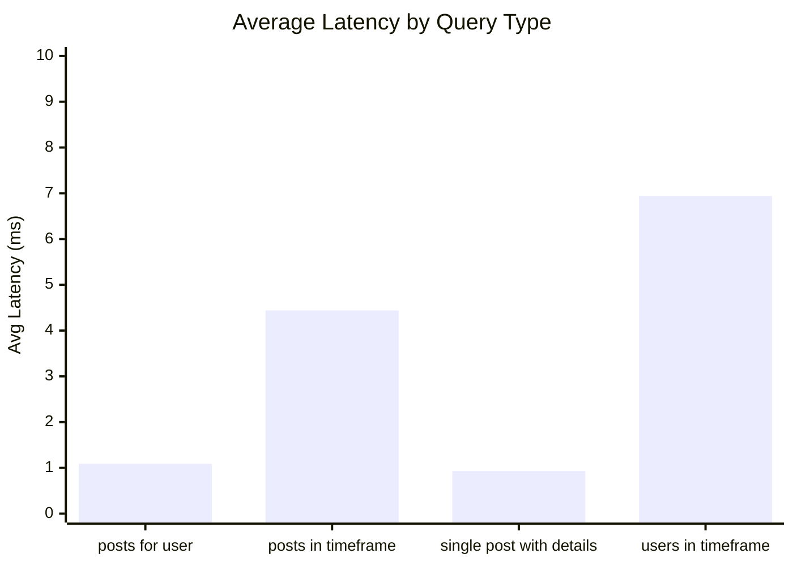
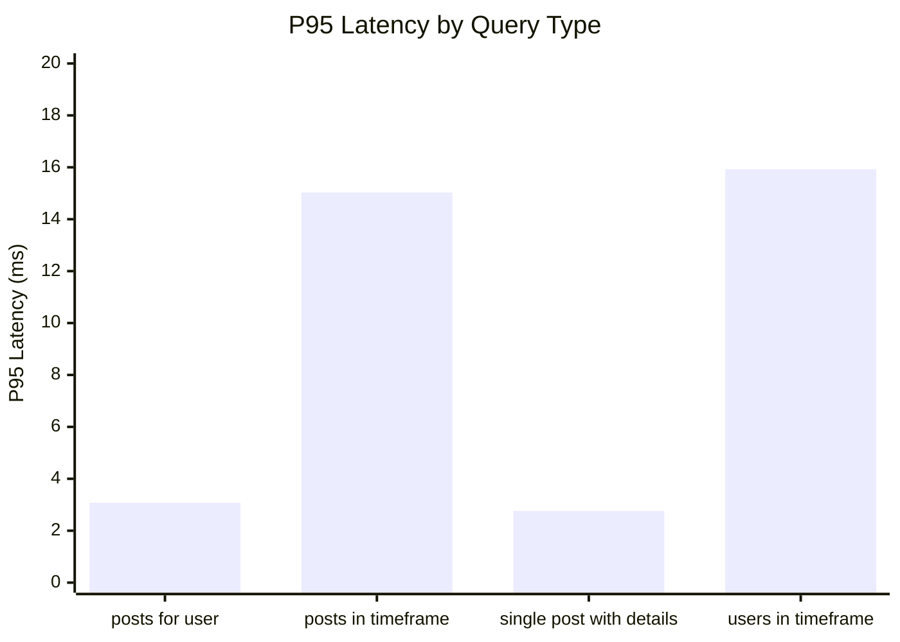
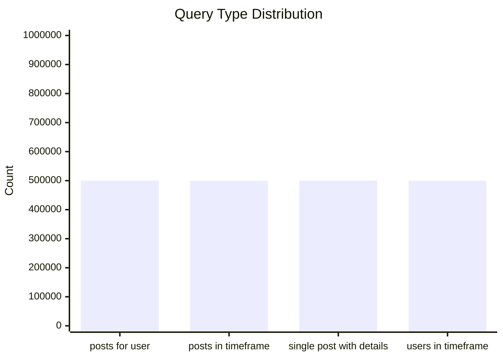
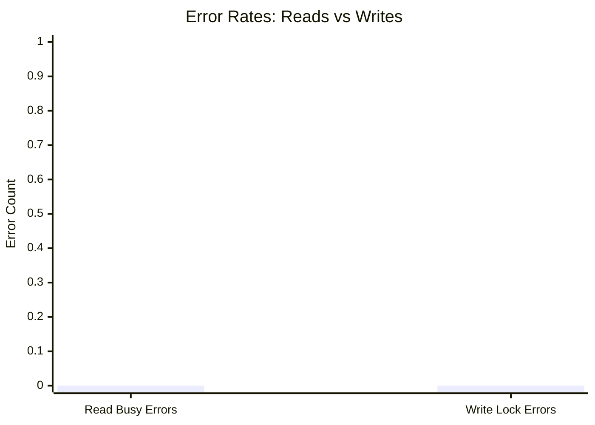
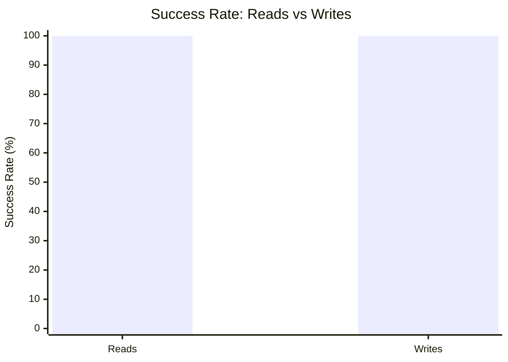

# Mixed Read/Write Benchmark: r400_w40_R2m_W200k_c100mb

**Test Run:** 12/25/2025, 2:55:31 PM

## Configuration

| Setting | Value |
|---------|-------|
| ID | r400_w40_R2m_W200k_c100mb |
| Read Workers | 400 |
| Write Workers | 40 |
| Total Reads | 2,000,000 |
| Total Writes | 200,000 |
| Total Operations | 2,200,000 |
| Read:Write Ratio | 10.0:1 |
| Cache Size | 100000 KB (100 MB) |

## Summary

| Metric | Reads | Writes | Combined |
|--------|-------|--------|----------|
| Total | 2,000,000 | 200,000 | 2,200,000 |
| Successful | 2,000,000 | 200,000 | - |
| Success Rate | 100.0% | 100.0% | - |
| Throughput | 4210/sec | 421/sec | 4631/sec |
| Avg Latency | 3.35ms | 15.55ms | - |
| P50 Latency | 0.96ms | 3.63ms | - |
| P95 Latency | 9.82ms | 67.00ms | - |
| P99 Latency | 51.17ms | 151.77ms | - |
| Errors | 0 (busy: 0) | 0 (lock: 0) | - |

**Total Duration:** 475.11 seconds

## Read Query Breakdown

| Query Type | Count | Avg (ms) | P95 (ms) | P99 (ms) | Avg Rows |
|------------|-------|----------|----------|----------|----------|
| posts_for_user | 500,265 | 1.09 | 3.08 | 21.00 | 0.6 |
| posts_in_timeframe | 499,587 | 4.44 | 15.03 | 69.97 | 100.0 |
| single_post_with_details | 500,288 | 0.93 | 2.76 | 17.08 | 3.1 |
| users_in_timeframe | 499,860 | 6.94 | 15.93 | 134.22 | 435.3 |


## Charts

### Read vs Write Latency Comparison

This chart compares latency percentiles (P50, P95, P99) between read and write operations. It shows how read and write latencies differ under concurrent load.



### Throughput Comparison

This chart compares the throughput of reads, writes, and combined operations. It shows the relative performance of read vs write operations.



### Average Latency by Query Type

This chart shows the average latency for each read query type. It helps identify which queries are the slowest.



### P95 Latency by Query Type

This chart shows the P95 latency (95th percentile) for each read query type. It highlights the worst-case performance for each query type.



### Query Type Distribution

This chart shows the distribution of query types executed during the test. It helps verify that queries are evenly distributed.



### Error Rates

This chart compares error rates between reads (SQLITE_BUSY errors) and writes (lock errors). It helps identify contention issues.



### Success Rate Comparison

This chart compares the success rate of read vs write operations. Both should ideally be at 100%.



## Key Observations

### Read Performance
- **2,000,000** successful reads out of 2,000,000 (100.0% success rate)
- Average read latency: **3.35ms**, P99: **51.17ms**
- Read throughput: **4210 reads/sec**
- ✅ No busy errors during reads (WAL mode working well)

### Write Performance
- **200,000** successful writes out of 200,000 (100.0% success rate)
- Average write latency: **15.55ms**, P99: **151.77ms**
- Write throughput: **421 writes/sec**
- ✅ No lock errors during writes

### Combined Throughput
- Total operations completed: **2,200,000**
- Combined throughput: **4631 ops/sec**

## Raw Data

<details>
<summary>Click to expand raw JSON data</summary>

```json
{
  "testName": "mixedReadWrite-r400_w40_R2m_W200k_c100mb",
  "timestamp": "2025-12-25T09:25:31.131Z",
  "configuration": {
    "id": "r400_w40_R2m_W200k_c100mb",
    "readWorkers": 400,
    "writeWorkers": 40,
    "readsPerWorker": 5000,
    "writesPerWorker": 5000,
    "totalReads": 2000000,
    "totalWrites": 200000,
    "totalOperations": 2200000,
    "readWriteRatio": 10,
    "cacheSize": 100000
  },
  "duration": 475108.835888,
  "reads": {
    "total": 2000000,
    "successful": 2000000,
    "errors": 0,
    "busyErrors": 0,
    "successRate": 100,
    "avgTime": 3.3481634616743245,
    "minTime": 0.0577869999979157,
    "maxTime": 3638.772729999968,
    "p50": 0.9602069999964442,
    "p95": 9.815087000024505,
    "p99": 51.171331999998074,
    "readsPerSec": 4209.561786536572,
    "byQueryType": {
      "posts_for_user": {
        "count": 500265,
        "avgTime": 1.0859256462154876,
        "p95": 3.0767179999966174,
        "p99": 20.995404000015697,
        "avgRowCount": 0.6149400817566689
      },
      "posts_in_timeframe": {
        "count": 499587,
        "avgTime": 4.438861738389972,
        "p95": 15.026695000007749,
        "p99": 69.96896800000104,
        "avgRowCount": 100
      },
      "single_post_with_details": {
        "count": 500288,
        "avgTime": 0.9292710815230656,
        "p95": 2.7580270000034943,
        "p99": 17.07651599997189,
        "avgRowCount": 3.065486279902776
      },
      "users_in_timeframe": {
        "count": 499860,
        "avgTime": 6.943095146269106,
        "p95": 15.934494999994058,
        "p99": 134.2223979999835,
        "avgRowCount": 435.28539991197533
      }
    }
  },
  "writes": {
    "total": 200000,
    "successful": 200000,
    "errors": 0,
    "lockErrors": 0,
    "successRate": 100,
    "avgTime": 15.550976005070092,
    "minTime": 0.06284500000765547,
    "maxTime": 1496.5035580000258,
    "p50": 3.6342850000073668,
    "p95": 67.00305699999444,
    "p99": 151.76914099999703,
    "writesPerSec": 420.95617865365716
  },
  "combined": {
    "totalOps": 2200000,
    "opsPerSec": 4630.517965190228
  }
}
```

</details>
