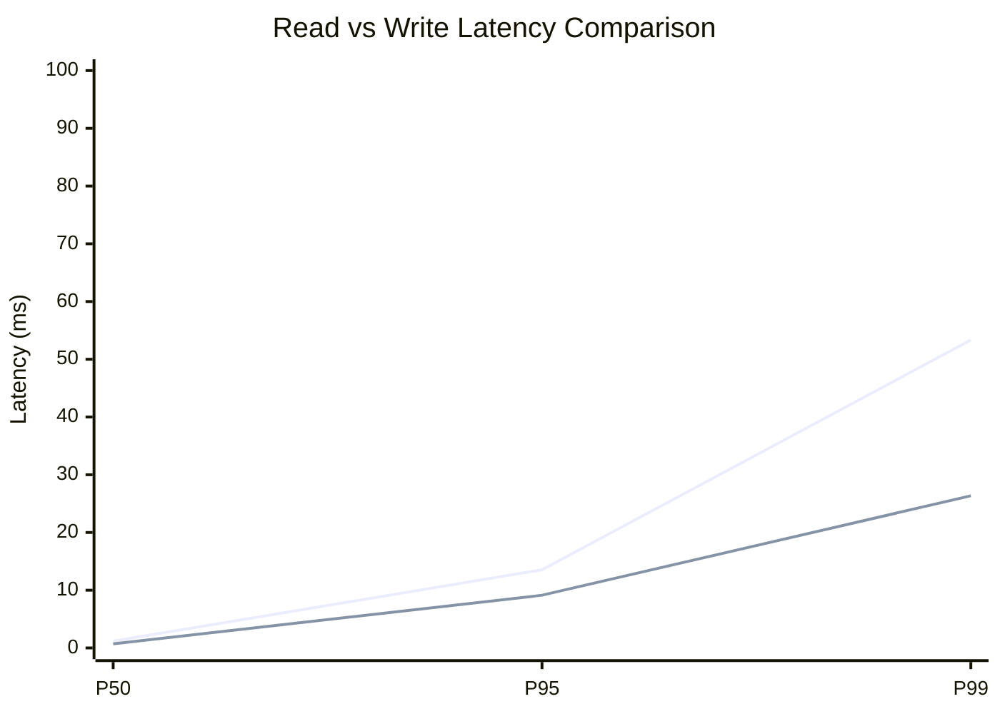
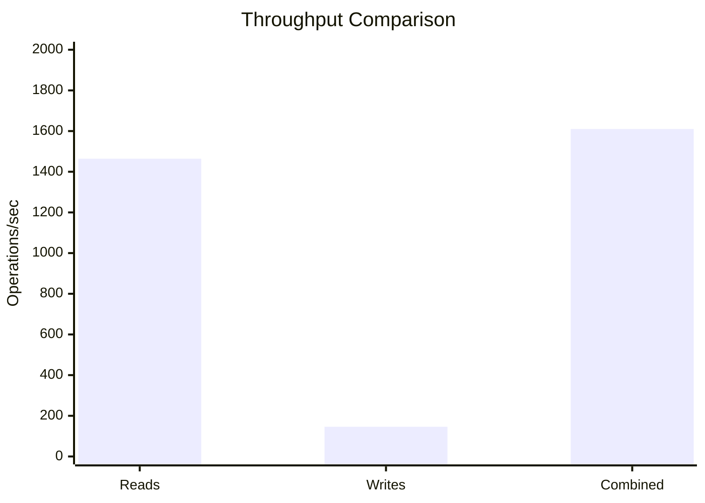
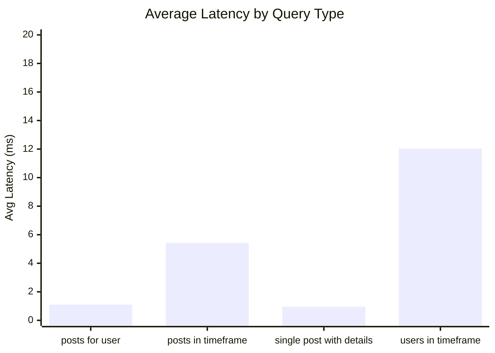
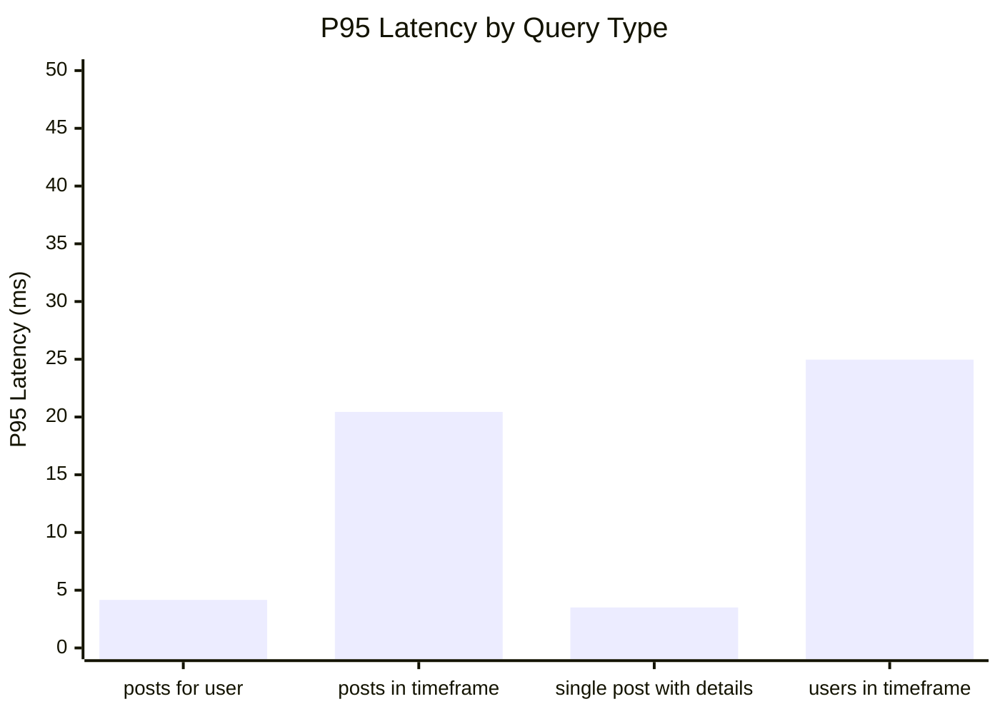
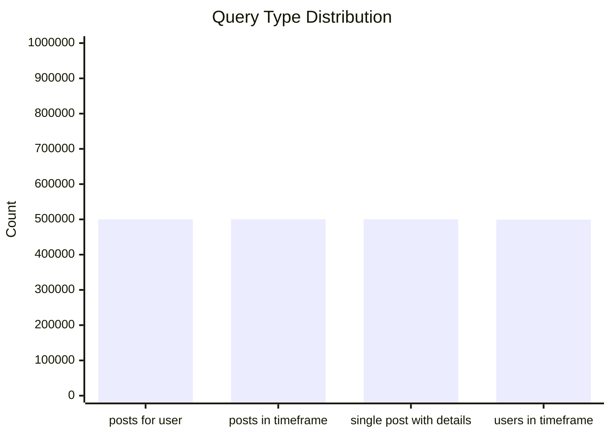
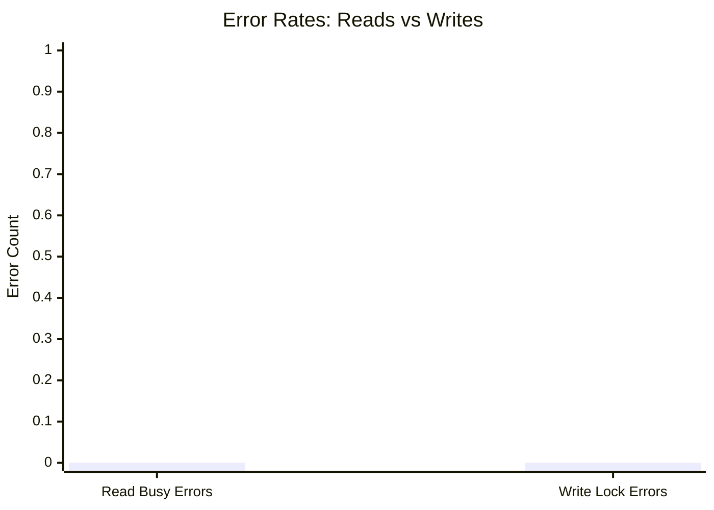
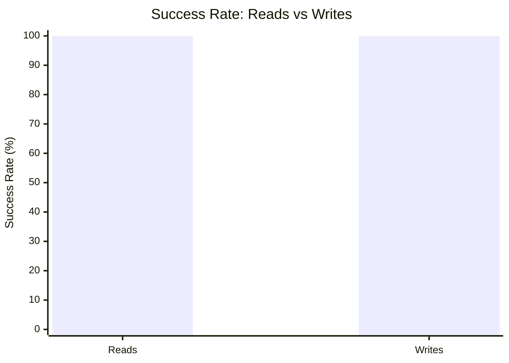

# Mixed Read/Write Benchmark: r40_w4_R2m_W200k_c48mb

**Test Run:** 12/25/2025, 9:52:50 PM

## Configuration

| Setting | Value |
|---------|-------|
| ID | r40_w4_R2m_W200k_c48mb |
| Read Workers | 40 |
| Write Workers | 4 |
| Total Reads | 2,000,000 |
| Total Writes | 200,000 |
| Total Operations | 2,200,000 |
| Read:Write Ratio | 10.0:1 |
| Cache Size | 48000 KB (48 MB) |

## Summary

| Metric | Reads | Writes | Combined |
|--------|-------|--------|----------|
| Total | 2,000,000 | 200,000 | 2,200,000 |
| Successful | 2,000,000 | 200,000 | - |
| Success Rate | 100.0% | 100.0% | - |
| Throughput | 1464/sec | 146/sec | 1610/sec |
| Avg Latency | 4.87ms | 2.45ms | - |
| P50 Latency | 1.19ms | 0.72ms | - |
| P95 Latency | 13.54ms | 9.13ms | - |
| P99 Latency | 53.34ms | 26.35ms | - |
| Errors | 0 (busy: 0) | 0 (lock: 0) | - |

**Total Duration:** 1366.19 seconds

## Read Query Breakdown

| Query Type | Count | Avg (ms) | P95 (ms) | P99 (ms) | Avg Rows |
|------------|-------|----------|----------|----------|----------|
| posts_for_user | 499,796 | 1.10 | 4.16 | 14.83 | 0.6 |
| posts_in_timeframe | 500,589 | 5.42 | 20.44 | 60.70 | 100.0 |
| single_post_with_details | 500,353 | 0.95 | 3.51 | 11.97 | 3.4 |
| users_in_timeframe | 499,262 | 12.04 | 24.97 | 323.02 | 686.0 |


## Charts

### Read vs Write Latency Comparison

This chart compares latency percentiles (P50, P95, P99) between read and write operations. It shows how read and write latencies differ under concurrent load.



### Throughput Comparison

This chart compares the throughput of reads, writes, and combined operations. It shows the relative performance of read vs write operations.



### Average Latency by Query Type

This chart shows the average latency for each read query type. It helps identify which queries are the slowest.



### P95 Latency by Query Type

This chart shows the P95 latency (95th percentile) for each read query type. It highlights the worst-case performance for each query type.



### Query Type Distribution

This chart shows the distribution of query types executed during the test. It helps verify that queries are evenly distributed.



### Error Rates

This chart compares error rates between reads (SQLITE_BUSY errors) and writes (lock errors). It helps identify contention issues.



### Success Rate Comparison

This chart compares the success rate of read vs write operations. Both should ideally be at 100%.



## Key Observations

### Read Performance
- **2,000,000** successful reads out of 2,000,000 (100.0% success rate)
- Average read latency: **4.87ms**, P99: **53.34ms**
- Read throughput: **1464 reads/sec**
- ✅ No busy errors during reads (WAL mode working well)

### Write Performance
- **200,000** successful writes out of 200,000 (100.0% success rate)
- Average write latency: **2.45ms**, P99: **26.35ms**
- Write throughput: **146 writes/sec**
- ✅ No lock errors during writes

### Combined Throughput
- Total operations completed: **2,200,000**
- Combined throughput: **1610 ops/sec**

## Raw Data

<details>
<summary>Click to expand raw JSON data</summary>

```json
{
  "testName": "mixedReadWrite-r40_w4_R2m_W200k_c48mb",
  "timestamp": "2025-12-25T16:22:50.346Z",
  "configuration": {
    "id": "r40_w4_R2m_W200k_c48mb",
    "readWorkers": 40,
    "writeWorkers": 4,
    "readsPerWorker": 50000,
    "writesPerWorker": 50000,
    "totalReads": 2000000,
    "totalWrites": 200000,
    "totalOperations": 2200000,
    "readWriteRatio": 10,
    "cacheSize": 48000
  },
  "duration": 1366190.8305660002,
  "reads": {
    "total": 2000000,
    "successful": 2000000,
    "errors": 0,
    "busyErrors": 0,
    "successRate": 100,
    "avgTime": 4.8742745792845374,
    "minTime": 0.04695400001946837,
    "maxTime": 1892.433177000028,
    "p50": 1.1916379999893252,
    "p95": 13.543361000018194,
    "p99": 53.34315900004003,
    "readsPerSec": 1463.9243327166955,
    "byQueryType": {
      "posts_for_user": {
        "count": 499796,
        "avgTime": 1.1021867178967437,
        "p95": 4.160193999996409,
        "p99": 14.828165000071749,
        "avgRowCount": 0.6447410543501749
      },
      "posts_in_timeframe": {
        "count": 500589,
        "avgTime": 5.418587980996285,
        "p95": 20.44075900001917,
        "p99": 60.70071399991866,
        "avgRowCount": 100
      },
      "single_post_with_details": {
        "count": 500353,
        "avgTime": 0.9479493712358373,
        "p95": 3.511636000010185,
        "p99": 11.974451999994926,
        "avgRowCount": 3.3879481086353036
      },
      "users_in_timeframe": {
        "count": 499262,
        "avgTime": 12.039541954216443,
        "p95": 24.96533899998758,
        "p99": 323.0231030000141,
        "avgRowCount": 685.9511919593319
      }
    }
  },
  "writes": {
    "total": 200000,
    "successful": 200000,
    "errors": 0,
    "lockErrors": 0,
    "successRate": 100,
    "avgTime": 2.4496292211399404,
    "minTime": 0.078436000039801,
    "maxTime": 700.0681360000744,
    "p50": 0.715567999985069,
    "p95": 9.13305499998387,
    "p99": 26.354637999960687,
    "writesPerSec": 146.39243327166957
  },
  "combined": {
    "totalOps": 2200000,
    "opsPerSec": 1610.3167659883652
  }
}
```

</details>
