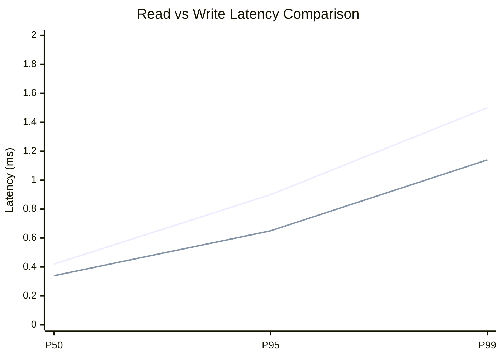
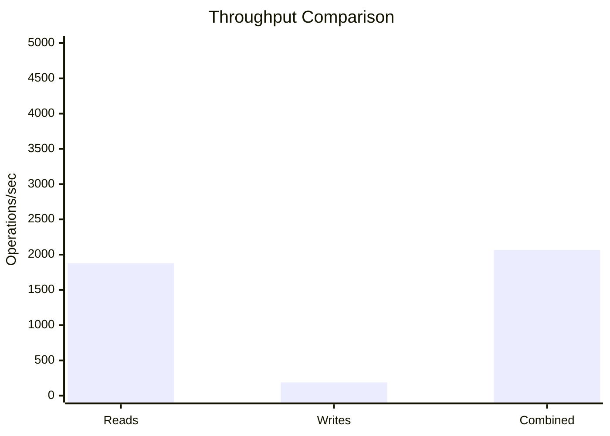
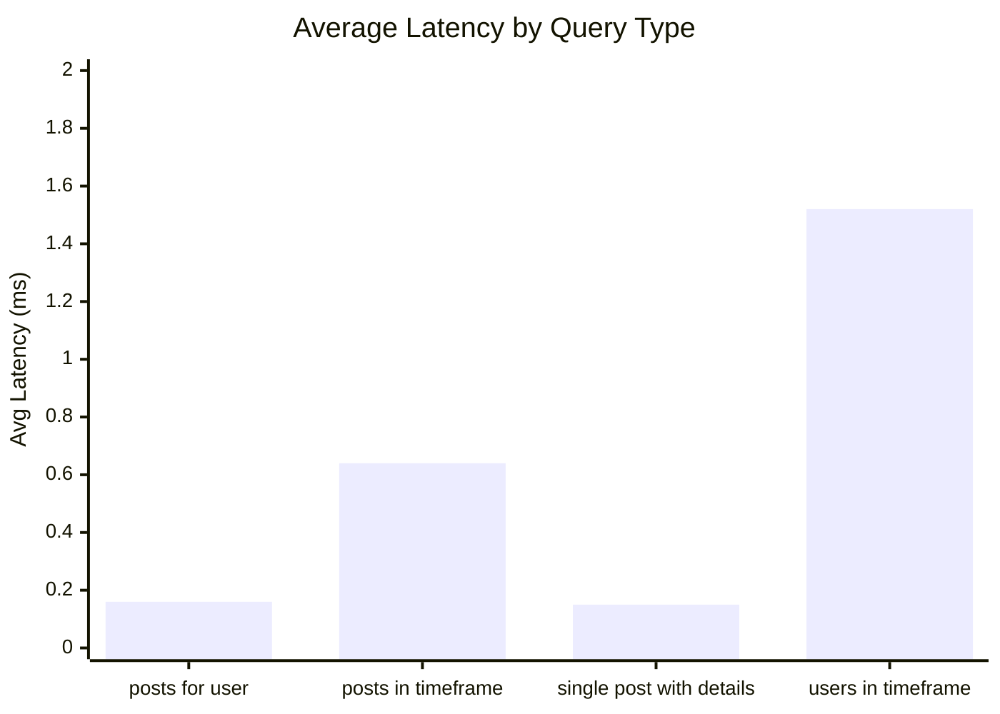
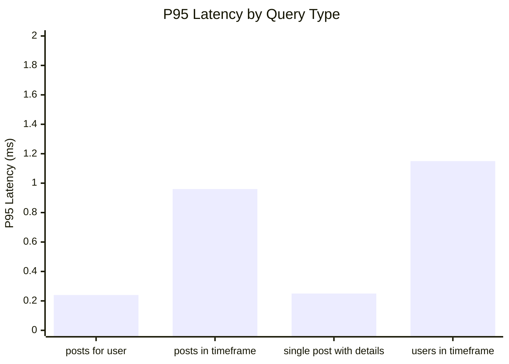
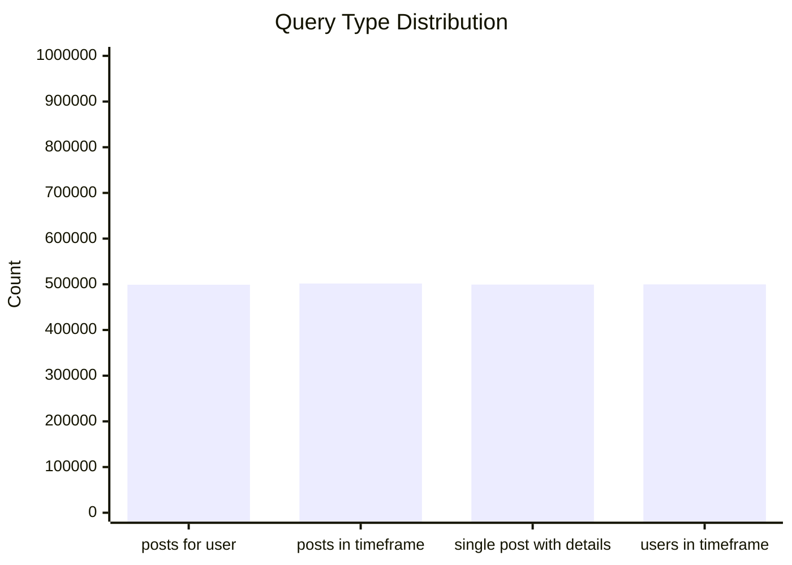
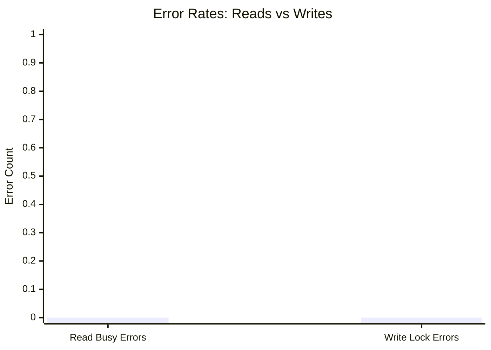
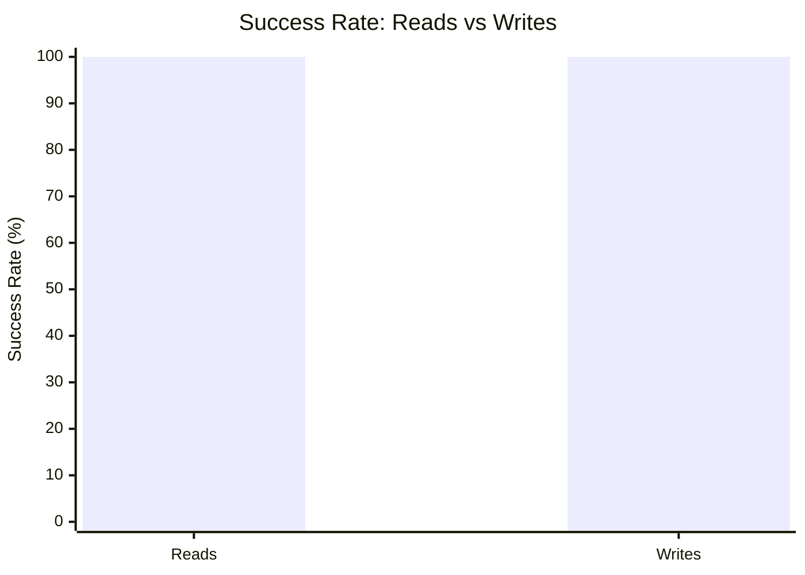

# Mixed Read/Write Benchmark: r5_w1_R2m_W200k_c24mb

**Test Run:** 12/25/2025, 4:25:17 PM

## Configuration

| Setting | Value |
|---------|-------|
| ID | r5_w1_R2m_W200k_c24mb |
| Read Workers | 5 |
| Write Workers | 1 |
| Total Reads | 2,000,000 |
| Total Writes | 200,000 |
| Total Operations | 2,200,000 |
| Read:Write Ratio | 10.0:1 |
| Cache Size | 24000 KB (24 MB) |

## Summary

| Metric | Reads | Writes | Combined |
|--------|-------|--------|----------|
| Total | 2,000,000 | 200,000 | 2,200,000 |
| Successful | 2,000,000 | 200,000 | - |
| Success Rate | 100.0% | 100.0% | - |
| Throughput | 1878/sec | 188/sec | 2066/sec |
| Avg Latency | 0.62ms | 0.34ms | - |
| P50 Latency | 0.42ms | 0.34ms | - |
| P95 Latency | 0.90ms | 0.65ms | - |
| P99 Latency | 1.50ms | 1.14ms | - |
| Errors | 0 (busy: 0) | 0 (lock: 0) | - |

**Total Duration:** 1065.12 seconds

## Read Query Breakdown

| Query Type | Count | Avg (ms) | P95 (ms) | P99 (ms) | Avg Rows |
|------------|-------|----------|----------|----------|----------|
| posts_for_user | 499,089 | 0.16 | 0.24 | 0.34 | 0.8 |
| posts_in_timeframe | 501,729 | 0.64 | 0.96 | 1.55 | 100.0 |
| single_post_with_details | 499,381 | 0.15 | 0.25 | 0.35 | 5.2 |
| users_in_timeframe | 499,801 | 1.52 | 1.15 | 50.14 | 687.9 |


## Charts

### Read vs Write Latency Comparison

This chart compares latency percentiles (P50, P95, P99) between read and write operations. It shows how read and write latencies differ under concurrent load.



### Throughput Comparison

This chart compares the throughput of reads, writes, and combined operations. It shows the relative performance of read vs write operations.



### Average Latency by Query Type

This chart shows the average latency for each read query type. It helps identify which queries are the slowest.



### P95 Latency by Query Type

This chart shows the P95 latency (95th percentile) for each read query type. It highlights the worst-case performance for each query type.



### Query Type Distribution

This chart shows the distribution of query types executed during the test. It helps verify that queries are evenly distributed.



### Error Rates

This chart compares error rates between reads (SQLITE_BUSY errors) and writes (lock errors). It helps identify contention issues.



### Success Rate Comparison

This chart compares the success rate of read vs write operations. Both should ideally be at 100%.



## Key Observations

### Read Performance
- **2,000,000** successful reads out of 2,000,000 (100.0% success rate)
- Average read latency: **0.62ms**, P99: **1.50ms**
- Read throughput: **1878 reads/sec**
- ✅ No busy errors during reads (WAL mode working well)

### Write Performance
- **200,000** successful writes out of 200,000 (100.0% success rate)
- Average write latency: **0.34ms**, P99: **1.14ms**
- Write throughput: **188 writes/sec**
- ✅ No lock errors during writes

### Combined Throughput
- Total operations completed: **2,200,000**
- Combined throughput: **2066 ops/sec**

## Raw Data

<details>
<summary>Click to expand raw JSON data</summary>

```json
{
  "testName": "mixedReadWrite-r5_w1_R2m_W200k_c24mb",
  "timestamp": "2025-12-25T10:55:17.235Z",
  "configuration": {
    "id": "r5_w1_R2m_W200k_c24mb",
    "readWorkers": 5,
    "writeWorkers": 1,
    "readsPerWorker": 400000,
    "writesPerWorker": 200000,
    "totalReads": 2000000,
    "totalWrites": 200000,
    "totalOperations": 2200000,
    "readWriteRatio": 10,
    "cacheSize": 24000
  },
  "duration": 1065115.9889180001,
  "reads": {
    "total": 2000000,
    "successful": 2000000,
    "errors": 0,
    "busyErrors": 0,
    "successRate": 100,
    "avgTime": 0.6167993050710252,
    "minTime": 0.05202699999790639,
    "maxTime": 223.19907299999613,
    "p50": 0.4221409999881871,
    "p95": 0.8973429999896325,
    "p99": 1.50477200000023,
    "readsPerSec": 1877.7297691603553,
    "byQueryType": {
      "posts_for_user": {
        "count": 499089,
        "avgTime": 0.15824856119854294,
        "p95": 0.23900900001171976,
        "p99": 0.34390500001609325,
        "avgRowCount": 0.8407237987613432
      },
      "posts_in_timeframe": {
        "count": 501729,
        "avgTime": 0.6393836471161842,
        "p95": 0.9629129999666475,
        "p99": 1.546237000002293,
        "avgRowCount": 100
      },
      "single_post_with_details": {
        "count": 499381,
        "avgTime": 0.15219429291261927,
        "p95": 0.24719899997580796,
        "p99": 0.3469810000387952,
        "avgRowCount": 5.186711148401721
      },
      "users_in_timeframe": {
        "count": 499801,
        "avgTime": 1.516239939313866,
        "p95": 1.1540190000087023,
        "p99": 50.135080000036396,
        "avgRowCount": 687.9274271159921
      }
    }
  },
  "writes": {
    "total": 200000,
    "successful": 200000,
    "errors": 0,
    "lockErrors": 0,
    "successRate": 100,
    "avgTime": 0.3350437561598972,
    "minTime": 0.07489400001941249,
    "maxTime": 150.8720500000054,
    "p50": 0.343295999977272,
    "p95": 0.65486700006295,
    "p99": 1.1411839999927906,
    "writesPerSec": 187.77297691603553
  },
  "combined": {
    "totalOps": 2200000,
    "opsPerSec": 2065.502746076391
  }
}
```

</details>
