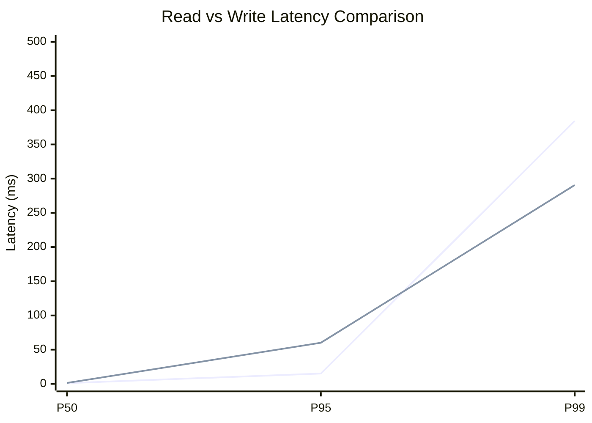
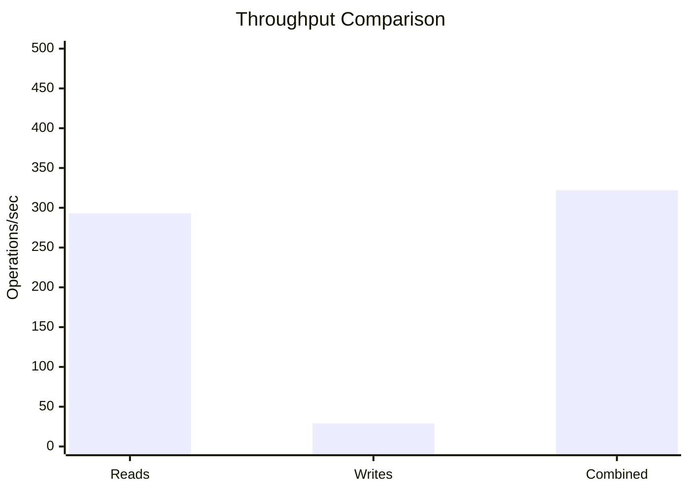
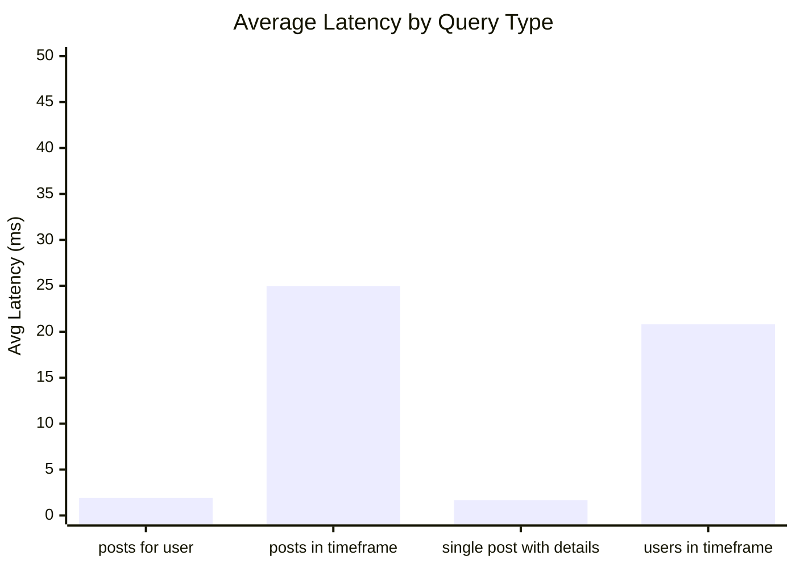
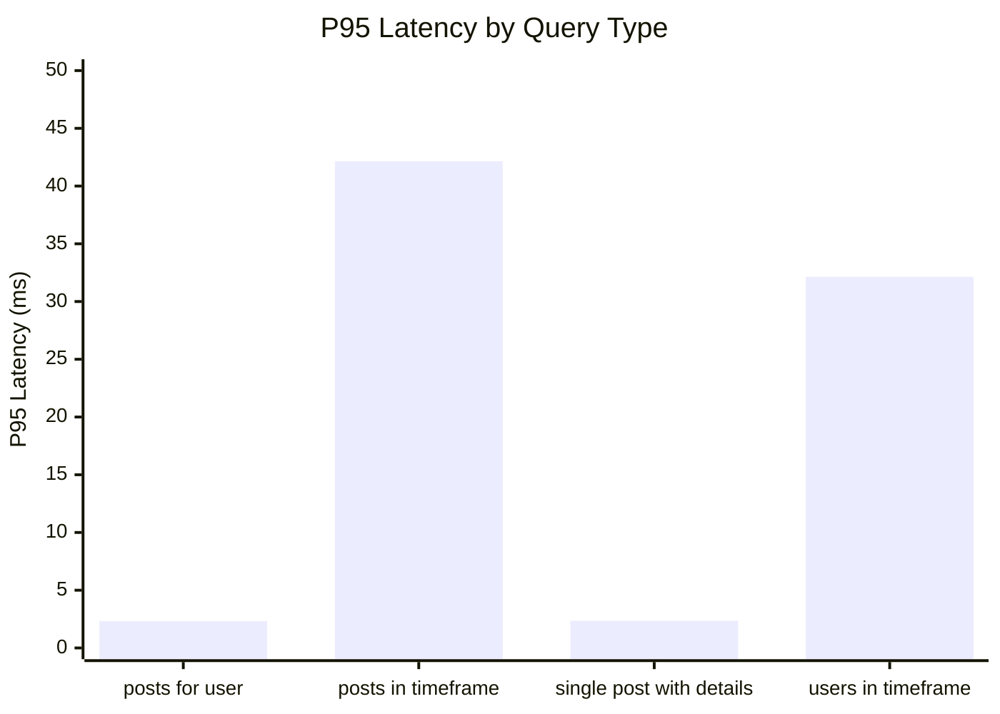
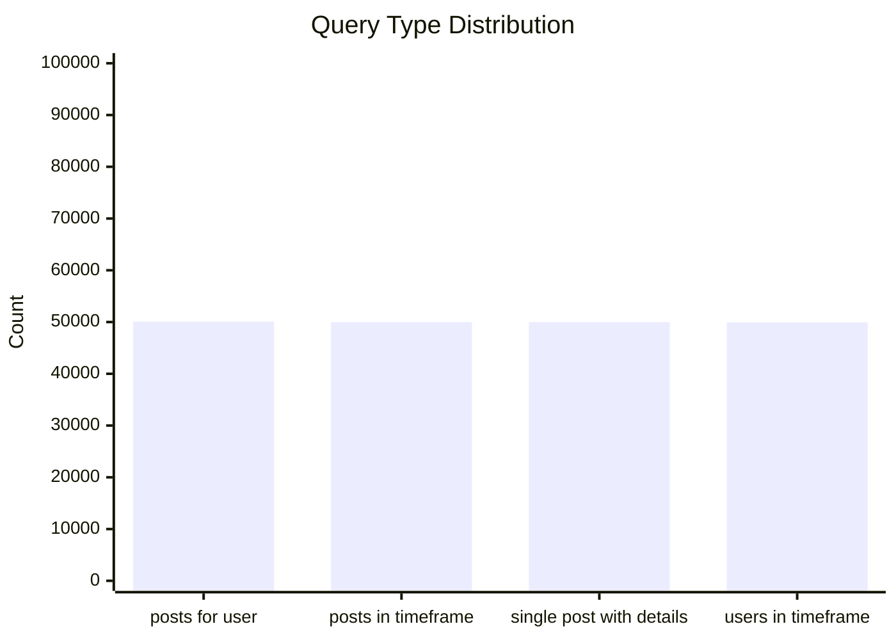
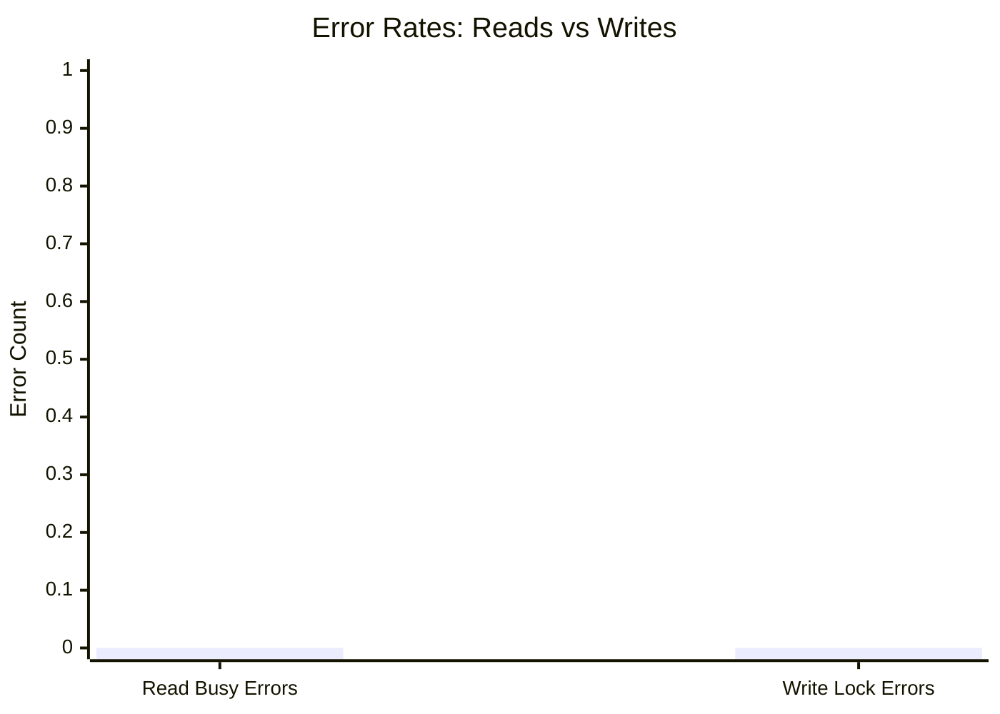
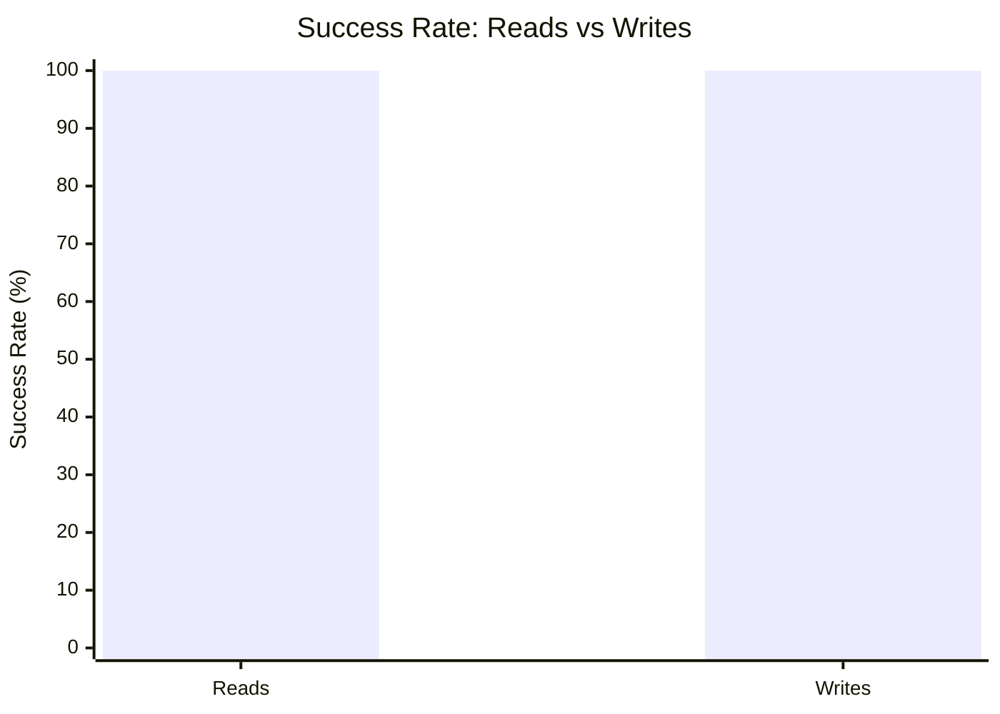

# Mixed Read/Write Benchmark: r800_w40_R200k_W20k_c48mb

**Test Run:** 12/25/2025, 6:35:53 PM

## Configuration

| Setting | Value |
|---------|-------|
| ID | r800_w40_R200k_W20k_c48mb |
| Read Workers | 800 |
| Write Workers | 40 |
| Total Reads | 200,000 |
| Total Writes | 20,000 |
| Total Operations | 220,000 |
| Read:Write Ratio | 10.0:1 |
| Cache Size | 48000 KB (48 MB) |

## Summary

| Metric | Reads | Writes | Combined |
|--------|-------|--------|----------|
| Total | 200,000 | 20,000 | 220,000 |
| Successful | 200,000 | 20,000 | - |
| Success Rate | 100.0% | 100.0% | - |
| Throughput | 293/sec | 29/sec | 322/sec |
| Avg Latency | 12.33ms | 16.08ms | - |
| P50 Latency | 1.06ms | 1.37ms | - |
| P95 Latency | 15.09ms | 60.10ms | - |
| P99 Latency | 384.37ms | 290.58ms | - |
| Errors | 0 (busy: 0) | 0 (lock: 0) | - |

**Total Duration:** 683.07 seconds

## Read Query Breakdown

| Query Type | Count | Avg (ms) | P95 (ms) | P99 (ms) | Avg Rows |
|------------|-------|----------|----------|----------|----------|
| posts_for_user | 50,090 | 1.90 | 2.33 | 14.25 | 0.3 |
| posts_in_timeframe | 49,981 | 24.95 | 42.15 | 715.87 | 100.0 |
| single_post_with_details | 49,987 | 1.67 | 2.36 | 11.65 | 1.3 |
| users_in_timeframe | 49,942 | 20.81 | 32.14 | 617.81 | 234.8 |


## Charts

### Read vs Write Latency Comparison

This chart compares latency percentiles (P50, P95, P99) between read and write operations. It shows how read and write latencies differ under concurrent load.



### Throughput Comparison

This chart compares the throughput of reads, writes, and combined operations. It shows the relative performance of read vs write operations.



### Average Latency by Query Type

This chart shows the average latency for each read query type. It helps identify which queries are the slowest.



### P95 Latency by Query Type

This chart shows the P95 latency (95th percentile) for each read query type. It highlights the worst-case performance for each query type.



### Query Type Distribution

This chart shows the distribution of query types executed during the test. It helps verify that queries are evenly distributed.



### Error Rates

This chart compares error rates between reads (SQLITE_BUSY errors) and writes (lock errors). It helps identify contention issues.



### Success Rate Comparison

This chart compares the success rate of read vs write operations. Both should ideally be at 100%.



## Key Observations

### Read Performance
- **200,000** successful reads out of 200,000 (100.0% success rate)
- Average read latency: **12.33ms**, P99: **384.37ms**
- Read throughput: **293 reads/sec**
- ✅ No busy errors during reads (WAL mode working well)

### Write Performance
- **20,000** successful writes out of 20,000 (100.0% success rate)
- Average write latency: **16.08ms**, P99: **290.58ms**
- Write throughput: **29 writes/sec**
- ✅ No lock errors during writes

### Combined Throughput
- Total operations completed: **220,000**
- Combined throughput: **322 ops/sec**

## Raw Data

<details>
<summary>Click to expand raw JSON data</summary>

```json
{
  "testName": "mixedReadWrite-r800_w40_R200k_W20k_c48mb",
  "timestamp": "2025-12-25T13:05:53.835Z",
  "configuration": {
    "id": "r800_w40_R200k_W20k_c48mb",
    "readWorkers": 800,
    "writeWorkers": 40,
    "readsPerWorker": 250,
    "writesPerWorker": 500,
    "totalReads": 200000,
    "totalWrites": 20000,
    "totalOperations": 220000,
    "readWriteRatio": 10,
    "cacheSize": 48000
  },
  "duration": 683072.294903,
  "reads": {
    "total": 200000,
    "successful": 200000,
    "errors": 0,
    "busyErrors": 0,
    "successRate": 100,
    "avgTime": 12.325415387709935,
    "minTime": 0.06822499993722886,
    "maxTime": 5563.743172000017,
    "p50": 1.063387000001967,
    "p95": 15.089043000014499,
    "p99": 384.36836199997924,
    "readsPerSec": 292.7947766178997,
    "byQueryType": {
      "posts_for_user": {
        "count": 50090,
        "avgTime": 1.9036149583952076,
        "p95": 2.3336099999723956,
        "p99": 14.2522459999891,
        "avgRowCount": 0.2914953084447994
      },
      "posts_in_timeframe": {
        "count": 49981,
        "avgTime": 24.946325122025975,
        "p95": 42.14564799994696,
        "p99": 715.8729009999661,
        "avgRowCount": 100
      },
      "single_post_with_details": {
        "count": 49987,
        "avgTime": 1.673212951387323,
        "p95": 2.3571089999750257,
        "p99": 11.653745000017807,
        "avgRowCount": 1.294716626322844
      },
      "users_in_timeframe": {
        "count": 49942,
        "avgTime": 20.809135247907484,
        "p95": 32.13596800004598,
        "p99": 617.80532699998,
        "avgRowCount": 234.8192303071563
      }
    }
  },
  "writes": {
    "total": 20000,
    "successful": 20000,
    "errors": 0,
    "lockErrors": 0,
    "successRate": 100,
    "avgTime": 16.075967610500403,
    "minTime": 0.06402900000102818,
    "maxTime": 1263.3577189999633,
    "p50": 1.3743239999748766,
    "p95": 60.09995499998331,
    "p99": 290.58255400008056,
    "writesPerSec": 29.279477661789972
  },
  "combined": {
    "totalOps": 220000,
    "opsPerSec": 322.0742542796897
  }
}
```

</details>
