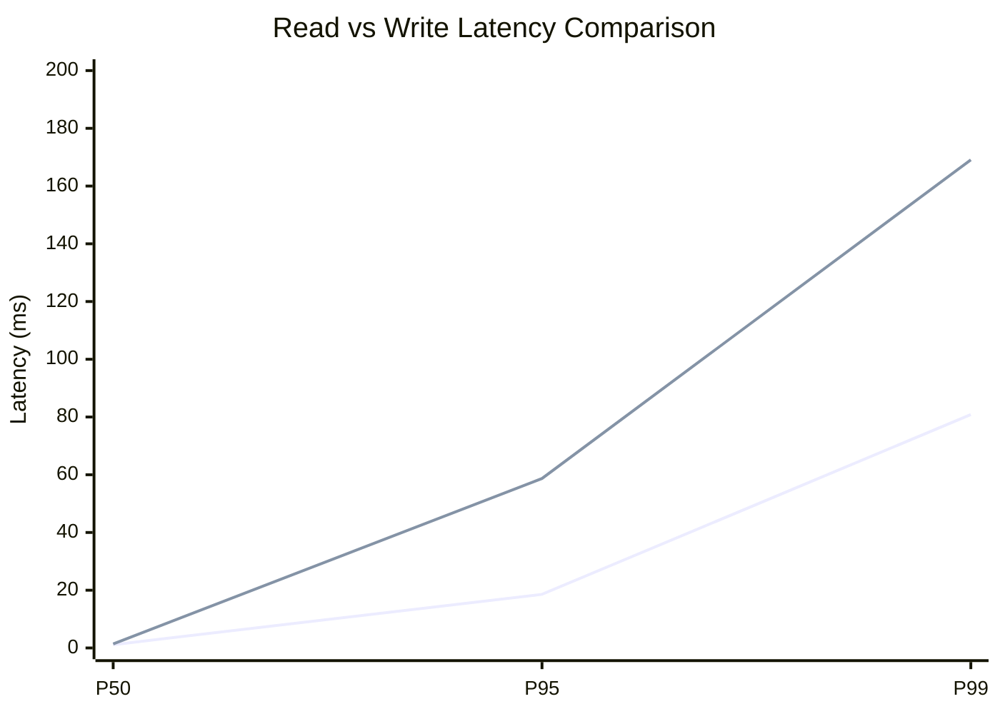
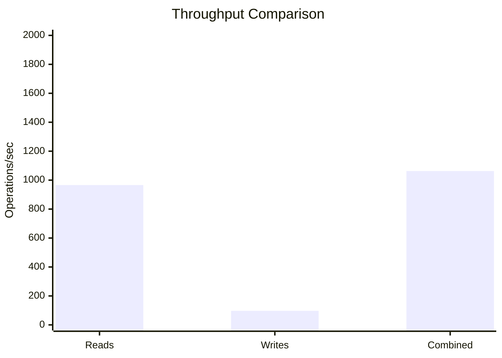
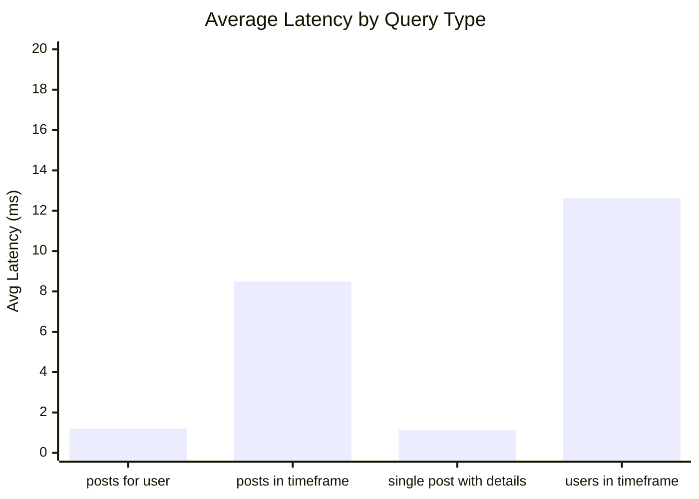
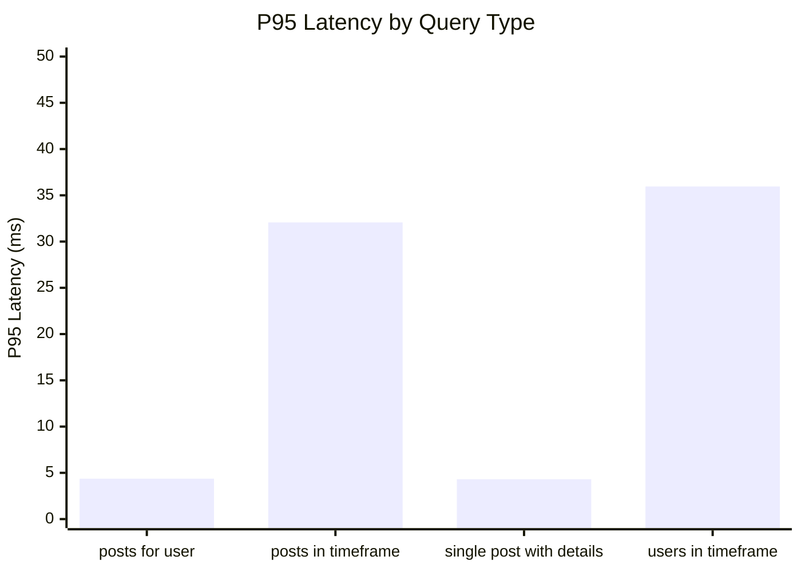
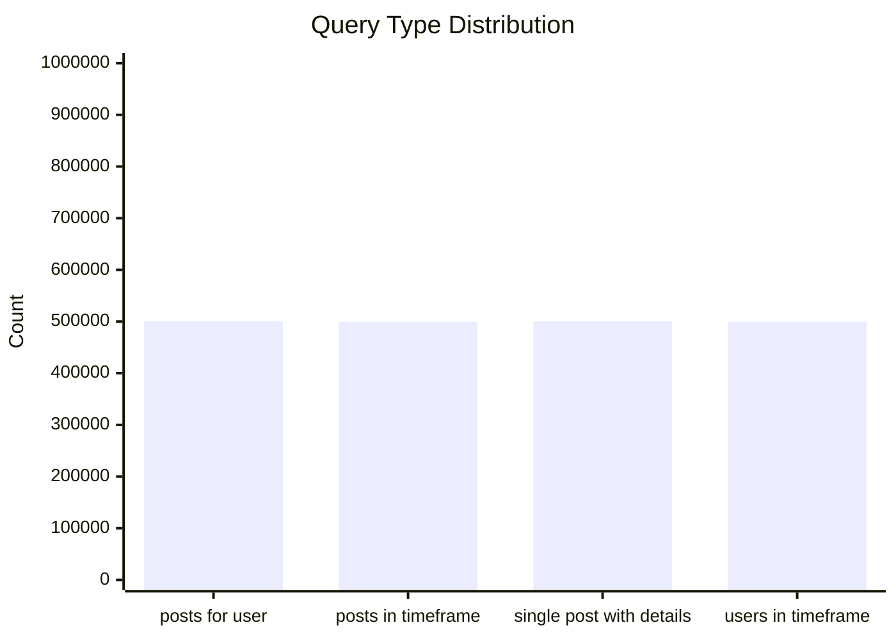
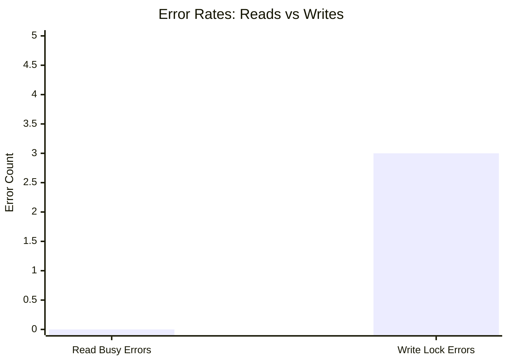
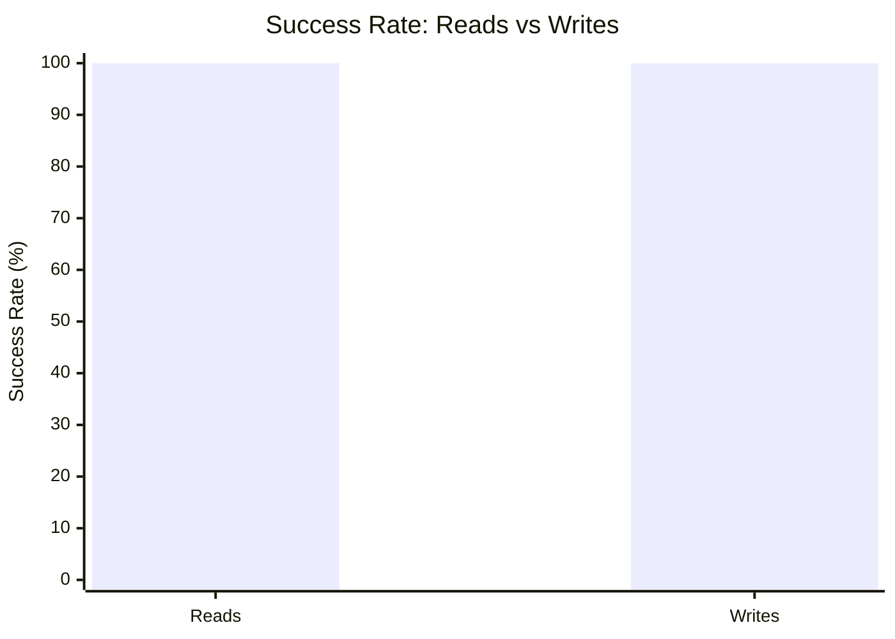

# Mixed Read/Write Benchmark: r800_w40_R2m_W200k_c100mb

**Test Run:** 12/25/2025, 9:56:05 PM

## Configuration

| Setting | Value |
|---------|-------|
| ID | r800_w40_R2m_W200k_c100mb |
| Read Workers | 800 |
| Write Workers | 40 |
| Total Reads | 2,000,000 |
| Total Writes | 200,000 |
| Total Operations | 2,200,000 |
| Read:Write Ratio | 10.0:1 |
| Cache Size | 100000 KB (100 MB) |

## Summary

| Metric | Reads | Writes | Combined |
|--------|-------|--------|----------|
| Total | 2,000,000 | 200,000 | 2,199,997 |
| Successful | 2,000,000 | 199,997 | - |
| Success Rate | 100.0% | 100.0% | - |
| Throughput | 966/sec | 97/sec | 1063/sec |
| Avg Latency | 5.86ms | 12.54ms | - |
| P50 Latency | 1.13ms | 1.38ms | - |
| P95 Latency | 18.57ms | 58.70ms | - |
| P99 Latency | 80.84ms | 169.09ms | - |
| Errors | 0 (busy: 0) | 3 (lock: 3) | - |

**Total Duration:** 2069.65 seconds

## Read Query Breakdown

| Query Type | Count | Avg (ms) | P95 (ms) | P99 (ms) | Avg Rows |
|------------|-------|----------|----------|----------|----------|
| posts_for_user | 500,191 | 1.20 | 4.37 | 17.77 | 0.5 |
| posts_in_timeframe | 499,172 | 8.49 | 32.07 | 97.95 | 100.0 |
| single_post_with_details | 500,906 | 1.14 | 4.31 | 16.07 | 1.9 |
| users_in_timeframe | 499,731 | 12.63 | 35.95 | 226.74 | 411.5 |


## Charts

### Read vs Write Latency Comparison

This chart compares latency percentiles (P50, P95, P99) between read and write operations. It shows how read and write latencies differ under concurrent load.



### Throughput Comparison

This chart compares the throughput of reads, writes, and combined operations. It shows the relative performance of read vs write operations.



### Average Latency by Query Type

This chart shows the average latency for each read query type. It helps identify which queries are the slowest.



### P95 Latency by Query Type

This chart shows the P95 latency (95th percentile) for each read query type. It highlights the worst-case performance for each query type.



### Query Type Distribution

This chart shows the distribution of query types executed during the test. It helps verify that queries are evenly distributed.



### Error Rates

This chart compares error rates between reads (SQLITE_BUSY errors) and writes (lock errors). It helps identify contention issues.



### Success Rate Comparison

This chart compares the success rate of read vs write operations. Both should ideally be at 100%.



## Key Observations

### Read Performance
- **2,000,000** successful reads out of 2,000,000 (100.0% success rate)
- Average read latency: **5.86ms**, P99: **80.84ms**
- Read throughput: **966 reads/sec**
- ✅ No busy errors during reads (WAL mode working well)

### Write Performance
- **199,997** successful writes out of 200,000 (100.0% success rate)
- Average write latency: **12.54ms**, P99: **169.09ms**
- Write throughput: **97 writes/sec**
- ⚠️ 3 lock errors during writes

### Combined Throughput
- Total operations completed: **2,199,997**
- Combined throughput: **1063 ops/sec**

## Raw Data

<details>
<summary>Click to expand raw JSON data</summary>

```json
{
  "testName": "mixedReadWrite-r800_w40_R2m_W200k_c100mb",
  "timestamp": "2025-12-25T16:26:05.943Z",
  "configuration": {
    "id": "r800_w40_R2m_W200k_c100mb",
    "readWorkers": 800,
    "writeWorkers": 40,
    "readsPerWorker": 2500,
    "writesPerWorker": 5000,
    "totalReads": 2000000,
    "totalWrites": 200000,
    "totalOperations": 2200000,
    "readWriteRatio": 10,
    "cacheSize": 100000
  },
  "duration": 2069648.696885,
  "reads": {
    "total": 2000000,
    "successful": 2000000,
    "errors": 0,
    "busyErrors": 0,
    "successRate": 100,
    "avgTime": 5.86137473546947,
    "minTime": 0.07034000009298325,
    "maxTime": 3113.7110580001026,
    "p50": 1.134847000008449,
    "p95": 18.567924999981187,
    "p99": 80.83966099994723,
    "readsPerSec": 966.3475753204748,
    "byQueryType": {
      "posts_for_user": {
        "count": 500191,
        "avgTime": 1.2022830815788494,
        "p95": 4.365386000019498,
        "p99": 17.76662700017914,
        "avgRowCount": 0.4570853933797289
      },
      "posts_in_timeframe": {
        "count": 499172,
        "avgTime": 8.494111329673904,
        "p95": 32.07342100003734,
        "p99": 97.94908900000155,
        "avgRowCount": 100
      },
      "single_post_with_details": {
        "count": 500906,
        "avgTime": 1.1377725968705579,
        "p95": 4.309224999975413,
        "p99": 16.07058500009589,
        "avgRowCount": 1.9496452428200102
      },
      "users_in_timeframe": {
        "count": 499731,
        "avgTime": 12.62967202958583,
        "p95": 35.94636299996637,
        "p99": 226.74060500017367,
        "avgRowCount": 411.4887569512398
      }
    }
  },
  "writes": {
    "total": 200000,
    "successful": 199997,
    "errors": 3,
    "lockErrors": 3,
    "successRate": 99.9985,
    "avgTime": 12.542716960684572,
    "minTime": 0.06102599995210767,
    "maxTime": 2131.4567579999566,
    "p50": 1.3778480000328273,
    "p95": 58.696588000049815,
    "p99": 169.09304099995643,
    "writesPerSec": 96.6333080106845
  },
  "combined": {
    "totalOps": 2199997,
    "opsPerSec": 1062.9808833311595
  }
}
```

</details>
