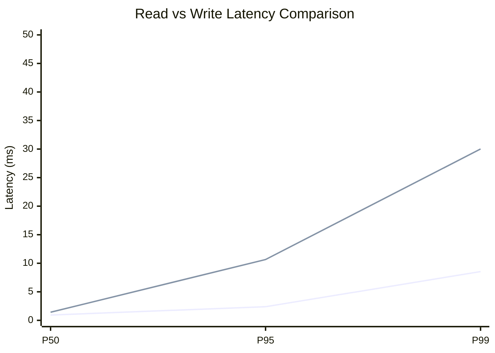
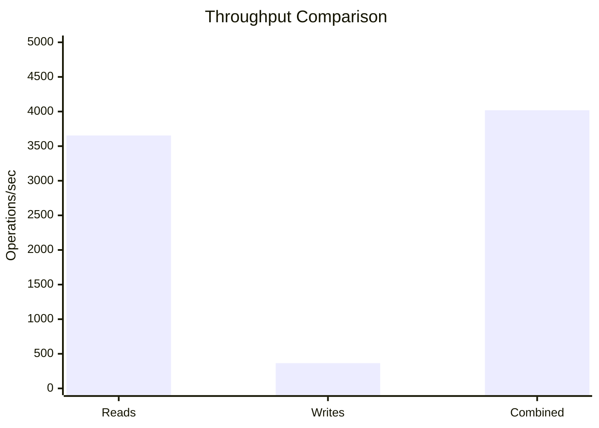
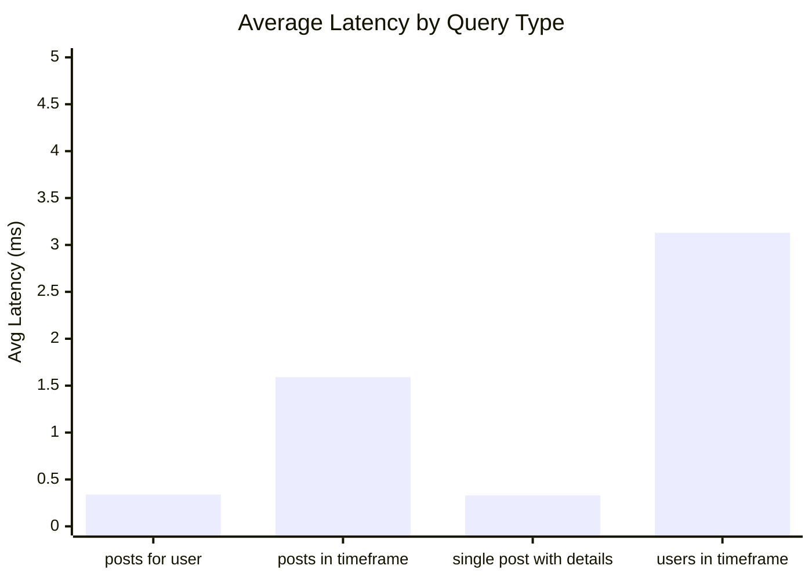
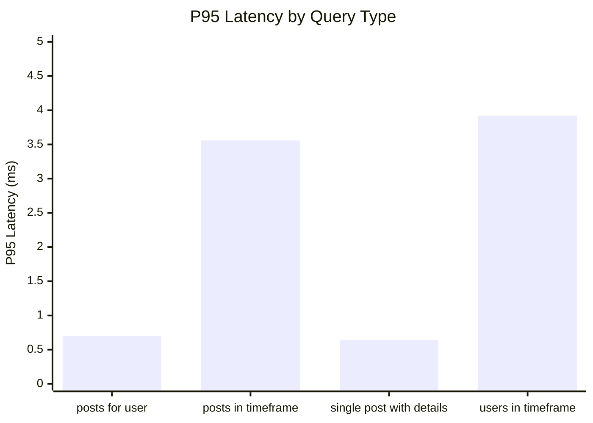
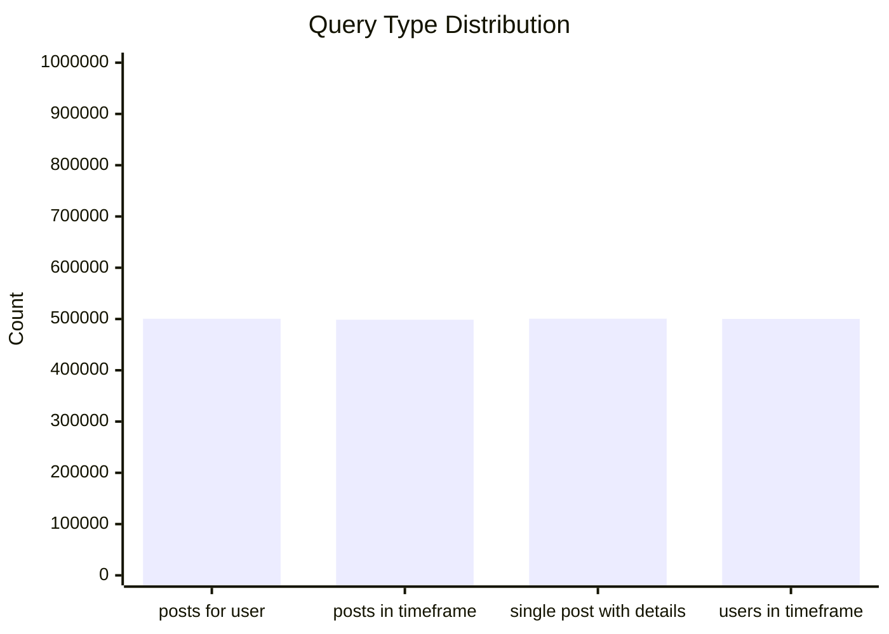
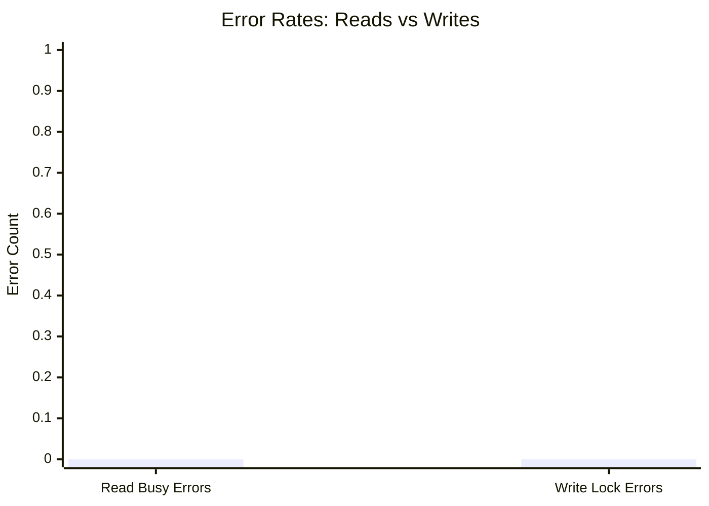
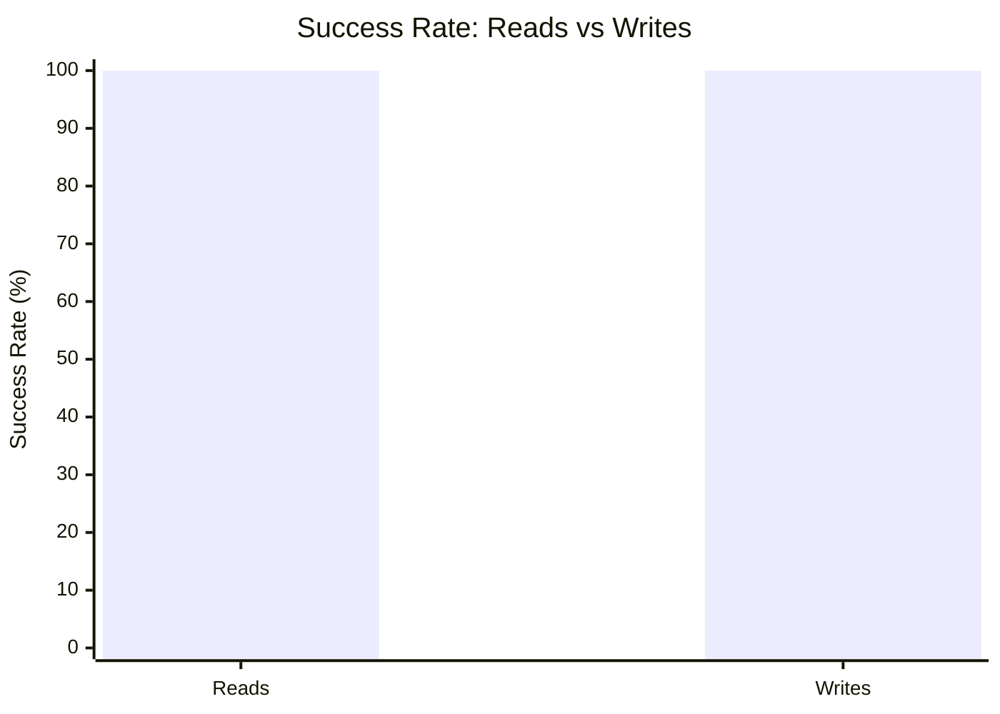

# Mixed Read/Write Benchmark: r80_w8_R2m_W200k_c100mb

**Test Run:** 12/25/2025, 12:50:37 PM

## Configuration

| Setting | Value |
|---------|-------|
| ID | r80_w8_R2m_W200k_c100mb |
| Read Workers | 80 |
| Write Workers | 8 |
| Total Reads | 2,000,000 |
| Total Writes | 200,000 |
| Total Operations | 2,200,000 |
| Read:Write Ratio | 10.0:1 |
| Cache Size | 100000 KB (100 MB) |

## Summary

| Metric | Reads | Writes | Combined |
|--------|-------|--------|----------|
| Total | 2,000,000 | 200,000 | 2,200,000 |
| Successful | 2,000,000 | 200,000 | - |
| Success Rate | 100.0% | 100.0% | - |
| Throughput | 3654/sec | 365/sec | 4019/sec |
| Avg Latency | 1.35ms | 3.10ms | - |
| P50 Latency | 0.93ms | 1.42ms | - |
| P95 Latency | 2.39ms | 10.65ms | - |
| P99 Latency | 8.54ms | 30.02ms | - |
| Errors | 0 (busy: 0) | 0 (lock: 0) | - |

**Total Duration:** 547.40 seconds

## Read Query Breakdown

| Query Type | Count | Avg (ms) | P95 (ms) | P99 (ms) | Avg Rows |
|------------|-------|----------|----------|----------|----------|
| posts_for_user | 500,546 | 0.34 | 0.70 | 3.51 | 0.6 |
| posts_in_timeframe | 498,641 | 1.59 | 3.56 | 10.08 | 100.0 |
| single_post_with_details | 500,642 | 0.33 | 0.64 | 3.21 | 3.1 |
| users_in_timeframe | 500,171 | 3.13 | 3.92 | 25.03 | 381.1 |


## Charts

### Read vs Write Latency Comparison

This chart compares latency percentiles (P50, P95, P99) between read and write operations. It shows how read and write latencies differ under concurrent load.



### Throughput Comparison

This chart compares the throughput of reads, writes, and combined operations. It shows the relative performance of read vs write operations.



### Average Latency by Query Type

This chart shows the average latency for each read query type. It helps identify which queries are the slowest.



### P95 Latency by Query Type

This chart shows the P95 latency (95th percentile) for each read query type. It highlights the worst-case performance for each query type.



### Query Type Distribution

This chart shows the distribution of query types executed during the test. It helps verify that queries are evenly distributed.



### Error Rates

This chart compares error rates between reads (SQLITE_BUSY errors) and writes (lock errors). It helps identify contention issues.



### Success Rate Comparison

This chart compares the success rate of read vs write operations. Both should ideally be at 100%.



## Key Observations

### Read Performance
- **2,000,000** successful reads out of 2,000,000 (100.0% success rate)
- Average read latency: **1.35ms**, P99: **8.54ms**
- Read throughput: **3654 reads/sec**
- ✅ No busy errors during reads (WAL mode working well)

### Write Performance
- **200,000** successful writes out of 200,000 (100.0% success rate)
- Average write latency: **3.10ms**, P99: **30.02ms**
- Write throughput: **365 writes/sec**
- ✅ No lock errors during writes

### Combined Throughput
- Total operations completed: **2,200,000**
- Combined throughput: **4019 ops/sec**

## Raw Data

<details>
<summary>Click to expand raw JSON data</summary>

```json
{
  "testName": "mixedReadWrite-r80_w8_R2m_W200k_c100mb",
  "timestamp": "2025-12-25T07:20:37.973Z",
  "configuration": {
    "id": "r80_w8_R2m_W200k_c100mb",
    "readWorkers": 80,
    "writeWorkers": 8,
    "readsPerWorker": 25000,
    "writesPerWorker": 25000,
    "totalReads": 2000000,
    "totalWrites": 200000,
    "totalOperations": 2200000,
    "readWriteRatio": 10,
    "cacheSize": 100000
  },
  "duration": 547396.2228900001,
  "reads": {
    "total": 2000000,
    "successful": 2000000,
    "errors": 0,
    "busyErrors": 0,
    "successRate": 100,
    "avgTime": 1.3476109298991474,
    "minTime": 0.055281000008108094,
    "maxTime": 1047.6956109999446,
    "p50": 0.9341450000065379,
    "p95": 2.3937739999964833,
    "p99": 8.540689999994356,
    "readsPerSec": 3653.660577782069,
    "byQueryType": {
      "posts_for_user": {
        "count": 500546,
        "avgTime": 0.3432627616342479,
        "p95": 0.704026999999769,
        "p99": 3.5135969999828376,
        "avgRowCount": 0.623075601443224
      },
      "posts_in_timeframe": {
        "count": 498641,
        "avgTime": 1.591479669666291,
        "p95": 3.5589009999966947,
        "p99": 10.077142999973148,
        "avgRowCount": 100
      },
      "single_post_with_details": {
        "count": 500642,
        "avgTime": 0.33276450839720917,
        "p95": 0.6388629999710247,
        "p99": 3.2140309999958845,
        "avgRowCount": 3.1354900308004523
      },
      "users_in_timeframe": {
        "count": 500171,
        "avgTime": 3.125391425208656,
        "p95": 3.918019999982789,
        "p99": 25.026043999998365,
        "avgRowCount": 381.07606198680054
      }
    }
  },
  "writes": {
    "total": 200000,
    "successful": 200000,
    "errors": 0,
    "lockErrors": 0,
    "successRate": 100,
    "avgTime": 3.1049701351600163,
    "minTime": 0.07325599994510412,
    "maxTime": 364.9183040000062,
    "p50": 1.4197559999884106,
    "p95": 10.652009000070393,
    "p99": 30.01637099999789,
    "writesPerSec": 365.36605777820694
  },
  "combined": {
    "totalOps": 2200000,
    "opsPerSec": 4019.0266355602757
  }
}
```

</details>
