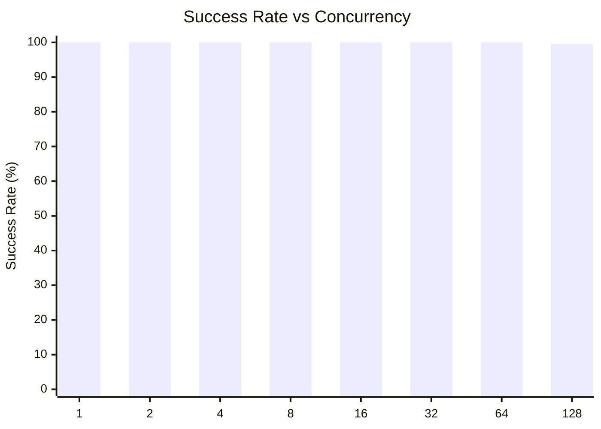
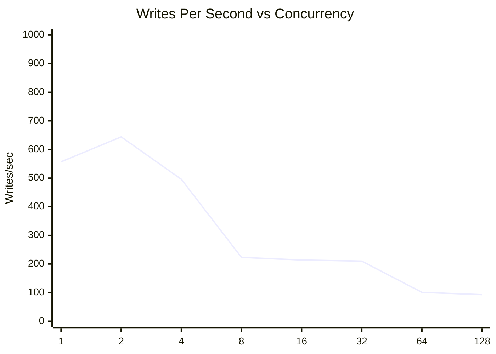
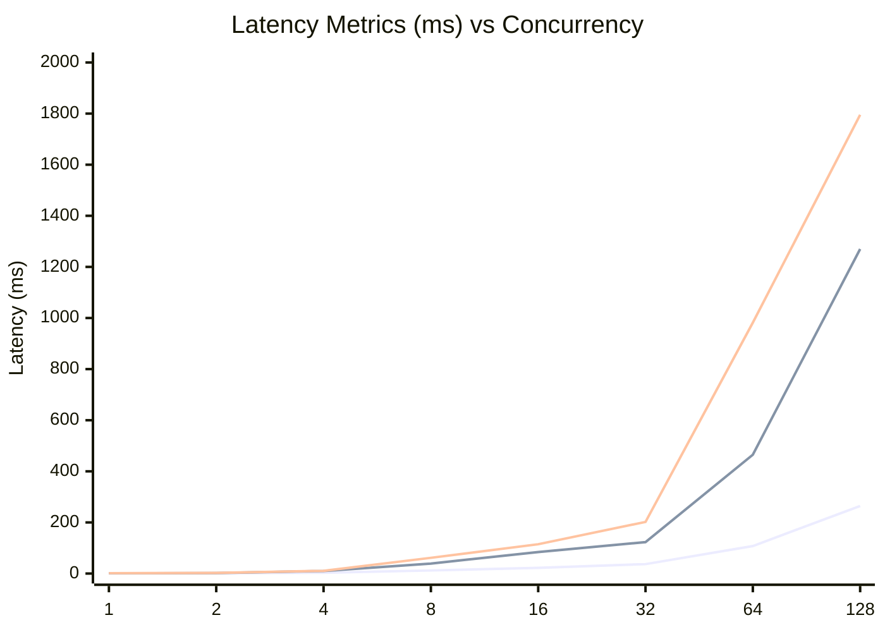
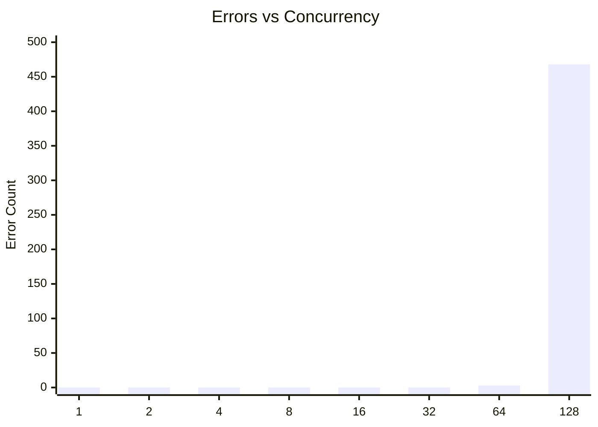

# SQLite Concurrent Writes Test: walConcurrentWrites

**Test Run:** 12/24/2025, 11:35:26 PM

## Overview

This test evaluates SQLite's behavior under concurrent write pressure. Each test configuration runs 100000 total write operations across different concurrency levels (number of simultaneous writers).

## Key Findings

- **Single writer achieves 100.0% success rate** with 557 writes/sec
- **Best throughput:** 644 writes/sec at concurrency 2
- **Worst success rate:** 99.5% at concurrency 128 with 468 lock errors
- **High concurrency P99 latency:** 773ms average at 16+ concurrent writers


## Summary Table

| Concurrency | Success Rate | Writes/sec | Avg (ms) | P95 (ms) | P99 (ms) | Lock Errors |
|-------------|--------------|------------|----------|----------|----------|-------------|
| 1 | 100.0% | 557 | 0.82 | 1.10 | 1.57 | 0 |
| 2 | 100.0% | 644 | 1.40 | 2.08 | 2.48 | 0 |
| 4 | 100.0% | 496 | 3.28 | 9.97 | 10.75 | 0 |
| 8 | 100.0% | 223 | 12.10 | 39.10 | 61.44 | 0 |
| 16 | 100.0% | 214 | 22.33 | 84.09 | 114.66 | 0 |
| 32 | 100.0% | 210 | 36.79 | 122.85 | 201.91 | 0 |
| 64 | 100.0% | 101 | 107.49 | 465.06 | 981.85 | 3 |
| 128 | 99.5% | 93 | 264.41 | 1269.93 | 1795.27 | 468 |


## Charts

### Success Rate by Concurrency

This chart shows how the success rate of write operations decreases as concurrency increases. SQLite uses file-level locking, so concurrent writes often fail with `SQLITE_BUSY` or `SQLITE_LOCKED` errors.



### Throughput (Writes Per Second)

Despite lower success rates at higher concurrency, the overall throughput pattern shows interesting behavior. The effective writes per second decreases as contention increases.



### Latency Distribution

This chart shows average, P95, and P99 latencies. As concurrency increases, latency variance grows significantly due to lock contention.



### Lock Errors by Concurrency

The number of lock errors (SQLITE_BUSY/SQLITE_LOCKED) increases with concurrency, demonstrating SQLite's single-writer limitation.



## Detailed Analysis

### Single Writer (Concurrency = 1)

With a single writer, SQLite performs optimally:
- **Success Rate:** 100.0%
- **Throughput:** 557 writes/second
- **Average Latency:** 0.82ms
- **P99 Latency:** 1.57ms
- **Lock Errors:** 0

This represents the baseline performance without contention.

### Low Concurrency (2-4 writers)

Even at low concurrency levels (2-4 writers), significant contention occurs:
- **Average Success Rate:** 100.0%
- **Average Lock Errors:** 0 per test run

This demonstrates SQLite's fundamental limitation with concurrent writes - even 2 simultaneous writers will frequently conflict.

### High Concurrency (16+ writers)

At high concurrency (16+ writers), performance degrades significantly:
- **Average Success Rate:** 99.9%
- **Average P99 Latency:** 773ms
- **Maximum P99 Latency:** 1795ms

The vast majority of write attempts fail due to lock contention. Successful writes also take much longer due to retry overhead and queuing.

## Raw Data

<details>
<summary>Click to expand raw JSON data</summary>

```json
{
  "testName": "walConcurrentWrites",
  "timestamp": "2025-12-24T18:05:26.697Z",
  "configurations": [
    {
      "concurrency": 1,
      "totalWrites": 100000,
      "metrics": {
        "total": 100000,
        "successful": 100000,
        "errors": 0,
        "lockErrors": 0,
        "successRate": 100,
        "avgTime": 0.8174576630300454,
        "p95": 1.1033940000052098,
        "p99": 1.5661609999951907,
        "writesPerSec": 556.638536747916,
        "totalDuration": 179649.796768
      }
    },
    {
      "concurrency": 2,
      "totalWrites": 100000,
      "metrics": {
        "total": 100000,
        "successful": 100000,
        "errors": 0,
        "lockErrors": 0,
        "successRate": 100,
        "avgTime": 1.4002560940299993,
        "p95": 2.0801919999648817,
        "p99": 2.4762229999760166,
        "writesPerSec": 644.4552265899722,
        "totalDuration": 155169.81766000003
      }
    },
    {
      "concurrency": 4,
      "totalWrites": 100000,
      "metrics": {
        "total": 100000,
        "successful": 100000,
        "errors": 0,
        "lockErrors": 0,
        "successRate": 100,
        "avgTime": 3.277602246799936,
        "p95": 9.965446999995038,
        "p99": 10.745245000056457,
        "writesPerSec": 496.3286700843251,
        "totalDuration": 201479.39465799998
      }
    },
    {
      "concurrency": 8,
      "totalWrites": 100000,
      "metrics": {
        "total": 100000,
        "successful": 100000,
        "errors": 0,
        "lockErrors": 0,
        "successRate": 100,
        "avgTime": 12.102967314579923,
        "p95": 39.09829200000968,
        "p99": 61.43524200003594,
        "writesPerSec": 222.9519123520267,
        "totalDuration": 448527.213537
      }
    },
    {
      "concurrency": 16,
      "totalWrites": 100000,
      "metrics": {
        "total": 100000,
        "successful": 100000,
        "errors": 0,
        "lockErrors": 0,
        "successRate": 100,
        "avgTime": 22.326900866899685,
        "p95": 84.09136700001545,
        "p99": 114.65533400001004,
        "writesPerSec": 214.07820131952937,
        "totalDuration": 467119.0218509999
      }
    },
    {
      "concurrency": 32,
      "totalWrites": 100000,
      "metrics": {
        "total": 100000,
        "successful": 100000,
        "errors": 0,
        "lockErrors": 0,
        "successRate": 100,
        "avgTime": 36.79333517152001,
        "p95": 122.8452090001665,
        "p99": 201.91397699993104,
        "writesPerSec": 210.47194733536912,
        "totalDuration": 475122.7005119999
      }
    },
    {
      "concurrency": 64,
      "totalWrites": 100000,
      "metrics": {
        "total": 100000,
        "successful": 99997,
        "errors": 3,
        "lockErrors": 3,
        "successRate": 99.997,
        "avgTime": 107.49351636380175,
        "p95": 465.05568300001323,
        "p99": 981.8456860000733,
        "writesPerSec": 100.9404094351442,
        "totalDuration": 990653.7982119999
      }
    },
    {
      "concurrency": 128,
      "totalWrites": 100000,
      "metrics": {
        "total": 100000,
        "successful": 99532,
        "errors": 468,
        "lockErrors": 468,
        "successRate": 99.532,
        "avgTime": 264.41297013594345,
        "p95": 1269.9287200002,
        "p99": 1795.2708560000174,
        "writesPerSec": 92.73853384054163,
        "totalDuration": 1073253.9741370003
      }
    }
  ]
}
```

</details>
