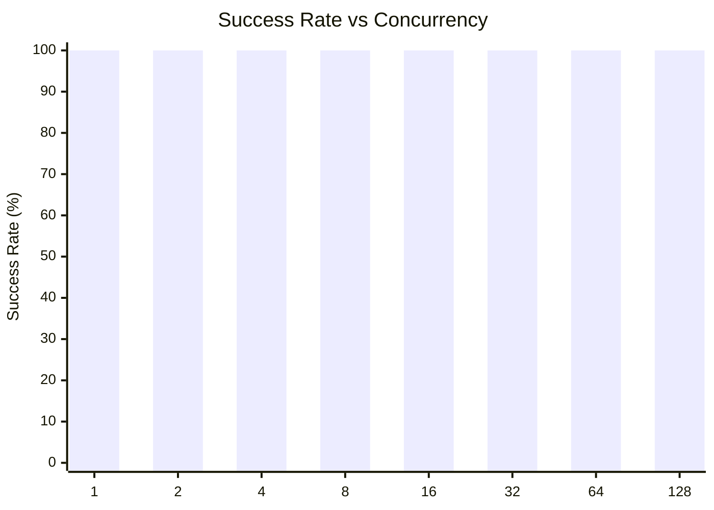
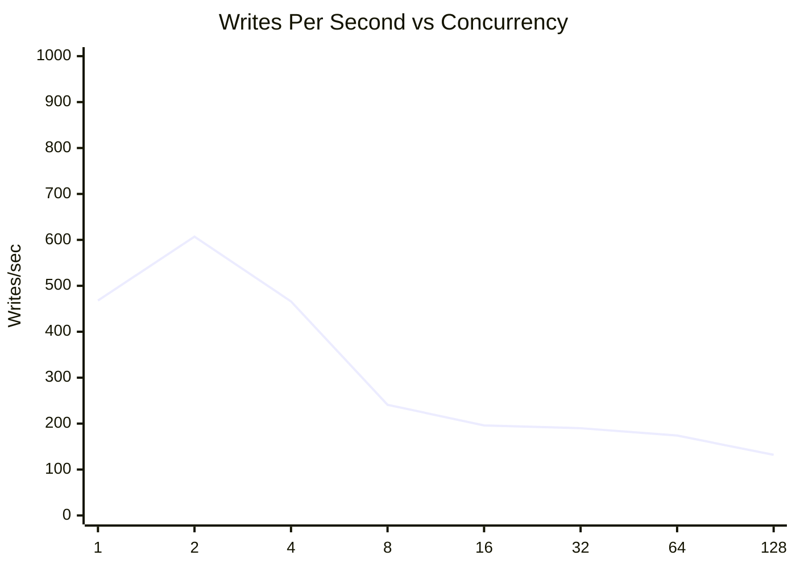
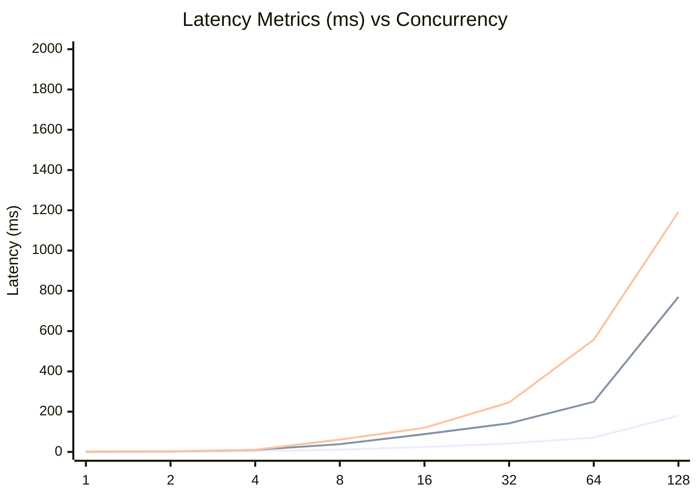
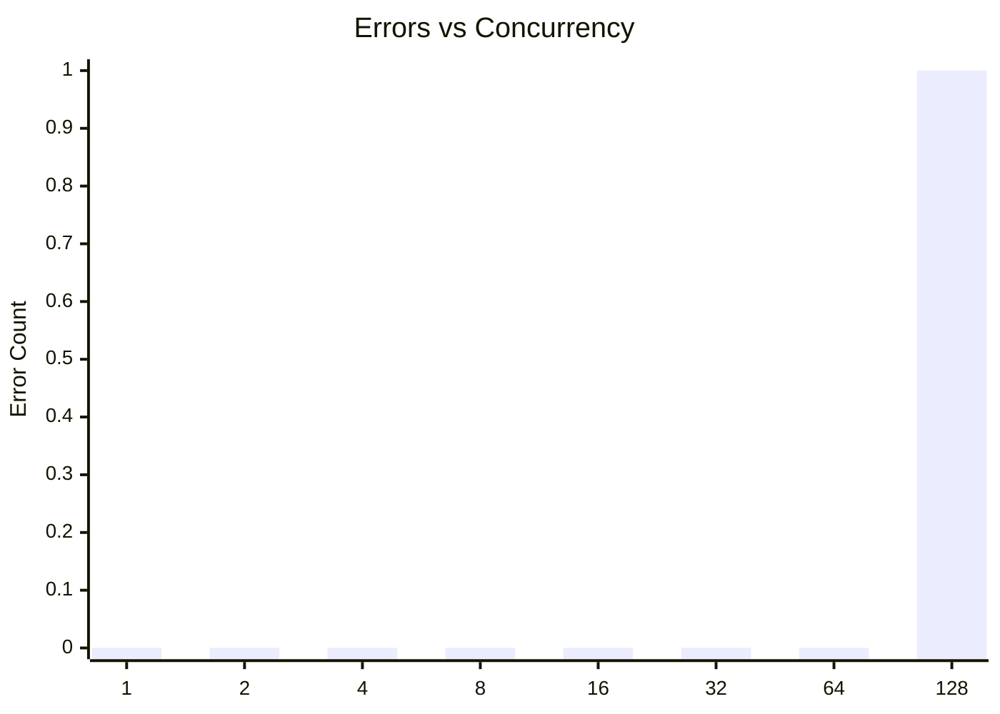

# SQLite Concurrent Writes Test: walSyncNormalAutocheckpoint2000ConcurrentWrites

**Test Run:** 12/24/2025, 11:54:16 PM

## Overview

This test evaluates SQLite's behavior under concurrent write pressure. Each test configuration runs 100000 total write operations across different concurrency levels (number of simultaneous writers).

## Key Findings

- **Single writer achieves 100.0% success rate** with 468 writes/sec
- **Best throughput:** 607 writes/sec at concurrency 2
- **Worst success rate:** 100.0% at concurrency 128 with 1 lock errors
- **High concurrency P99 latency:** 529ms average at 16+ concurrent writers


## Summary Table

| Concurrency | Success Rate | Writes/sec | Avg (ms) | P95 (ms) | P99 (ms) | Lock Errors |
|-------------|--------------|------------|----------|----------|----------|-------------|
| 1 | 100.0% | 468 | 0.99 | 1.39 | 2.19 | 0 |
| 2 | 100.0% | 607 | 1.51 | 2.22 | 2.63 | 0 |
| 4 | 100.0% | 466 | 3.45 | 10.18 | 10.93 | 0 |
| 8 | 100.0% | 241 | 11.04 | 38.59 | 61.42 | 0 |
| 16 | 100.0% | 196 | 24.49 | 88.27 | 119.54 | 0 |
| 32 | 100.0% | 190 | 41.88 | 141.93 | 245.88 | 0 |
| 64 | 100.0% | 174 | 71.33 | 248.94 | 557.60 | 0 |
| 128 | 100.0% | 132 | 179.77 | 769.90 | 1191.46 | 1 |


## Charts

### Success Rate by Concurrency

This chart shows how the success rate of write operations decreases as concurrency increases. SQLite uses file-level locking, so concurrent writes often fail with `SQLITE_BUSY` or `SQLITE_LOCKED` errors.



### Throughput (Writes Per Second)

Despite lower success rates at higher concurrency, the overall throughput pattern shows interesting behavior. The effective writes per second decreases as contention increases.



### Latency Distribution

This chart shows average, P95, and P99 latencies. As concurrency increases, latency variance grows significantly due to lock contention.



### Lock Errors by Concurrency

The number of lock errors (SQLITE_BUSY/SQLITE_LOCKED) increases with concurrency, demonstrating SQLite's single-writer limitation.



## Detailed Analysis

### Single Writer (Concurrency = 1)

With a single writer, SQLite performs optimally:
- **Success Rate:** 100.0%
- **Throughput:** 468 writes/second
- **Average Latency:** 0.99ms
- **P99 Latency:** 2.19ms
- **Lock Errors:** 0

This represents the baseline performance without contention.

### Low Concurrency (2-4 writers)

Even at low concurrency levels (2-4 writers), significant contention occurs:
- **Average Success Rate:** 100.0%
- **Average Lock Errors:** 0 per test run

This demonstrates SQLite's fundamental limitation with concurrent writes - even 2 simultaneous writers will frequently conflict.

### High Concurrency (16+ writers)

At high concurrency (16+ writers), performance degrades significantly:
- **Average Success Rate:** 100.0%
- **Average P99 Latency:** 529ms
- **Maximum P99 Latency:** 1191ms

The vast majority of write attempts fail due to lock contention. Successful writes also take much longer due to retry overhead and queuing.

## Raw Data

<details>
<summary>Click to expand raw JSON data</summary>

```json
{
  "testName": "walSyncNormalAutocheckpoint2000ConcurrentWrites",
  "timestamp": "2025-12-24T18:24:16.188Z",
  "configurations": [
    {
      "concurrency": 1,
      "totalWrites": 100000,
      "metrics": {
        "total": 100000,
        "successful": 100000,
        "errors": 0,
        "lockErrors": 0,
        "successRate": 100,
        "avgTime": 0.9903028145199548,
        "p95": 1.3919279999972787,
        "p99": 2.186098000005586,
        "writesPerSec": 468.47701571699105,
        "totalDuration": 213457.643908
      }
    },
    {
      "concurrency": 2,
      "totalWrites": 100000,
      "metrics": {
        "total": 100000,
        "successful": 100000,
        "errors": 0,
        "lockErrors": 0,
        "successRate": 100,
        "avgTime": 1.506967474469917,
        "p95": 2.223314000002574,
        "p99": 2.6349320000153966,
        "writesPerSec": 606.5449322294277,
        "totalDuration": 164868.247489
      }
    },
    {
      "concurrency": 4,
      "totalWrites": 100000,
      "metrics": {
        "total": 100000,
        "successful": 100000,
        "errors": 0,
        "lockErrors": 0,
        "successRate": 100,
        "avgTime": 3.4482159138500297,
        "p95": 10.184428999957163,
        "p99": 10.931634999986272,
        "writesPerSec": 465.71004404865386,
        "totalDuration": 214725.88207599998
      }
    },
    {
      "concurrency": 8,
      "totalWrites": 100000,
      "metrics": {
        "total": 100000,
        "successful": 100000,
        "errors": 0,
        "lockErrors": 0,
        "successRate": 100,
        "avgTime": 11.04209515784978,
        "p95": 38.594091999926604,
        "p99": 61.42211199994199,
        "writesPerSec": 241.25650147465666,
        "totalDuration": 414496.601703
      }
    },
    {
      "concurrency": 16,
      "totalWrites": 100000,
      "metrics": {
        "total": 100000,
        "successful": 100000,
        "errors": 0,
        "lockErrors": 0,
        "successRate": 100,
        "avgTime": 24.494503700640138,
        "p95": 88.27395000006072,
        "p99": 119.54462400008924,
        "writesPerSec": 196.19482143483992,
        "totalDuration": 509697.44903899985
      }
    },
    {
      "concurrency": 32,
      "totalWrites": 100000,
      "metrics": {
        "total": 100000,
        "successful": 100000,
        "errors": 0,
        "lockErrors": 0,
        "successRate": 100,
        "avgTime": 41.88149210486042,
        "p95": 141.9327269999776,
        "p99": 245.8750360000413,
        "writesPerSec": 189.6151847689,
        "totalDuration": 527383.9229799998
      }
    },
    {
      "concurrency": 64,
      "totalWrites": 100000,
      "metrics": {
        "total": 100000,
        "successful": 100000,
        "errors": 0,
        "lockErrors": 0,
        "successRate": 100,
        "avgTime": 71.32890060729055,
        "p95": 248.93663199990988,
        "p99": 557.5971429999918,
        "writesPerSec": 174.4760692209986,
        "totalDuration": 573144.5031200002
      }
    },
    {
      "concurrency": 128,
      "totalWrites": 100000,
      "metrics": {
        "total": 100000,
        "successful": 99999,
        "errors": 1,
        "lockErrors": 1,
        "successRate": 99.99900000000001,
        "avgTime": 179.771561407635,
        "p95": 769.9029069999233,
        "p99": 1191.4563100002706,
        "writesPerSec": 131.7218151841287,
        "totalDuration": 759168.0987709998
      }
    }
  ]
}
```

</details>
