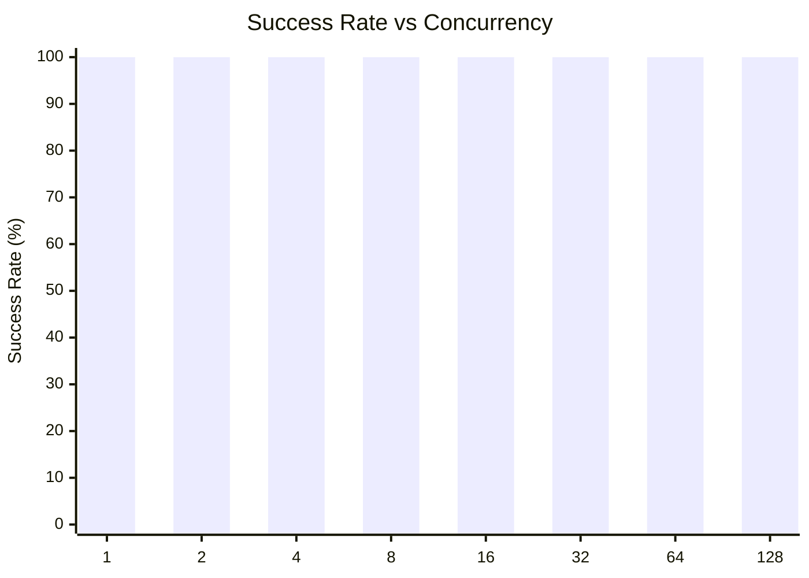
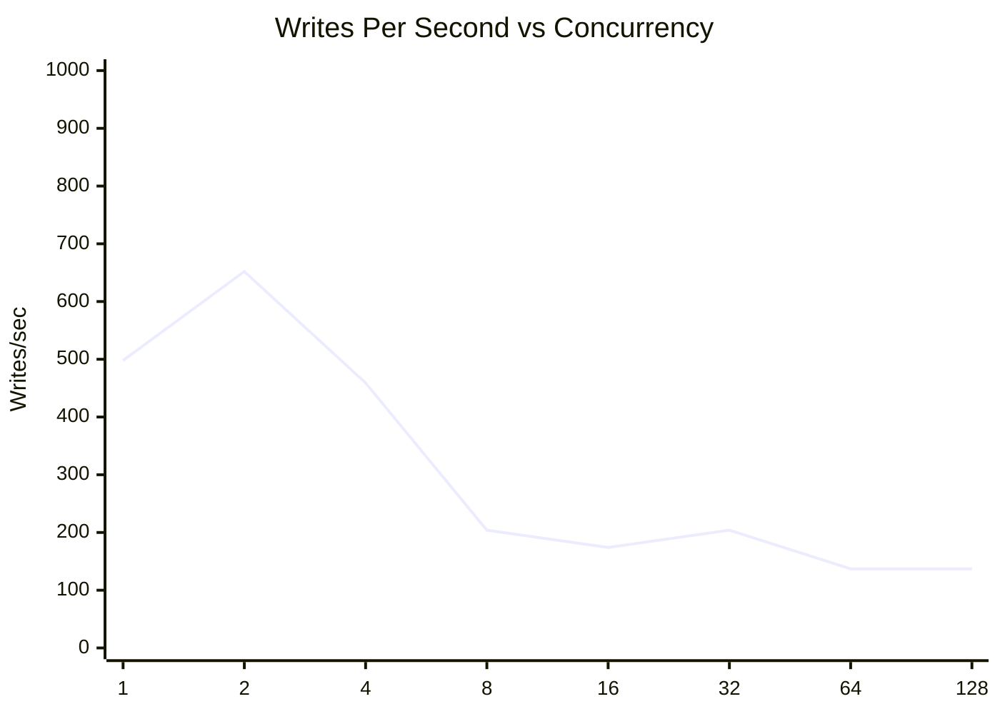
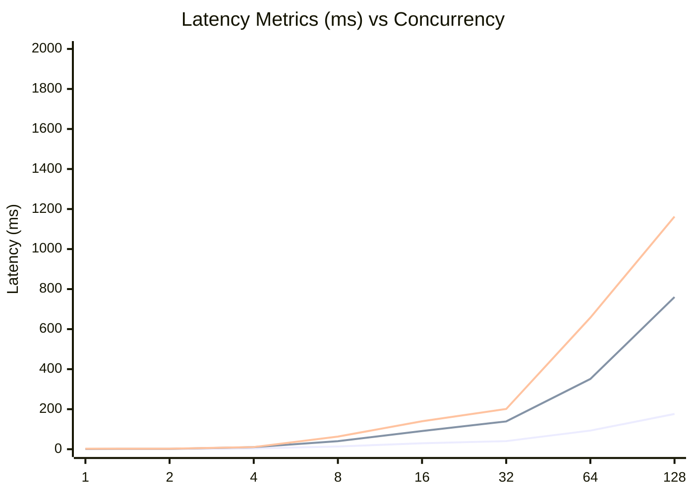
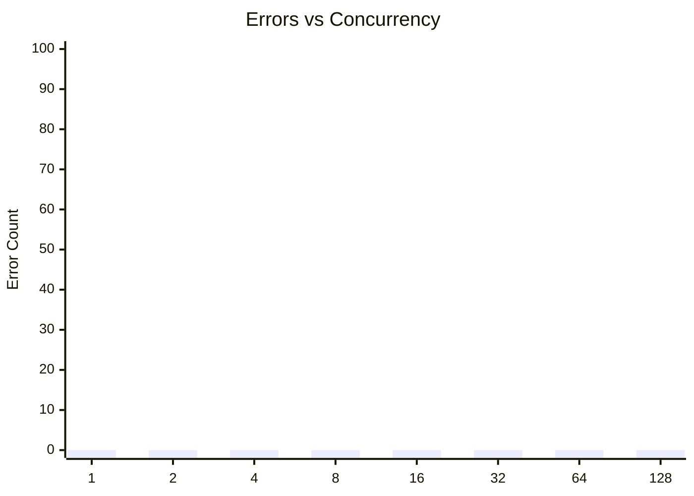

# SQLite Concurrent Writes Test: walSyncNormalAutocheckpoint4000Mmap1gbConcurrentWrites

**Test Run:** 12/26/2025, 5:58:58 PM

## Overview

This test evaluates SQLite's behavior under concurrent write pressure. Each test configuration runs 100000 total write operations across different concurrency levels (number of simultaneous writers).

## Key Findings

- **Single writer achieves 100.0% success rate** with 498 writes/sec
- **Best throughput:** 652 writes/sec at concurrency 2
- **Worst success rate:** 100.0% at concurrency 1 with 0 lock errors
- **High concurrency P99 latency:** 540ms average at 16+ concurrent writers


## Summary Table

| Concurrency | Success Rate | Writes/sec | Avg (ms) | P95 (ms) | P99 (ms) | Lock Errors |
|-------------|--------------|------------|----------|----------|----------|-------------|
| 1 | 100.0% | 498 | 0.87 | 1.45 | 2.40 | 0 |
| 2 | 100.0% | 652 | 1.37 | 2.04 | 2.54 | 0 |
| 4 | 100.0% | 459 | 3.48 | 10.31 | 10.78 | 0 |
| 8 | 100.0% | 204 | 13.44 | 39.99 | 63.08 | 0 |
| 16 | 100.0% | 174 | 29.66 | 90.71 | 139.74 | 0 |
| 32 | 100.0% | 204 | 40.45 | 138.81 | 200.94 | 0 |
| 64 | 100.0% | 137 | 93.00 | 350.93 | 657.44 | 0 |
| 128 | 100.0% | 137 | 176.08 | 760.09 | 1162.20 | 0 |


## Charts

### Success Rate by Concurrency

This chart shows how the success rate of write operations decreases as concurrency increases. SQLite uses file-level locking, so concurrent writes often fail with `SQLITE_BUSY` or `SQLITE_LOCKED` errors.



### Throughput (Writes Per Second)

Despite lower success rates at higher concurrency, the overall throughput pattern shows interesting behavior. The effective writes per second decreases as contention increases.



### Latency Distribution

This chart shows average, P95, and P99 latencies. As concurrency increases, latency variance grows significantly due to lock contention.



### Lock Errors by Concurrency

The number of lock errors (SQLITE_BUSY/SQLITE_LOCKED) increases with concurrency, demonstrating SQLite's single-writer limitation.



## Detailed Analysis

### Single Writer (Concurrency = 1)

With a single writer, SQLite performs optimally:
- **Success Rate:** 100.0%
- **Throughput:** 498 writes/second
- **Average Latency:** 0.87ms
- **P99 Latency:** 2.40ms
- **Lock Errors:** 0

This represents the baseline performance without contention.

### Low Concurrency (2-4 writers)

Even at low concurrency levels (2-4 writers), significant contention occurs:
- **Average Success Rate:** 100.0%
- **Average Lock Errors:** 0 per test run

This demonstrates SQLite's fundamental limitation with concurrent writes - even 2 simultaneous writers will frequently conflict.

### High Concurrency (16+ writers)

At high concurrency (16+ writers), performance degrades significantly:
- **Average Success Rate:** 100.0%
- **Average P99 Latency:** 540ms
- **Maximum P99 Latency:** 1162ms

The vast majority of write attempts fail due to lock contention. Successful writes also take much longer due to retry overhead and queuing.

## Raw Data

<details>
<summary>Click to expand raw JSON data</summary>

```json
{
  "testName": "walSyncNormalAutocheckpoint4000Mmap1gbConcurrentWrites",
  "timestamp": "2025-12-26T12:28:58.001Z",
  "configurations": [
    {
      "concurrency": 1,
      "totalWrites": 100000,
      "metrics": {
        "total": 100000,
        "successful": 100000,
        "errors": 0,
        "lockErrors": 0,
        "successRate": 100,
        "avgTime": 0.8657644203299767,
        "p95": 1.4474859999900218,
        "p99": 2.3957319999899482,
        "writesPerSec": 498.20399987427027,
        "totalDuration": 200720.989846
      }
    },
    {
      "concurrency": 2,
      "totalWrites": 100000,
      "metrics": {
        "total": 100000,
        "successful": 100000,
        "errors": 0,
        "lockErrors": 0,
        "successRate": 100,
        "avgTime": 1.371191709179958,
        "p95": 2.043019999982789,
        "p99": 2.53922799997963,
        "writesPerSec": 652.1739434092642,
        "totalDuration": 153333.326194
      }
    },
    {
      "concurrency": 4,
      "totalWrites": 100000,
      "metrics": {
        "total": 100000,
        "successful": 100000,
        "errors": 0,
        "lockErrors": 0,
        "successRate": 100,
        "avgTime": 3.4843013121499498,
        "p95": 10.31138299999293,
        "p99": 10.781565999961458,
        "writesPerSec": 458.78405311931704,
        "totalDuration": 217967.47144999995
      }
    },
    {
      "concurrency": 8,
      "totalWrites": 100000,
      "metrics": {
        "total": 100000,
        "successful": 100000,
        "errors": 0,
        "lockErrors": 0,
        "successRate": 100,
        "avgTime": 13.437719637910034,
        "p95": 39.986419999971986,
        "p99": 63.078645000001416,
        "writesPerSec": 203.68822189433823,
        "totalDuration": 490946.4036259999
      }
    },
    {
      "concurrency": 16,
      "totalWrites": 100000,
      "metrics": {
        "total": 100000,
        "successful": 100000,
        "errors": 0,
        "lockErrors": 0,
        "successRate": 100,
        "avgTime": 29.664285159059716,
        "p95": 90.70797400013544,
        "p99": 139.74099999992177,
        "writesPerSec": 174.10929836416906,
        "totalDuration": 574351.863683
      }
    },
    {
      "concurrency": 32,
      "totalWrites": 100000,
      "metrics": {
        "total": 100000,
        "successful": 100000,
        "errors": 0,
        "lockErrors": 0,
        "successRate": 100,
        "avgTime": 40.446170259000155,
        "p95": 138.81219800002873,
        "p99": 200.9401750001125,
        "writesPerSec": 204.39883528191174,
        "totalDuration": 489239.5784060003
      }
    },
    {
      "concurrency": 64,
      "totalWrites": 100000,
      "metrics": {
        "total": 100000,
        "successful": 100000,
        "errors": 0,
        "lockErrors": 0,
        "successRate": 100,
        "avgTime": 93.00230120662026,
        "p95": 350.9313660003245,
        "p99": 657.4366780002601,
        "writesPerSec": 136.68891307725553,
        "totalDuration": 731588.230155
      }
    },
    {
      "concurrency": 128,
      "totalWrites": 100000,
      "metrics": {
        "total": 100000,
        "successful": 100000,
        "errors": 0,
        "lockErrors": 0,
        "successRate": 100,
        "avgTime": 176.08483673393894,
        "p95": 760.0949329999276,
        "p99": 1162.1979370000772,
        "writesPerSec": 136.92173339886608,
        "totalDuration": 730344.2449759999
      }
    }
  ]
}
```

</details>
