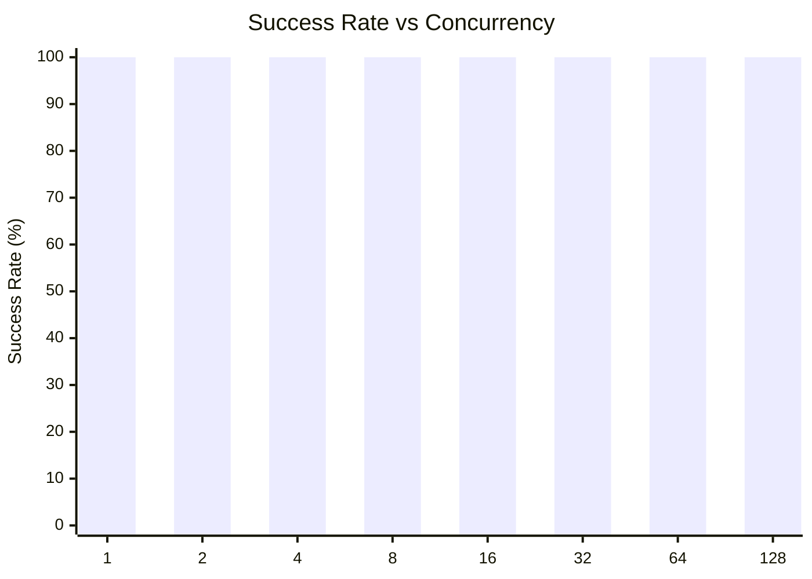
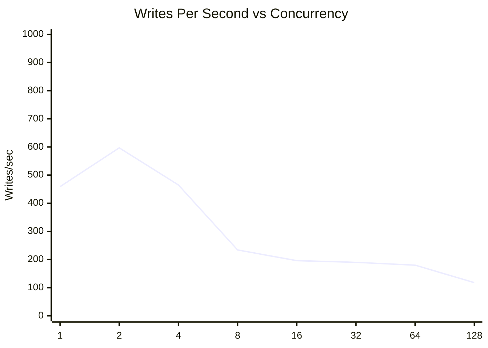
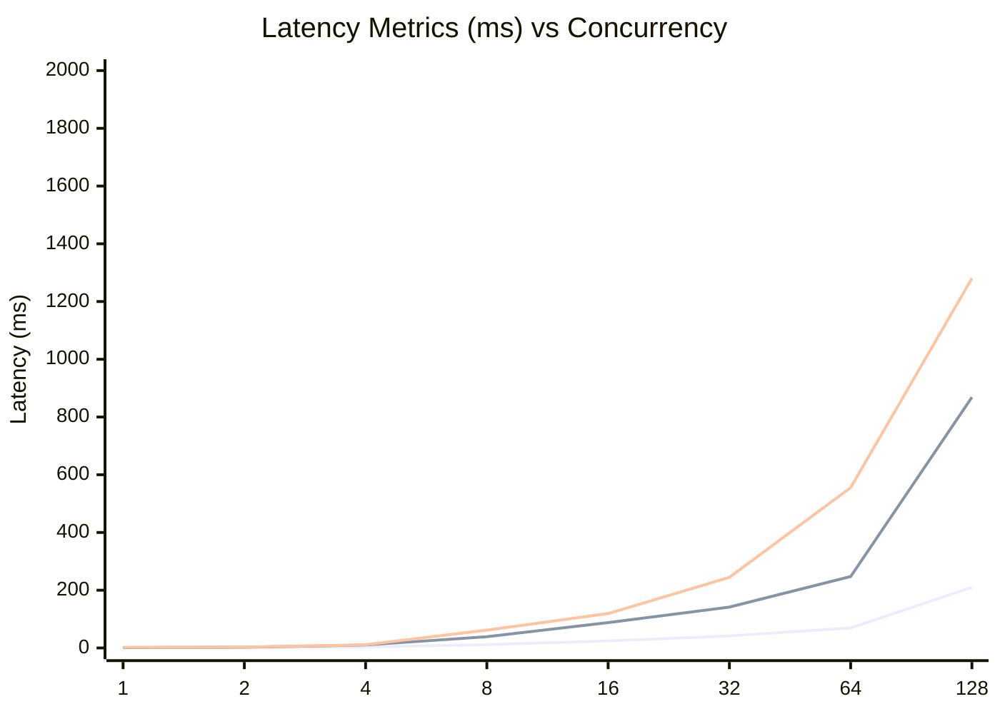
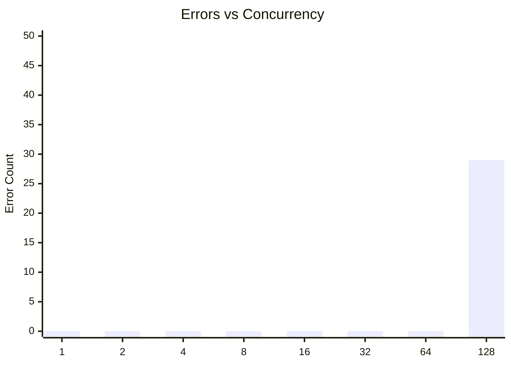

# SQLite Concurrent Writes Test: walSyncNormalAutocheckpoint4000ConcurrentWrites

**Test Run:** 12/24/2025, 11:56:15 PM

## Overview

This test evaluates SQLite's behavior under concurrent write pressure. Each test configuration runs 100000 total write operations across different concurrency levels (number of simultaneous writers).

## Key Findings

- **Single writer achieves 100.0% success rate** with 459 writes/sec
- **Best throughput:** 597 writes/sec at concurrency 2
- **Worst success rate:** 100.0% at concurrency 128 with 29 lock errors
- **High concurrency P99 latency:** 550ms average at 16+ concurrent writers


## Summary Table

| Concurrency | Success Rate | Writes/sec | Avg (ms) | P95 (ms) | P99 (ms) | Lock Errors |
|-------------|--------------|------------|----------|----------|----------|-------------|
| 1 | 100.0% | 459 | 1.01 | 1.40 | 2.22 | 0 |
| 2 | 100.0% | 597 | 1.50 | 2.23 | 2.85 | 0 |
| 4 | 100.0% | 465 | 3.45 | 10.22 | 10.94 | 0 |
| 8 | 100.0% | 234 | 11.39 | 38.93 | 61.85 | 0 |
| 16 | 100.0% | 196 | 24.47 | 87.99 | 119.15 | 0 |
| 32 | 100.0% | 190 | 41.73 | 141.77 | 244.61 | 0 |
| 64 | 100.0% | 180 | 69.33 | 247.27 | 555.29 | 0 |
| 128 | 100.0% | 118 | 210.07 | 868.32 | 1280.24 | 29 |


## Charts

### Success Rate by Concurrency

This chart shows how the success rate of write operations decreases as concurrency increases. SQLite uses file-level locking, so concurrent writes often fail with `SQLITE_BUSY` or `SQLITE_LOCKED` errors.



### Throughput (Writes Per Second)

Despite lower success rates at higher concurrency, the overall throughput pattern shows interesting behavior. The effective writes per second decreases as contention increases.



### Latency Distribution

This chart shows average, P95, and P99 latencies. As concurrency increases, latency variance grows significantly due to lock contention.



### Lock Errors by Concurrency

The number of lock errors (SQLITE_BUSY/SQLITE_LOCKED) increases with concurrency, demonstrating SQLite's single-writer limitation.



## Detailed Analysis

### Single Writer (Concurrency = 1)

With a single writer, SQLite performs optimally:
- **Success Rate:** 100.0%
- **Throughput:** 459 writes/second
- **Average Latency:** 1.01ms
- **P99 Latency:** 2.22ms
- **Lock Errors:** 0

This represents the baseline performance without contention.

### Low Concurrency (2-4 writers)

Even at low concurrency levels (2-4 writers), significant contention occurs:
- **Average Success Rate:** 100.0%
- **Average Lock Errors:** 0 per test run

This demonstrates SQLite's fundamental limitation with concurrent writes - even 2 simultaneous writers will frequently conflict.

### High Concurrency (16+ writers)

At high concurrency (16+ writers), performance degrades significantly:
- **Average Success Rate:** 100.0%
- **Average P99 Latency:** 550ms
- **Maximum P99 Latency:** 1280ms

The vast majority of write attempts fail due to lock contention. Successful writes also take much longer due to retry overhead and queuing.

## Raw Data

<details>
<summary>Click to expand raw JSON data</summary>

```json
{
  "testName": "walSyncNormalAutocheckpoint4000ConcurrentWrites",
  "timestamp": "2025-12-24T18:26:15.545Z",
  "configurations": [
    {
      "concurrency": 1,
      "totalWrites": 100000,
      "metrics": {
        "total": 100000,
        "successful": 100000,
        "errors": 0,
        "lockErrors": 0,
        "successRate": 100,
        "avgTime": 1.0064493379799682,
        "p95": 1.402008000004571,
        "p99": 2.223147999997309,
        "writesPerSec": 459.35033342275517,
        "totalDuration": 217698.76437199998
      }
    },
    {
      "concurrency": 2,
      "totalWrites": 100000,
      "metrics": {
        "total": 100000,
        "successful": 100000,
        "errors": 0,
        "lockErrors": 0,
        "successRate": 100,
        "avgTime": 1.5020356644299158,
        "p95": 2.226169999979902,
        "p99": 2.846596999996109,
        "writesPerSec": 597.2906517866355,
        "totalDuration": 167422.67721899998
      }
    },
    {
      "concurrency": 4,
      "totalWrites": 100000,
      "metrics": {
        "total": 100000,
        "successful": 100000,
        "errors": 0,
        "lockErrors": 0,
        "successRate": 100,
        "avgTime": 3.453969275189968,
        "p95": 10.220231999992393,
        "p99": 10.942916000029072,
        "writesPerSec": 465.1522740174197,
        "totalDuration": 214983.362623
      }
    },
    {
      "concurrency": 8,
      "totalWrites": 100000,
      "metrics": {
        "total": 100000,
        "successful": 100000,
        "errors": 0,
        "lockErrors": 0,
        "successRate": 100,
        "avgTime": 11.390019064270051,
        "p95": 38.93488800001796,
        "p99": 61.84805499995127,
        "writesPerSec": 234.30980588563568,
        "totalDuration": 426785.38195199997
      }
    },
    {
      "concurrency": 16,
      "totalWrites": 100000,
      "metrics": {
        "total": 100000,
        "successful": 100000,
        "errors": 0,
        "lockErrors": 0,
        "successRate": 100,
        "avgTime": 24.467947118189908,
        "p95": 87.985175000038,
        "p99": 119.14742499997374,
        "writesPerSec": 195.7515335183005,
        "totalDuration": 510851.68122399994
      }
    },
    {
      "concurrency": 32,
      "totalWrites": 100000,
      "metrics": {
        "total": 100000,
        "successful": 100000,
        "errors": 0,
        "lockErrors": 0,
        "successRate": 100,
        "avgTime": 41.73233274015965,
        "p95": 141.76626800000668,
        "p99": 244.60988299991004,
        "writesPerSec": 189.68526182532986,
        "totalDuration": 527189.0870049999
      }
    },
    {
      "concurrency": 64,
      "totalWrites": 100000,
      "metrics": {
        "total": 100000,
        "successful": 100000,
        "errors": 0,
        "lockErrors": 0,
        "successRate": 100,
        "avgTime": 69.32991572152034,
        "p95": 247.27483399957418,
        "p99": 555.2882469999604,
        "writesPerSec": 179.91252852663095,
        "totalDuration": 555825.660497
      }
    },
    {
      "concurrency": 128,
      "totalWrites": 100000,
      "metrics": {
        "total": 100000,
        "successful": 99971,
        "errors": 29,
        "lockErrors": 29,
        "successRate": 99.971,
        "avgTime": 210.07008476076055,
        "p95": 868.3246320001781,
        "p99": 1280.2398810000159,
        "writesPerSec": 118.1649725304949,
        "totalDuration": 846029.0546269999
      }
    }
  ]
}
```

</details>
