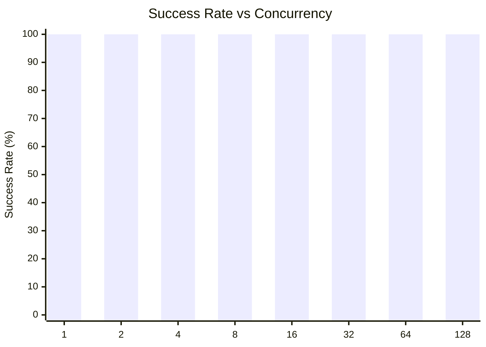
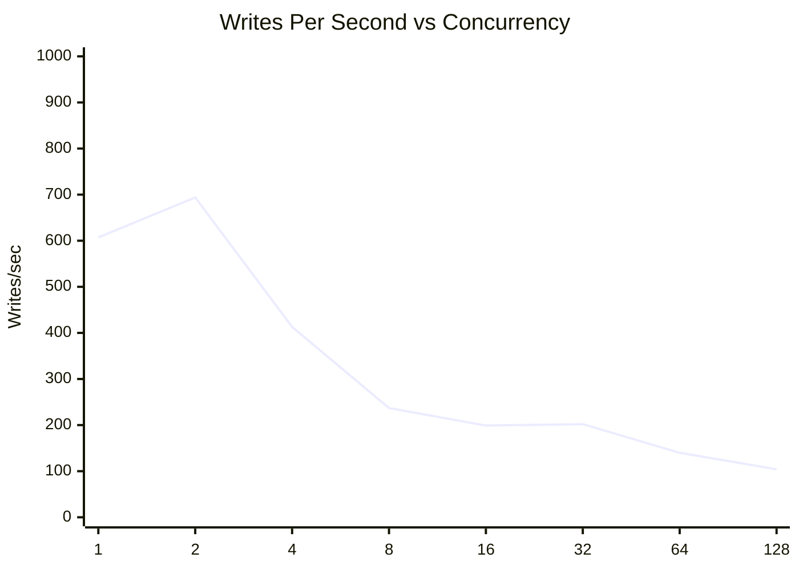
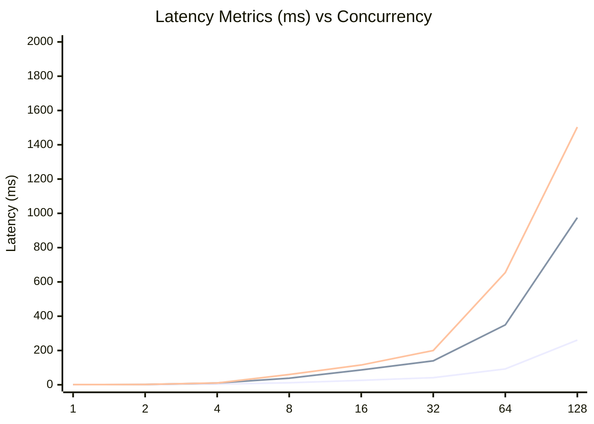
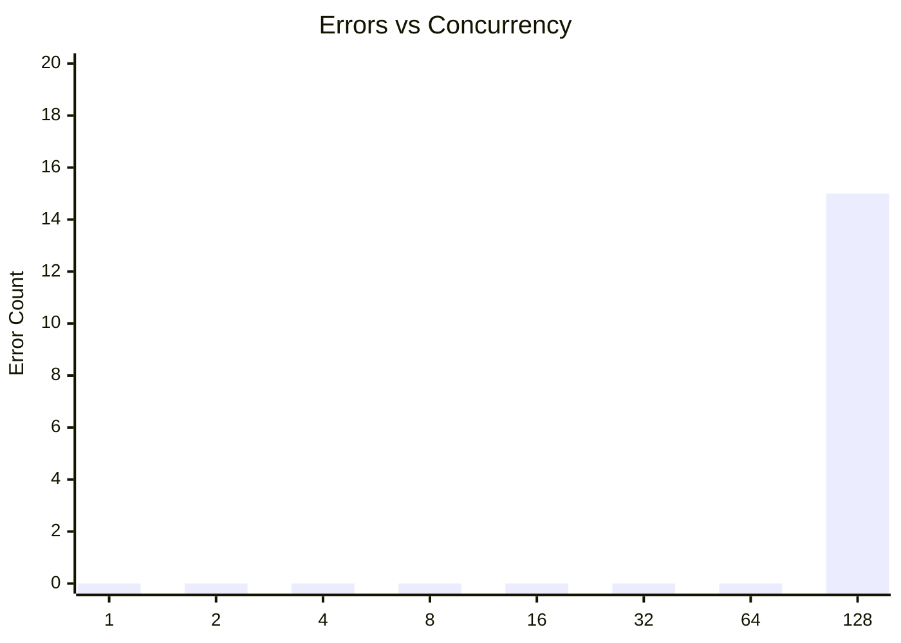

# SQLite Concurrent Writes Test: walSyncNormalBusyTimeout5000ConcurrentWrites

**Test Run:** 12/25/2025, 1:02:31 AM

## Overview

This test evaluates SQLite's behavior under concurrent write pressure. Each test configuration runs 100000 total write operations across different concurrency levels (number of simultaneous writers).

## Key Findings

- **Single writer achieves 100.0% success rate** with 607 writes/sec
- **Best throughput:** 694 writes/sec at concurrency 2
- **Worst success rate:** 100.0% at concurrency 128 with 15 lock errors
- **High concurrency P99 latency:** 618ms average at 16+ concurrent writers


## Summary Table

| Concurrency | Success Rate | Writes/sec | Avg (ms) | P95 (ms) | P99 (ms) | Lock Errors |
|-------------|--------------|------------|----------|----------|----------|-------------|
| 1 | 100.0% | 607 | 0.74 | 0.90 | 1.16 | 0 |
| 2 | 100.0% | 694 | 1.29 | 1.87 | 1.97 | 0 |
| 4 | 100.0% | 413 | 3.77 | 10.36 | 10.76 | 0 |
| 8 | 100.0% | 237 | 11.63 | 38.47 | 59.99 | 0 |
| 16 | 100.0% | 199 | 25.84 | 86.55 | 115.46 | 0 |
| 32 | 100.0% | 202 | 41.64 | 139.85 | 199.83 | 0 |
| 64 | 100.0% | 140 | 92.47 | 349.31 | 654.45 | 0 |
| 128 | 100.0% | 104 | 260.51 | 975.01 | 1503.53 | 15 |


## Charts

### Success Rate by Concurrency

This chart shows how the success rate of write operations decreases as concurrency increases. SQLite uses file-level locking, so concurrent writes often fail with `SQLITE_BUSY` or `SQLITE_LOCKED` errors.



### Throughput (Writes Per Second)

Despite lower success rates at higher concurrency, the overall throughput pattern shows interesting behavior. The effective writes per second decreases as contention increases.



### Latency Distribution

This chart shows average, P95, and P99 latencies. As concurrency increases, latency variance grows significantly due to lock contention.



### Lock Errors by Concurrency

The number of lock errors (SQLITE_BUSY/SQLITE_LOCKED) increases with concurrency, demonstrating SQLite's single-writer limitation.



## Detailed Analysis

### Single Writer (Concurrency = 1)

With a single writer, SQLite performs optimally:
- **Success Rate:** 100.0%
- **Throughput:** 607 writes/second
- **Average Latency:** 0.74ms
- **P99 Latency:** 1.16ms
- **Lock Errors:** 0

This represents the baseline performance without contention.

### Low Concurrency (2-4 writers)

Even at low concurrency levels (2-4 writers), significant contention occurs:
- **Average Success Rate:** 100.0%
- **Average Lock Errors:** 0 per test run

This demonstrates SQLite's fundamental limitation with concurrent writes - even 2 simultaneous writers will frequently conflict.

### High Concurrency (16+ writers)

At high concurrency (16+ writers), performance degrades significantly:
- **Average Success Rate:** 100.0%
- **Average P99 Latency:** 618ms
- **Maximum P99 Latency:** 1504ms

The vast majority of write attempts fail due to lock contention. Successful writes also take much longer due to retry overhead and queuing.

## Raw Data

<details>
<summary>Click to expand raw JSON data</summary>

```json
{
  "testName": "walSyncNormalBusyTimeout5000ConcurrentWrites",
  "timestamp": "2025-12-24T19:32:31.680Z",
  "configurations": [
    {
      "concurrency": 1,
      "totalWrites": 100000,
      "metrics": {
        "total": 100000,
        "successful": 100000,
        "errors": 0,
        "lockErrors": 0,
        "successRate": 100,
        "avgTime": 0.7386054450900008,
        "p95": 0.8967699999921024,
        "p99": 1.1581679999944754,
        "writesPerSec": 606.561673218916,
        "totalDuration": 164863.697156
      }
    },
    {
      "concurrency": 2,
      "totalWrites": 100000,
      "metrics": {
        "total": 100000,
        "successful": 100000,
        "errors": 0,
        "lockErrors": 0,
        "successRate": 100,
        "avgTime": 1.2910831716100473,
        "p95": 1.8656170000031125,
        "p99": 1.9715609999839216,
        "writesPerSec": 694.215208315438,
        "totalDuration": 144047.55010000002
      }
    },
    {
      "concurrency": 4,
      "totalWrites": 100000,
      "metrics": {
        "total": 100000,
        "successful": 100000,
        "errors": 0,
        "lockErrors": 0,
        "successRate": 100,
        "avgTime": 3.7689436182499403,
        "p95": 10.364488999999594,
        "p99": 10.75792599999113,
        "writesPerSec": 412.545478681316,
        "totalDuration": 242397.51777099998
      }
    },
    {
      "concurrency": 8,
      "totalWrites": 100000,
      "metrics": {
        "total": 100000,
        "successful": 100000,
        "errors": 0,
        "lockErrors": 0,
        "successRate": 100,
        "avgTime": 11.627756087940373,
        "p95": 38.4729229999939,
        "p99": 59.99078599992208,
        "writesPerSec": 236.59127685051757,
        "totalDuration": 422669.85212299996
      }
    },
    {
      "concurrency": 16,
      "totalWrites": 100000,
      "metrics": {
        "total": 100000,
        "successful": 100000,
        "errors": 0,
        "lockErrors": 0,
        "successRate": 100,
        "avgTime": 25.840687326309677,
        "p95": 86.54705300007481,
        "p99": 115.46067400020547,
        "writesPerSec": 198.6181225446162,
        "totalDuration": 503478.7295280001
      }
    },
    {
      "concurrency": 32,
      "totalWrites": 100000,
      "metrics": {
        "total": 100000,
        "successful": 100000,
        "errors": 0,
        "lockErrors": 0,
        "successRate": 100,
        "avgTime": 41.64385132959926,
        "p95": 139.8532759998925,
        "p99": 199.82705299998634,
        "writesPerSec": 202.441335691893,
        "totalDuration": 493970.263821
      }
    },
    {
      "concurrency": 64,
      "totalWrites": 100000,
      "metrics": {
        "total": 100000,
        "successful": 100000,
        "errors": 0,
        "lockErrors": 0,
        "successRate": 100,
        "avgTime": 92.46727356615,
        "p95": 349.30992200039327,
        "p99": 654.4480340001173,
        "writesPerSec": 140.10488674125597,
        "totalDuration": 713750.9784700002
      }
    },
    {
      "concurrency": 128,
      "totalWrites": 100000,
      "metrics": {
        "total": 100000,
        "successful": 99985,
        "errors": 15,
        "lockErrors": 15,
        "successRate": 99.985,
        "avgTime": 260.51458815201516,
        "p95": 975.0103869996965,
        "p99": 1503.5308110001497,
        "writesPerSec": 104.04092740561222,
        "totalDuration": 961016.0394880003
      }
    }
  ]
}
```

</details>
