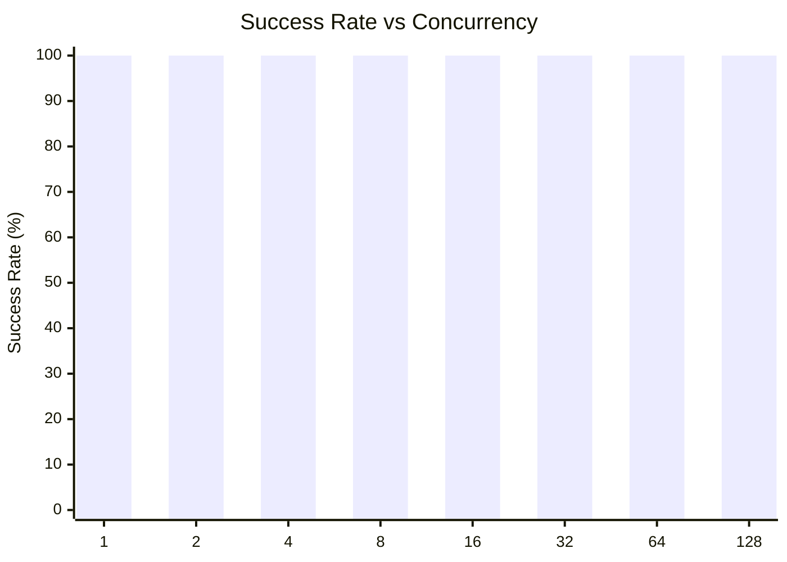
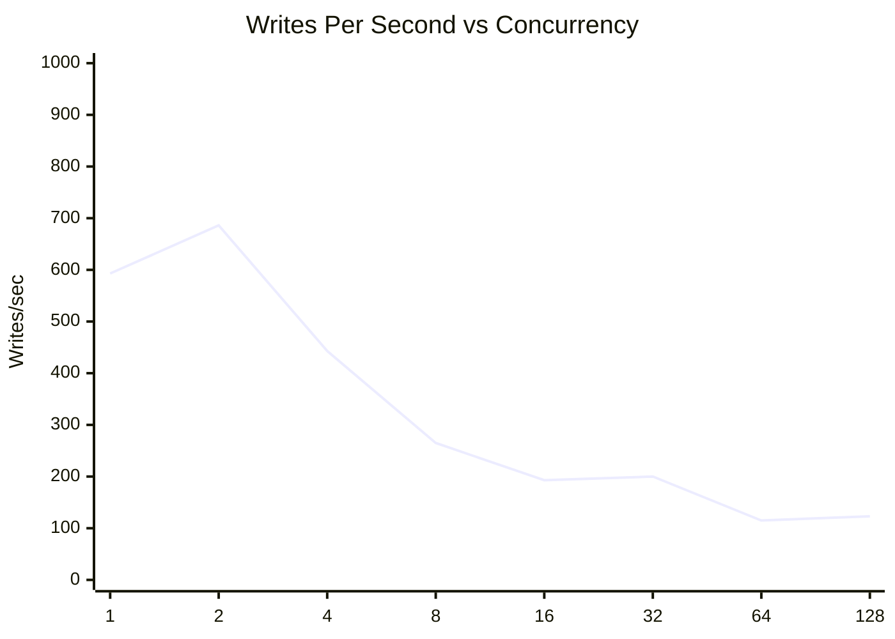
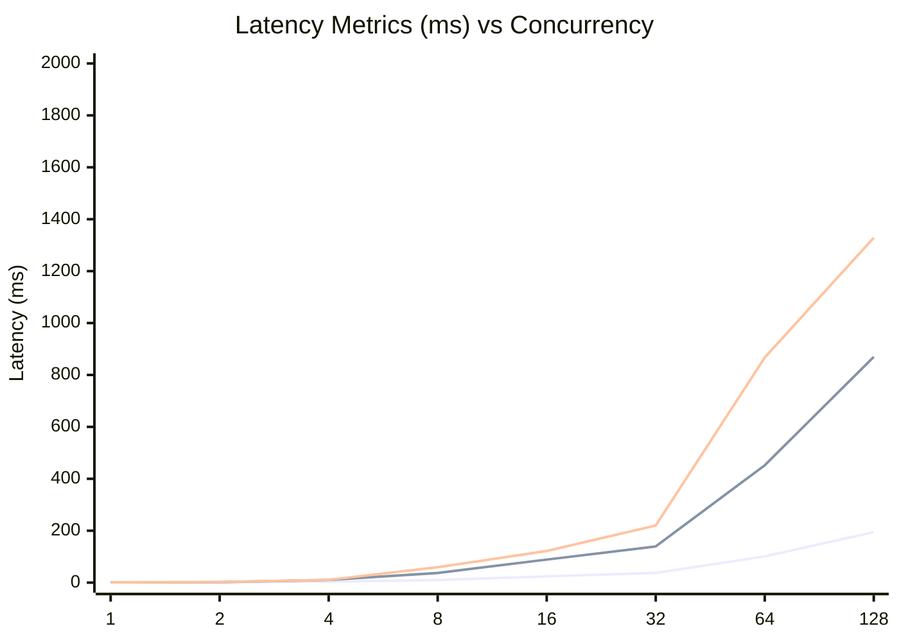
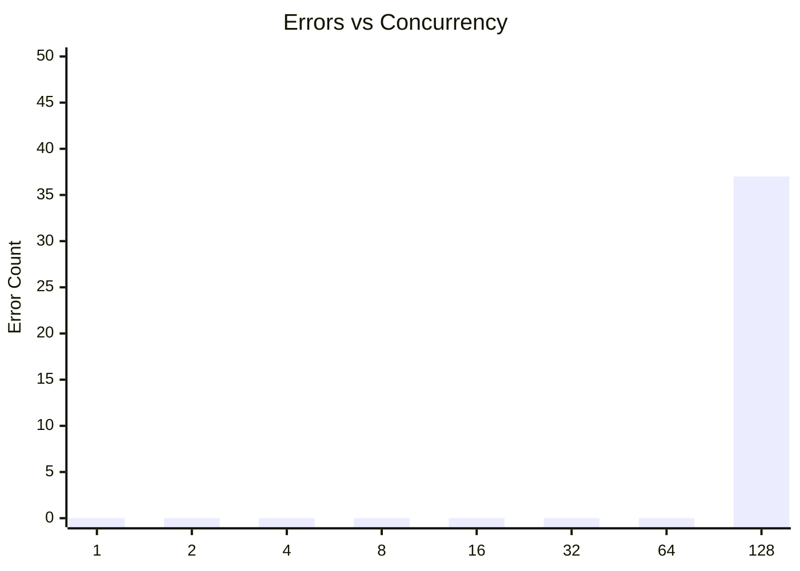

# SQLite Concurrent Writes Test: walSyncNormalConcurrentWrites

**Test Run:** 12/24/2025, 11:47:30 PM

## Overview

This test evaluates SQLite's behavior under concurrent write pressure. Each test configuration runs 100000 total write operations across different concurrency levels (number of simultaneous writers).

## Key Findings

- **Single writer achieves 100.0% success rate** with 593 writes/sec
- **Best throughput:** 686 writes/sec at concurrency 2
- **Worst success rate:** 100.0% at concurrency 128 with 37 lock errors
- **High concurrency P99 latency:** 634ms average at 16+ concurrent writers


## Summary Table

| Concurrency | Success Rate | Writes/sec | Avg (ms) | P95 (ms) | P99 (ms) | Lock Errors |
|-------------|--------------|------------|----------|----------|----------|-------------|
| 1 | 100.0% | 593 | 0.77 | 0.99 | 1.28 | 0 |
| 2 | 100.0% | 686 | 1.33 | 1.96 | 2.21 | 0 |
| 4 | 100.0% | 443 | 3.59 | 10.32 | 10.82 | 0 |
| 8 | 100.0% | 265 | 10.13 | 37.12 | 59.19 | 0 |
| 16 | 100.0% | 193 | 23.95 | 88.79 | 121.71 | 0 |
| 32 | 100.0% | 200 | 37.32 | 139.27 | 220.18 | 0 |
| 64 | 100.0% | 115 | 101.06 | 452.03 | 867.16 | 0 |
| 128 | 100.0% | 123 | 194.31 | 869.64 | 1328.64 | 37 |


## Charts

### Success Rate by Concurrency

This chart shows how the success rate of write operations decreases as concurrency increases. SQLite uses file-level locking, so concurrent writes often fail with `SQLITE_BUSY` or `SQLITE_LOCKED` errors.



### Throughput (Writes Per Second)

Despite lower success rates at higher concurrency, the overall throughput pattern shows interesting behavior. The effective writes per second decreases as contention increases.



### Latency Distribution

This chart shows average, P95, and P99 latencies. As concurrency increases, latency variance grows significantly due to lock contention.



### Lock Errors by Concurrency

The number of lock errors (SQLITE_BUSY/SQLITE_LOCKED) increases with concurrency, demonstrating SQLite's single-writer limitation.



## Detailed Analysis

### Single Writer (Concurrency = 1)

With a single writer, SQLite performs optimally:
- **Success Rate:** 100.0%
- **Throughput:** 593 writes/second
- **Average Latency:** 0.77ms
- **P99 Latency:** 1.28ms
- **Lock Errors:** 0

This represents the baseline performance without contention.

### Low Concurrency (2-4 writers)

Even at low concurrency levels (2-4 writers), significant contention occurs:
- **Average Success Rate:** 100.0%
- **Average Lock Errors:** 0 per test run

This demonstrates SQLite's fundamental limitation with concurrent writes - even 2 simultaneous writers will frequently conflict.

### High Concurrency (16+ writers)

At high concurrency (16+ writers), performance degrades significantly:
- **Average Success Rate:** 100.0%
- **Average P99 Latency:** 634ms
- **Maximum P99 Latency:** 1329ms

The vast majority of write attempts fail due to lock contention. Successful writes also take much longer due to retry overhead and queuing.

## Raw Data

<details>
<summary>Click to expand raw JSON data</summary>

```json
{
  "testName": "walSyncNormalConcurrentWrites",
  "timestamp": "2025-12-24T18:17:30.133Z",
  "configurations": [
    {
      "concurrency": 1,
      "totalWrites": 100000,
      "metrics": {
        "total": 100000,
        "successful": 100000,
        "errors": 0,
        "lockErrors": 0,
        "successRate": 100,
        "avgTime": 0.7671517123200041,
        "p95": 0.9944039999973029,
        "p99": 1.2796220000018366,
        "writesPerSec": 593.29630362713,
        "totalDuration": 168549.844974
      }
    },
    {
      "concurrency": 2,
      "totalWrites": 100000,
      "metrics": {
        "total": 100000,
        "successful": 100000,
        "errors": 0,
        "lockErrors": 0,
        "successRate": 100,
        "avgTime": 1.3310670435499874,
        "p95": 1.9562980000046082,
        "p99": 2.209495999966748,
        "writesPerSec": 686.0086100627691,
        "totalDuration": 145770.765167
      }
    },
    {
      "concurrency": 4,
      "totalWrites": 100000,
      "metrics": {
        "total": 100000,
        "successful": 100000,
        "errors": 0,
        "lockErrors": 0,
        "successRate": 100,
        "avgTime": 3.5939618898699313,
        "p95": 10.32391400000779,
        "p99": 10.822876000020187,
        "writesPerSec": 443.0676635739424,
        "totalDuration": 225699.16114699998
      }
    },
    {
      "concurrency": 8,
      "totalWrites": 100000,
      "metrics": {
        "total": 100000,
        "successful": 100000,
        "errors": 0,
        "lockErrors": 0,
        "successRate": 100,
        "avgTime": 10.12510157106024,
        "p95": 37.12194499990437,
        "p99": 59.18545699992683,
        "writesPerSec": 264.52592674020343,
        "totalDuration": 378034.778036
      }
    },
    {
      "concurrency": 16,
      "totalWrites": 100000,
      "metrics": {
        "total": 100000,
        "successful": 100000,
        "errors": 0,
        "lockErrors": 0,
        "successRate": 100,
        "avgTime": 23.95400490710971,
        "p95": 88.78662999998778,
        "p99": 121.70975300006103,
        "writesPerSec": 192.503023670562,
        "totalDuration": 519472.35993100004
      }
    },
    {
      "concurrency": 32,
      "totalWrites": 100000,
      "metrics": {
        "total": 100000,
        "successful": 100000,
        "errors": 0,
        "lockErrors": 0,
        "successRate": 100,
        "avgTime": 37.320676191019984,
        "p95": 139.26610899996012,
        "p99": 220.18032000004314,
        "writesPerSec": 199.62376005885625,
        "totalDuration": 500942.372644
      }
    },
    {
      "concurrency": 64,
      "totalWrites": 100000,
      "metrics": {
        "total": 100000,
        "successful": 100000,
        "errors": 0,
        "lockErrors": 0,
        "successRate": 100,
        "avgTime": 101.06395757968984,
        "p95": 452.03383800014853,
        "p99": 867.1603470002301,
        "writesPerSec": 115.46151584933902,
        "totalDuration": 866089.443434
      }
    },
    {
      "concurrency": 128,
      "totalWrites": 100000,
      "metrics": {
        "total": 100000,
        "successful": 99963,
        "errors": 37,
        "lockErrors": 37,
        "successRate": 99.96300000000001,
        "avgTime": 194.31207284361076,
        "p95": 869.6400190000422,
        "p99": 1328.640372000169,
        "writesPerSec": 123.20525061586618,
        "totalDuration": 811353.4082380002
      }
    }
  ]
}
```

</details>
